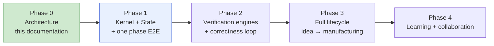

# Roadmap

> **Ring:** foundation (Entities). This document phases the journey **from this Phase 0 architecture to a shipping product**. It is deliberately *conceptual*: milestones describe *what capability becomes real* and *which principles it proves out*, never dates and never technology ([Phase 0 scope](../CONVENTIONS.md): no tech selection). It exists so the architecture is read as a *buildable sequence*, not a flat wish-list — each phase is a coherent, demonstrable increment that rests on the one before.

The sequencing is driven by one rule: **build the load-bearing core first, prove it end-to-end on the narrowest possible slice, then widen.** The architecture's value is its kernel ([P2](principles.md)–[P8](principles.md)); a kernel that works on *one* phase end-to-end is worth more than every phase half-built on no kernel.

## Phasing at a glance

*Figure: the conceptual phases. Each proves a defined set of principles before the next builds on it. From the program's viewpoint.*

## Phase 0 — Architecture (current)

**Goal.** A complete, justified Phase 0 architecture: every subsystem, boundary, and decision documented so a competent team can begin implementation in any ring without ambiguity ([vision success criteria](vision.md)).

**Done when** the [success criteria for the architecture](vision.md) are met: every subsystem understood, end-to-end flow visible, every significant decision justified, contracts unambiguous, and the system extensible without violating the [principles](principles.md). The deliverable is this documentation tree plus the [seed ADRs 0001–0010](../decisions/README.md).

**Proves:** that the design is coherent on paper — the prerequisite for everything below.

## Phase 1 — Kernel + State + one phase end-to-end

**Goal.** The smallest thing that is unmistakably *this architecture working*: the deterministic kernel, the shared state, and exactly **one** engineering phase running end-to-end through the real machinery.

**Capabilities that become real.**
- The [Engineering Runtime](../core/engineering-runtime.md) kernel: [execution engine](../core/execution-engine.md), [state-machine framework](../core/state-machine-framework.md), [event log](../core/event-bus.md), minimal [orchestrator](../core/workflow-orchestration.md) and [scheduler](../core/scheduler.md).
- The [Shared State Model](../core/shared-state-model.md) over the [domain model](engineering-domain-model.md) entities the chosen phase needs, with stable [Entity IDs](engineering-domain-model.md) and the [State Repository](../core/contracts.md#state-repository) port.
- The [Reasoning Engine port](../core/reasoning-engine-interface.md) and the [Capability port](../core/capability-registry.md) — the two boundaries — with one phase's [Agent](../agents/README.md) built as a proper two-part split ([P8](principles.md)).
- Event recording sufficient for [provenance](../core/provenance-and-traceability.md) and basic [replay](../core/determinism-and-reproducibility.md).

**Suggested first phase:** [Requirement Planning](../state-machines/requirement-planning.md) — it is the lifecycle root, needs the fewest upstream entities, and exercises the full loop (intent → reasoning → validated → committed → traceable) on simple data.

**Proves:** [P1](principles.md) (rings/contracts), [P2](principles.md) (runtime owns knowledge), [P3](principles.md) (reasoning behind the port), [P4](principles.md) (replay of one phase), [P8](principles.md) (two-part agent). The [quality attributes](quality-attributes.md) of reproducibility, auditability, and testability become demonstrable.

**Exit criterion.** One phase runs, its output is fully traceable, and its history replays to identical state.

## Phase 2 — Verification engines + the correctness loop

**Goal.** Make the system *correct by construction*: the [Constraint Engine](../engineering/constraint-engine.md) and [Verification Engine](../engineering/verification-engine.md) run continuously, and at least one verification phase loops back on failure.

**Capabilities that become real.**
- The [Constraint Engine](../engineering/constraint-engine.md): [Constraints](engineering-domain-model.md#constraint) derived, stored, resolved, and checked; typed [Physical Quantities](../engineering/units-and-quantities.md) ([P9](principles.md)).
- The [Verification Engine](../engineering/verification-engine.md): the generic [Rule](engineering-domain-model.md#rule)/[Violation](engineering-domain-model.md#violation)/[Waiver](engineering-domain-model.md#waiver) framework, specialized by a first check phase (e.g. [ERC](../state-machines/erc-verification.md)).
- The **fail → loop-back** path in the [workflow plan](../core/workflow-orchestration.md): verification failures route back to the producing phase.
- Domain validation of reasoning output wired to the constraint engine ([reasoning port](../core/reasoning-engine-interface.md) gate).

**Proves:** correctness-by-construction (vision tenet 3), [P9](principles.md) (typed quantities), and the [verification engine](../engineering/verification-engine.md)'s reuse model (one framework, many checks). The architecture's claim that correctness is *continuous, not a final gate* becomes real.

**Exit criterion.** A design that violates a constraint is caught continuously and routed back automatically, with the violation fully traceable to its cause.

## Phase 3 — Full lifecycle (idea → manufacturing)

**Goal.** All **14 phases** and **13 agents** present, chained into the [default workflow plan](architecture-views.md), so a one-line idea can reach manufacturable outputs.

**Capabilities that become real.**
- The remaining phase [state machines](../state-machines/README.md) and [agents](../agents/README.md), each following the same [agent runtime protocol](../core/agent-runtime-protocol.md).
- The [compiler IR](../compiler/compiler-ir.md) chain and [lowerings](../compiler/transformations.md) between phase boundaries — Requirement → Engineering → BOM → Schematic → PCB → Manufacturing.
- External integrations behind their ports: [parts/supply-chain](../integration/supply-chain-and-parts-data.md), [simulation](../integration/simulation-interface.md), [datasheet intelligence](../state-machines/datasheet-intelligence.md), [knowledge graph](../knowledge/knowledge-graph.md) and [vector memory](../knowledge/vector-memory.md).
- The [Manufacturing gate](../state-machines/manufacturing-generation.md): blocked on open error-violations and an incomplete [requirement-satisfaction matrix](../core/provenance-and-traceability.md).
- A usable [frontend](../presentation/frontend.md) shell over the [Presentation/Query port](../core/contracts.md#presentation-query-port).

**Proves:** [P6](principles.md) (one canonical model, many IR projections), [P7](principles.md) (new phases as instances, kernel untouched), and the end-to-end [system overview](system-overview.md) story.

**Exit criterion.** A representative design goes idea → manufacturing outputs, fully traceable and reproducible, with the engineer in command throughout.

## Phase 4 — Learning + collaboration

**Goal.** The system improves with use and supports more than one engineer.

**Capabilities that become real.**
- The [Learning Engine](../engineering/learning-engine.md): capturing reusable engineering experience to improve defaults and reasoning (cross-cutting; observes all phases). Reusable *product-engineering* intelligence still goes to [ECC](../GLOSSARY.md#ecc), not into the design state.
- Multi-user [sessions and workspaces](../collaboration/multi-user-and-sessions.md) and richer [Design Branch](../data/design-version-control.md) workflows ("Git for hardware": branch, diff, merge).
- Higher [Autonomy Levels](../engineering/human-in-the-loop.md) ([P10](principles.md)) as trust is earned — always reversible and traceable.
- The [plugin system](../integration/plugin-system.md) opened for third-party [Capabilities](../core/capability-registry.md).

**Proves:** extensibility and scalability at organizational scale ([quality attributes](quality-attributes.md)), and that the [concurrency model](../core/concurrency-and-consistency.md) holds under genuine multi-actor load.

**Exit criterion.** Two engineers collaborate on branched designs that merge cleanly, the system measurably improves its defaults from past projects, and third-party capabilities extend it without kernel changes.

## Sequencing rationale

| Decision | Why |
|----------|-----|
| Kernel + one phase **before** breadth | The kernel is the architecture's value; proving it on one phase de-risks all others ([P7](principles.md) makes the rest additive). |
| Verification **before** full lifecycle | Correctness-by-construction is a core promise; later phases generate more to check, so the checking machinery must exist first. |
| Full lifecycle **before** learning/collaboration | Learning needs completed designs to learn from; collaboration needs a stable single-user core to share. |
| Each phase exits on a **traceable, reproducible** demonstration | Reproducibility and auditability ([quality attributes](quality-attributes.md)) are non-negotiable from Phase 1, not retrofitted. |

## Non-goals of this roadmap

- **No dates, no estimates** — conceptual milestones only.
- **No technology** — backend, stores, model providers, and UI tech are deferred to later ADRs, per [Phase 0 scope](../CONVENTIONS.md).
- **No re-prioritization of principles** — every phase obeys all [principles](principles.md); later phases *demonstrate* more of them, they never relax earlier ones.

## Open decisions

- The choice of the Phase 1 first phase (Requirement Planning is recommended above) is an implementation decision to be confirmed in an ADR when implementation begins.
- Technology-selection ADRs for each ring are deferred and will be numbered as they arise, after the [seed ADRs 0001–0010](../decisions/README.md).
- Quantitative exit criteria (performance/scale targets per phase) are deferred to [quality attributes](quality-attributes.md) follow-ups; this roadmap fixes the *capability* milestones.

## Related documents

[`foundation/vision.md`](vision.md) · [`foundation/principles.md`](principles.md) · [`foundation/architecture-views.md`](architecture-views.md) · [`foundation/system-overview.md`](system-overview.md) · [`foundation/quality-attributes.md`](quality-attributes.md) · [`core/engineering-runtime.md`](../core/engineering-runtime.md) · [`state-machines/README.md`](../state-machines/README.md) · [`agents/README.md`](../agents/README.md) · [`decisions/README.md`](../decisions/README.md)
