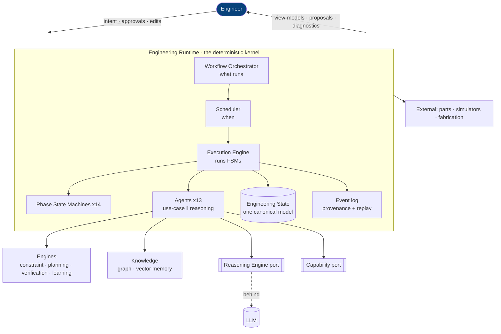
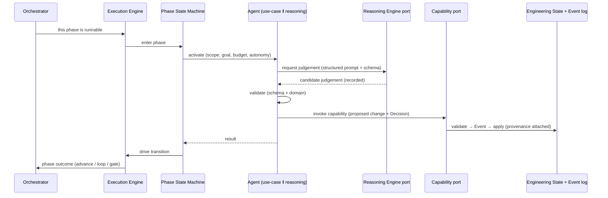

# System Overview

> **Ring:** foundation (Entities). This is the **narrative tour** of the whole system end-to-end — from a one-line product idea to manufacturable outputs — and the "how it all fits" document for a newcomer. It does not introduce new rules or entities; it weaves the [vision](vision.md), [principles](principles.md), [domain model](engineering-domain-model.md), [contracts](../core/contracts.md), and the [C4 views and phase map](architecture-views.md) into a single readable story so a competent engineer can hold the whole shape in their head before diving into any one ring.

Read this after the [vision](vision.md) and before the deep [core](../core/) documents. Where this tour mentions a component, it links to that component's authoritative doc; this overview is deliberately a *map*, not a *territory* — it never restates what another document owns.

## The one-sentence model

> **A [Project](../data/stores/project-store.md) holds one versioned [Engineering State](../core/shared-state-model.md); the [Engineering Runtime](../core/engineering-runtime.md) advances it through a sequence of [phases](../state-machines/README.md), each run by an [Agent](../agents/README.md) whose deterministic half acts through [contracts](../core/contracts.md) and whose reasoning half asks an LLM for judgement — and every change is a recorded [Event](../core/event-bus.md), giving full [provenance](../core/provenance-and-traceability.md) and [deterministic replay](../core/determinism-and-reproducibility.md).**

Everything below expands that sentence.

## The big picture

*Figure: the runtime kernel with the engineer in command, agents acting only through ports, and engineering state at the center. From a newcomer's viewpoint.* For the formal C4 views see [architecture-views.md](architecture-views.md).

## The cast (who does what)

| Component | Role in one line | Authoritative doc |
|-----------|------------------|-------------------|
| **Engineering Runtime** | The deterministic kernel; the only thing that mutates knowledge ([P2](principles.md)). | [`core/engineering-runtime.md`](../core/engineering-runtime.md) |
| **Engineering State** | The single versioned model of everything known about the design. | [`core/shared-state-model.md`](../core/shared-state-model.md) |
| **Workflow Orchestrator** | Owns the [workflow plan](../GLOSSARY.md#the-word-planning-disambiguation): the graph of phases. | [`core/workflow-orchestration.md`](../core/workflow-orchestration.md) |
| **Scheduler** | Decides *when* runnable work executes, under budgets. | [`core/scheduler.md`](../core/scheduler.md) |
| **Execution Engine** | Runs a phase's [state machine](../state-machines/README.md); invokes agents. | [`core/execution-engine.md`](../core/execution-engine.md) |
| **Agents (13)** | Do the engineering work in each phase; two-part ([P8](principles.md)). | [`agents/README.md`](../agents/README.md) |
| **Engines (4)** | Deterministic domain services: constraint, planning, verification, learning. | [`engineering/`](../engineering/constraint-engine.md) |
| **Reasoning Engine port** | The one boundary to LLM judgement ([P3](principles.md)). | [`core/reasoning-engine-interface.md`](../core/reasoning-engine-interface.md) |
| **Capability Registry** | The only way agents *act*. | [`core/capability-registry.md`](../core/capability-registry.md) |
| **Event log + stores** | Records every change; basis of provenance + replay. | [`core/event-bus.md`](../core/event-bus.md), [`data/stores/`](../data/stores/event-store.md) |
| **Frontend** | Presentation-only IDE shell ([P11](principles.md)). | [`presentation/frontend.md`](../presentation/frontend.md) |

## The end-to-end journey: idea → manufacturing

The runtime coordinates the full lifecycle as the [default workflow plan](architecture-views.md). Here is the story of one design, phase by phase (the canonical mapping of phase → state machine → agent → engine → IR is the [phase map](architecture-views.md)):

```mermaid
flowchart LR
  I([One-line idea]) --> R[1 Requirement Planning]
  R --> EA[2 Engineering Analysis] --> CE[3 Constraint Extraction]
  CE --> DS[4 Datasheet Intelligence] --> BOM[5 BOM Planning]
  BOM --> SCH[6 Schematic Planning] --> ERC[7 ERC Verification]
  ERC -->|pass| FP[8 Floor Planning] --> PL[9 Placement] --> RO[10 Routing]
  RO --> DRC[11 DRC] --> DFM[12 DFM] --> EMC[13 EMC] --> MFG[14 Manufacturing]
  MFG --> O([Manufacturable outputs])
  ERC -.fail.-> SCH
  DRC -.fail.-> RO
  DFM -.fail.-> PL
  EMC -.fail.-> RO
  LRN[Learning Engine\ncross-cutting] -. observes & improves .- R
```

*Figure: the lifecycle the runtime drives. Verification phases loop back on failure; the cross-cutting Learning Engine observes all phases. From the engineer's viewpoint.*

1. **Requirement Planning** — the engineer's [Design Intent](engineering-domain-model.md#design-intent) ("USB-C IoT sensor, < 5 W, < 50×50 mm") becomes structured, testable [Requirements](engineering-domain-model.md#requirement). Produces the [Requirement IR](../compiler/ir/requirement-ir.md).
2. **Engineering Analysis** — requirements become an engineering approach (topologies, functional blocks); enriches the [Engineering IR](../compiler/ir/engineering-ir.md).
3. **Constraint Extraction** — requirements and standards become machine-checkable [Constraints](engineering-domain-model.md#constraint) ([Constraint Engine](../engineering/constraint-engine.md)).
4. **Datasheet Intelligence** — structured facts (parameters, pinouts, limits) are extracted from datasheets into the [Knowledge Graph](../knowledge/knowledge-graph.md) as [Evidence](engineering-domain-model.md#evidence).
5. **BOM Planning** — concrete [Parts](engineering-domain-model.md#part-manufacturer-part) are selected; the [BOM IR](../compiler/ir/bom-ir.md) is produced with sourcing data.
6. **Schematic Planning** — [Components](engineering-domain-model.md#component), [Pins](engineering-domain-model.md#pin), [Connections](engineering-domain-model.md#connection), and [Nets](engineering-domain-model.md#net) are created; the [Schematic IR](../compiler/ir/schematic-ir.md) is produced.
7. **ERC Verification** — electrical rules check the schematic ([Verification Engine](../engineering/verification-engine.md)); on failure, loop back to Schematic.
8. **PCB Floor Planning** — board regions are allocated to functional blocks; lowers Schematic → [PCB IR](../compiler/ir/pcb-ir.md).
9. **Component Placement** — each [Component](engineering-domain-model.md#component) gets a [Placement](engineering-domain-model.md#placement) on the [Board](engineering-domain-model.md#board--layer-stack).
10. **Routing Planning** — [Nets](engineering-domain-model.md#net) are realized as [Tracks](engineering-domain-model.md#track--routing).
11. **DRC Verification** — design rules check the layout; loop back to Routing on failure.
12. **DFM Verification** — manufacturability checks; loop back to Placement on failure.
13. **EMC Analysis** — electromagnetic-compatibility analysis (non-pass/fail [Analysis Results](engineering-domain-model.md#analysis-result)); loop back to Routing as needed.
14. **Manufacturing Generation** — the [Manufacturing IR](../compiler/ir/manufacturing-ir.md) and fabrication outputs are produced — **gated** on no open error-[Violations](engineering-domain-model.md#violation) and a complete [requirement-satisfaction matrix](../core/provenance-and-traceability.md).

Throughout, the cross-cutting [Learning Engine](../engineering/learning-engine.md) observes outcomes to improve future defaults and reasoning (it is an engine, not a phase — hence no state machine, per the [phase map](architecture-views.md)).

## How one phase actually runs (the inner loop)

Zooming into any single phase shows the same machinery every time — this uniformity is the point of the kernel ([P7](principles.md)):

*Figure: the universal per-phase loop. Judgement enters only through the reasoning port; change exits only through the capability port; state is mutated only by the runtime. From the runtime's viewpoint.* The full contract is in the [agent runtime protocol](../core/agent-runtime-protocol.md).

## The properties that emerge

Because every phase runs this way, the system inherits its defining qualities *for free*, everywhere:

- **Owned knowledge** ([P2](principles.md)): state lives in the runtime, not in prompts — durable and verifiable.
- **Provenance** ([P5](principles.md)): every artifact links to its Decision, agent, reasoning call, and evidence ([provenance graph](../core/provenance-and-traceability.md)).
- **Determinism** ([P4](principles.md)): the recorded [Event](../core/event-bus.md) log replays to identical state ([determinism](../core/determinism-and-reproducibility.md)).
- **Correctness** (vision tenet): constraints and verification run continuously, not at a final gate.
- **Human command** ([P10](principles.md)): the engineer sets the [Autonomy Level](../engineering/human-in-the-loop.md); AI proposes, the engineer disposes.
- **One canonical model, many projections** ([P6](principles.md)): [IRs](../compiler/compiler-ir.md) and UI view-models are projections of the one [Engineering State](../core/shared-state-model.md).

These map directly to the [quality attributes](quality-attributes.md) the architecture is built to satisfy.

## Where to go next

| If you want to understand… | Read |
|----------------------------|------|
| The non-negotiable laws | [`principles.md`](principles.md) |
| The vocabulary (entities) | [`engineering-domain-model.md`](engineering-domain-model.md) |
| The boundaries (ports) | [`core/contracts.md`](../core/contracts.md) |
| The formal C4 views + phase map | [`architecture-views.md`](architecture-views.md) |
| The state at the center | [`core/shared-state-model.md`](../core/shared-state-model.md) |
| How phases run | [`core/execution-engine.md`](../core/execution-engine.md), [`core/agent-runtime-protocol.md`](../core/agent-runtime-protocol.md) |
| The road from here to a product | [`roadmap.md`](roadmap.md) |

## Open decisions

This overview introduces no decisions of its own; it narrates decisions recorded elsewhere. The load-bearing ones are the seed ADRs [0001–0010](../decisions/README.md), each cited in the document that owns the topic.

## Related documents

[`foundation/vision.md`](vision.md) · [`foundation/principles.md`](principles.md) · [`foundation/engineering-domain-model.md`](engineering-domain-model.md) · [`foundation/architecture-views.md`](architecture-views.md) · [`foundation/quality-attributes.md`](quality-attributes.md) · [`foundation/roadmap.md`](roadmap.md) · [`core/contracts.md`](../core/contracts.md) · [`core/shared-state-model.md`](../core/shared-state-model.md) · [`README.md`](../README.md)
