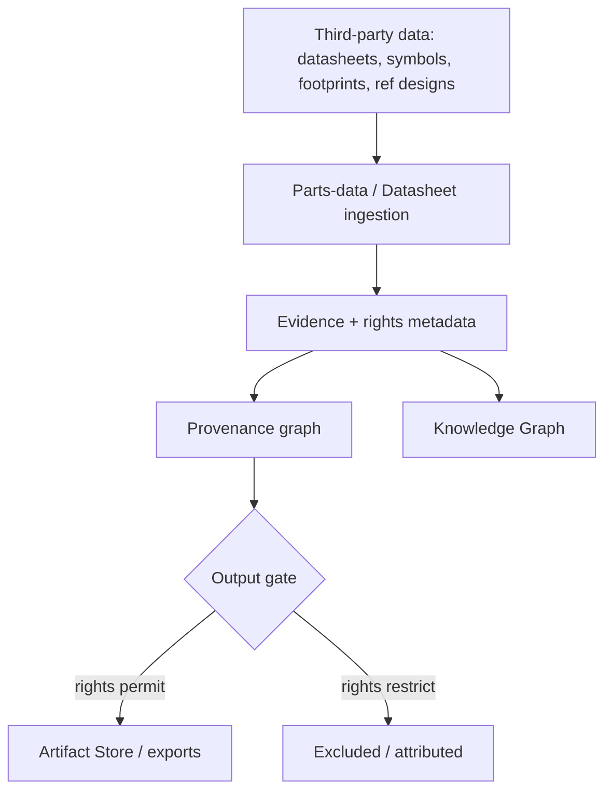

# Data Licensing & IP

> **Ring:** Governance (cross-cutting policy). This document defines how Electronics Agent Kit handles the **licensing, intellectual-property rights, and provenance of third-party engineering data** it ingests — datasheets, symbols and footprints, reference designs, parametric catalogs, and standards text. It exists because an AI engineering tool is only as trustworthy as the lineage of the data it reasons over: every external fact that influences a design must carry *where it came from*, *under what rights it may be used*, and *whether it may be redistributed in an output*. The architecture already records [provenance](../core/provenance-and-traceability.md) and treats external facts as dated [Evidence](../foundation/engineering-domain-model.md#evidence); this document adds the *rights* dimension to that lineage.

---

## 1. Purpose & responsibilities

### What it owns
- **Provenance-of-rights.** Ensuring every ingested third-party datum records its source and its license/usage terms alongside the fact itself, as part of its [Evidence](../foundation/engineering-domain-model.md#evidence) record.
- **Usage classification.** A policy taxonomy for how a datum may be used: internal reasoning only, embeddable in a design, redistributable in an output/export, or restricted.
- **Attribution & redistribution rules.** What must be attributed, and what may (or may not) appear in a generated artifact (BOM, Gerbers, reports, exports).
- **IP boundary for outputs.** Ensuring generated [artifacts](../data/stores/artifact-store.md) do not embed third-party content the project lacks rights to redistribute.

### What it does NOT own
- **Fetching the data.** External data is retrieved by the [supply-chain/parts-data](../integration/supply-chain-and-parts-data.md) and [datasheet intelligence](../GLOSSARY.md#datasheet-intelligence) paths; this doc governs the *rights* on what they fetch.
- **Protecting data in transit/at rest.** Confidentiality and access control are [security](../crosscutting/security.md); licensing is about *rights to use*, not *protection from access*.
- **Engineering/regulatory compliance** of the design — that is [standards & compliance](../engineering/standards-and-compliance.md), a different meaning of "compliance."
- **Liability for design outcomes** — owned by [safety, liability & ethics](safety-liability-and-ethics.md).
- **The provenance mechanism** — owned by [provenance & traceability](../core/provenance-and-traceability.md); this doc adds a rights facet to it.

---

## 2. Position in the architecture

*Figure: ingested third-party data carries rights metadata into the provenance graph; an output gate enforces redistribution rights on generated artifacts. From the governance viewpoint.*

- **Depends on:** [provenance & traceability](../core/provenance-and-traceability.md), the [Knowledge Graph](../knowledge/knowledge-graph.md) (where facts and their sources live), and the ingestion adapters.
- **Depended on by:** [artifact](../data/stores/artifact-store.md) generation/export, the [BOM](../compiler/ir/bom-ir.md), and any output that could carry third-party content.

---

## 3. Rights travel with the data

The core discipline: a third-party datum never enters the system as a bare value — it enters as [Evidence](../foundation/engineering-domain-model.md#evidence) bundled with source and usage terms, so rights are queryable at any later point ([P5](../foundation/principles.md)).

| Data kind | Typical rights concern | Architectural handling |
|-----------|------------------------|------------------------|
| **Datasheets** | Copyright on the document; facts vs. expression. | Store extracted *facts* as Evidence with source; do not redistribute the document unless permitted. |
| **Symbols / footprints** | License of the library (open vs. proprietary). | Record library license on the [Component Library](../engineering/component-library.md) entry; gate redistribution accordingly. |
| **Reference designs** | Derivative-work and attribution terms. | Track lineage; flag a design that derives from a restricted reference. |
| **Parametric catalogs** | Distributor terms of use. | Cache as dated Evidence ([supply-chain](../integration/supply-chain-and-parts-data.md)); use per the source's terms. |
| **Standards text** | Strong copyright on standards bodies' text. | Reason over *requirements*; never embed standard text in outputs. |

## 4. The output gate

Because the system *generates* artifacts, the IP risk concentrates at export. Before an [artifact](../data/stores/artifact-store.md) is produced, an output gate checks the rights metadata of every contributing datum: content marked non-redistributable is excluded or replaced with a reference, and required attributions are emitted. This makes "did we have the right to ship this?" an answerable, recorded question rather than an assumption ([P13](../foundation/principles.md)).

## 5. Why govern rights as provenance

Required by [P13](../foundation/principles.md). Rights that are not attached to the data are rights that get lost — and an AI tool that silently bakes third-party IP into a customer's design creates real legal exposure. By making license/usage terms a facet of the same [provenance](../core/provenance-and-traceability.md) record the system already keeps for trust and reproducibility, rights become traceable, enforceable at the output boundary, and auditable after the fact.

## Contracts

- **Consumes:** [provenance & traceability](../core/provenance-and-traceability.md) (rights as a facet of lineage), the [Knowledge port](../knowledge/knowledge-graph.md) (facts + sources), the [Parts-data port](../integration/supply-chain-and-parts-data.md) and datasheet ingestion (rights at ingest), and the [Security/Policy port](../crosscutting/security.md) (it protects the data this doc governs the *use* of).
- **Gates:** [artifact](../data/stores/artifact-store.md) generation/export against redistribution rights.
- **No port of its own** — it is a policy facet layered on existing ports.

## Failure modes

| Failure | Effect | Mitigation / degradation |
|---------|--------|--------------------------|
| **Missing rights metadata** | Unknown if a datum may be used. | Treated as restricted by default — never assumed permissive; flagged for human resolution ([P10](../foundation/principles.md)). |
| **Restricted content in an output** | Redistribution risk. | Output gate excludes/attributes it before export; the artifact records what was excluded. |
| **License change at source** | Previously-OK data now restricted. | Dated Evidence enables re-evaluation; provenance flags affected artifacts. |
| **Standard text leakage** | Copyright exposure. | Architecture reasons over requirements, not text; embedding standard text in outputs is disallowed. |
| **Untracked derivative** | Reference-design terms violated. | Lineage tracking flags derivatives; restricted lineage blocks unattributed export. |

## Open decisions

- [ADR-0002](../decisions/0002-runtime-owns-knowledge-llm-as-reasoning-engine.md) — external facts enter as Evidence (now carrying rights), not prompt content.
- [ADR-0008](../decisions/0008-design-version-control-model.md) — how dated rights metadata versions with the design.

## Related documents

[`core/provenance-and-traceability.md`](../core/provenance-and-traceability.md) · [`knowledge/knowledge-graph.md`](../knowledge/knowledge-graph.md) · [`integration/supply-chain-and-parts-data.md`](../integration/supply-chain-and-parts-data.md) · [`engineering/component-library.md`](../engineering/component-library.md) · [`data/stores/artifact-store.md`](../data/stores/artifact-store.md) · [`crosscutting/security.md`](../crosscutting/security.md) · [`engineering/standards-and-compliance.md`](../engineering/standards-and-compliance.md) · [`governance/safety-liability-and-ethics.md`](safety-liability-and-ethics.md) · [`foundation/principles.md`](../foundation/principles.md)
