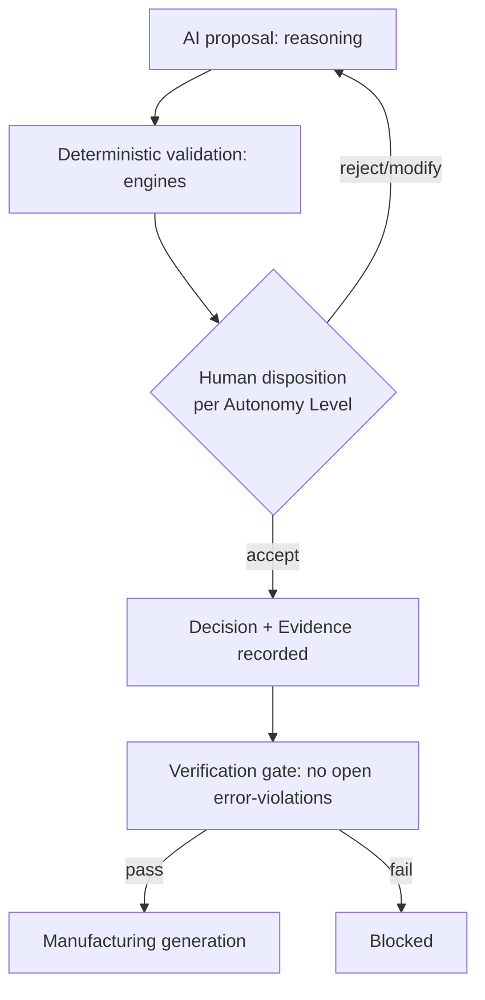

# Safety, Liability & Ethics

> **Ring:** Governance (cross-cutting policy). This document states the **safety posture, liability stance, and ethical commitments** of Electronics Agent Kit as an AI tool that participates in designing real, physical electronics. It exists because AI-generated designs can be *wrong in ways that injure people or destroy hardware* — and because responsibility for an engineering artifact cannot be delegated to a stochastic model. The architecture's answer is structural, not merely a disclaimer: the engineer stays **in command** ([P10](../foundation/principles.md)), every design-significant act is **traceable** ([P5](../foundation/principles.md)), and the AI **proposes while the human disposes**. This document makes that stance explicit and ties it to the mechanisms that enforce it.

---

## 1. Purpose & responsibilities

### What it owns
- **The human-in-command stance.** The non-negotiable position that a human engineer is the responsible authority for any design the system helps produce, and the architectural commitments that make that real.
- **Safety posture.** How the system avoids presenting unverified AI output as fact, how it marks confidence and uncertainty, and how it prevents an unsafe design from silently reaching manufacturing.
- **Disclaimers & framing.** What the product must communicate about the AI's role (assistant, not certifier) and the limits of its judgement.
- **Liability framing.** The architectural basis (traceability, reversibility, explicit acceptance) on which responsibility is assigned for AI-assisted decisions.

### What it does NOT own
- **Engineering rule definitions / regulatory compliance** — owned by [standards & compliance](../engineering/standards-and-compliance.md) and the [verification engine](../engineering/verification-engine.md). This doc governs *posture and responsibility*, not the rules themselves.
- **The autonomy mechanism** — owned by [human-in-the-loop](../engineering/human-in-the-loop.md); this doc explains *why* it must exist and how it underpins liability.
- **Information security** — owned by [security](../crosscutting/security.md).
- **Data/IP rights** — owned by [data licensing & IP](data-licensing-and-ip.md).
- **Specific legal terms** — contractual/legal language is a product/legal concern; this doc fixes the architectural commitments those terms rest on.

---

## 2. Position in the architecture

*Figure: every AI contribution passes deterministic validation, explicit human disposition, and a verification gate before it can become a manufacturable output. From the governance viewpoint.*

- **Depends on:** [human-in-the-loop](../engineering/human-in-the-loop.md) (autonomy + reversibility), [provenance & traceability](../core/provenance-and-traceability.md) (the record), the [verification engine](../engineering/verification-engine.md) (the safety gate), and [standards & compliance](../engineering/standards-and-compliance.md).
- **Depended on by:** product framing, [governance](data-licensing-and-ip.md) policy, and any [autonomous](../engineering/human-in-the-loop.md) operation.

---

## 3. The human-in-command stance (structural, not cosmetic)

Responsibility follows authority; the architecture therefore keeps authority with the human:

- **AI proposes, engineer disposes** ([P10](../foundation/principles.md)). By default the system *suggests*; a human accepts. Autonomous action is opt-in, bounded, and always reversible.
- **No unverified fact.** Stochastic output never becomes [Engineering State](../core/shared-state-model.md) without passing deterministic validation ([P3](../foundation/principles.md)); the runtime *owns the truth*, the model only advises.
- **Explicit acceptance is recorded.** When a human accepts a proposal or files a [Waiver](../foundation/engineering-domain-model.md#waiver), that acceptance is a recorded [Decision](../foundation/engineering-domain-model.md#decision) with rationale and actor — the evidentiary basis for assigning responsibility ([P5](../foundation/principles.md)).
- **The safety gate holds.** A design with open error-severity [Violations](../foundation/engineering-domain-model.md#violation) cannot transition to [manufacturing generation](../GLOSSARY.md#erc--drc--dfm--emc) — an unsafe design cannot silently ship; overriding requires an explicit, recorded Waiver.

## 4. Confidence, uncertainty, and honest framing

The tool must never launder a guess as a certainty. Reasoning outputs carry confidence; low-confidence proposals are surfaced as such, and the UI ([presentation-only](../foundation/principles.md), [P11](../foundation/principles.md)) presents diagnostics and provenance so the engineer can judge. The product framing is consistent: the AI is an *engineering assistant*, not a *certifying authority*; final sign-off, and the professional responsibility that comes with it, rests with the human ([P13](../foundation/principles.md): no silent or overstated claims).

## 5. Liability framing

Liability for a physical design cannot rest on a stochastic component. The architecture supports a clear assignment of responsibility by guaranteeing three things about every AI-assisted decision: it is **traceable** (who/what produced it and why), **reversible** (it can be undone, so a mistake is recoverable), and **explicitly accepted** (a human Decision authorized it before it became binding). These are the same properties professional engineering practice and functional-safety regimes demand of any design process; the runtime makes them inherent rather than procedural.

## Contracts

- **Consumes:** [human-in-the-loop](../engineering/human-in-the-loop.md) ([Autonomy Level](../engineering/human-in-the-loop.md) gating, reversibility), [provenance & traceability](../core/provenance-and-traceability.md) (the responsibility record), the [verification engine](../engineering/verification-engine.md) (safety gate + [Waivers](../foundation/engineering-domain-model.md#waiver)), and the [Presentation/Query port](../integration/ipc.md) (honest surfacing of confidence/diagnostics).
- **No port of its own** — it is a posture enforced through existing mechanisms.

## Failure modes

| Failure | Effect | Mitigation / degradation |
|---------|--------|--------------------------|
| **Overconfident wrong proposal** | Engineer might trust a bad suggestion. | Confidence surfaced; deterministic validation gates it; human disposition required; reversible if accepted in error. |
| **Autonomy misused** | AI acts beyond intended scope. | [Autonomy Level](../engineering/human-in-the-loop.md) is opt-in and bounded; all autonomous acts are reversible and recorded ([P10](../foundation/principles.md)). |
| **Unsafe design nears manufacturing** | Risk of shipping a hazard. | Verification gate blocks open error-violations; override only via explicit, justified [Waiver](../foundation/engineering-domain-model.md#waiver). |
| **Responsibility unclear after the fact** | Disputed accountability. | Full provenance: every decision traces to an actor + rationale ([P5](../foundation/principles.md)). |
| **Disclaimer treated as the only safeguard** | False sense of safety. | Safety is structural (gates, validation, reversibility), not merely textual. |

## Open decisions

- [ADR-0010](../decisions/0010-human-in-the-loop-autonomy-levels.md) — autonomy levels that underpin the human-in-command stance.
- [ADR-0002](../decisions/0002-runtime-owns-knowledge-llm-as-reasoning-engine.md) — the runtime owns truth; the model only advises.

## Related documents

[`engineering/human-in-the-loop.md`](../engineering/human-in-the-loop.md) · [`core/provenance-and-traceability.md`](../core/provenance-and-traceability.md) · [`engineering/verification-engine.md`](../engineering/verification-engine.md) · [`engineering/standards-and-compliance.md`](../engineering/standards-and-compliance.md) · [`governance/data-licensing-and-ip.md`](data-licensing-and-ip.md) · [`crosscutting/security.md`](../crosscutting/security.md) · [`integration/ipc.md`](../integration/ipc.md) · [`foundation/principles.md`](../foundation/principles.md) · [`foundation/quality-attributes.md`](../foundation/quality-attributes.md)
