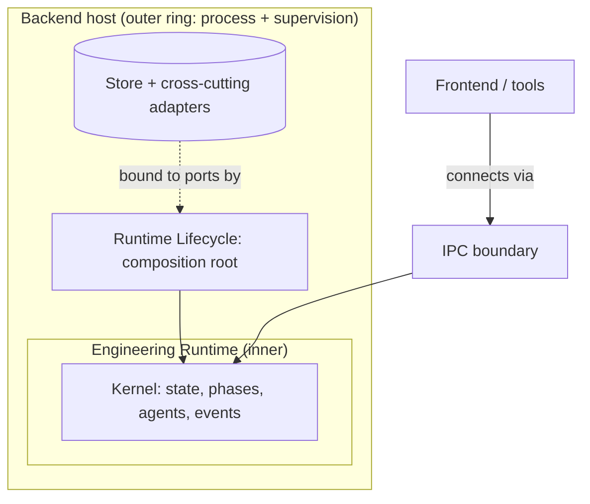

# Backend Hosting Model

> **Ring:** Interface adapters / frameworks boundary (outer ring). This document defines the **backend hosting model** — the process and runtime *host* that brings the [Engineering Runtime](../core/engineering-runtime.md) to life as a running service and exposes it to clients through [IPC](ipc.md). It exists to draw a sharp line that is easy to blur: the **logical runtime** (the deterministic kernel that owns the knowledge) is *not* the same thing as the **host** (the operating-system process, its startup, its supervision, its connectivity). This file is the "backend hosting" document other docs link to. It answers *where and how the kernel runs as a process*, never *what the kernel is* — that is the [Engineering Runtime](../core/engineering-runtime.md) — and never *how the kernel is wired together*, which is the [Runtime Lifecycle](../core/runtime-lifecycle.md) composition root.

---

## 1. Purpose & responsibilities

### What it owns
- **Process hosting.** Running the kernel inside one or more OS processes: launching the host, supervising it, and shutting it down cleanly so the runtime's [lifecycle](../core/runtime-lifecycle.md) can reconstruct state on the next start.
- **Endpoint exposure.** Standing up the [IPC](ipc.md) boundary so clients (the [frontend](../presentation/frontend.md), tools, automation) can reach the [Presentation/Query port](../core/contracts.md#presentation--query-port).
- **Adapter binding to infrastructure.** Being the outer-ring place where concrete cross-cutting adapters ([Observability](../crosscutting/logging-and-observability.md), [Configuration](../crosscutting/configuration.md), [Security/Policy](../crosscutting/security.md), [Cost-budget](../crosscutting/cost-and-resource-governance.md)) and store adapters are attached to the runtime's ports.
- **Deployment shape.** The hosting topology — single-user local host vs. shared/multi-tenant host — and what each implies for isolation and connectivity (the engineering consequences, not the chosen technology).

### What it does NOT own
- **The kernel's logic or knowledge.** The host *contains* the [Engineering Runtime](../core/engineering-runtime.md); it does not duplicate or override it. The runtime remains the sole authority over [Engineering State](../core/shared-state-model.md) ([P2](../foundation/principles.md)).
- **Composition / wiring order.** Which adapter implements which port and the order subsystems initialize is the [Runtime Lifecycle](../core/runtime-lifecycle.md) (the composition root). The host *invokes* the lifecycle; it does not define it.
- **The client.** The [frontend](../presentation/frontend.md) is a separate concern; the host only exposes the endpoint it connects to.
- **Transport and presentation semantics** — owned by [IPC](ipc.md).
- **Technology selection.** Process model, runtime platform, and deployment substrate are deferred ([Phase 0](../README.md)); this document fixes the *requirements* a host must meet.

---

## 2. Position in the architecture

*Figure: the host is the process that runs the lifecycle, which assembles the kernel and binds adapters; clients reach the kernel only through IPC. From the deployment viewpoint.*

- **Depends on:** the [Runtime Lifecycle](../core/runtime-lifecycle.md) (which it starts), [IPC](ipc.md) (which it exposes), and the outer-ring [adapters](../GLOSSARY.md#adapter) it binds. By [P1](../foundation/principles.md), all source dependency still points inward — the kernel knows nothing of its host.
- **Depended on by:** clients, operationally — not at the source level.

---

## 3. Logical runtime vs. physical host (the distinction that matters)

These are deliberately separated; conflating them is a common architectural error and is called out by the review.

| Concern | Owned by | Question it answers | Analogy |
|---------|----------|---------------------|---------|
| **What the kernel is and owns** | [Engineering Runtime](../core/engineering-runtime.md) | *What is the deterministic authority over the design?* | The mind |
| **How the kernel is assembled & started** | [Runtime Lifecycle](../core/runtime-lifecycle.md) | *In what order are ports bound and subsystems initialized?* | Waking up |
| **Where the kernel runs as a process** | **This doc — Backend Host** | *What process hosts it, supervises it, and exposes it?* | The body and its environment |

The same logical runtime can be hosted many ways — embedded in a desktop application, run as a local background service, or hosted as a shared service — *without changing the kernel*. That portability is precisely why the kernel must not know about its host ([P1](../foundation/principles.md), [P12](../foundation/principles.md)).

## 4. Hosting topologies (engineering consequences)

The hosting shape changes isolation and collaboration properties but not the kernel:

- **Local single-user host.** Kernel runs beside (or within) the client on one machine. Simplest isolation; one [Project](../GLOSSARY.md#project) at a time per host; [multi-user](../collaboration/multi-user-and-sessions.md) concerns are minimal.
- **Shared / multi-tenant host.** Kernel runs as a service many [Sessions](../collaboration/multi-user-and-sessions.md) connect to. Demands tenant isolation enforced through the [Security/Policy port](../crosscutting/security.md), fair scheduling under the [Scheduler](../core/scheduler.md) and [Cost-budget port](../crosscutting/cost-and-resource-governance.md), and the [concurrency model](../core/concurrency-and-consistency.md) for concurrent access to a Project.

In every topology the determinism and provenance guarantees are identical because they are properties of the kernel, not the host ([P4](../foundation/principles.md), [P5](../foundation/principles.md)).

## 5. Why separate the host from the runtime

Required by [P13](../foundation/principles.md). Binding the kernel to a particular process model or deployment substrate would make it un-portable and would smuggle infrastructure concerns into the inner ring, violating [P1](../foundation/principles.md)/[P12](../foundation/principles.md). Keeping the host as a thin, replaceable outer-ring shell lets deployment evolve (desktop today, hosted service later) while the engineering kernel — the part that must stay correct and reproducible — remains untouched.

## Contracts

- **Hosts the definer of, and binds implementations to:** every [Contract](../core/contracts.md) the kernel needs — [State Repository](../core/contracts.md#state-repository), [Event Sink/Source](../core/contracts.md#event-sink-event-source), [Reasoning Engine port](../core/reasoning-engine-interface.md), [Capability port](../core/contracts.md#capability-port), and the cross-cutting [Observability](../crosscutting/logging-and-observability.md) / [Configuration](../crosscutting/configuration.md) / [Security/Policy](../crosscutting/security.md) / [Cost-budget](../crosscutting/cost-and-resource-governance.md) ports.
- **Exposes:** the [Presentation/Query port](../core/contracts.md#presentation--query-port) via [IPC](ipc.md).
- **Delegates binding to:** the [Runtime Lifecycle](../core/runtime-lifecycle.md), which owns *which* adapter satisfies *which* port and in what order.

## Failure modes

| Failure | Effect | Mitigation / degradation |
|---------|--------|--------------------------|
| **Host crash** | Process dies mid-work. | On restart, the [lifecycle](../core/runtime-lifecycle.md) reconstructs state from the [Event Store](../data/stores/event-store.md) and nearest [Checkpoint](../core/checkpoint-system.md); no committed knowledge is lost ([P2](../foundation/principles.md), [P4](../foundation/principles.md)). |
| **Adapter fails to bind at startup** | A required port has no implementation. | The lifecycle aborts startup loudly rather than running a partially-wired kernel; the host reports the missing binding. |
| **Endpoint cannot be exposed** | Clients cannot connect. | Host stays up serving health/diagnostics; the kernel continues any autonomous work it is permitted; clients reconnect when the endpoint returns. |
| **Resource exhaustion (shared host)** | One tenant starves others. | Fair scheduling ([Scheduler](../core/scheduler.md)) and budgets ([Cost-budget port](../crosscutting/cost-and-resource-governance.md)); tenant isolation via [Security/Policy](../crosscutting/security.md). |
| **Unclean shutdown** | In-flight work interrupted. | The effect/commit boundary ([execution engine](../core/execution-engine.md)) and checkpointing ensure no design-significant operation is left half-applied. |

## Open decisions

- [ADR-0001](../decisions/0001-adopt-clean-architecture-dependency-rule.md) — the kernel must not depend on its host.
- [ADR-0003](../decisions/0003-shared-state-consistency-model.md) — concurrency model a shared host must honor.
- [ADR-0004](../decisions/0004-event-sourcing-decision.md) — state reconstruction on host restart.

## Related documents

[`core/engineering-runtime.md`](../core/engineering-runtime.md) · [`core/runtime-lifecycle.md`](../core/runtime-lifecycle.md) · [`integration/ipc.md`](ipc.md) · [`core/scheduler.md`](../core/scheduler.md) · [`core/concurrency-and-consistency.md`](../core/concurrency-and-consistency.md) · [`collaboration/multi-user-and-sessions.md`](../collaboration/multi-user-and-sessions.md) · [`crosscutting/configuration.md`](../crosscutting/configuration.md) · [`crosscutting/security.md`](../crosscutting/security.md) · [`foundation/principles.md`](../foundation/principles.md)
