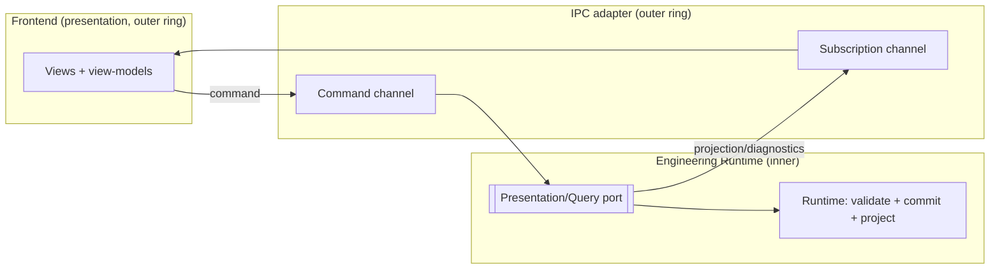
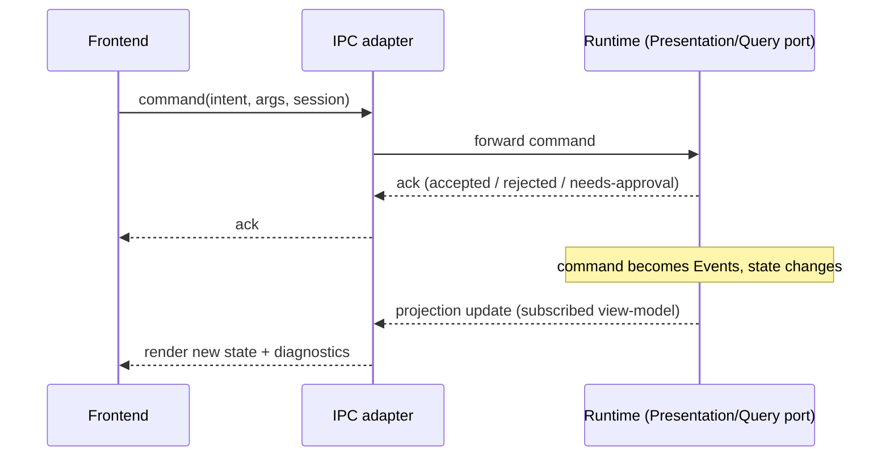

# Inter-Process Communication (IPC)

> **Ring:** Interface adapters (outer ring). IPC is the boundary across which the user-facing [frontend](../presentation/frontend.md) talks to the [Engineering Runtime](../core/engineering-runtime.md) backend. It is the outer-ring adapter that **implements the [Presentation/Query port](../core/contracts.md#presentation--query-port)**: it carries *commands* from the UI to the runtime and *projections + diagnostics* from the runtime to the UI. It exists because the runtime and its presentation surface are separate processes (often separate machines), and the seam between them must be expressed in **domain terms** — commands and subscriptions over [Engineering State](../core/shared-state-model.md) — not in transport mechanics. This is what keeps [P11 (UI is presentation-only)](../foundation/principles.md) real: the UI can only *ask* and *command*; it cannot reach into the runtime's internals.

---

## 1. Purpose & responsibilities

### What it owns
- **The command channel.** Conveying a user-issued [command](#the-command--subscription-model) (an intent to change state — "place this component," "run DRC," "accept this proposal") from the frontend to the runtime, where it is validated and committed as [Events](../core/event-bus.md).
- **The subscription channel.** Letting the frontend subscribe to read-only **projections** (view-models) of state and receive a live stream of updates and [diagnostics](../engineering/verification-engine.md) as the design changes.
- **Boundary marshalling.** Translating between the on-the-wire representation and the domain-vocabulary command/projection shapes the [Presentation/Query port](../core/contracts.md#presentation--query-port) defines — without leaking transport details inward.
- **Session and request correlation.** Associating each command and subscription with a [Session](../collaboration/multi-user-and-sessions.md) so the runtime can attribute, authorize, and order them; carrying request identity for [provenance](../core/provenance-and-traceability.md).

### What it does NOT own
- **Engineering rules.** IPC computes nothing about the design. ERC/DRC/DFM logic lives in the [Verification Engine](../engineering/verification-engine.md); IPC only transports the diagnostics it produces ([P11](../foundation/principles.md)).
- **The transport technology.** Whether the channel is a socket, a pipe, a message queue, or an in-process call is a deferred decision; this document speaks only of commands and subscriptions ([contracts](../core/contracts.md) design rule: domain vocabulary only).
- **Process hosting.** *Where* the runtime process lives and how it is launched is the [backend hosting model](backend.md); IPC assumes a backend exists and connects to it.
- **State authority.** IPC never holds the canonical state; it relays projections of state the runtime owns ([P2](../foundation/principles.md)).
- **Authorization.** IPC carries identity and the command; the [Security/Policy port](../crosscutting/security.md) decides whether the command is permitted.
- **Multi-user merge semantics.** Concurrent edits, presence, and conflict handling belong to [multi-user & sessions](../collaboration/multi-user-and-sessions.md) and the [concurrency model](../core/concurrency-and-consistency.md); IPC is the pipe, not the policy.

---

## 2. Position in the architecture

*Figure: IPC implements the Presentation/Query port — commands flow inward, projections and diagnostics flow outward. From the system's viewpoint. The UI never bypasses the port.*

- **Depends on:** the [Presentation/Query port](../core/contracts.md#presentation--query-port) (inward) and the [backend hosting model](backend.md) (a peer outer-ring concern that provides the process to connect to).
- **Depended on by:** the [frontend](../presentation/frontend.md), which only ever reaches the runtime through this adapter.

---

## 3. The command + subscription model

The seam is expressed as two complementary flows, both in domain terms:

### Commands (write path)
A **command** is a *request to do something* — never a direct mutation. The flow is asymmetric on purpose: the UI proposes, the runtime disposes.

1. The UI issues a command naming a domain intent and its arguments (entities by [Entity ID](../foundation/engineering-domain-model.md), [Physical Quantities](../engineering/units-and-quantities.md) with units).
2. IPC carries it, with session identity, to the [Presentation/Query port](../core/contracts.md#presentation--query-port).
3. The runtime authorizes ([Security/Policy port](../crosscutting/security.md)), validates, and — if accepted — performs it via a [Capability](../core/capability-registry.md), committing [Events](../core/event-bus.md).
4. IPC returns an acknowledgement (accepted / rejected / needs-approval per the [Autonomy Level](../engineering/human-in-the-loop.md)) — *not* the new state. New state arrives over the subscription channel.

This "command acknowledged, state streamed" separation means the UI never assumes its command's outcome; it observes the authoritative result, preserving [P11](../foundation/principles.md) and a single source of truth ([P2](../foundation/principles.md)).

### Subscriptions (read path)
A **subscription** is a standing request for a **projection** — a read-only view-model of some slice of [Engineering State](../core/shared-state-model.md) (the BOM, the current schematic, open [Violations](../foundation/engineering-domain-model.md#violation), an agent's progress). The runtime pushes an initial snapshot and then incremental updates as [Events](../core/event-bus.md) change the underlying state. Diagnostics computed by the [Verification Engine](../engineering/verification-engine.md) are delivered the same way. Projections are derived from the canonical model ([P6](../foundation/principles.md)); the UI renders them and holds no rules.

*Figure: the command is acknowledged; the resulting state arrives asynchronously over the subscription. From the user's viewpoint.*

## 4. Why a domain-typed boundary (not a generic RPC)

Required by [P13](../foundation/principles.md). A generic remote-call surface would let the UI invoke arbitrary runtime internals, eroding [P11](../foundation/principles.md) and the [Capability](../core/capability-registry.md) action model. By constraining the boundary to *commands* (which become Capability invocations) and *projection subscriptions* (read-only view-models), the UI's reach is exactly "ask and command" — auditable, authorizable, and impossible to misuse to embed engineering logic in the client.

## Contracts

- **Implements:** the [Presentation/Query port](../core/contracts.md#presentation--query-port) — *subscribe to a projection / issue a command / receive diagnostics*.
- **Consumes:** the [Security/Policy port](../crosscutting/security.md) (authorize each command, redact projections by permission), the [Observability port](../crosscutting/logging-and-observability.md) (trace command/subscription flows), and [Session](../collaboration/multi-user-and-sessions.md) context for attribution and ordering.
- **Relies on:** the [Event Sink/Source](../core/contracts.md#event-sink-event-source) indirectly — projection updates are driven by committed Events, but IPC subscribes through the Presentation/Query port, not the event bus directly.

## Failure modes

| Failure | Effect | Mitigation / degradation |
|---------|--------|--------------------------|
| **Channel disconnect** | UI loses live updates. | Subscriptions are resumable from the last delivered sequence point; on reconnect the UI re-syncs a fresh projection snapshot. No state is lost — it lives in the runtime. |
| **Command lost in flight** | UI unsure if the command applied. | Commands are idempotent by correlation id; a retried command is recognized and not double-applied. |
| **Backend unreachable** | No commands can be issued. | UI enters a read-only/offline indication; the runtime remains the source of truth and no partial state is invented client-side ([P11](../foundation/principles.md)). |
| **Slow consumer / backpressure** | Projection stream outpaces the UI. | The adapter coalesces or throttles projection updates (latest-state-wins for view-models); it never drops committed Events from the record. |
| **Unauthorized command** | UI requests a forbidden action. | Rejected by the [Security/Policy port](../crosscutting/security.md); IPC returns a rejection with no side effect. |
| **Schema mismatch (version skew)** | Frontend and runtime disagree on a shape. | Contract versioning per [data-versioning discipline](../core/contracts.md); the adapter rejects incompatible messages rather than mis-marshalling. |

## Open decisions

- [ADR-0001](../decisions/0001-adopt-clean-architecture-dependency-rule.md) — IPC is an outer-ring adapter implementing an inner port.
- [ADR-0003](../decisions/0003-shared-state-consistency-model.md) — ordering and consistency of concurrent commands across sessions.
- [ADR-0004](../decisions/0004-event-sourcing-decision.md) — how projections are derived/streamed from the event record.

## Related documents

[`core/contracts.md`](../core/contracts.md) · [`presentation/frontend.md`](../presentation/frontend.md) · [`integration/backend.md`](backend.md) · [`core/engineering-runtime.md`](../core/engineering-runtime.md) · [`core/concurrency-and-consistency.md`](../core/concurrency-and-consistency.md) · [`collaboration/multi-user-and-sessions.md`](../collaboration/multi-user-and-sessions.md) · [`crosscutting/security.md`](../crosscutting/security.md) · [`engineering/verification-engine.md`](../engineering/verification-engine.md) · [`foundation/principles.md`](../foundation/principles.md)
