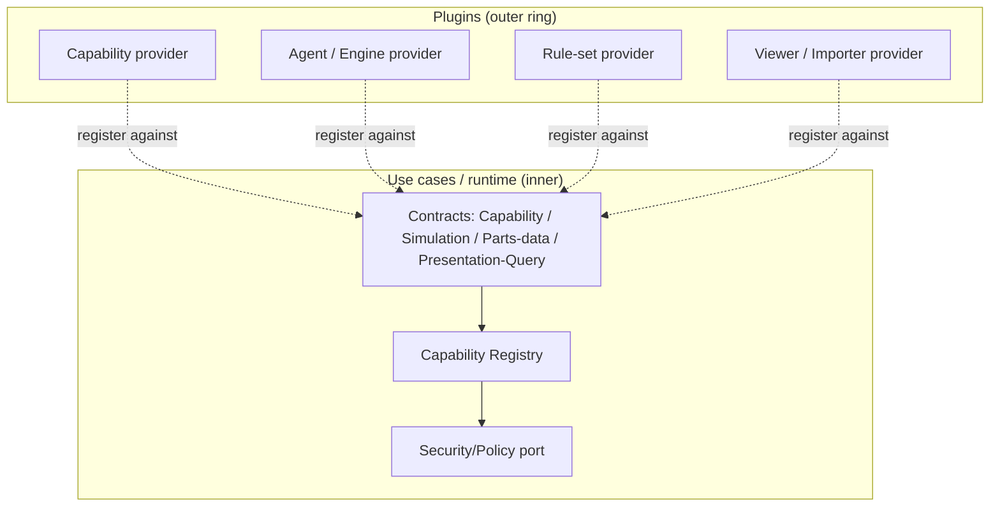

# Plugin System

> **Ring:** Interface adapters (outer ring). The Plugin System is the controlled extension mechanism by which third parties and first-party modules add new behavior — [Capabilities](../core/capability-registry.md), [Agents](../agents/README.md), [Engines](../GLOSSARY.md#engine), rule sets, viewers, and importers — to Electronics Agent Kit *without modifying the kernel*. It exists because an AI-native Engineering IDE must grow new actions, analyses, and vendor integrations continuously, yet the [Engineering Runtime](../core/engineering-runtime.md) must stay small, deterministic, and trustworthy. The plugin system resolves that tension the way mature IDEs and game engines do: extensions register against stable inner contracts and run under explicit permission, so the kernel gains reach without gaining surface area ([P7](../foundation/principles.md): mechanism/policy/instance separation).

---

## 1. Purpose & responsibilities

### What it owns
- **The registration model.** How an external module declares what it provides — Capabilities (with schema, permissions, declared side effects), Agent definitions, Engine implementations, verification rule sets, presentation viewers, and importers — and how the runtime ingests those declarations at load time.
- **The plugin lifecycle.** Discovery, validation, activation, deactivation, and unloading of a plugin as a unit, including version and compatibility checks against the contract versions the kernel exposes.
- **The sandbox and permission envelope.** The boundary that confines what a plugin may touch: which [Capabilities](../core/capability-registry.md) it may register, which [ports](../core/contracts.md) it may reach, and the least-privilege grant it runs under.
- **Extension-point definitions.** The catalog of *where* the system is extensible (the action surface, the agent set, the engine set, the rule set, the viewer set, the importer set) and the contract each extension point requires.

### What it does NOT own
- **The Capability catalog itself** — that is the [Capability Registry](../core/capability-registry.md). The plugin system is how an entry *gets into* the registry; the registry remains the authority over what a Capability is and how it is invoked.
- **Authorization decisions** — permission and autonomy checks at invocation time belong to the [Security/Policy port](../crosscutting/security.md) and the [Capability Registry](../core/capability-registry.md). The plugin system declares the *requested* grant; security *decides* it.
- **State mutation** — a plugin never touches [Engineering State](../core/shared-state-model.md) directly; it acts only through registered Capabilities, exactly like core code ([P2](../foundation/principles.md)).
- **Reasoning** — a plugin cannot smuggle in its own model client; any judgement still flows through the single [Reasoning Engine port](../core/reasoning-engine-interface.md) ([P3](../foundation/principles.md)).
- **Cost and metering policy** — declared by the plugin's Capabilities, enforced by the [Cost-budget port](../crosscutting/cost-and-resource-governance.md).

---

## 2. Position in the architecture

The plugin system is an outer-ring adapter. By the [Dependency Rule (P1)](../foundation/principles.md) plugins depend *inward* on the contracts the core defines; the core never depends on any plugin. A plugin is, architecturally, "more outer ring" — its code is loaded by the runtime but is governed exactly as untrusted adapter code.

*Figure: plugins register against stable inner contracts; the registry and the Security/Policy port govern them. From the runtime's viewpoint. Source dependency points inward only.*

- **Depends on:** the [Capability port](../core/contracts.md#capability-port), the [Security/Policy port](../crosscutting/security.md), and the contract versions the kernel publishes.
- **Depended on by:** nothing in the core — plugins are leaves. Other plugins may depend on a plugin's Capabilities only through the registry, never directly.

---

## 3. What a plugin may extend

Each extension point is a stable contract; a plugin supplies an implementation that the runtime governs identically to first-party code.

| Extension point | What a plugin contributes | Governed by |
|-----------------|---------------------------|-------------|
| **Capability** | A new action (e.g. a vendor-specific export, a niche check) with full schema, permissions, side-effect class. | [Capability Registry](../core/capability-registry.md) |
| **Agent** | A two-part [Agent](../agents/README.md) bound to one or more [Phases](../GLOSSARY.md#phase) (deterministic use-case ‖ reasoning adapter — the split is mandatory, [P8](../foundation/principles.md)). | [Agent runtime protocol](../core/agent-runtime-protocol.md) |
| **Engine** | A deterministic domain service callable by agents (no stochastic reasoning permitted inside it). | [Engine](../GLOSSARY.md#engine) conventions |
| **Rule set** | Additional verification/analysis rules over the [Verification Engine](../engineering/verification-engine.md) (e.g. a house DRC profile, a regulatory rule pack). | [Verification Engine](../engineering/verification-engine.md) |
| **Viewer** | A presentation panel that renders state via view-models — strictly presentation-only ([P11](../foundation/principles.md)); a viewer holds no engineering rules. | [Presentation/Query port](../core/contracts.md#presentation--query-port) |
| **Importer** | A reader that maps an external design format into the [domain model](../foundation/engineering-domain-model.md) via Capabilities. | [Capability Registry](../core/capability-registry.md) |

The unifying rule: a plugin **declares**, the kernel **governs**. Nothing a plugin provides bypasses the contracts core code uses.

## 4. Sandboxing and permissions

A plugin runs under an explicit, least-privilege grant established at activation and enforced at every invocation:

- **Declared grant.** A plugin states the Capabilities it registers and the ports it needs. The grant is reviewed (by policy / a human, [P10](../foundation/principles.md)) before activation; an unrequested reach is denied by default.
- **Confined action surface.** A plugin can act *only* through Capabilities. It cannot open a store, call a model, or reach the network except through the proper inner port, where the [Security/Policy port](../crosscutting/security.md) and [Cost-budget port](../crosscutting/cost-and-resource-governance.md) apply.
- **Isolation posture.** Plugin code is treated as untrusted: faults, resource exhaustion, or misbehavior in a plugin must be containable without corrupting [Engineering State](../core/shared-state-model.md) or crashing the kernel. The *degree* of isolation (in-process vs. out-of-process) is a deferred technology decision; the *requirement* — containment and least privilege — is fixed here ([P13](../foundation/principles.md)).
- **Same governance as core.** A plugin Capability is validated, permission-checked, side-effect-handled, metered, and recorded exactly like a core Capability; it cannot grant itself an undeclared or unmetered effect.

> **Assumption:** the concrete trust tiers (signed first-party vs. community vs. local-dev plugins) and the in-process/out-of-process isolation choice are deferred. This document fixes the invariant — least privilege, action only via Capabilities, identical governance — per [P13](../foundation/principles.md).

## 5. Why a plugin system (and not kernel edits)

Recording the rationale is required by [P13](../foundation/principles.md). New analyses, vendor formats, and house rules arrive faster than the kernel should change. Letting them register against stable contracts means the action surface grows by *declaration*, keeping the kernel small, auditable, and deterministic ([P4](../foundation/principles.md)). It also keeps every third-party effect inside the same audit trail ([P5](../foundation/principles.md)) and least-privilege envelope ([P12](../foundation/principles.md)) as first-party code — the extension model that makes ecosystems like VS Code and Unreal viable, adapted to an engineering runtime where correctness and provenance are non-negotiable.

## Contracts

- **Implements / extends:** the [Capability port](../core/contracts.md#capability-port) (registration is the port's extension mechanism); supplies implementations behind the [Simulation port](../core/contracts.md#simulation-port), [Parts-data port](../core/contracts.md#parts-data-port), and [Presentation/Query port](../core/contracts.md#presentation--query-port) where a plugin provides simulators, parts sources, or viewers.
- **Consumes:** the [Security/Policy port](../crosscutting/security.md) (grant review and per-invocation authz), the [Cost-budget port](../crosscutting/cost-and-resource-governance.md) (metering), the [Observability port](../crosscutting/logging-and-observability.md) (plugin activity is logged/traced), and the [Configuration port](../crosscutting/configuration.md) (plugin settings as a configuration layer).
- **Defines:** the extension-point contracts (registration descriptor for Capabilities/Agents/Engines/rule sets/viewers/importers) and the plugin lifecycle contract.

## Failure modes

| Failure | Effect | Mitigation / degradation |
|---------|--------|--------------------------|
| **Invalid / under-declared registration** | Plugin offers a Capability without full schema/permissions/side-effects. | Rejected at load; the registry refuses under-declared entries; plugin does not activate. |
| **Contract-version mismatch** | Plugin built against an incompatible kernel contract. | Compatibility check fails at discovery; plugin is quarantined, never half-loaded. |
| **Plugin requests excessive grant** | Over-broad permission request. | Denied by least-privilege default; requires explicit human/policy approval ([P10](../foundation/principles.md)). |
| **Plugin fault at runtime** | Exception, hang, or resource exhaustion. | Contained by isolation; the offending invocation fails as a recoverable error; kernel and state are unaffected. |
| **Malicious plugin** | Attempts undeclared I/O, state access, or model calls. | Impossible through contracts; blocked by the [Security/Policy port](../crosscutting/security.md); activity recorded as [Events](../core/event-bus.md). |
| **Plugin deactivated mid-use** | Its Capabilities vanish. | In-flight invocations complete or fail cleanly; the registry stops advertising the Capabilities; dependent agents re-plan. |

## Open decisions

- [ADR-0001](../decisions/0001-adopt-clean-architecture-dependency-rule.md) — plugins are outer-ring; the dependency rule makes their governance possible.
- [ADR-0002](../decisions/0002-runtime-owns-knowledge-llm-as-reasoning-engine.md) — plugins act only through Capabilities; the runtime owns effects.
- [ADR-0006](../decisions/0006-agent-fsm-separation.md) — plugin-provided agents must obey the two-part split.
- [ADR-0010](../decisions/0010-human-in-the-loop-autonomy-levels.md) — autonomy gating of plugin-registered actions.

## Related documents

[`core/capability-registry.md`](../core/capability-registry.md) · [`core/contracts.md`](../core/contracts.md) · [`core/agent-runtime-protocol.md`](../core/agent-runtime-protocol.md) · [`crosscutting/security.md`](../crosscutting/security.md) · [`crosscutting/cost-and-resource-governance.md`](../crosscutting/cost-and-resource-governance.md) · [`engineering/verification-engine.md`](../engineering/verification-engine.md) · [`integration/simulation-interface.md`](simulation-interface.md) · [`integration/supply-chain-and-parts-data.md`](supply-chain-and-parts-data.md) · [`foundation/principles.md`](../foundation/principles.md) · [`GLOSSARY.md`](../GLOSSARY.md)
