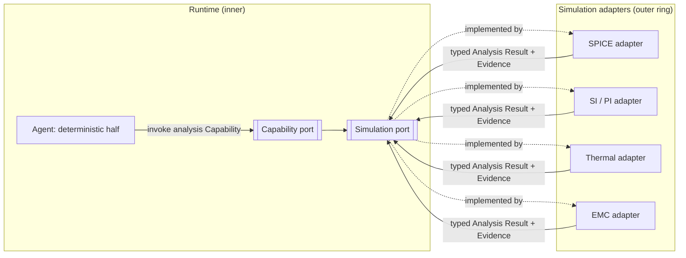

# Simulation Interface

> **Ring:** Interface adapters (outer ring). The Simulation Interface is the outer-ring adapter family that connects the [Engineering Runtime](../core/engineering-runtime.md) to external analysis tools — SPICE circuit simulation, signal integrity (SI), power integrity (PI), thermal, and electromagnetic compatibility (EMC) solvers. It **implements the [Simulation port](../core/contracts.md#simulation-port)**: the runtime asks for an analysis in domain terms, the adapter drives the appropriate external solver, and the result returns as a typed [Analysis Result](../foundation/engineering-domain-model.md#analysis-result). It exists because high-fidelity physical analysis is specialized, heavy, and best left to mature external engines — but its *outputs* must enter the runtime as first-class, traceable [Evidence](../foundation/engineering-domain-model.md#evidence), never as opaque blobs the UI or an agent interprets ad hoc.

---

## 1. Purpose & responsibilities

### What it owns
- **Solver invocation.** Driving external simulators across the analysis families (SPICE, SI, PI, thermal, EMC): preparing the solver-specific input from the design, running the analysis, and collecting raw output.
- **Domain ↔ solver translation.** Mapping the relevant slice of [Engineering State](../core/shared-state-model.md) (the netlist, stack-up, placement, material/[Physical Quantity](../engineering/units-and-quantities.md) parameters) into what a solver needs, and mapping raw solver output back into a typed [Analysis Result](../foundation/engineering-domain-model.md#analysis-result).
- **Non-determinism capture.** Recording solver identity, version, inputs, and outputs so the analysis is reproducible and replayable as recorded [Evidence](../foundation/engineering-domain-model.md#evidence) ([P4](../foundation/principles.md)).
- **Result typing.** Guaranteeing every returned quantity carries units and tolerance, and that interpretation metadata (confidence, assumptions, validity bounds) accompanies the data.

### What it does NOT own
- **The simulators themselves.** They are external tools; this adapter integrates them, it does not implement physics.
- **When to simulate.** That is an engineering decision made by [Agents](../agents/README.md) and sequenced by the [Workflow Orchestrator](../core/workflow-orchestration.md)/[Scheduler](../core/scheduler.md); the adapter only executes a requested analysis.
- **Rule evaluation / pass-fail.** ERC/DRC/DFM rule checking is the [Verification Engine](../engineering/verification-engine.md). Simulation produces *analysis* (numbers and interpretation); turning a result into a [Violation](../foundation/engineering-domain-model.md#violation) is a separate, deterministic step.
- **The Analysis Result entity definition.** That is owned by the [domain model](../foundation/engineering-domain-model.md#analysis-result); the adapter *produces* instances of it.
- **State mutation.** The adapter returns results; recording them as Evidence and attaching them to [Decisions](../foundation/engineering-domain-model.md#decision) happens through [Capabilities](../core/capability-registry.md) in the runtime ([P2](../foundation/principles.md)).

---

## 2. Position in the architecture

*Figure: the runtime requests an analysis through the Simulation port; outer adapters drive the solvers and return typed results. From the runtime's viewpoint.*

- **Depends on:** the [Simulation port](../core/contracts.md#simulation-port) (inward) and the [domain model](../foundation/engineering-domain-model.md) vocabulary it speaks in.
- **Depended on by:** nothing inner. Agents reach it only through the [Capability port](../core/capability-registry.md) → Simulation port, never directly ([P1](../foundation/principles.md)).
- **Extensible by:** the [plugin system](plugin-system.md), which can register additional solver adapters behind the same port.

---

## 3. The analysis families

Each family answers a distinct physical question; all return through the same port as typed [Analysis Results](../foundation/engineering-domain-model.md#analysis-result):

| Family | Question it answers | Principal inputs |
|--------|---------------------|------------------|
| **SPICE (circuit)** | Does the circuit behave as intended (DC/AC/transient)? | Netlist, component models, stimuli. |
| **Signal integrity (SI)** | Do high-speed signals arrive clean (reflections, crosstalk, eye)? | Net geometry, stack-up, [net class](../foundation/engineering-domain-model.md#net) targets. |
| **Power integrity (PI)** | Is the power-delivery network adequate (IR drop, impedance)? | Plane geometry, currents, decoupling. |
| **Thermal** | Do parts stay within thermal limits? | Placement, power dissipation, board materials. |
| **EMC** | Will the design meet emissions/immunity expectations? | Geometry, currents, shielding. |

A single adapter family may wrap several solvers; the port stays uniform so the runtime requests "an SI analysis of this net" without knowing which solver runs.

## 4. Results as typed, traceable Evidence

The defining discipline: a simulation result is not a number on a screen — it is an [Analysis Result](../foundation/engineering-domain-model.md#analysis-result) with typed [Physical Quantities](../engineering/units-and-quantities.md), recorded inputs, solver provenance, confidence, and validity bounds. That makes it usable as [Evidence](../foundation/engineering-domain-model.md#evidence) supporting a [Decision](../foundation/engineering-domain-model.md#decision), traceable in the [provenance graph](../core/provenance-and-traceability.md), and reproducible under [replay](../core/determinism-and-reproducibility.md) (the recorded result is reused rather than re-solved). This is what keeps analysis honest in an AI-driven tool: an agent cannot quietly assert "the rail is fine" — it must cite a recorded, typed result ([P5](../foundation/principles.md)).

## 5. Why an external-solver port (not built-in physics)

Required by [P13](../foundation/principles.md). Field-grade SPICE/SI/PI/thermal/EMC engines represent decades of specialized work; reimplementing them inside the kernel would be slower, less trusted, and would couple the deterministic core to heavyweight numerics. Wrapping them behind one port keeps the kernel provider-independent, lets results enter as recorded Evidence, and allows new or better solvers to be swapped in (or added via [plugins](plugin-system.md)) without touching engineering logic.

## Contracts

- **Implements:** the [Simulation port](../core/contracts.md#simulation-port) — *run an external analysis and return a typed [Analysis Result](../foundation/engineering-domain-model.md#analysis-result)*.
- **Consumes:** the [Cost-budget port](../crosscutting/cost-and-resource-governance.md) (solver runs are cost/time-bearing and metered), the [Configuration port](../crosscutting/configuration.md) (solver endpoints/settings), the [Security/Policy port](../crosscutting/security.md) (access to external solver services and any secrets), and the [Observability port](../crosscutting/logging-and-observability.md) (tracing long-running analyses).
- **Feeds:** [Evidence](../foundation/engineering-domain-model.md#evidence) → [Decisions](../foundation/engineering-domain-model.md#decision); consumed downstream by the [Verification Engine](../engineering/verification-engine.md) when a result must become a pass/fail check.

## Failure modes

| Failure | Effect | Mitigation / degradation |
|---------|--------|--------------------------|
| **Solver unavailable** | Analysis cannot run. | Capability returns a recoverable error; the runtime degrades to advisory/manual and never fabricates a result; the agent re-plans or requests human input ([P10](../foundation/principles.md)). |
| **Non-convergence / numerical failure** | No usable result. | Recorded as a failed Analysis Result with diagnostics (Evidence of failure), not silently dropped ([P13](../foundation/principles.md)). |
| **Solver timeout / cost overrun** | Long or expensive run. | Bounded by the [Cost-budget port](../crosscutting/cost-and-resource-governance.md); cancellable; partial results marked incomplete. |
| **Untyped / unit-ambiguous output** | Risk of dimensional error. | Adapter must attach units/tolerance before returning ([P9](../foundation/principles.md)); ambiguous output is rejected, not guessed. |
| **Stale inputs** | Result no longer matches the design. | Result records the exact input snapshot; provenance flags it superseded when the underlying state changes. |
| **Solver version drift** | Replay produces different numbers. | Solver identity/version recorded; replay reuses the recorded result rather than re-solving ([P4](../foundation/principles.md)). |

## Open decisions

- [ADR-0009](../decisions/0009-determinism-and-replay-strategy.md) — recording solver runs for deterministic replay.
- [ADR-0007](../decisions/0007-units-and-physical-quantity-type-system.md) — typing of returned physical quantities.
- [ADR-0002](../decisions/0002-runtime-owns-knowledge-llm-as-reasoning-engine.md) — results enter as Evidence the runtime owns.

## Related documents

[`core/contracts.md`](../core/contracts.md) · [`foundation/engineering-domain-model.md`](../foundation/engineering-domain-model.md) · [`engineering/verification-engine.md`](../engineering/verification-engine.md) · [`engineering/units-and-quantities.md`](../engineering/units-and-quantities.md) · [`core/provenance-and-traceability.md`](../core/provenance-and-traceability.md) · [`core/determinism-and-reproducibility.md`](../core/determinism-and-reproducibility.md) · [`integration/plugin-system.md`](plugin-system.md) · [`crosscutting/cost-and-resource-governance.md`](../crosscutting/cost-and-resource-governance.md) · [`foundation/principles.md`](../foundation/principles.md)
