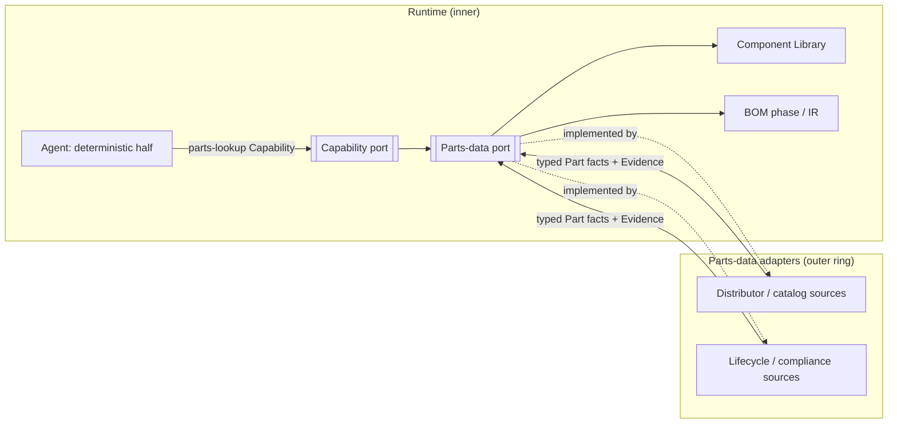

# Supply-Chain & Parts Data

> **Ring:** Interface adapters (outer ring). This is the outer-ring adapter family that connects the [Engineering Runtime](../core/engineering-runtime.md) to external part databases, distributor catalogs, pricing/availability feeds, and component lifecycle sources. It **implements the [Parts-data port](../core/contracts.md#parts-data-port)**: the runtime asks to resolve a real, orderable [Part](../foundation/engineering-domain-model.md#part-manufacturer-part) — its parameters, price, availability, lead time, lifecycle status, and compliance flags — and the adapter fetches that from the outside world and returns it in domain terms. It exists because component sourcing data is large, external, fast-changing, and authoritative only at its source; the runtime must consume it as recorded [Evidence](../foundation/engineering-domain-model.md#evidence) that feeds the [Component Library](../engineering/component-library.md) and the [BOM](../GLOSSARY.md#bom), never as folklore baked into a prompt.

---

## 1. Purpose & responsibilities

### What it owns
- **Part resolution.** Looking up a manufacturer part (by MPN or parametric query) and returning its identity, parametric facts, datasheet reference, and compliance flags (RoHS/REACH).
- **Sourcing data.** Fetching price breaks, stock/availability, lead time, and alternates from distributor/aggregator sources.
- **Lifecycle signals.** Surfacing lifecycle status (active / NRND / EOL / last-time-buy) so the runtime can flag risk.
- **External → domain mapping.** Translating heterogeneous external records into the [Part](../foundation/engineering-domain-model.md#part-manufacturer-part) and [BOM Line Item](../foundation/engineering-domain-model.md#bom-line-item) vocabulary, with [Physical Quantities](../engineering/units-and-quantities.md) typed and units normalized.
- **Provenance & freshness.** Recording source, query, and timestamp for every fetched fact so it enters as dated [Evidence](../foundation/engineering-domain-model.md#evidence).

### What it does NOT own
- **The Part / BOM entity definitions** — owned by the [domain model](../foundation/engineering-domain-model.md). The adapter *populates* instances; it does not define them.
- **Part selection.** Choosing *which* part to use is an engineering [Decision](../foundation/engineering-domain-model.md#decision) made by [Agents](../agents/README.md) (e.g. the [BOM Agent](../agents/README.md)); the adapter supplies candidates and facts, not the choice.
- **BOM assembly logic** — owned by the BOM phase/agent and the [BOM IR](../compiler/ir/bom-ir.md).
- **Datasheet parameter extraction** — the [Datasheet Intelligence](../GLOSSARY.md#datasheet-intelligence) phase extracts structured facts into the [Knowledge Graph](../knowledge/knowledge-graph.md); this adapter provides catalog/sourcing data and datasheet *references*, not the parsing of datasheet PDFs.
- **Licensing/IP judgments** about third-party catalog data — that is [data licensing & IP governance](../governance/data-licensing-and-ip.md).
- **State mutation** — facts are recorded as Evidence and attached to Decisions through [Capabilities](../core/capability-registry.md) ([P2](../foundation/principles.md)).

---

## 2. Position in the architecture

*Figure: the runtime resolves parts through the Parts-data port; outer adapters fetch from external sources and return typed, dated facts that feed the Component Library and BOM. From the runtime's viewpoint.*

- **Depends on:** the [Parts-data port](../core/contracts.md#parts-data-port) (inward) and the [domain model](../foundation/engineering-domain-model.md) vocabulary.
- **Depended on by:** nothing inner directly; agents reach it through the [Capability port](../core/capability-registry.md). Feeds the [Component Library](../engineering/component-library.md) and [BOM](../compiler/ir/bom-ir.md).
- **Extensible by:** the [plugin system](plugin-system.md), which can register additional parts/sourcing adapters behind the same port.

---

## 3. What it returns

For a resolved [Part](../foundation/engineering-domain-model.md#part-manufacturer-part) the adapter returns, all carrying source + timestamp [provenance](../core/provenance-and-traceability.md):

- **Identity & parameters** — MPN, manufacturer, datasheet reference, typed parametric facts.
- **Sourcing** — price breaks, stock, lead time, alternates/cross-references.
- **Lifecycle** — active / NRND / EOL / last-time-buy, with risk signal.
- **Compliance** — RoHS/REACH and similar flags.

Every field is dated and attributed so the runtime can reason about *freshness* and the user can trust the audit trail ([P5](../foundation/principles.md)).

## 4. Freshness, caching, and provenance

Sourcing data is volatile (price and stock change hourly; lifecycle changes rarely). The adapter therefore distinguishes **stable facts** (parameters, footprint class — cacheable long) from **volatile facts** (price, stock — short-lived). Cached data is recorded as Evidence *with its fetch timestamp*, so a [Decision](../foundation/engineering-domain-model.md#decision) made on day-old pricing is honestly dated and can be re-validated. Caching policy aligns with the [performance](../crosscutting/performance.md) and [cost governance](../crosscutting/cost-and-resource-governance.md) strategies (external lookups are rate-limited and cost-bearing). No silent staleness: a fact's age is always part of the record ([P13](../foundation/principles.md)).

## 5. Why an external parts port (not an embedded catalog)

Required by [P13](../foundation/principles.md). The universe of orderable parts is enormous, externally owned, and continuously changing; an embedded catalog would be instantly stale and would couple the kernel to a data vendor. A port lets the runtime consume authoritative data on demand, record it as dated Evidence, swap or combine sources, and keep part *selection* a traceable engineering Decision rather than an artifact of whatever happened to be in a prompt ([P2](../foundation/principles.md), [P3](../foundation/principles.md)).

## Contracts

- **Implements:** the [Parts-data port](../core/contracts.md#parts-data-port) — *resolve Parts, pricing, availability, lifecycle*.
- **Consumes:** the [Cost-budget port](../crosscutting/cost-and-resource-governance.md) (external queries are metered/rate-limited), the [Configuration port](../crosscutting/configuration.md) (source endpoints/preferences), the [Security/Policy port](../crosscutting/security.md) (API credentials as secrets), and the [Observability port](../crosscutting/logging-and-observability.md).
- **Feeds:** the [Component Library](../engineering/component-library.md), the [BOM IR](../compiler/ir/bom-ir.md), and the [Knowledge Graph](../knowledge/knowledge-graph.md) (as Evidence); subject to [data licensing & IP](../governance/data-licensing-and-ip.md) governance.

## Failure modes

| Failure | Effect | Mitigation / degradation |
|---------|--------|--------------------------|
| **Source unavailable** | Cannot fetch live data. | Serve cached facts marked with their age; degrade to advisory; never invent prices/stock ([P13](../foundation/principles.md)). |
| **Conflicting data across sources** | Two sources disagree. | Both recorded as Evidence with attribution; the runtime surfaces the conflict for a human/agent Decision rather than silently picking one. |
| **Stale cached data** | Decision made on old data. | Every fact is dated; volatile facts have short TTLs; provenance enables re-validation before commit. |
| **Rate-limit / cost overrun** | Too many external calls. | Bounded by the [Cost-budget port](../crosscutting/cost-and-resource-governance.md); batched and cached per the [performance](../crosscutting/performance.md) strategy. |
| **Unit-ambiguous parameter** | Risk of dimensional error. | Normalized to typed [Physical Quantities](../engineering/units-and-quantities.md) on ingest ([P9](../foundation/principles.md)); ambiguous values rejected. |
| **EOL/obsolete part chosen** | Sourcing risk. | Lifecycle status surfaced at resolution; the runtime flags risk before the part is committed to the BOM. |

## Open decisions

- [ADR-0002](../decisions/0002-runtime-owns-knowledge-llm-as-reasoning-engine.md) — parts data enters as Evidence the runtime owns, not prompt folklore.
- [ADR-0007](../decisions/0007-units-and-physical-quantity-type-system.md) — typing of fetched parametric values.
- [ADR-0008](../decisions/0008-design-version-control-model.md) — how dated sourcing Evidence versions with the design.

## Related documents

[`core/contracts.md`](../core/contracts.md) · [`foundation/engineering-domain-model.md`](../foundation/engineering-domain-model.md) · [`engineering/component-library.md`](../engineering/component-library.md) · [`compiler/ir/bom-ir.md`](../compiler/ir/bom-ir.md) · [`knowledge/knowledge-graph.md`](../knowledge/knowledge-graph.md) · [`governance/data-licensing-and-ip.md`](../governance/data-licensing-and-ip.md) · [`integration/plugin-system.md`](plugin-system.md) · [`crosscutting/cost-and-resource-governance.md`](../crosscutting/cost-and-resource-governance.md) · [`foundation/principles.md`](../foundation/principles.md)
