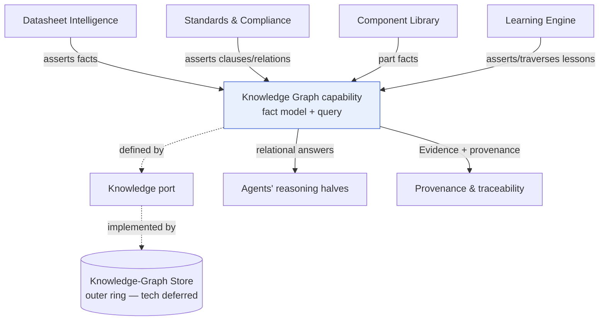
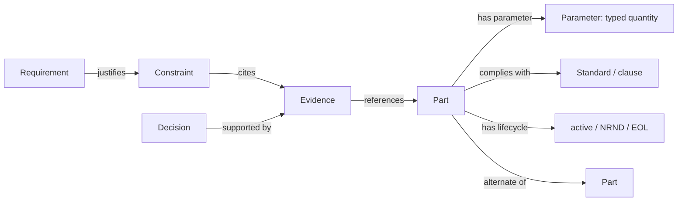

# Knowledge Graph (capability)

> **Ring:** Use cases / runtime (inner) — a **capability**, defined by the [Knowledge port](../core/contracts.md). The Knowledge Graph is the capability for **modelling and querying interconnected engineering facts**: parts, parameters, relationships, standards, and the [Evidence](../foundation/engineering-domain-model.md#evidence) that supports [Decisions](../foundation/engineering-domain-model.md#decision). It exists because much engineering reasoning is *relational* — "what parts have this footprint and are RoHS-compliant and active?", "which requirement justifies this constraint?", "what else connects to this power rail?" — and those questions need a queryable web of facts, not flat records. **This document describes the capability — *what* is modelled and *how* it is queried — NOT storage technology.** The bytes live in the [Knowledge-Graph Store](../data/stores/knowledge-graph-store.md) (an outer-ring adapter); this capability depends only on the [Knowledge port](../core/contracts.md) ([P1](../foundation/principles.md), [P12](../foundation/principles.md)).

---

## 1. Purpose & responsibilities

### What it owns

- **The engineering fact model.** The conceptual schema of *what kinds of facts and relationships* are modelled: parts and their parameters, components, nets, standards/clauses, datasheet-derived facts, and the [Provenance Links](../foundation/engineering-domain-model.md#provenance-link) among [Requirements](../foundation/engineering-domain-model.md#requirement), [Constraints](../foundation/engineering-domain-model.md#constraint), [Decisions](../foundation/engineering-domain-model.md#decision), and [Evidence](../foundation/engineering-domain-model.md#evidence).
- **Assertion of facts.** The discipline by which facts enter the graph: typed (using [Physical Quantities](../engineering/units-and-quantities.md) where physical), sourced, and provenance-bearing.
- **Relational query.** Pattern-matching and relationship traversal — answering connectivity and qualification questions a flat store cannot.
- **Feeding Evidence & provenance.** Serving as the substrate for [Evidence](../foundation/engineering-domain-model.md#evidence) that backs [Decisions](../foundation/engineering-domain-model.md#decision) and for the [provenance](../core/provenance-and-traceability.md) fabric ([P5](../foundation/principles.md)).

### What it does **NOT** own

- **Storage technology.** No graph-database choice, schema DDL, indexing, or query-language selection appears here. That is the [Knowledge-Graph Store](../data/stores/knowledge-graph-store.md) adapter (deferred, outer ring). **This separation is the central point of this document.**
- **The canonical design state.** The authoritative model of *the design itself* is the [Engineering State](../core/shared-state-model.md) / [Engineering Domain Model](../foundation/engineering-domain-model.md). The Knowledge Graph holds *engineering knowledge* (facts about parts, standards, prior art, relationships) that informs design — it complements, not replaces, the design state. (See §4.)
- **Semantic similarity.** Fuzzy "find things like this" retrieval is [Vector Memory](vector-memory.md), a sibling capability. The Knowledge Graph answers *precise, structured* questions; Vector Memory answers *approximate, similarity* ones. (See §5.)
- **Extraction.** Turning datasheets into facts is [Datasheet Intelligence](../state-machines/datasheet-intelligence.md); the graph is where extracted facts land, not the extractor.
- **Stochastic reasoning.** The graph is queried deterministically; a model may *reason over* retrieved facts, but the capability itself does not call a model ([P3](../foundation/principles.md)).

---

## 2. Position in the architecture

*Figure: the capability is defined by the Knowledge port and backed by the store adapter; producers assert facts, consumers query relationships and draw Evidence. Viewpoint: the knowledge ring.*

- **Ring:** Use cases / runtime. **Defines** the [Knowledge port](../core/contracts.md) (per [contracts.md](../core/contracts.md): defined by the knowledge capability). Depends inward only — on the [Engineering Domain Model](../foundation/engineering-domain-model.md) and [Physical Quantities](../engineering/units-and-quantities.md) ([P1](../foundation/principles.md)).
- **Depended on by:** [Datasheet Intelligence](../state-machines/datasheet-intelligence.md), the [Component Library](../engineering/component-library.md), [Standards & Compliance](../engineering/standards-and-compliance.md), the [Constraint Engine](../engineering/constraint-engine.md) (deriving bounds from facts), the [Learning Engine](../engineering/learning-engine.md), and [provenance & traceability](../core/provenance-and-traceability.md).

---

## 3. What is modelled and how it is queried

### Facts and relationships (illustrative)

*Figure: a slice of the engineering fact web. Edges carry meaning; queries traverse them. Viewpoint: the conceptual schema.*

### Query styles (conceptual, via the [Knowledge port](../core/contracts.md))

- **Assert fact** — add a typed, sourced fact or relationship.
- **Query by pattern** — "parts where footprint = X and lifecycle = active and RoHS = true."
- **Traverse relationships** — "from this net, all connected pins → their components → their parts → datasheet thermal limits."

The port's operations are exactly `assert fact / query by pattern / traverse relationships` ([contracts.md §2](../core/contracts.md)). Crucially these are *structured, deterministic* operations — given the same facts, the same query yields the same answer ([P4](../foundation/principles.md)).

---

## 4. Capability vs. store (the distinction that defines this doc)

| Aspect | Knowledge Graph **capability** (this doc) | [Knowledge-Graph **Store**](../data/stores/knowledge-graph-store.md) (adapter) |
|--------|-------------------------------------------|------------------------------------------------------------------------------|
| Concern | *what* facts/relationships exist; *how* they're queried conceptually | *how* they're persisted, indexed, and served in bytes |
| Ring | use cases / runtime (inner) | interface adapter (outer, deferred) |
| Vocabulary | [domain-model](../foundation/engineering-domain-model.md) terms | storage/engine terms |
| Stability | stable conceptual model | swappable technology |
| Defined/implemented | **defines** the [Knowledge port](../core/contracts.md) | **implements** it |

> **Why split capability from store?** [P1/P12](../foundation/principles.md): the inner ring must not depend on a storage technology. By describing the *capability* against the [Knowledge port](../core/contracts.md), the choice of graph engine (or even a non-graph realization) is deferrable and swappable without touching any consumer. A consumer asks "what parts qualify?" — it never knows or cares how the store answers.

### Knowledge Graph vs. Engineering State

The [Engineering State](../core/shared-state-model.md) is the canonical truth of *the design*. The Knowledge Graph holds *engineering knowledge that informs the design* — part facts, standards, prior art, relationships, and the [Evidence](../foundation/engineering-domain-model.md#evidence)/[provenance](../core/provenance-and-traceability.md) web. They overlap at provenance (the graph is a natural home for the relationship fabric), but design-significant *state mutations* always go through the [State Repository](../core/contracts.md) and become [Events](../core/event-bus.md); the graph is queried, not a back-door to mutate the design.

---

## 5. Relationship to Vector Memory

[Knowledge Graph](knowledge-graph.md) and [Vector Memory](vector-memory.md) are **complementary** capabilities, often used together:

| | Knowledge Graph | [Vector Memory](vector-memory.md) |
|--|-----------------|-----------------------------------|
| Question | precise, structured, relational | approximate, semantic, "similar to" |
| Example | "active RoHS parts with this footprint" | "reference designs like this one" |
| Result | exact matches + traversals | ranked similar items |
| Port | [Knowledge port](../core/contracts.md) | [Vector Memory port](../core/contracts.md) |

A typical flow: [Vector Memory](vector-memory.md) finds *candidate* similar parts/designs; the Knowledge Graph then *qualifies* them precisely (lifecycle, compliance, exact parameters). The [Learning Engine](../engineering/learning-engine.md) uses both.

---

## 6. Contracts

- **Defines:** the [Knowledge port](../core/contracts.md) — *assert fact / query by pattern / traverse relationships* — implemented by the [Knowledge-Graph Store](../data/stores/knowledge-graph-store.md) (outer ring).
- **Consumes:** the [Engineering Domain Model](../foundation/engineering-domain-model.md) vocabulary and [Physical Quantities](../engineering/units-and-quantities.md) for typed facts; the [Security/Policy port](../core/contracts.md) for fact-access scoping (whose knowledge is visible).
- **Does not consume** the [Reasoning Engine port](../core/reasoning-engine-interface.md); it serves facts *to* reasoning, deterministically ([P3](../foundation/principles.md)).

---

## 7. Failure modes

- **Store unavailable.** Queries degrade to unanswerable; consumers treat missing facts as [indeterminate](../engineering/constraint-engine.md), never fabricated. See [`failure-taxonomy-and-degraded-modes.md`](../core/failure-taxonomy-and-degraded-modes.md).
- **Conflicting facts** (two sources disagree on a parameter). Modelled explicitly with source/reliability so a consumer (or the engineer) can adjudicate — not silently overwritten.
- **Stale fact** (lifecycle changed upstream). Facts carry source/provenance so they can be refreshed; staleness is detectable, not hidden.
- **Unsourced assertion.** Rejected — every fact must carry a source for [provenance](../core/provenance-and-traceability.md) ([P5](../foundation/principles.md)).
- **Over-broad query / cost.** Bounded via the [Cost-budget port](../core/contracts.md); no silent unbounded traversal ([P13](../foundation/principles.md)).

---

## 8. Open decisions

- [ADR-0002](../decisions/0002-runtime-owns-knowledge-llm-as-reasoning-engine.md) — the graph is *runtime-owned knowledge*, feeding reasoning, never a model's private memory.
- [ADR-0005](../decisions/0005-ir-as-canonical-phase-boundary-representation.md) — relationship between graph facts and [IR](../compiler/compiler-ir.md) projections.
- [ADR-0008](../decisions/0008-design-version-control-model.md) — how facts version alongside [design branches](../data/design-version-control.md).
- **Open (deferred to store):** the concrete realization of the [Knowledge-Graph Store](../data/stores/knowledge-graph-store.md) — a later-phase technology ADR, deliberately out of scope here.

---

## 9. Related documents

[`core/contracts.md`](../core/contracts.md) (Knowledge port) · [`data/stores/knowledge-graph-store.md`](../data/stores/knowledge-graph-store.md) (the store — tech) · [`knowledge/vector-memory.md`](vector-memory.md) (sibling capability) · [`core/provenance-and-traceability.md`](../core/provenance-and-traceability.md) · [`foundation/engineering-domain-model.md`](../foundation/engineering-domain-model.md) (Evidence, Provenance Link) · [`engineering/component-library.md`](../engineering/component-library.md) · [`engineering/learning-engine.md`](../engineering/learning-engine.md) · [`state-machines/datasheet-intelligence.md`](../state-machines/datasheet-intelligence.md)
