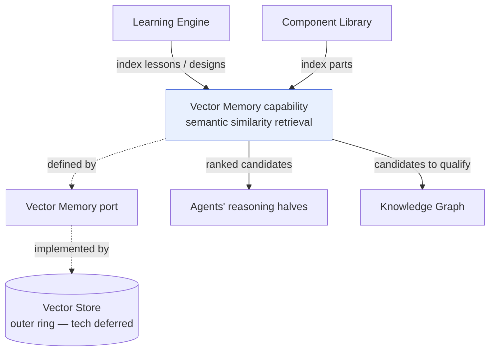

# Vector Memory (capability)

> **Ring:** Use cases / runtime (inner) — a **capability**, defined by the [Vector Memory port](../core/contracts.md). Vector Memory is the capability for **semantic similarity retrieval over engineering content**: "find reference designs like this one," "parts similar to this one," "prior cases that resemble this situation." It exists because much valuable engineering knowledge is *not* exactly query-able — it is fuzzy, by-resemblance recall ("we've seen a power tree shaped like this before"), which structured queries cannot serve. **This document describes the capability — *what* is retrieved and *how* it is used — NOT storage technology.** The vectors live in the [Vector Store](../data/stores/vector-store.md) (an outer-ring adapter); this capability depends only on the [Vector Memory port](../core/contracts.md) ([P1](../foundation/principles.md), [P12](../foundation/principles.md)).

---

## 1. Purpose & responsibilities

### What it owns

- **The semantic-retrieval capability.** The conceptual ability to index engineering content and retrieve the most *similar* items to a query item — over designs, [Parts](../foundation/engineering-domain-model.md#part), [Functional Blocks](../foundation/engineering-domain-model.md#functional-block), patterns, and [Learning Engine](../engineering/learning-engine.md) lessons.
- **What is indexable.** The discipline of *which* engineering content is meaningfully embeddable and what a "similar" result means for each kind (similar topology vs. similar part vs. similar problem).
- **Ranked, scored results.** Returning candidates with similarity scores so a consumer can threshold, and so results are *suggestions* to be validated, never asserted facts.
- **Serving Learning & agents.** Being the recall substrate for the [Learning Engine](../engineering/learning-engine.md) and for [Agents](../agents/README.md) seeking prior art to inform a proposal.

### What it does **NOT** own

- **Storage / embedding technology.** No vector-database, embedding-model, index-type, or distance-metric *choice* appears here — those are the [Vector Store](../data/stores/vector-store.md) adapter and the embedding adapter (deferred, outer ring). **This separation is the central point of this document.**
- **Truth.** A similarity hit is a *candidate*, not a fact. Vector Memory never produces design state; results are validated (often by the [Knowledge Graph](knowledge-graph.md) and the engineer) before influencing anything ([P3](../foundation/principles.md), [P10](../foundation/principles.md)).
- **Structured/relational query.** Precise, qualified questions are the [Knowledge Graph](knowledge-graph.md), the sibling capability. Vector Memory answers *approximate* questions only. (See §4.)
- **Generating embeddings as judgement.** Producing an embedding is a mechanical adapter operation, not stochastic *reasoning*; reasoning over retrieved candidates happens in an [Agent's](../agents/README.md) reasoning half via the [Reasoning Engine port](../core/reasoning-engine-interface.md).
- **Persistence guarantees of canonical state.** Canonical knowledge is the [Engineering State](../core/shared-state-model.md) / [Knowledge Graph](knowledge-graph.md); Vector Memory is a derived, rebuildable index.

---

## 2. Position in the architecture


*Figure: the capability is defined by the Vector Memory port and backed by the store adapter; producers index content, consumers retrieve ranked candidates that are then qualified/validated. Viewpoint: the knowledge ring.*

- **Ring:** Use cases / runtime. **Defines** the [Vector Memory port](../core/contracts.md) (per [contracts.md](../core/contracts.md): defined by the vector memory capability). Depends inward only — on the [Engineering Domain Model](../foundation/engineering-domain-model.md) vocabulary for what it indexes ([P1](../foundation/principles.md)).
- **Depended on by:** the [Learning Engine](../engineering/learning-engine.md) (its primary client), the [Component Library](../engineering/component-library.md) (similar/alternate parts), and [Agents](../agents/README.md) seeking prior art.

---

## 3. What is retrieved and how it is used

### Indexable content (illustrative)

| Content | "Similar" means | Used by |
|---------|-----------------|---------|
| Reference designs / [Functional Blocks](../foundation/engineering-domain-model.md#functional-block) | comparable topology/intent | [Schematic](../state-machines/schematic-planning.md)/[Floor Planning](../state-machines/pcb-floor-planning.md) agents seeking prior art |
| [Parts](../foundation/engineering-domain-model.md#part) | comparable parametric/functional profile | [Component Library](../engineering/component-library.md) (alternates, suggestions) |
| [Learning Engine](../engineering/learning-engine.md) lessons | comparable applicability context | the learning feedback loop |
| Past problems/[Violations](../foundation/engineering-domain-model.md#violation)+fixes | comparable situation | agents proposing fixes |

### Retrieval flow (the canonical pattern)

```mermaid
sequenceDiagram
  autonumber
  participant AG as Agent / Learning Engine
  participant VM as Vector Memory (port)
  participant KG as Knowledge Graph
  participant E as Engineer
  AG->>VM: similarity query (this design / part / situation)
  VM-->>AG: ranked candidates + scores
  AG->>KG: qualify candidates (lifecycle, compliance, exact params)
  KG-->>AG: precise, validated subset
  AG->>E: propose (Evidence-backed); engineer disposes
```
*Figure: the recommended "fuzzy-then-precise" pattern — Vector Memory finds candidates, the Knowledge Graph qualifies them, the engineer disposes. Viewpoint: one retrieval.*

This pattern is deliberate: **similarity narrows the search; structure and humans confirm.** A vector hit alone never becomes a design decision ([P10](../foundation/principles.md)).

### Port operations (conceptual)

Per [contracts.md §2](../core/contracts.md), the [Vector Memory port](../core/contracts.md) offers *index item / similarity query / delete*. Nothing in those operations names a metric, model, or index type — by design.

---

## 4. Capability vs. store, and vs. Knowledge Graph

### Capability vs. store (the distinction that defines this doc)

| Aspect | Vector Memory **capability** (this doc) | [Vector **Store**](../data/stores/vector-store.md) (adapter) |
|--------|-----------------------------------------|-------------------------------------------------------------|
| Concern | *what* is retrievable; *how* similarity is used | *how* vectors are stored, indexed, and searched in bytes |
| Ring | use cases / runtime (inner) | interface adapter (outer, deferred) |
| Vocabulary | [domain-model](../foundation/engineering-domain-model.md) terms | embedding/index terms |
| Defined/implemented | **defines** the [Vector Memory port](../core/contracts.md) | **implements** it |

> **Why split capability from store?** [P1/P12](../foundation/principles.md): no inner-ring consumer should depend on an embedding model or vector database. By describing the *capability* against the [Vector Memory port](../core/contracts.md), the entire retrieval technology stack is deferrable and swappable. A consumer asks "what's similar?" — it never knows the metric or model behind the answer. Because the index is *derived*, it can be rebuilt from canonical sources, so swapping technology is safe.

### Vector Memory vs. Knowledge Graph (sibling capabilities)

| | [Knowledge Graph](knowledge-graph.md) | Vector Memory (this doc) |
|--|---------------------------------------|--------------------------|
| Question | precise, structured, relational | approximate, semantic, "similar to" |
| Determinism | exact, reproducible answers | ranked by similarity; thresholded by consumer |
| Role | *qualify / verify* candidates | *discover* candidates |
| Port | [Knowledge port](../core/contracts.md) | [Vector Memory port](../core/contracts.md) |

They are complementary, not competing — the §3 flow uses both.

---

## 5. Contracts

- **Defines:** the [Vector Memory port](../core/contracts.md) — *index item / similarity query / delete* — implemented by the [Vector Store](../data/stores/vector-store.md) (outer ring).
- **Consumes:** the [Engineering Domain Model](../foundation/engineering-domain-model.md) vocabulary (what entities are indexed); the [Security/Policy port](../core/contracts.md) for scoping (whose content is retrievable, preventing cross-tenant leakage — see [Learning Engine](../engineering/learning-engine.md)); the [Cost-budget port](../core/contracts.md) to bound query cost.
- **Does not consume** the [Reasoning Engine port](../core/reasoning-engine-interface.md); embedding is a mechanical adapter op, and reasoning over results happens in agents ([P3](../foundation/principles.md)).

---

## 6. Failure modes

- **Store unavailable.** Retrieval degrades to no-candidates; agents fall back to first-principles reasoning and structured [Knowledge Graph](knowledge-graph.md) queries. No fabricated similarity. See [`failure-taxonomy-and-degraded-modes.md`](../core/failure-taxonomy-and-degraded-modes.md).
- **Irrelevant / low-score results.** Consumers threshold on score; below-threshold candidates are ignored rather than forced — and never become facts without [Knowledge Graph](knowledge-graph.md) qualification + human disposal.
- **Stale index** (source content changed). The index is *derived* and rebuildable from canonical sources; staleness is recoverable, not corrupting.
- **Embedding drift** (technology change shifts the vector space). Handled at the [Vector Store](../data/stores/vector-store.md) adapter via re-indexing; the capability contract is unaffected.
- **Cross-tenant leakage risk.** Prevented by [Security/Policy](../core/contracts.md) scoping; similarity never crosses an unauthorized boundary.

---

## 7. Open decisions

- [ADR-0002](../decisions/0002-runtime-owns-knowledge-llm-as-reasoning-engine.md) — similarity hits inform *reasoning inputs*; they are never truth or state on their own.
- [ADR-0009](../decisions/0009-determinism-and-replay-strategy.md) — how non-deterministic similarity results are captured/recorded so a run replays (a retrieval result is recorded like any other boundary output).
- **Open (deferred to store):** the concrete embedding model, vector database, distance metric, and index type — a later-phase technology ADR, deliberately out of scope here ([Vector Store](../data/stores/vector-store.md)).
- **Open:** scope of indexed experience sharing (per-user / org / global) — shared with [Learning Engine](../engineering/learning-engine.md), governed by [security](../crosscutting/security.md).

---

## 8. Related documents

[`core/contracts.md`](../core/contracts.md) (Vector Memory port) · [`data/stores/vector-store.md`](../data/stores/vector-store.md) (the store — tech) · [`knowledge/knowledge-graph.md`](knowledge-graph.md) (sibling capability) · [`engineering/learning-engine.md`](../engineering/learning-engine.md) (primary client) · [`engineering/component-library.md`](../engineering/component-library.md) (similar parts) · [`foundation/engineering-domain-model.md`](../foundation/engineering-domain-model.md) · [`core/determinism-and-reproducibility.md`](../core/determinism-and-reproducibility.md)
