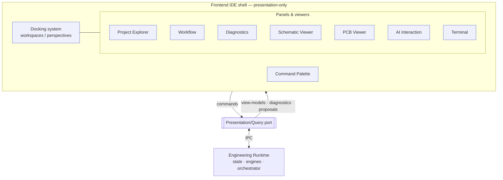
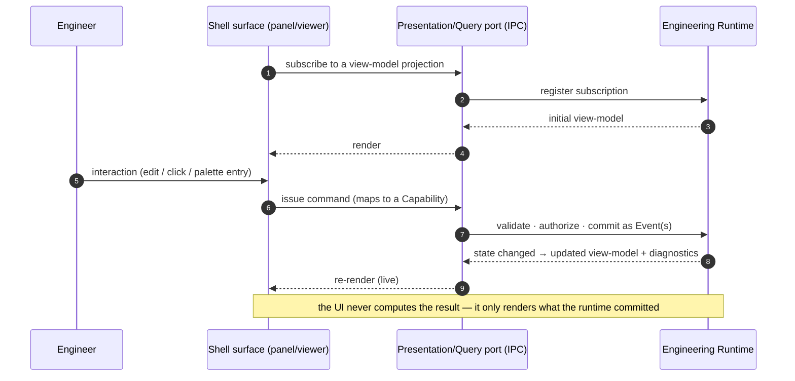

# Frontend — the IDE Shell

> **Ring:** Interface adapters — presentation (outer). This is the **overview** of the Electronics Agent Kit frontend: an AI-native Engineering IDE shell — dockable panels, viewers, a command palette, a workflow surface — modeled conceptually after the ergonomics of a modern code IDE and a real-time engine editor. It exists to give an engineer a single, coherent surface for driving the [Engineering Runtime](../core/engineering-runtime.md): every panel **renders read-only view-models** obtained over the [Presentation/Query port](../core/contracts.md#presentation-query-port) and **emits commands** back through it. The defining law of this whole ring is [P11 — The UI Is Presentation-Only](../foundation/principles.md): the frontend contains **no engineering rules**. ERC/DRC/DFM logic, constraint resolution, gating, and provenance all live in the runtime; the UI only shows their results and asks the runtime to act.

---

## 1. Purpose & responsibilities

### What it owns

- **The shell composition.** The overall layout — how the [docking system](frontend/docking-system.md) hosts [panels](frontend/panels.md) and viewers, the command surface, the status surface — and the ergonomics of arranging them ([workspaces/perspectives](frontend/docking-system.md)).
- **Presentation of runtime state.** Subscribing to view-model projections (the [Project/Engineering State](../core/shared-state-model.md) structure, the [workflow plan](../core/workflow-orchestration.md), diagnostics, proposals) and rendering them faithfully and live.
- **Command issuance.** Translating user intent (clicks, edits, palette entries, keystrokes) into well-formed commands that map to runtime [Capabilities](../core/capability-registry.md), and sending them over the [Presentation/Query port](../core/contracts.md#presentation-query-port).
- **Interaction state.** Purely local, non-engineering UI state: which panels are open, selection, zoom, scroll, hover, in-progress (uncommitted) edit gestures, and per-user layout preferences.

### What it does **NOT** own (no engineering rules — [P11](../foundation/principles.md))

- **No engineering logic.** It never computes ERC/DRC/DFM results, never resolves [Constraints](../engineering/constraint-engine.md), never decides whether a design may advance or manufacture. Those are the [Verification Engine](../engineering/verification-engine.md), [Constraint Engine](../engineering/constraint-engine.md), and [Workflow Orchestrator](../core/workflow-orchestration.md).
- **No authority over state.** It cannot mutate [Engineering State](../core/shared-state-model.md) directly; the only way it changes anything is by issuing a command that the runtime validates, authorizes, and commits as an [Event](../core/event-bus.md).
- **No knowledge ownership.** It holds no durable engineering knowledge ([P2](../foundation/principles.md)); a view-model is a disposable projection, not a source of truth.
- **No reasoning.** It does not call models. AI judgement enters only at the [Reasoning Engine port](../core/reasoning-engine-interface.md) inside the runtime; the UI surfaces proposals, it does not generate them (see [AI interaction model](frontend/ai-interaction-model.md)).
- **No autonomy/gate decisions.** Approvals and gates are decided by [human-in-the-loop](../engineering/human-in-the-loop.md) policy in the runtime; the UI renders the pending decision and relays the engineer's disposition.

---

## 2. Position in the architecture

The frontend is the outermost ring and depends inward only, through one boundary — the [Presentation/Query port](../core/contracts.md#presentation-query-port) — transported by [IPC](../integration/ipc.md). The runtime core never imports the UI ([P1](../foundation/principles.md)); it merely exposes projections and accepts commands.

*Figure: the shell composition. Every surface renders view-models from, and emits commands to, the single Presentation/Query port; nothing in the shell reaches the runtime any other way. Viewpoint: the presentation ring.*

- **Depends on:** the [Presentation/Query port](../core/contracts.md#presentation-query-port) only. View-models are expressed in [domain-model](../foundation/engineering-domain-model.md) vocabulary, never in storage/transport terms (a [contract design rule](../core/contracts.md)).
- **Depended on by:** nothing inward — the UI is a leaf. The runtime is fully usable headless; the UI is one consumer of its port.

---

## 3. How the shell gets its data — and sends commands

The whole frontend follows one read/write pattern, applied uniformly by every panel:

*Figure: the read-model + command-out loop shared by every surface. The UI proposes intent; the runtime disposes ([P10](../foundation/principles.md)). Viewpoint: one user interaction.*

- **Read side — projections.** A surface subscribes to the projection it needs (the project tree, a schematic, a board, the diagnostics list, the workflow graph, pending proposals). Projections are **read-only** and **live**: when the runtime commits an [Event](../core/event-bus.md), the affected view-models update and the surface re-renders. The UI keeps no authoritative copy.
- **Write side — commands.** Every user action that changes the design becomes a command mapped to a registered [Capability](../core/capability-registry.md). The runtime validates against the capability schema, authorizes against the [Autonomy Level](../engineering/human-in-the-loop.md), commits as Events, and the resulting projection flows back. A rejected command produces no change and a surfaced reason ([P13](../foundation/principles.md)).
- **Diagnostics are received, never computed.** Errors/warnings/info shown anywhere in the shell originate in the [Verification Engine](../engineering/verification-engine.md) and arrive as a diagnostics projection ([P11](../foundation/principles.md)); see [diagnostics](frontend/diagnostics.md).
- **Optimistic vs. authoritative.** A surface may *preview* an in-progress gesture locally (e.g. dragging a part), but the authoritative state is only what the runtime commits and projects back; the preview is reconciled to it.

---

## 4. The surfaces of the shell

Each surface is detailed in its own document; together they compose the IDE:

| Surface | Role | Document |
|---------|------|----------|
| **Docking system** | dockable/splittable layout, workspaces/perspectives, layout persistence | [docking-system](frontend/docking-system.md) |
| **Panel model** | what a panel is, its lifecycle, the standard panels, plugin extensibility | [panels](frontend/panels.md) |
| **Workflow** | presents the [workflow plan](../core/workflow-orchestration.md), guides through phases, surfaces gates/approvals | [workflow](frontend/workflow.md) |
| **Command palette** | discoverable command surface mapping to [Capabilities](../core/capability-registry.md) | [command-palette](frontend/command-palette.md) |
| **AI interaction** | propose/review/accept/reject of agent proposals; provenance ([P10](../foundation/principles.md)) | [ai-interaction-model](frontend/ai-interaction-model.md) |
| **Terminal** | integrated command/console surface; scope & boundaries | [terminal](frontend/terminal.md) |
| **Project Explorer** | navigates Project / [Engineering State](../core/shared-state-model.md) structure | [project-explorer](frontend/project-explorer.md) |
| **Diagnostics** | surfaces [Violations](../foundation/engineering-domain-model.md#violation)/[Analysis Results](../foundation/engineering-domain-model.md#analysis-result) as diagnostics | [diagnostics](frontend/diagnostics.md) |
| **PCB Viewer** | visualizes the [PCB IR](../compiler/ir/pcb-ir.md) (board/placement/routing/layers) | [pcb-viewer](frontend/pcb-viewer.md) |
| **Schematic Viewer** | visualizes the [Schematic IR](../compiler/ir/schematic-ir.md) (components/nets/symbols) | [schematic-viewer](frontend/schematic-viewer.md) |

> **Why an IDE shell, not a PCB editor and not a chatbot.** Per the [system framing](../README.md), the product is an *Engineering Runtime* with a presentation layer over it. The shell borrows the proven ergonomics of code-IDE and engine-editor environments — docking, a command palette, a project tree, integrated diagnostics, viewers — because those ergonomics let an engineer *command a system* rather than *operate a drawing tool*. The AI is woven in as proposals an engineer reviews, not a conversational add-on ([ai-interaction-model](frontend/ai-interaction-model.md)).

---

## 5. Contracts

- **Consumes:** the [Presentation/Query port](../core/contracts.md#presentation-query-port) — *subscribe to a projection*, *issue a command*, *receive diagnostics* — transported over [IPC](../integration/ipc.md). This is the frontend's **only** inward dependency.
- **Implements:** the outer-ring side of that port (the rendering and command-emitting adapter). Per the [contracts catalog](../core/contracts.md), the Presentation/Query port is *defined by* the runtime core and *implemented by* IPC + frontend.
- **Speaks domain vocabulary.** View-models and commands are phrased in [domain-model](../foundation/engineering-domain-model.md) terms (entities by [Entity ID](../foundation/engineering-domain-model.md), typed [Physical Quantities](../engineering/units-and-quantities.md)), never in UI-framework or storage terms.

---

## 6. Failure modes

- **Runtime/IPC unavailable.** The shell shows last-known projections as stale (clearly marked) and disables command issuance until reconnected; it never fabricates state. See [`failure-taxonomy-and-degraded-modes.md`](../core/failure-taxonomy-and-degraded-modes.md).
- **Command rejected** (schema-invalid, unpermitted, or gated). No state change; the surface shows the runtime's reason and the engineer re-tries or seeks approval ([P10](../foundation/principles.md), [P13](../foundation/principles.md)).
- **Projection lag under heavy change.** Surfaces render the latest committed projection and indicate pending updates; correctness comes from the runtime, so a slow UI is never a wrong UI.
- **Reasoning unavailable.** Proposal-oriented affordances degrade to advisory/empty; human-driven commands still work, mirroring the runtime's [degraded posture](../engineering/human-in-the-loop.md).
- **Stale layout/workspace.** A layout referencing a now-absent panel degrades gracefully (the panel is omitted), since layout is preference, not engineering data ([docking-system](frontend/docking-system.md)).

---

## 7. Open decisions

- [ADR-0001](../decisions/0001-adopt-clean-architecture-dependency-rule.md) — the dependency rule that keeps the UI a leaf with one inward port.
- [ADR-0002](../decisions/0002-runtime-owns-knowledge-llm-as-reasoning-engine.md) — runtime owns knowledge; the UI holds none.
- [ADR-0010](../decisions/0010-human-in-the-loop-autonomy-levels.md) — propose/dispose and gate surfacing the UI relays.
- **Open:** the granularity and update/subscription semantics of view-model projections (full vs. incremental), and the IPC transport shape — to be fixed in [IPC](../integration/ipc.md) and a future ADR (per [P13](../foundation/principles.md), recorded rather than assumed silently).

---

## 8. Related documents

[`foundation/principles.md`](../foundation/principles.md) (P11) · [`core/contracts.md`](../core/contracts.md#presentation-query-port) · [`integration/ipc.md`](../integration/ipc.md) · [`core/shared-state-model.md`](../core/shared-state-model.md) · [`core/capability-registry.md`](../core/capability-registry.md) · [`engineering/verification-engine.md`](../engineering/verification-engine.md) · [`engineering/human-in-the-loop.md`](../engineering/human-in-the-loop.md) · [`foundation/architecture-views.md`](../foundation/architecture-views.md) · panels: [docking-system](frontend/docking-system.md) · [panels](frontend/panels.md) · [workflow](frontend/workflow.md) · [command-palette](frontend/command-palette.md) · [ai-interaction-model](frontend/ai-interaction-model.md) · [terminal](frontend/terminal.md) · [project-explorer](frontend/project-explorer.md) · [diagnostics](frontend/diagnostics.md) · [pcb-viewer](frontend/pcb-viewer.md) · [schematic-viewer](frontend/schematic-viewer.md)
