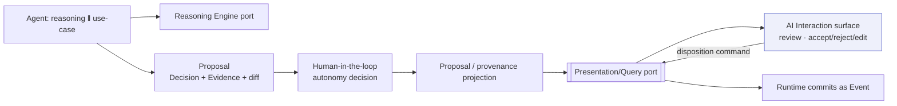
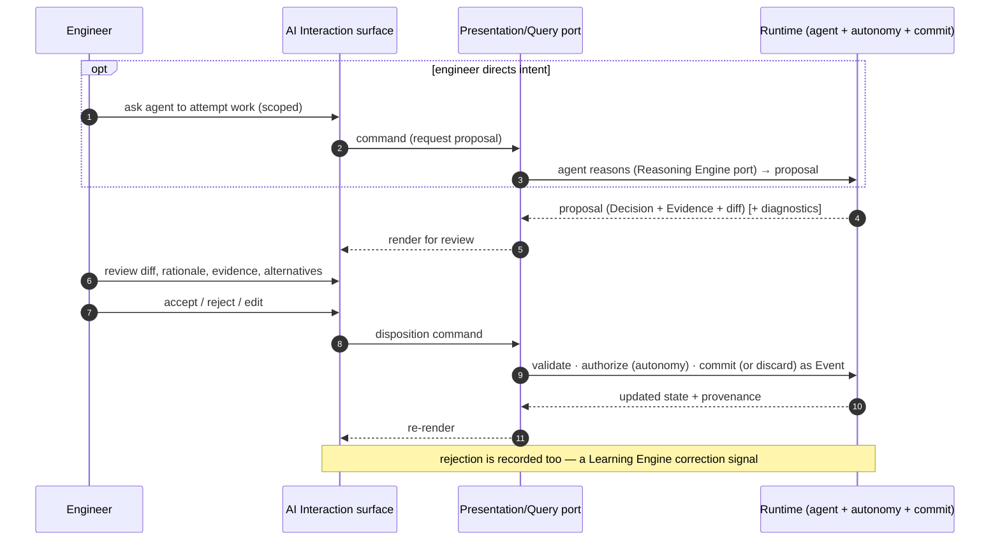

# AI Interaction Model

> **Ring:** Interface adapters — presentation (outer). This document defines how an engineer **interacts with the AI** inside the [IDE shell](../frontend.md): the AI *proposes*, the engineer *reviews and disposes* (accept / reject / edit), and every proposal carries its **provenance** — the [Decision](../../foundation/engineering-domain-model.md#decision), [Evidence](../../foundation/engineering-domain-model.md#evidence), and reasoning that produced it. It exists to realize [P10 — Humans Stay in Command](../../foundation/principles.md) at the interaction layer. It is emphatically **not a chatbot wrapper**: AI here is woven into the engineering surfaces as reviewable proposals over real [Engineering State](../../core/shared-state-model.md), not a free-text assistant that owns knowledge. The UI **surfaces** proposals and **relays** dispositions; it never generates proposals, calls models, or commits state ([P11](../../foundation/principles.md), [P3](../../foundation/principles.md)).

---

## 1. Purpose & responsibilities

### What it owns

- **Presenting proposals.** Rendering an agent's proposed change as a reviewable artifact: *what* would change (a diff over the affected entities/IR), *why* (rationale), and *on what basis* ([Evidence](../../foundation/engineering-domain-model.md#evidence), confidence, alternatives considered).
- **The dispose interaction.** Affording **accept / reject / edit** on a proposal, and relaying the engineer's choice as a command — the interaction-layer form of "AI proposes, engineer disposes" ([P10](../../foundation/principles.md)).
- **Provenance surfacing.** Letting the engineer trace a proposal (and any committed fact) back to its [Decision](../../foundation/engineering-domain-model.md#decision), [Evidence](../../foundation/engineering-domain-model.md#evidence), originating [requirement](../../foundation/engineering-domain-model.md), and reasoning call ([P5](../../foundation/principles.md)).
- **Directing intent.** Letting the engineer ask an agent to attempt work (e.g. "propose a placement for this block"), scoped to a [phase](../../core/workflow-orchestration.md)/entity, as a command — the *request* is relayed; the *reasoning* happens in the runtime.

### What it does **NOT** own

- **Reasoning.** No model calls in the UI. Judgement enters only at the [Reasoning Engine port](../../core/reasoning-engine-interface.md) inside the runtime ([P3](../../foundation/principles.md)); the proposal arrives already formed and validated.
- **Committing.** Accepting a proposal *issues a command*; the runtime validates, authorizes (per [Autonomy Level](../../engineering/human-in-the-loop.md)), and commits as [Events](../../core/event-bus.md). The UI cannot mutate state ([P2](../../foundation/principles.md)).
- **Engineering rules.** It does not evaluate whether a proposal is correct — diagnostics on a proposal come from the [Verification Engine](../../engineering/verification-engine.md) ([P11](../../foundation/principles.md)).
- **Knowledge.** A proposal and its provenance live in the runtime's model; the UI shows a projection, owning nothing durable.

---

## 2. Position in the architecture

*Figure: a proposal is produced inside the runtime (reasoning + use-case), gated by autonomy policy, projected to the UI for review, and disposed via a command. Viewpoint: the presentation ring.*

This mirrors the runtime's [propose/dispose seam](../../engineering/human-in-the-loop.md); the AI interaction surface is simply that seam's human face.

---

## 3. How it gets its data

- **Proposal projection.** The surface subscribes, over the [Presentation/Query port](../../core/contracts.md#presentation-query-port), to pending proposals — each a [Decision](../../foundation/engineering-domain-model.md#decision) with [Evidence](../../foundation/engineering-domain-model.md#evidence) and a computed **diff** over the affected entities or [IR](../../compiler/compiler-ir.md) (e.g. a schematic change, a placement). The diff is computed by the runtime; the UI renders it.
- **Provenance projection.** For any proposal or committed fact, the UI can pull its [provenance](../../core/provenance-and-traceability.md) lineage — the chain from requirement → decision → reasoning call → evidence — as a read-only projection.
- **Diagnostics on proposals.** Where a proposal is checked, associated [Violations](../../foundation/engineering-domain-model.md#violation) arrive from the [Verification Engine](../../engineering/verification-engine.md) via the [diagnostics](diagnostics.md) projection — so the engineer reviews a proposal *with* its consequences.
- **Live updates.** Disposing a proposal commits [Events](../../core/event-bus.md); the projection updates and the surface reflects the new pending set.

---

## 4. Propose → review → dispose

*Figure: the full interaction. The engineer reviews a fully-formed proposal and disposes; both acceptance and rejection are recorded. Viewpoint: one proposed change.*

- **Review is grounded.** The engineer sees the concrete diff over real entities, the rationale, the [Evidence](../../foundation/engineering-domain-model.md#evidence) (datasheet facts, reference designs, constraints), and — where the agent offered them — alternatives considered.
- **Edit-then-accept.** The engineer may amend a proposal before disposing; the amended form is what gets committed, and the human edit is itself recorded ([P5](../../foundation/principles.md)).
- **Rejection is valuable.** A rejection is recorded as a [Decision](../../foundation/engineering-domain-model.md#decision) and becomes a correction signal for the [Learning Engine](../../engineering/learning-engine.md).
- **Autonomy-aware.** Under higher [Autonomy Levels](../../engineering/human-in-the-loop.md), some low-risk proposals may be auto-disposed by the runtime; the surface still shows *what happened and why*, because nothing is ever an unrecorded mutation ([P2](../../foundation/principles.md)).

---

## 5. Why this is not a chatbot wrapper

> **The interaction is over state, not over a transcript.** A chatbot wrapper would make free text the primary artifact and let the model hold the "knowledge." Here, the primary artifacts are **proposals and provenance over the [Engineering State](../../core/shared-state-model.md)** — typed, diffable, traceable, reversible. Natural language may *frame* a request or *explain* a rationale, but it is never the source of truth and never the thing that commits. This is the direct consequence of [P2](../../foundation/principles.md) (runtime owns knowledge) and [P3](../../foundation/principles.md) (LLMs are only reasoning engines): the AI surface is a review-and-command surface, not a conversation that owns the design.

Practically: AI affordances live *inside* the engineering surfaces (a placement proposal appears in the [PCB viewer](pcb-viewer.md); a circuit proposal in the [schematic viewer](schematic-viewer.md); fixes next to [diagnostics](diagnostics.md)), each reviewable and disposable in context.

---

## 6. What it does NOT do (no engineering rules)

The surface generates no proposals, calls no model, evaluates no rule, resolves no constraint, and commits no state. It renders runtime-produced proposals and provenance and relays the engineer's disposition; correctness, gating, and commitment are the runtime's ([P11](../../foundation/principles.md), [P3](../../foundation/principles.md)).

---

## 7. Contracts

- **Consumes:** the [Presentation/Query port](../../core/contracts.md#presentation-query-port) — proposal/decision projection, provenance projection, proposal diagnostics, and disposition/request commands. Upstream, proposals come from [agents](../../agents/README.md) via the [Reasoning Engine port](../../core/reasoning-engine-interface.md), gated by [human-in-the-loop](../../engineering/human-in-the-loop.md), recorded for [provenance](../../core/provenance-and-traceability.md) — all in the runtime.

---

## 8. Failure modes

- **Reasoning unavailable.** No new proposals can be produced; the surface degrades to advisory/empty and human-driven commands still work, mirroring the runtime's [degraded posture](../../engineering/human-in-the-loop.md).
- **Proposal rejected by runtime on accept** (stale base state, or now-gated). No commit; the surface shows the reason and the engineer re-requests against current state.
- **Conflicting/low-confidence proposal.** Surfaced with its confidence and any blocking [diagnostics](diagnostics.md); the engineer disposes with full context — never auto-accepted beyond the [Autonomy Level](../../engineering/human-in-the-loop.md) bounds.
- **Provenance incomplete.** Shown as such rather than fabricated; missing lineage is a flagged gap, consistent with [traceability](../../core/provenance-and-traceability.md).

---

## 9. Open decisions

- [ADR-0010](../../decisions/0010-human-in-the-loop-autonomy-levels.md) — propose/dispose and what may be auto-disposed at each level.
- [ADR-0002](../../decisions/0002-runtime-owns-knowledge-llm-as-reasoning-engine.md) — knowledge in the runtime, LLM as reasoning engine (why this isn't a chatbot).
- [ADR-0006](../../decisions/0006-agent-fsm-separation.md) — the agent two-part split whose reasoning half produces proposals.
- **Open:** how proposal diffs are presented across the different IRs (schematic vs. board vs. BOM) — a presentation refinement recorded here per [P13](../../foundation/principles.md).

---

## 10. Related documents

[`presentation/frontend.md`](../frontend.md) · [`engineering/human-in-the-loop.md`](../../engineering/human-in-the-loop.md) · [`core/reasoning-engine-interface.md`](../../core/reasoning-engine-interface.md) · [`core/provenance-and-traceability.md`](../../core/provenance-and-traceability.md) · [`engineering/learning-engine.md`](../../engineering/learning-engine.md) · [`agents/README.md`](../../agents/README.md) · [`presentation/frontend/diagnostics.md`](diagnostics.md) · [`presentation/frontend/schematic-viewer.md`](schematic-viewer.md) · [`presentation/frontend/pcb-viewer.md`](pcb-viewer.md) · [`foundation/principles.md`](../../foundation/principles.md) (P3, P10, P11)
