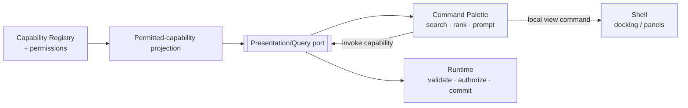
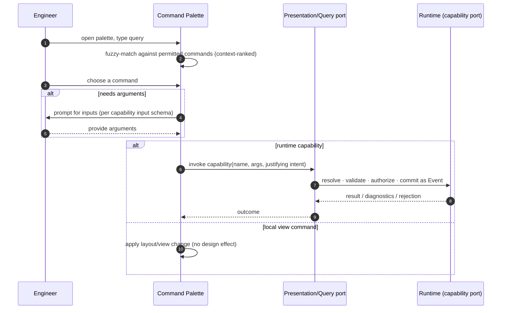

# Command Palette

> **Ring:** Interface adapters — presentation (outer). The command palette is the [IDE shell](../frontend.md)'s **keyboard-first command surface**: a searchable list of the actions available right now, each mapping to a runtime [Capability](../../core/capability-registry.md) (or a local view command). It exists to make the system's action surface **discoverable** and fast to invoke without hunting through menus — the ergonomics that make a code IDE feel like *commanding a system*. The palette **lists and dispatches** commands; it holds **no engineering logic** ([P11](../../foundation/principles.md)). Crucially, the commands it offers are exactly the [Capabilities the runtime says the user is permitted to invoke](../../core/capability-registry.md) — the palette does not invent actions.

---

## 1. Purpose & responsibilities

### What it owns

- **Discovery.** Presenting a searchable, fuzzy-matchable list of available commands with names, descriptions, categories, and keybindings.
- **Dispatch.** Turning a chosen command into either a runtime command (mapped to a [Capability](../../core/capability-registry.md)) over the [Presentation/Query port](../../core/contracts.md#presentation-query-port), or a local view command (open a [panel](panels.md), switch a [perspective](docking-system.md), focus a region).
- **Context-awareness.** Filtering/ranking commands by current context (active [phase](../../GLOSSARY.md#phase), selected entity, focused viewer) so the relevant actions surface first.
- **Argument prompting.** Where a [Capability](../../core/capability-registry.md) needs inputs, guiding the engineer to supply them per the capability's declared input schema (which the runtime validates).

### What it does **NOT** own

- **The action catalog.** The authoritative set of actions is the [Capability Registry](../../core/capability-registry.md); the palette is a *view* of the permitted subset, not its owner.
- **Permission decisions.** Whether the user may run an action — and at what [Autonomy Level](../../engineering/human-in-the-loop.md) — is decided by the runtime's [Security/Policy port](../../core/contracts.md) on invocation; the palette merely doesn't show what isn't permitted.
- **Engineering logic.** A "run DRC" entry triggers the [Verification Engine](../../engineering/verification-engine.md) via a capability; the palette neither runs DRC nor knows its rules ([P11](../../foundation/principles.md)).
- **Reasoning.** It does not call models; AI-assisted commands enter through the [AI interaction model](ai-interaction-model.md) and the [Reasoning Engine port](../../core/reasoning-engine-interface.md) inside the runtime.

---

## 2. Position in the architecture

*Figure: the palette renders the permitted-capability projection and dispatches either a runtime capability invocation or a local view command. Viewpoint: the presentation ring.*

---

## 3. How it gets its data

- **Permitted-capability projection.** The palette subscribes, over the [Presentation/Query port](../../core/contracts.md#presentation-query-port), to the set of [Capabilities](../../core/capability-registry.md) the current user/agent context is permitted to invoke — the registry's *"list permitted capabilities"* operation, projected for display ([capability registry](../../core/capability-registry.md)). Disallowed capabilities are *not even discoverable*, matching the runtime's least-privilege model.
- **Command metadata.** Each entry carries its display name, description, category, declared input schema (for prompting), and any keybinding.
- **Local commands.** View commands (open panel, switch perspective) are contributed by the shell itself and need no runtime round-trip to *list*; invoking them changes only the [layout](docking-system.md).
- **Live filtering.** As context changes (phase, selection), the projection and ranking update so the palette stays relevant.

---

## 4. Interaction model

*Figure: from query to dispatch. Runtime commands are validated and committed by the runtime; local view commands stay in the shell. Viewpoint: one palette invocation.*

- **Keyboard-first.** Open with a shortcut, type to filter, run with Enter; power users never leave the keyboard.
- **One surface, many actions.** Engineering actions (create component, run [ERC](../../state-machines/erc-verification.md)/[DRC](../../state-machines/drc-verification.md), advance a [phase](workflow.md)), navigation (reveal entity), and view actions (open panel, switch perspective) share one searchable surface.
- **Schema-guided arguments.** When a capability needs inputs, the palette guides entry against its [declared schema](../../core/capability-registry.md); the runtime still validates authoritatively before committing.

---

## 5. Discoverability

The palette is the shell's primary answer to "what can I do here?":

- **Reflects permissions and context** — only permitted, relevant commands appear, so discovery never misleads.
- **Surfaces keybindings** next to commands, teaching shortcuts over time.
- **Bridges to plugins** — capabilities and panels contributed by the [plugin system](../../integration/plugin-system.md) appear automatically once registered and permitted, with no special-casing ([P7](../../foundation/principles.md)).

---

## 6. What it does NOT do (no engineering rules)

The palette runs no verification, resolves no constraints, makes no permission or autonomy decision, and computes nothing about the design. A command like "run DRC" or "place component" is dispatched to the runtime, which performs and governs it; the palette is a discovery-and-dispatch surface only ([P11](../../foundation/principles.md)).

---

## 7. Contracts

- **Consumes:** the [Presentation/Query port](../../core/contracts.md#presentation-query-port) for the permitted-capability projection and for invoking capabilities. The action set originates in the [Capability Registry](../../core/capability-registry.md); permissions are enforced by the [Security/Policy port](../../core/contracts.md) on invocation.

---

## 8. Failure modes

- **Command rejected** (not permitted, schema-invalid, or [gated](../../engineering/human-in-the-loop.md)). No effect; the palette shows the runtime's reason and may route to an [approval](workflow.md) ([P13](../../foundation/principles.md)).
- **Permitted set stale/unavailable.** The palette falls back to local view commands and marks runtime actions unavailable until reconnected; it never offers an action the runtime hasn't sanctioned.
- **Ambiguous query.** Ranking surfaces best matches; the engineer disambiguates — no action runs without explicit choice.

---

## 9. Open decisions

- [ADR-0001](../../decisions/0001-adopt-clean-architecture-dependency-rule.md) — the palette is a view of capabilities, not an action owner.
- [ADR-0010](../../decisions/0010-human-in-the-loop-autonomy-levels.md) — autonomy gating of capability invocation the palette dispatches.
- **Open:** how command argument-prompting renders complex schemas (entity pickers, [Physical Quantity](../../engineering/units-and-quantities.md) entry) — a presentation refinement.

---

## 10. Related documents

[`presentation/frontend.md`](../frontend.md) · [`core/capability-registry.md`](../../core/capability-registry.md) · [`core/contracts.md`](../../core/contracts.md#presentation-query-port) · [`presentation/frontend/ai-interaction-model.md`](ai-interaction-model.md) · [`presentation/frontend/docking-system.md`](docking-system.md) · [`integration/plugin-system.md`](../../integration/plugin-system.md) · [`engineering/human-in-the-loop.md`](../../engineering/human-in-the-loop.md) · [`foundation/principles.md`](../../foundation/principles.md) (P11)
