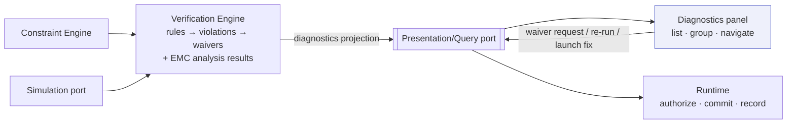

# Diagnostics Panel

> **Ring:** Interface adapters — presentation (outer). The diagnostics panel is the [IDE shell](../frontend.md)'s **problems view**: it surfaces the [Violations](../../foundation/engineering-domain-model.md#violation) and [Analysis Results](../../foundation/engineering-domain-model.md#analysis-result) computed by the [Verification Engine](../../engineering/verification-engine.md) — as errors / warnings / info, with [waiver](../../foundation/engineering-domain-model.md#waiver) status — and lets the engineer navigate to the offending entities. It exists to give the engineer one trustworthy, live list of "what is wrong (or noteworthy) with this design and why," in the familiar code-IDE problems-list ergonomic. The defining constraint, and the sharpest application of [P11](../../foundation/principles.md): **the UI does not compute these diagnostics.** ERC/DRC/DFM evaluation, severity, gating, and waiver enforcement all happen in the [Verification Engine](../../engineering/verification-engine.md); the panel only displays the result and relays engineer actions.

---

## 1. Purpose & responsibilities

### What it owns

- **Presenting diagnostics.** Rendering the live diagnostics list — each entry's rule reference, **severity** (error / warning / info), offending [entities](../../foundation/engineering-domain-model.md) and location, human-readable explanation, and **status** (open / fixed / waived).
- **Organization.** Grouping, filtering, and sorting diagnostics by severity, source phase ([ERC](../../state-machines/erc-verification.md)/[DRC](../../state-machines/drc-verification.md)/[DFM](../../state-machines/dfm-verification.md)/[EMC](../../state-machines/emc-analysis.md)), entity, or status.
- **Navigation to offenders.** Letting the engineer jump from a diagnostic to the offending entity in the [schematic viewer](schematic-viewer.md), [PCB viewer](pcb-viewer.md), or [project explorer](project-explorer.md).
- **Relaying actions.** Issuing commands for engineer-initiated responses — request a [waiver](../../foundation/engineering-domain-model.md#waiver), trigger a re-run, or invoke a [proposed fix](ai-interaction-model.md) — all of which the runtime governs.
- **Presenting analysis results.** Showing [EMC](../../state-machines/emc-analysis.md)/SI/PI [Analysis Results](../../foundation/engineering-domain-model.md#analysis-result) as interpreted, non-pass/fail findings, distinct from gating violations.

### What it does **NOT** own

- **Computing diagnostics.** It evaluates **no** rule, assigns **no** severity, runs **no** simulation. All of that is the [Verification Engine](../../engineering/verification-engine.md) ([P11](../../foundation/principles.md), [P3](../../foundation/principles.md): the engine has no reasoning either).
- **The manufacturing gate.** Whether open errors block [manufacturing](../../state-machines/manufacturing-generation.md) is a deterministic predicate in the [Verification Engine](../../engineering/verification-engine.md), surfaced by the [workflow panel](workflow.md); the diagnostics panel shows the blocking violations but does not enforce the gate.
- **Authorizing waivers.** A waiver's *authorization* is a [human-in-the-loop](../../engineering/human-in-the-loop.md) decision at the project's [Autonomy Level](../../engineering/human-in-the-loop.md); the panel relays the request and shows the resulting status.
- **Fixing violations.** Repair is an [agent](../../agents/README.md)/engineer action in the relevant phase; the panel may *launch* a proposed fix but performs none itself.

---

## 2. Position in the architecture

*Figure: diagnostics are computed in the Verification Engine and merely projected to the panel; engineer actions return as governed commands. Viewpoint: the presentation ring.*

---

## 3. How it gets its data

- **Diagnostics projection.** The panel subscribes, over the [Presentation/Query port](../../core/contracts.md#presentation-query-port), to the read-only **diagnostics projection** the [Verification Engine](../../engineering/verification-engine.md) provides — exactly the projection named in that engine's contracts ("the diagnostics projection the UI renders, [P11](../../foundation/principles.md)"). Each diagnostic is a projection of a [Violation](../../foundation/engineering-domain-model.md#violation) (or [Analysis Result](../../foundation/engineering-domain-model.md#analysis-result)) entity in [Engineering State](../../core/shared-state-model.md).
- **Live & deduplicated.** Because the engine **deduplicates** and tracks violation status, the panel shows a *stable* defect list across iterations: a defect found again on re-run is the same entry, and a fixed defect drops to *fixed*/clears — the panel inherits this, it does not implement it.
- **Continuous + gate-time.** The engine can re-evaluate incrementally for live diagnostics as the engineer works, and authoritatively at gate time; the panel renders whichever updates arrive, always reflecting committed runtime results.
- **Severity semantics are the engine's.** error/warning/info and their gating effect are defined once in the [Verification Engine](../../engineering/verification-engine.md); the panel displays them consistently and never reinterprets them.

---

## 4. Severity, waivers, and navigation

| Severity | Meaning (defined by the [Verification Engine](../../engineering/verification-engine.md)) | How the panel treats it |
|----------|-------------|-------------------------|
| **error** | a real defect that must not ship; **blocks** [manufacturing](../../state-machines/manufacturing-generation.md) unless waived | shown prominently; surfaced as blocking at the relevant [gate](workflow.md) |
| **warning** | likely problem to review; non-blocking | listed and tracked |
| **info** | advisory/informational | listed, lowest priority |

- **Waivers are visible, not invented.** A [waived](../../foundation/engineering-domain-model.md#waiver) violation shows as *waived* with its rationale, scope, and expiry; if a waiver expires or its scope no longer matches, the engine reverts the violation to *open* and the panel reflects that automatically — the panel never decides waiver validity.
- **Navigate to the offender.** Selecting a diagnostic reveals the offending [entity/location](../../foundation/engineering-domain-model.md) in the [schematic viewer](schematic-viewer.md) (electrical), [PCB viewer](pcb-viewer.md) (physical), or [project explorer](project-explorer.md) — turning a problem into a one-click jump.
- **Act, via the runtime.** From a diagnostic the engineer can request a [waiver](../../engineering/human-in-the-loop.md), trigger a re-run, or open an [agent-proposed fix](ai-interaction-model.md); each is a governed command, recorded as an [Event](../../core/event-bus.md).

---

## 5. What it does NOT do (no engineering rules)

This is the panel that most tempts rule-leakage, so it is the most explicit: it runs no ERC/DRC/DFM, computes no severity, performs no EMC analysis, enforces no gate, and authorizes no waiver. Every number, severity, and status it shows is computed by the [Verification Engine](../../engineering/verification-engine.md) and consumed via the [Presentation/Query port](../../core/contracts.md#presentation-query-port) ([P11](../../foundation/principles.md)). If the panel and the engine ever disagreed, the engine is right by construction — the panel holds no independent logic to disagree *with*.

---

## 6. Contracts

- **Consumes:** the [Presentation/Query port](../../core/contracts.md#presentation-query-port) — the diagnostics projection from the [Verification Engine](../../engineering/verification-engine.md), and command issuance for waiver requests, re-runs, and launching fixes (governed by [human-in-the-loop](../../engineering/human-in-the-loop.md) and the [Capability Registry](../../core/capability-registry.md)).

---

## 7. Failure modes

- **Indeterminate result** (insufficient data, or [analysis](../../core/contracts.md) unavailable). Shown as *indeterminate* exactly as the engine reports it — never silently rendered as a pass, matching the engine's "not passable" treatment.
- **Diagnostics projection stale/unavailable.** The list is marked stale; the engineer is warned not to trust it until refreshed, since correctness is the engine's.
- **Waiver request denied.** The violation stays *open*; the panel shows the denial reason from the [Security/Policy](../../core/contracts.md)/[autonomy](../../engineering/human-in-the-loop.md) decision ([P10](../../foundation/principles.md)).
- **Large violation set.** Virtualized/grouped for performance; severity ordering ensures blocking errors remain visible.

---

## 8. Open decisions

- [ADR-0010](../../decisions/0010-human-in-the-loop-autonomy-levels.md) — who may authorize a waiver the panel relays a request for.
- [ADR-0009](../../decisions/0009-determinism-and-replay-strategy.md) — verification results and gate outcomes replay identically, so the displayed list is reproducible.
- **Open:** how analysis-flavoured [EMC](../../state-machines/emc-analysis.md) results (datasets, not pass/fail) are best visualized alongside gating violations — a presentation refinement recorded here per [P13](../../foundation/principles.md).

---

## 9. Related documents

[`presentation/frontend.md`](../frontend.md) · [`engineering/verification-engine.md`](../../engineering/verification-engine.md) · [`foundation/engineering-domain-model.md`](../../foundation/engineering-domain-model.md) (Violation, Waiver, Analysis Result) · [`engineering/human-in-the-loop.md`](../../engineering/human-in-the-loop.md) · [`presentation/frontend/workflow.md`](workflow.md) · [`presentation/frontend/schematic-viewer.md`](schematic-viewer.md) · [`presentation/frontend/pcb-viewer.md`](pcb-viewer.md) · [`presentation/frontend/ai-interaction-model.md`](ai-interaction-model.md) · [`foundation/principles.md`](../../foundation/principles.md) (P11)
