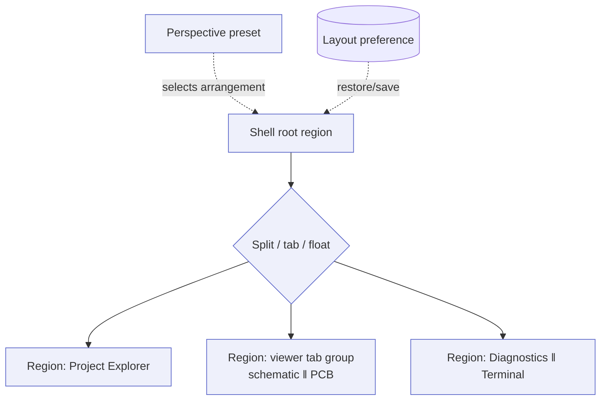

# Docking System

> **Ring:** Interface adapters — presentation (outer). The docking system is the **layout engine of the [IDE shell](../frontend.md)**: it arranges [panels](panels.md) and viewers into dockable, splittable, resizable regions, lets the engineer save and switch named arrangements (workspaces/perspectives), and persists those arrangements per user. It exists so that a multi-panel engineering IDE can present many simultaneous views of one design (project tree, schematic, board, diagnostics, AI proposals) without forcing a fixed layout — borrowing the proven ergonomics of code-IDE and engine-editor environments. It governs **only arrangement**; it holds **no engineering data and no engineering rules** ([P11](../../foundation/principles.md)). Layout is a user preference, not part of [Engineering State](../../core/shared-state-model.md).

---

## 1. Purpose & responsibilities

### What it owns

- **Region management.** Splitting the shell into nested, resizable regions; docking panels into them; tabbing multiple panels in one region; floating and re-docking; full-screen/maximize of a region.
- **Workspaces / perspectives.** Named layout presets tuned to a task — e.g. a *Schematic* perspective (project tree + [schematic viewer](schematic-viewer.md) + [diagnostics](diagnostics.md)) vs. a *Layout* perspective (project tree + [PCB viewer](pcb-viewer.md) + diagnostics + [AI interaction](ai-interaction-model.md)). Switching a perspective rearranges panels without changing the design.
- **Layout persistence.** Saving and restoring the arrangement (open panels, sizes, tabs, active perspective) across sessions, as a per-user preference.
- **Focus & visibility.** Which region is active, which panel is foreground in a tabbed region, and show/hide of panels.

### What it does **NOT** own

- **Panel content or behavior.** What a panel renders and how it interacts is the [panel](panels.md)'s concern and ultimately the runtime's data; the docking system only positions the panel.
- **Engineering state or rules.** No [Engineering State](../../core/shared-state-model.md), no [Constraints](../../engineering/constraint-engine.md), no diagnostics computation ([P11](../../foundation/principles.md)). Layout never appears in the [Engineering Domain Model](../../foundation/engineering-domain-model.md).
- **Cross-user/session coordination.** Multi-user presence and session semantics belong to [sessions](../../collaboration/multi-user-and-sessions.md); the docking system is a per-user view concern.

---

## 2. Position in the architecture

The docking system is a pure presentation concern inside the outer ring. It needs no inward dependency for layout itself; the panels it hosts each consume the [Presentation/Query port](../../core/contracts.md#presentation-query-port). Its only persistence need — saving a layout preference — is a per-user/session concern that, if persisted server-side at all, rides the [Session Store](../../data/stores/session-store.md) as non-engineering preference data, never the engineering stores.

*Figure: the docking tree — nested regions hosting panels, with perspectives selecting an arrangement and a layout preference restoring it. Viewpoint: the presentation ring.*

---

## 3. How it gets its data

- **For layout itself:** the docking system reads and writes a **layout-preference projection** (the saved arrangement) — non-engineering data. There is no engineering view-model involved in deciding *where* a panel goes.
- **For panel contents:** the docking system places a [panel](panels.md); that panel independently subscribes to its own view-model over the [Presentation/Query port](../../core/contracts.md#presentation-query-port). The docking system is content-agnostic and never inspects engineering data.

This separation is deliberate: arrangement (preference) and content (runtime projections) are different concerns, so a layout can be saved, shared, or reset without touching the design.

---

## 4. User interactions

- **Arrange:** drag a panel by its tab to dock it to an edge, split a region, or float it; drag region borders to resize; double-click a tab to maximize/restore.
- **Switch perspective:** pick a named perspective to reflow panels for a task; the active perspective is shown in the shell.
- **Save / reset layout:** save the current arrangement (optionally as a new perspective) or reset to a built-in default.
- **Show/hide & focus:** toggle a panel's visibility (often via the [command palette](command-palette.md)) and move focus between regions by keyboard.

All of these are **local view operations** — none issues an engineering command or changes the design.

---

## 5. What it does NOT do (no engineering rules)

The docking system never evaluates ERC/DRC/DFM, never resolves constraints, never gates the workflow, and never holds design data. Rearranging panels cannot change, validate, or block a design — it only changes what the engineer sees ([P11](../../foundation/principles.md)).

---

## 6. Contracts

- **Consumes:** no engineering contract directly. The panels it hosts consume the [Presentation/Query port](../../core/contracts.md#presentation-query-port). Layout persistence, if server-backed, uses the [Session Store](../../data/stores/session-store.md) as per-user preference (not the engineering [State Store](../../core/shared-state-model.md)).
- **Provides:** to the rest of the shell, a place for panels to live and a stable focus/visibility model.

---

## 7. Failure modes

- **Corrupt/missing saved layout.** Falls back to a built-in default perspective; the design is unaffected because layout is mere preference.
- **Layout references an absent panel** (e.g. a removed [plugin](../../integration/plugin-system.md) panel). That slot is dropped or shown as unavailable; the rest of the layout restores normally.
- **Region too small to render content.** The hosted panel degrades to a minimal/overflow presentation; no engineering consequence.

---

## 8. Open decisions

- [ADR-0001](../../decisions/0001-adopt-clean-architecture-dependency-rule.md) — layout is presentation-only, outside the engineering rings.
- **Open:** whether perspectives/layouts are shareable across users or strictly per-user, and whether they persist client-side only or via the [Session Store](../../data/stores/session-store.md) — to be recorded with [sessions](../../collaboration/multi-user-and-sessions.md) (per [P13](../../foundation/principles.md), stated rather than assumed).

---

## 9. Related documents

[`presentation/frontend.md`](../frontend.md) · [`presentation/frontend/panels.md`](panels.md) · [`presentation/frontend/command-palette.md`](command-palette.md) · [`foundation/principles.md`](../../foundation/principles.md) (P11) · [`core/contracts.md`](../../core/contracts.md#presentation-query-port) · [`data/stores/session-store.md`](../../data/stores/session-store.md) · [`collaboration/multi-user-and-sessions.md`](../../collaboration/multi-user-and-sessions.md)
