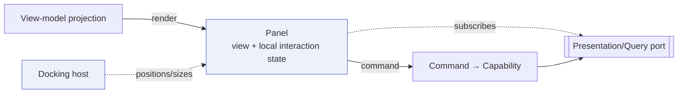

# Panel Model

> **Ring:** Interface adapters — presentation (outer). This document defines the **panel** — the unit of presentation in the [IDE shell](../frontend.md) — its lifecycle, the standard panels the product ships, and how the set is extended by [plugins](../../integration/plugin-system.md). A panel is a self-contained view that **subscribes to a view-model** over the [Presentation/Query port](../../core/contracts.md#presentation-query-port) and **emits commands** back through it; it is hosted (positioned/sized/tabbed) by the [docking system](docking-system.md). Every panel obeys [P11](../../foundation/principles.md): it renders runtime state and issues commands, and contains **no engineering rules**.

---

## 1. Purpose & responsibilities

### What it owns (per panel)

- **A bounded view.** One coherent slice of the design or process — the project tree, a schematic, a board, diagnostics, the workflow, AI proposals, a terminal — rendered from a view-model.
- **Local interaction state.** Selection, scroll/zoom, expansion, hover, and in-progress (uncommitted) edit gestures specific to that panel.
- **Command emission.** Turning user interactions into commands mapped to [Capabilities](../../core/capability-registry.md), sent over the [Presentation/Query port](../../core/contracts.md#presentation-query-port).
- **Subscription management.** Subscribing to exactly the projection it needs and re-rendering on updates.

### What it does **NOT** own

- **Engineering logic.** No verification, constraint resolution, gating, or reasoning ([P11](../../foundation/principles.md)). A panel shows results computed by the runtime; it never computes them.
- **Authoritative state.** A panel holds no durable engineering knowledge ([P2](../../foundation/principles.md)); its view-model is a disposable projection.
- **Its own placement.** Where a panel lives is the [docking system](docking-system.md)'s job; the panel is content, not layout.

---

## 2. What a panel is

A panel is a presentation component with three stable seams:

*Figure: the three seams of any panel — a read subscription in, a command path out, and a docking host that places it. Viewpoint: one panel.*

Because all three seams are identical across panels, new panels (including plugin ones) compose into the shell uniformly: subscribe, render, emit.

---

## 3. Panel lifecycle

```mermaid
stateDiagram-v2
  [*] --> Registered: panel type available in the shell
  Registered --> Instantiated: opened (by user, perspective, or command)
  Instantiated --> Subscribed: subscribe to its view-model projection
  Subscribed --> Active: rendering live; handling interaction
  Active --> Active: view-model updates → re-render
  Active --> Suspended: hidden / backgrounded (subscription may pause)
  Suspended --> Active: shown again → resubscribe/refresh
  Active --> Closed: closed by user/perspective
  Suspended --> Closed
  Closed --> [*]: subscriptions released
```

*Figure: a panel's lifecycle from registration to disposal. Suspension lets a hidden panel relinquish work without losing its place. Viewpoint: one panel instance.*

- **Registered** — the panel *type* is known to the shell (built-in or [plugin](../../integration/plugin-system.md)-contributed) and discoverable (e.g. in the [command palette](command-palette.md)).
- **Instantiated** — an instance is created when opened by the user, restored by a [perspective](docking-system.md), or summoned by a command (e.g. "reveal entity in viewer").
- **Subscribed / Active** — it subscribes to its projection and renders live, re-rendering on each committed update.
- **Suspended** — when hidden it may pause its subscription to save resources, refreshing on re-show.
- **Closed** — it releases subscriptions cleanly; closing a panel never affects the design (it is presentation-only).

---

## 4. The standard panels

The product ships a standard set, each documented separately:

| Panel | Renders | View-model source | Document |
|-------|---------|-------------------|----------|
| **Project Explorer** | Project / [Engineering State](../../core/shared-state-model.md) structure | state-structure projection | [project-explorer](project-explorer.md) |
| **Workflow** | the [workflow plan](../../core/workflow-orchestration.md), phases, gates | workflow projection | [workflow](workflow.md) |
| **Schematic Viewer** | the [Schematic IR](../../compiler/ir/schematic-ir.md) | schematic view-model | [schematic-viewer](schematic-viewer.md) |
| **PCB Viewer** | the [PCB IR](../../compiler/ir/pcb-ir.md) | board/layout view-model | [pcb-viewer](pcb-viewer.md) |
| **Diagnostics** | [Violations](../../foundation/engineering-domain-model.md#violation)/[Analysis Results](../../foundation/engineering-domain-model.md#analysis-result) | diagnostics projection | [diagnostics](diagnostics.md) |
| **AI Interaction** | agent proposals & provenance | proposal/decision projection | [ai-interaction-model](ai-interaction-model.md) |
| **Terminal** | integrated command/console surface | command/log projection | [terminal](terminal.md) |
| **Command Palette** | discoverable commands | permitted-capability projection | [command-palette](command-palette.md) |

All of these are *consumers* of the same [Presentation/Query port](../../core/contracts.md#presentation-query-port); none is privileged with engineering logic.

---

## 5. Extensibility via plugins

New panels arrive the same way new actions do — as registrations, not kernel edits ([P7](../../foundation/principles.md)). The [plugin system](../../integration/plugin-system.md) lets a plugin contribute a panel type that:

- declares the **projection(s)** it subscribes to and the **commands/[Capabilities](../../core/capability-registry.md)** it emits — both governed by the same [Security/Policy](../../core/contracts.md) and permission rules as core panels;
- is **discoverable** (palette, perspective) and **dockable** like any built-in panel;
- remains **presentation-only** — a plugin panel may render runtime data and issue permitted commands, but it cannot embed engineering rules, mutate state directly, or call models ([P11](../../foundation/principles.md), [P3](../../foundation/principles.md)). Its action surface is exactly the capabilities it is permitted to invoke.

> **Why uniform seams matter for extensibility.** Because every panel is "subscribe → render → emit command," a plugin panel cannot smuggle in privileged behavior: it has the same one inward port and the same permissioned command surface as a built-in panel. The shell stays coherent and auditable as it grows.

---

## 6. Contracts

- **Consumes:** the [Presentation/Query port](../../core/contracts.md#presentation-query-port) (subscribe to projection / issue command / receive diagnostics). Plugin panels additionally register through the [plugin system](../../integration/plugin-system.md) and act only via permitted [Capabilities](../../core/capability-registry.md).
- **Hosted by:** the [docking system](docking-system.md).

---

## 7. Failure modes

- **Projection unavailable / lagging.** The panel shows an empty or stale (clearly-marked) state and recovers on the next update; it never invents data.
- **Command rejected.** The panel surfaces the runtime's reason; no design change ([P13](../../foundation/principles.md)).
- **Plugin panel misbehaves.** Bounded by the same permission/cost governance as core ([capability registry](../../core/capability-registry.md)); it cannot exceed its declared command surface or hold engineering rules.
- **Panel closed mid-edit.** Uncommitted local gestures are discarded; only runtime-committed state survives, so nothing is silently lost from the design.

---

## 8. Open decisions

- [ADR-0001](../../decisions/0001-adopt-clean-architecture-dependency-rule.md) — panels are leaf consumers of one inward port.
- **Open:** the plugin-panel trust/sandboxing model and the projection-subscription semantics (full vs. incremental refresh), deferred to the [plugin system](../../integration/plugin-system.md) and [IPC](../../integration/ipc.md) docs (stated, not assumed — [P13](../../foundation/principles.md)).

---

## 9. Related documents

[`presentation/frontend.md`](../frontend.md) · [`presentation/frontend/docking-system.md`](docking-system.md) · [`presentation/frontend/command-palette.md`](command-palette.md) · [`core/contracts.md`](../../core/contracts.md#presentation-query-port) · [`core/capability-registry.md`](../../core/capability-registry.md) · [`integration/plugin-system.md`](../../integration/plugin-system.md) · [`foundation/principles.md`](../../foundation/principles.md) (P7, P11)
