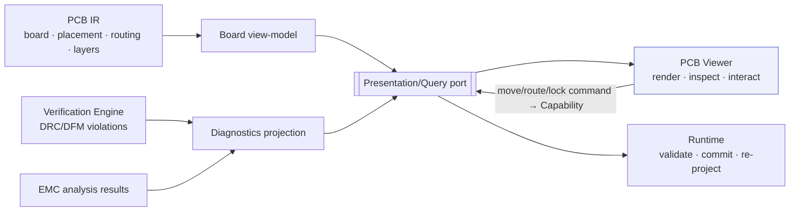

# PCB Viewer

> **Ring:** Interface adapters — presentation (outer). The PCB viewer is the [IDE shell](../frontend.md)'s **physical-board view**: it visualizes the [PCB IR](../../compiler/ir/pcb-ir.md) — the [Board / Layer Stack](../../foundation/engineering-domain-model.md#board--layer-stack), [Placement](../../foundation/engineering-domain-model.md#placement), and [Track / Routing](../../foundation/engineering-domain-model.md#track--routing) across layers — and lets the engineer inspect and interact with the layout. It exists to give a faithful, navigable picture of the design *as copper and substrate* and a surface for placement/routing actions, in the engine-editor ergonomic of a real-time canvas. It is strictly **read-model in, command out**: it renders a board view-model and issues commands; it embeds **no DRC/DFM logic** and computes nothing about the design ([P11](../../foundation/principles.md)).

---

## 1. Purpose & responsibilities

### What it owns

- **Visualizing the board.** Rendering the [PCB IR](../../compiler/ir/pcb-ir.md) projection: board outline and [layer stack-up](../../foundation/engineering-domain-model.md#board--layer-stack), [floor-planning regions](../../foundation/engineering-domain-model.md#functional-block), per-component [footprints and placement](../../foundation/engineering-domain-model.md#placement) (position/rotation/side), and [routing](../../foundation/engineering-domain-model.md#track--routing) geometry (segments, arcs, vias, differential pairs).
- **Layer & view control.** Layer visibility/ordering, side (top/bottom), zoom/pan, measurement, and visual modes — all local view state.
- **Selection & inspection.** Selecting a component, net, track, or region and showing its projected properties (typed [Physical Quantities](../../engineering/units-and-quantities.md)) and [provenance](../../core/provenance-and-traceability.md).
- **Layout interaction.** Manipulating placement/routing (move/rotate/lock a component, adjust a route) by **issuing commands** mapped to [Capabilities](../../core/capability-registry.md); previewing the gesture locally until the runtime commits.
- **Overlaying diagnostics.** Drawing [DRC](../../state-machines/drc-verification.md)/[DFM](../../state-machines/dfm-verification.md) [Violations](../../foundation/engineering-domain-model.md#violation) and [EMC](../../state-machines/emc-analysis.md) [Analysis Results](../../foundation/engineering-domain-model.md#analysis-result) at their locations — sourced from the [diagnostics](diagnostics.md) projection, not computed here.

### What it does **NOT** own

- **DRC/DFM/EMC logic.** It evaluates **no** clearance, manufacturability, or electromagnetic rule. Those are the [Verification Engine](../../engineering/verification-engine.md) (over [DRC](../../state-machines/drc-verification.md)/[DFM](../../state-machines/dfm-verification.md)) and [EMC analysis](../../state-machines/emc-analysis.md); the viewer only overlays their results ([P11](../../foundation/principles.md)).
- **The board model.** The authoritative board is the [PCB IR](../../compiler/ir/pcb-ir.md) projection of the canonical [domain model](../../foundation/engineering-domain-model.md) ([P6](../../foundation/principles.md)); the viewer holds a disposable view-model.
- **Auto-place/auto-route.** Automated placement/routing is [agent](../../agents/README.md) work ([Placement Agent](../../agents/placement-agent.md), [Routing Agent](../../agents/routing-agent.md)) the engineer reviews as [proposals](ai-interaction-model.md); the viewer renders and disposes, it does not run algorithms.
- **State mutation.** Every layout change is a runtime-validated, committed command — never a direct edit to the model.

---

## 2. Position in the architecture

*Figure: the viewer renders the board view-model with overlaid diagnostics and issues layout commands; the runtime commits and re-projects. Viewpoint: the presentation ring.*

---

## 3. How it gets its data

- **Board view-model.** The viewer subscribes, over the [Presentation/Query port](../../core/contracts.md#presentation-query-port), to a read-only projection of the [PCB IR](../../compiler/ir/pcb-ir.md) — the *"rendered as a board/layout view-model"* sibling projection that IR names ([PCB IR](../../compiler/ir/pcb-ir.md) Consumers). Geometry, stack-up, and positions are typed [Physical Quantities](../../engineering/units-and-quantities.md) ([P9](../../foundation/principles.md)).
- **Diagnostics overlay.** [Violations](../../foundation/engineering-domain-model.md#violation)/[Analysis Results](../../foundation/engineering-domain-model.md#analysis-result) arrive via the [diagnostics](diagnostics.md) projection from the [Verification Engine](../../engineering/verification-engine.md); the viewer draws them at the offending geometry, computing none.
- **Live re-projection.** When a placement/routing command commits [Events](../../core/event-bus.md), the runtime re-projects the IR and the viewer re-renders — including any DRC/DFM consequences the engine recomputes ([continuous verification](../../engineering/verification-engine.md)).

---

## 4. User interactions

- **Inspect:** zoom/pan, toggle layers/side, measure, hover for properties, select a component/net/track/region to see its typed properties and [provenance](../../core/provenance-and-traceability.md).
- **Edit (as commands):** move/rotate/lock a [component placement](../../foundation/engineering-domain-model.md#placement); adjust/realize a [route](../../foundation/engineering-domain-model.md#track--routing); each gesture previews locally then issues a [Capability](../../core/capability-registry.md) the runtime validates and commits.
- **Review AI proposals:** an agent-proposed placement/route appears as a reviewable [diff overlay](ai-interaction-model.md); the engineer accepts/edits/rejects.
- **Act on diagnostics:** jump from a [DRC/DFM](diagnostics.md) overlay to the offending track/footprint and request a fix or [waiver](../../engineering/human-in-the-loop.md).

> **Optimistic preview, authoritative commit.** Dragging a part shows an immediate local preview, but the design only changes when the runtime commits the command and re-projects; the preview is then reconciled to the committed state. The viewer never treats its preview as truth.

---

## 5. What it does NOT do (no DRC logic)

The viewer checks no clearance, validates no manufacturability rule, runs no field solver, and decides no gate. A clearance violation is detected by the [Verification Engine](../../engineering/verification-engine.md) and *shown* by the viewer; moving a track issues a command and the engine — not the viewer — re-evaluates the rules ([P11](../../foundation/principles.md), [P3](../../foundation/principles.md)).

---

## 6. Contracts

- **Consumes:** the [Presentation/Query port](../../core/contracts.md#presentation-query-port) — the [PCB IR](../../compiler/ir/pcb-ir.md) board view-model, the [diagnostics](diagnostics.md) projection (from the [Verification Engine](../../engineering/verification-engine.md)/[EMC analysis](../../state-machines/emc-analysis.md)), proposal overlays, and layout command issuance (mapped to [Capabilities](../../core/capability-registry.md)).

---

## 7. Failure modes

- **View-model stale/unavailable.** Renders last-known board marked stale; disables editing until reconnected; never fabricates geometry.
- **Layout command rejected** (schema-invalid, unpermitted, gated, or violates a runtime-enforced invariant such as placement-within-outline). No change; the preview reverts; the reason is shown ([P13](../../foundation/principles.md)).
- **Diagnostics overlay lag.** The board may briefly show without latest overlays; the panel marks pending updates, and the [Verification Engine](../../engineering/verification-engine.md) remains authoritative.
- **Heavy board (many tracks/layers).** Rendering is culled/level-of-detail managed; correctness is unaffected since the IR is the truth.

---

## 8. Open decisions

- [ADR-0005](../../decisions/0005-ir-as-canonical-phase-boundary-representation.md) — the viewer renders the PCB IR projection of the canonical model.
- [ADR-0007](../../decisions/0007-units-and-physical-quantity-type-system.md) — typed geometry/stack-up the viewer displays.
- [ADR-0010](../../decisions/0010-human-in-the-loop-autonomy-levels.md) — how much placement/routing is engineer-directed vs. autonomous (mirrors the [PCB IR](../../compiler/ir/pcb-ir.md) open question), surfaced as proposals here.
- **Open:** rendering fidelity vs. interactivity trade-offs and 2D/3D presentation — presentation refinements recorded here per [P13](../../foundation/principles.md).

---

## 9. Related documents

[`presentation/frontend.md`](../frontend.md) · [`compiler/ir/pcb-ir.md`](../../compiler/ir/pcb-ir.md) · [`foundation/engineering-domain-model.md`](../../foundation/engineering-domain-model.md) (Board, Placement, Track/Routing) · [`engineering/verification-engine.md`](../../engineering/verification-engine.md) · [`state-machines/drc-verification.md`](../../state-machines/drc-verification.md) · [`state-machines/dfm-verification.md`](../../state-machines/dfm-verification.md) · [`state-machines/emc-analysis.md`](../../state-machines/emc-analysis.md) · [`agents/placement-agent.md`](../../agents/placement-agent.md) · [`agents/routing-agent.md`](../../agents/routing-agent.md) · [`presentation/frontend/diagnostics.md`](diagnostics.md) · [`presentation/frontend/ai-interaction-model.md`](ai-interaction-model.md) · [`foundation/principles.md`](../../foundation/principles.md) (P11)
