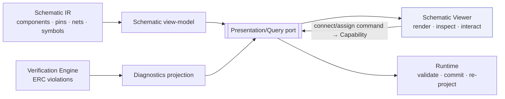

# Schematic Viewer

> **Ring:** Interface adapters — presentation (outer). The schematic viewer is the [IDE shell](../frontend.md)'s **logical-circuit view**: it visualizes the [Schematic IR](../../compiler/ir/schematic-ir.md) — [Components](../../foundation/engineering-domain-model.md#component), [Pins](../../foundation/engineering-domain-model.md#pin), [Connections](../../foundation/engineering-domain-model.md#connection)/[Nets](../../foundation/engineering-domain-model.md#net), and [Symbols](../../foundation/engineering-domain-model.md#symbol) — and lets the engineer inspect and edit the circuit. It exists to give a faithful, navigable picture of the design *as a connected circuit* (what is wired to what), independent of any board, and a surface for circuit actions. Like its physical sibling, it is strictly **read-model in, command out**: it renders a schematic view-model and issues commands; it embeds **no ERC logic** and computes nothing about the design ([P11](../../foundation/principles.md)).

---

## 1. Purpose & responsibilities

### What it owns

- **Visualizing the circuit.** Rendering the [Schematic IR](../../compiler/ir/schematic-ir.md) projection: [Components](../../foundation/engineering-domain-model.md#component) with their [Symbols](../../foundation/engineering-domain-model.md#symbol) and reference designators, [Pins](../../foundation/engineering-domain-model.md#pin) with electrical type, and [Nets](../../foundation/engineering-domain-model.md#net) (with net class: power/ground/signal/differential/high-speed) as the transitive closure of [Connections](../../foundation/engineering-domain-model.md#connection).
- **Navigation & view control.** Zoom/pan, sheet/section navigation, net highlight/trace, and visual modes — local view state.
- **Selection & inspection.** Selecting a component, pin, or net and showing its projected properties (typed [Physical Quantities](../../engineering/units-and-quantities.md): pin limits, net electrical properties) and [provenance](../../core/provenance-and-traceability.md).
- **Circuit interaction.** Editing the circuit (place/connect/assign a component, value, or net) by **issuing commands** mapped to [Capabilities](../../core/capability-registry.md), with local preview until the runtime commits.
- **Overlaying diagnostics.** Drawing [ERC](../../state-machines/erc-verification.md) [Violations](../../foundation/engineering-domain-model.md#violation) at their entities — sourced from the [diagnostics](diagnostics.md) projection, not computed here.

### What it does **NOT** own

- **ERC logic.** It evaluates **no** electrical rule (output-driving-output, unconnected power, pin-type conflicts). That is the [Verification Engine](../../engineering/verification-engine.md) over the [ERC phase](../../state-machines/erc-verification.md); the viewer only overlays its results ([P11](../../foundation/principles.md)).
- **Net resolution.** *Nets are the closure of Connections* — computed by the runtime as part of the [Schematic IR](../../compiler/ir/schematic-ir.md); the viewer displays nets, it does not derive them.
- **The circuit model.** The authoritative circuit is the [Schematic IR](../../compiler/ir/schematic-ir.md) projection of the canonical [domain model](../../foundation/engineering-domain-model.md) ([P6](../../foundation/principles.md)); the viewer holds a disposable view-model.
- **State mutation / reasoning.** Every circuit change is a runtime-validated, committed command; AI-suggested circuitry arrives as [proposals](ai-interaction-model.md) from the [Schematic Agent](../../agents/schematic-agent.md), reviewed here, not generated here.

---

## 2. Position in the architecture

*Figure: the viewer renders the schematic view-model with overlaid ERC diagnostics and issues circuit commands; the runtime resolves nets, commits, and re-projects. Viewpoint: the presentation ring.*

---

## 3. How it gets its data

- **Schematic view-model.** The viewer subscribes, over the [Presentation/Query port](../../core/contracts.md#presentation-query-port), to a read-only projection of the [Schematic IR](../../compiler/ir/schematic-ir.md) — the *"rendered as a schematic view-model"* sibling projection that IR names ([Schematic IR](../../compiler/ir/schematic-ir.md) Consumers). Pin limits and net properties are typed [Physical Quantities](../../engineering/units-and-quantities.md) ([P9](../../foundation/principles.md)).
- **Diagnostics overlay.** [ERC](../../state-machines/erc-verification.md) [Violations](../../foundation/engineering-domain-model.md#violation) arrive via the [diagnostics](diagnostics.md) projection from the [Verification Engine](../../engineering/verification-engine.md); the viewer draws them on the offending pins/nets/components, computing none.
- **Live re-projection.** When a circuit command commits [Events](../../core/event-bus.md), the runtime re-resolves nets, re-projects the IR, and the viewer re-renders — including any ERC consequences the engine recomputes ([continuous verification](../../engineering/verification-engine.md)).

---

## 4. User interactions

- **Inspect:** zoom/pan, navigate sheets, highlight/trace a net across the circuit, hover for properties, select a component/pin/net to see typed properties and [provenance](../../core/provenance-and-traceability.md).
- **Edit (as commands):** place a [component](../../foundation/engineering-domain-model.md#component), make a [connection](../../foundation/engineering-domain-model.md#connection), assign a value/net class, or set a pin role; each gesture previews locally then issues a [Capability](../../core/capability-registry.md) the runtime validates and commits (re-resolving nets).
- **Review AI proposals:** an agent-proposed circuit fragment appears as a reviewable [diff overlay](ai-interaction-model.md); the engineer accepts/edits/rejects.
- **Act on diagnostics:** jump from an [ERC](diagnostics.md) overlay to the offending pin/net and request a fix or [waiver](../../engineering/human-in-the-loop.md).

> **Optimistic preview, authoritative commit.** A drawn connection previews immediately, but connectivity (and the resulting net) is only real once the runtime commits the command and re-projects; the preview is reconciled to committed state. The viewer never treats its preview — or its own idea of a net — as truth.

---

## 5. What it does NOT do (no ERC logic)

The viewer checks no electrical rule, resolves no net, decides no gate. An ERC violation (e.g. two outputs on one net) is detected by the [Verification Engine](../../engineering/verification-engine.md) and *shown* by the viewer; making a connection issues a command and the runtime — not the viewer — resolves the net and re-evaluates the rules ([P11](../../foundation/principles.md), [P3](../../foundation/principles.md)).

---

## 6. Contracts

- **Consumes:** the [Presentation/Query port](../../core/contracts.md#presentation-query-port) — the [Schematic IR](../../compiler/ir/schematic-ir.md) view-model, the [diagnostics](diagnostics.md) projection (from the [Verification Engine](../../engineering/verification-engine.md)), proposal overlays, and circuit command issuance (mapped to [Capabilities](../../core/capability-registry.md)).

---

## 7. Failure modes

- **View-model stale/unavailable.** Renders last-known circuit marked stale; disables editing until reconnected; never fabricates connectivity.
- **Circuit command rejected** (schema-invalid, unpermitted, gated, or violates a runtime invariant such as a floating non-no-connect pin). No change; the preview reverts; the reason is shown ([P13](../../foundation/principles.md)).
- **Diagnostics overlay lag.** The circuit may briefly show without latest ERC overlays; pending updates are marked, and the [Verification Engine](../../engineering/verification-engine.md) remains authoritative.
- **Large/dense schematic.** Rendering is virtualized/level-of-detail managed; correctness is unaffected since the IR is the truth.

---

## 8. Open decisions

- [ADR-0005](../../decisions/0005-ir-as-canonical-phase-boundary-representation.md) — the viewer renders the Schematic IR projection of the canonical model.
- [ADR-0007](../../decisions/0007-units-and-physical-quantity-type-system.md) — typed pin limits / net properties the viewer displays.
- [ADR-0006](../../decisions/0006-agent-fsm-separation.md) — the [Schematic Agent](../../agents/schematic-agent.md)'s reasoning half produces proposals reviewed here.
- **Open:** how net-class assignment (high-speed/differential) is presented for confirmation (mirrors the [Schematic IR](../../compiler/ir/schematic-ir.md) open question) — a presentation refinement recorded here per [P13](../../foundation/principles.md).

---

## 9. Related documents

[`presentation/frontend.md`](../frontend.md) · [`compiler/ir/schematic-ir.md`](../../compiler/ir/schematic-ir.md) · [`foundation/engineering-domain-model.md`](../../foundation/engineering-domain-model.md) (Component, Pin, Net, Symbol) · [`engineering/verification-engine.md`](../../engineering/verification-engine.md) · [`state-machines/erc-verification.md`](../../state-machines/erc-verification.md) · [`agents/schematic-agent.md`](../../agents/schematic-agent.md) · [`engineering/component-library.md`](../../engineering/component-library.md) · [`presentation/frontend/diagnostics.md`](diagnostics.md) · [`presentation/frontend/ai-interaction-model.md`](ai-interaction-model.md) · [`presentation/frontend/pcb-viewer.md`](pcb-viewer.md) · [`foundation/principles.md`](../../foundation/principles.md) (P11)
