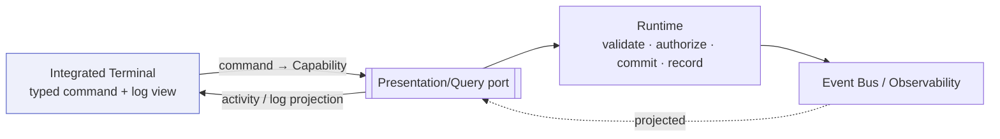

# Integrated Terminal

> **Ring:** Interface adapters — presentation (outer). The integrated terminal is a **text command-and-log surface** inside the [IDE shell](../frontend.md): a place to issue runtime [Capabilities](../../core/capability-registry.md) by typed command, to read a streaming log of runtime activity (phase progress, agent actions, [Events](../../core/event-bus.md)), and to script repetitive engineering actions. It exists to give power users and automation a textual, scriptable counterpart to the graphical surfaces — the IDE ergonomic of "drop to a console" — without ever becoming a second, privileged path into the system. Like every surface, it is **presentation-only**: it sends commands and renders output, and contains **no engineering rules** ([P11](../../foundation/principles.md)). It is **not** a host OS shell.

---

## 1. Purpose & responsibilities

### What it owns

- **A typed command surface.** Accepting textual commands that map to the **same** registered [Capabilities](../../core/capability-registry.md) the [command palette](command-palette.md) and graphical surfaces use, and sending them over the [Presentation/Query port](../../core/contracts.md#presentation-query-port).
- **A log/output surface.** Rendering a streaming, read-only projection of runtime activity — phase transitions, agent actions, capability invocations, [Events](../../core/event-bus.md), and command results/errors.
- **Scripting affordances.** Letting an engineer compose/replay sequences of commands for repetitive flows (always as ordinary, governed capability invocations).
- **Local console state.** Command history, scrollback, and input editing — non-engineering UI state.

### What it does **NOT** own

- **A host operating-system shell.** It is **not** a pass-through to the machine's OS; it speaks the runtime's [capability](../../core/capability-registry.md) vocabulary, not arbitrary system commands. Its action surface is exactly the permitted capabilities — nothing more.
- **A privileged path.** It bypasses nothing: every command is validated, permission-checked, autonomy-gated, and recorded exactly like any other ([capability registry](../../core/capability-registry.md) invocation guarantees).
- **Engineering logic.** No verification, constraint resolution, gating, or reasoning ([P11](../../foundation/principles.md)). A typed `run drc` triggers the [Verification Engine](../../engineering/verification-engine.md) via a capability; the terminal neither runs nor knows the rules.
- **Authoritative state or logs.** The displayed log is a projection of the runtime's [Event](../../core/event-bus.md)/observability stream; the terminal stores no system of record.

---

## 2. Position in the architecture

*Figure: the terminal issues capabilities and renders an activity/log projection — the same one port, the same governance as any surface. Viewpoint: the presentation ring.*

---

## 3. How it gets its data

- **Activity/log projection.** The terminal subscribes, over the [Presentation/Query port](../../core/contracts.md#presentation-query-port), to a read-only stream of runtime activity derived from the [Event Bus](../../core/event-bus.md) and the [Observability port](../../core/contracts.md). It renders, it does not author.
- **Command results.** A typed command is invoked as a [Capability](../../core/capability-registry.md); the runtime returns a typed result, diagnostics, or a rejection, which the terminal prints.
- **Permitted set.** Like the [command palette](command-palette.md), the terminal can only offer/complete capabilities the user is permitted to invoke ([least privilege](../../core/capability-registry.md)).

---

## 4. Scope & boundaries

This surface is deliberately bounded to avoid becoming a back door:

| Concern | In scope | Out of scope |
|---------|----------|--------------|
| Commands | runtime [Capabilities](../../core/capability-registry.md) (same catalog as the GUI) | arbitrary host-OS commands |
| Effects | governed, recorded capability invocations | unrecorded or unpermissioned mutation |
| Output | projection of runtime [Events](../../core/event-bus.md)/logs | a private, authoritative log store |
| Reasoning | none — AI proposals come via the [AI interaction model](ai-interaction-model.md) | model calls from the UI |
| Engineering logic | none ([P11](../../foundation/principles.md)) | verification/constraint/gating computation |

> **Why constrain a terminal at all?** A console is the classic place where "just let me run anything" creeps in. Binding it to the [Capability port](../../core/capability-registry.md) keeps the architecture's guarantees intact: every action is enumerable, permissioned, side-effect-declared, and recorded ([P5](../../foundation/principles.md), [P13](../../foundation/principles.md)). The terminal is a faster way to use the *same* sanctioned actions, not a wider set of them.

---

## 5. User interactions

- **Type a command** to invoke a capability (with completion against the permitted set and the capability's [input schema](../../core/capability-registry.md)).
- **Read the live log** of phase/agent/event activity; filter or search scrollback.
- **Replay history / scripts** to repeat a sequence of governed commands.
- **Jump to context** — clicking an entity reference or [diagnostic](diagnostics.md) in the log reveals it in the relevant viewer or panel.

All interactions are command-out / projection-in; none bypasses runtime governance.

---

## 6. What it does NOT do (no engineering rules)

The terminal evaluates no rule, resolves no constraint, gates nothing, makes no permission/autonomy decision, and reaches no host OS. It is a textual front-end to the same governed [capabilities](../../core/capability-registry.md) and a viewer onto the runtime's activity stream ([P11](../../foundation/principles.md)).

---

## 7. Contracts

- **Consumes:** the [Presentation/Query port](../../core/contracts.md#presentation-query-port) — command issuance (to [Capabilities](../../core/capability-registry.md)) and the activity/log projection (from the [Event Bus](../../core/event-bus.md) / [Observability port](../../core/contracts.md)). Permissions are enforced by the [Security/Policy port](../../core/contracts.md) on invocation.

---

## 8. Failure modes

- **Unknown/unpermitted/invalid command.** Rejected with no effect; the reason is printed ([capability registry](../../core/capability-registry.md) rejection guarantee).
- **Gated command.** Routed to [approval](../../engineering/human-in-the-loop.md); shown as pending, not silently dropped ([P10](../../foundation/principles.md)).
- **Log stream lag/unavailable.** Output is marked stale and resumes on reconnect; the runtime remains the source of record.
- **Long-running command.** Progress streams into the log; the surface stays responsive and the action remains cancelable where the capability supports it.

---

## 9. Open decisions

- [ADR-0001](../../decisions/0001-adopt-clean-architecture-dependency-rule.md) — the terminal is a presentation surface over the one inward port, not a privileged channel.
- [ADR-0010](../../decisions/0010-human-in-the-loop-autonomy-levels.md) — autonomy gating applies equally to terminal-issued commands.
- **Open:** the surface scripting/macro model (how command sequences are saved/shared) — a presentation refinement recorded here per [P13](../../foundation/principles.md).

---

## 10. Related documents

[`presentation/frontend.md`](../frontend.md) · [`presentation/frontend/command-palette.md`](command-palette.md) · [`core/capability-registry.md`](../../core/capability-registry.md) · [`core/event-bus.md`](../../core/event-bus.md) · [`core/contracts.md`](../../core/contracts.md#presentation-query-port) · [`presentation/frontend/ai-interaction-model.md`](ai-interaction-model.md) · [`presentation/frontend/diagnostics.md`](diagnostics.md) · [`foundation/principles.md`](../../foundation/principles.md) (P11)
