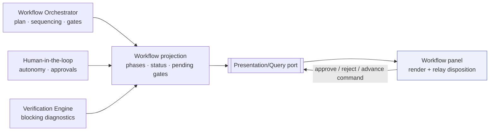
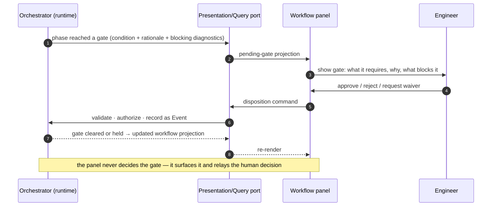

# Workflow Panel

> **Ring:** Interface adapters — presentation (outer). The workflow panel is the [IDE shell](../frontend.md)'s view of **where the design is in its engineering process**: it renders the [workflow plan](../../core/workflow-orchestration.md) (the project's phase graph), shows each [Phase](../../GLOSSARY.md#phase)'s status, and surfaces **gates and approvals** so the engineer can keep command of the design ([P10](../../foundation/principles.md)). It exists because an AI-native engineering process moves through many phases with branches, gates, and loop-backs, and the engineer needs one place to see progress and to *dispose* of the decisions the runtime pauses for. It **presents** the plan and **relays** approvals; it owns **no workflow logic** — sequencing, gating, and loop-backs are decided by the [Workflow Orchestrator](../../core/workflow-orchestration.md) and [human-in-the-loop](../../engineering/human-in-the-loop.md) policy ([P11](../../foundation/principles.md)).

---

## 1. Purpose & responsibilities

### What it owns

- **Presenting the workflow plan.** Rendering the phase DAG — nodes (phases), forward edges, gate edges, and loop-back edges — from a workflow projection, mirroring the [default workflow plan](../../foundation/architecture-views.md).
- **Showing phase status.** Per-phase state (not-started / runnable / running / gated / passed / failed / looped-back), derived from committed phase outcomes.
- **Surfacing gates & approvals.** Making a *pending gate* (e.g. an approval at the project's [Autonomy Level](../../engineering/human-in-the-loop.md), or "no open error [Violations](../../foundation/engineering-domain-model.md#violation)") visible and actionable, with the rationale and any blocking diagnostics.
- **Relaying disposition.** Issuing the engineer's *approve / reject / waive-request / advance* as commands; the runtime decides and commits.
- **Navigation.** Letting the engineer jump from a phase to its relevant viewer, [diagnostics](diagnostics.md), or [AI proposals](ai-interaction-model.md).

### What it does **NOT** own

- **Sequencing or gating logic.** *What runs next*, *which gate blocks*, and *loop-back routing* belong to the [Workflow Orchestrator](../../core/workflow-orchestration.md); *what a gate requires* and *who may approve* belong to [human-in-the-loop](../../engineering/human-in-the-loop.md). The panel computes none of it ([P11](../../foundation/principles.md)).
- **Phase internals.** A phase's states/transitions are its [state-machine instance](../../state-machines/README.md); the panel shows status, not mechanism.
- **Verification.** Blocking diagnostics shown at a gate come from the [Verification Engine](../../engineering/verification-engine.md); the panel never computes pass/fail.

---

## 2. Position in the architecture

*Figure: the panel renders a workflow projection assembled by the orchestrator (plus autonomy and verification inputs) and relays the engineer's disposition back as a command. Viewpoint: the presentation ring.*

---

## 3. How it gets its data

- **Workflow projection.** The panel subscribes, over the [Presentation/Query port](../../core/contracts.md#presentation-query-port), to a read-only projection of the [workflow plan](../../core/workflow-orchestration.md) and live phase outcomes. The DAG's shape and each phase's status are computed in the runtime; the panel only draws them.
- **Pending-gate projection.** Gates awaiting human disposition arrive from [human-in-the-loop](../../engineering/human-in-the-loop.md) policy as a *pending-approval* projection, carrying the gate's condition, rationale, and any blocking [Violations](../../foundation/engineering-domain-model.md#violation) (from the [Verification Engine](../../engineering/verification-engine.md)).
- **Live updates.** When the orchestrator advances, loops back, or opens/closes a gate, it commits [Events](../../core/event-bus.md); the projection updates and the panel re-renders.

---

## 4. Presenting the phases & guiding the engineer

- **The graph.** Phases render as nodes with status; forward edges show dependencies, dotted edges show verification loop-backs, and gate edges are marked with their condition — consistent with the [canonical phase map](../../foundation/architecture-views.md).
- **Guidance, not control.** The panel highlights the *runnable* / *attention-needed* phase (e.g. a gate awaiting approval, a failed verification that looped back) so the engineer knows what to do next, but it cannot itself decide what runs.
- **Drill-in.** Selecting a phase reveals its purpose, its driving [agent](../../agents/README.md), its current outcome, and shortcuts to the relevant viewer ([schematic](schematic-viewer.md)/[PCB](pcb-viewer.md)), [diagnostics](diagnostics.md), and [AI proposals](ai-interaction-model.md).

---

## 5. Gates & approvals (human-in-the-loop surfacing)

This is the panel's most important job: realizing "AI proposes, engineer disposes" at the *workflow* scale ([P10](../../foundation/principles.md)).

*Figure: how a gate is surfaced and disposed. The decision and its recording happen in the runtime; the panel is the human-facing surface. Viewpoint: one gate.*

- **Gates are made visible, never silent.** A project pausing at a gate shows as *gated* (idle, awaiting decision), not failed — matching the runtime's [degraded/idle posture](../../core/failure-taxonomy-and-degraded-modes.md).
- **Waivers route correctly.** A request to [waive](../../engineering/verification-engine.md) a blocking violation is relayed as a command; whether it may be granted is an [autonomy](../../engineering/human-in-the-loop.md)/authority decision in the runtime, recorded as a [Decision](../../foundation/engineering-domain-model.md#decision) with [Evidence](../../foundation/engineering-domain-model.md#evidence) ([P5](../../foundation/principles.md)).
- **Disposition is recorded.** Approve/reject becomes an [Event](../../core/event-bus.md), so the human's role is in the audit trail and a rejection can feed the [Learning Engine](../../engineering/learning-engine.md).

---

## 6. What it does NOT do (no engineering rules)

The panel never sequences phases, never evaluates a gate condition, never computes verification pass/fail, never authorizes a waiver, and never advances the project on its own. It draws the plan and relays decisions; all logic lives in the [orchestrator](../../core/workflow-orchestration.md), [verification engine](../../engineering/verification-engine.md), and [autonomy policy](../../engineering/human-in-the-loop.md) ([P11](../../foundation/principles.md)).

---

## 7. Contracts

- **Consumes:** the [Presentation/Query port](../../core/contracts.md#presentation-query-port) — the workflow projection, the pending-gate/approval projection, and command issuance for dispositions. The underlying inputs come from the [Workflow Orchestrator](../../core/workflow-orchestration.md), [human-in-the-loop](../../engineering/human-in-the-loop.md), and [Verification Engine](../../engineering/verification-engine.md), all inside the runtime.

---

## 8. Failure modes

- **Gate never disposed.** The phase stays visibly *gated*; the project does not advance silently ([P10](../../foundation/principles.md)).
- **Unauthorized disposition attempt.** Rejected by the runtime's [Security/Policy port](../../core/contracts.md); the panel shows the reason.
- **Oscillating loop-back.** The runtime's convergence safeguards escalate to a gate; the panel surfaces repeated failure rather than hiding it ([P13](../../foundation/principles.md)).
- **Projection stale/unavailable.** The panel marks status as stale and disables disposition until reconnected; correctness comes from the runtime.

---

## 9. Open decisions

- [ADR-0010](../../decisions/0010-human-in-the-loop-autonomy-levels.md) — how gates bind to autonomy levels (the policy the panel surfaces).
- [ADR-0005](../../decisions/0005-ir-as-canonical-phase-boundary-representation.md) — phase boundaries align with IR lowerings shown as forward edges.
- **Open:** how branch/optional phases (e.g. skipping EMC for a low-speed board) are presented and chosen — to be recorded with [workflow orchestration](../../core/workflow-orchestration.md).

---

## 10. Related documents

[`presentation/frontend.md`](../frontend.md) · [`core/workflow-orchestration.md`](../../core/workflow-orchestration.md) · [`engineering/human-in-the-loop.md`](../../engineering/human-in-the-loop.md) · [`engineering/verification-engine.md`](../../engineering/verification-engine.md) · [`foundation/architecture-views.md`](../../foundation/architecture-views.md) · [`presentation/frontend/diagnostics.md`](diagnostics.md) · [`presentation/frontend/ai-interaction-model.md`](ai-interaction-model.md) · [`foundation/principles.md`](../../foundation/principles.md) (P10, P11)
