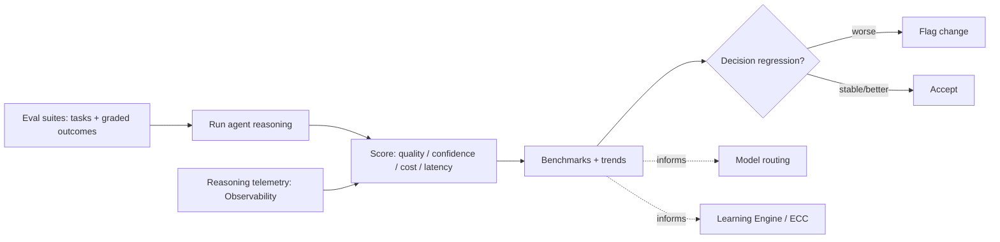

# Agent Evaluation

> **Ring:** Quality (cross-cutting process). This document defines how the **reasoning quality** of Electronics Agent Kit is measured — how good the [Agents](../agents/README.md)' judgement is, not whether the [runtime](../core/engineering-runtime.md) executes correctly. It exists because the stochastic half of the system (the [reasoning adapter](../core/agent-runtime-protocol.md) of each agent, behind the [Reasoning Engine port](../core/reasoning-engine-interface.md)) cannot be validated by the deterministic methods in [testing & validation](testing-and-validation-strategy.md): a reasoning step can be *valid* (schema-correct, rule-passing) yet *poor* (a worse part choice, a clumsier topology). Evaluation measures that quality with eval suites, benchmarks, confidence scoring, and regression of agent *decisions* — so reasoning can be improved and protected against regressions like any other quality. It is deliberately distinct from runtime testing: that asks *did the machine run right?*, this asks *did the AI judge well?*

---

## 1. Purpose & responsibilities

### What it owns
- **Eval suites.** Curated tasks with known-good or graded outcomes that exercise an agent's reasoning (e.g. "select a regulator for these requirements," "propose a placement for this block").
- **Benchmarks.** Aggregate quality, cost, and latency scores per agent and per [model tier](../crosscutting/cost-and-resource-governance.md), enabling comparison across prompts, tiers, and versions.
- **Confidence scoring.** How a reasoning output's self-reported and externally-assessed confidence is calibrated and tracked against actual outcomes.
- **Decision regression.** Detecting when a change (prompt, model, routing) makes agent *decisions* worse, even when they remain rule-valid.

### What it does NOT own
- **Runtime correctness / determinism** — owned by [testing & validation](testing-and-validation-strategy.md). Evaluation assumes the runtime executes correctly and asks only about judgement quality.
- **The reasoning boundary itself** — owned by the [Reasoning Engine interface](../core/reasoning-engine-interface.md); evaluation *measures what comes through it*.
- **Model routing policy** — owned by [cost governance](../crosscutting/cost-and-resource-governance.md); evaluation *informs* it with quality-vs-cost data.
- **Capturing lessons into the product** — turning evaluation findings into improved defaults/experience is the [Learning Engine](../engineering/learning-engine.md) (in-domain) or [ECC](../GLOSSARY.md#ecc) (meta); evaluation produces the measurements, not the persisted lessons.
- **The validation gate.** Whether a single output is *safe to use* is the deterministic gate in the [reasoning interface](../core/reasoning-engine-interface.md); evaluation grades *quality over many outputs*, not per-call admission.

---

## 2. Position in the architecture

*Figure: eval suites drive agent reasoning; scored outcomes feed benchmarks, regression detection, routing, and learning. From the quality viewpoint.*

- **Depends on:** the [Reasoning Engine interface](../core/reasoning-engine-interface.md) (the boundary it measures), the [Observability port](../crosscutting/logging-and-observability.md) (reasoning telemetry — tier, confidence, retries, cost), and the [agent runtime protocol](../core/agent-runtime-protocol.md) (the reasoning-adapter contract).
- **Depended on by:** [cost governance](../crosscutting/cost-and-resource-governance.md) (quality-vs-cost), the [Learning Engine](../engineering/learning-engine.md) (improvement targets), and [safety/ethics](../governance/safety-liability-and-ethics.md) (confidence honesty).

---

## 3. What "good reasoning" means (graded, not binary)

Runtime tests are pass/fail; reasoning quality is *graded*. An agent's output is assessed on several axes at once:

| Axis | Question | Example |
|------|----------|---------|
| **Correctness** | Is the judgement defensible against ground truth? | The chosen regulator actually meets the spec. |
| **Quality** | Among valid options, how good is this one? | A cheaper, in-stock part with equal performance. |
| **Confidence calibration** | Does stated confidence match real accuracy? | High-confidence answers are right more often. |
| **Cost & latency** | At what spend was the judgement obtained? | Same quality from a cheaper [tier](../crosscutting/cost-and-resource-governance.md). |
| **Stability** | Does equivalent input give consistent judgement? | No erratic flip-flops across runs. |

A change is judged on the whole profile: a prompt that is slightly better on quality but far worse on cost or calibration may be a regression overall ([P13](../foundation/principles.md): trade-offs are explicit, not silent).

## 4. Confidence scoring and calibration

Because the system surfaces confidence to engineers and uses it for [autonomy](../engineering/human-in-the-loop.md) gating and [safety framing](../governance/safety-liability-and-ethics.md), confidence must be *honest*. Evaluation tracks calibration — comparing stated confidence against measured outcome accuracy over the eval suites — so the system neither over- nor under-states certainty. Miscalibration is itself a tracked regression, because an overconfident agent is a safety problem, not just a quality one.

## 5. Why evaluate reasoning separately from testing the runtime

Required by [P13](../foundation/principles.md). The architecture's deterministic/stochastic split ([P3](../foundation/principles.md)/[P4](../foundation/principles.md)) means two fundamentally different quality questions exist, with different methods: the deterministic kernel is *tested* (exact, repeatable, pass/fail — see [testing & validation](testing-and-validation-strategy.md)); the stochastic judgement is *evaluated* (graded, statistical, trend-based). Conflating them would either make reasoning seem untestable or make the kernel seem fuzzy. Separating them lets each be measured properly and lets reasoning improve continuously without destabilizing the proven kernel.

## Contracts

- **Consumes:** the [Reasoning Engine interface](../core/reasoning-engine-interface.md) (recorded judgements), the [Observability port](../crosscutting/logging-and-observability.md) (reasoning telemetry), and the [Cost-budget port](../crosscutting/cost-and-resource-governance.md) (cost per judgement).
- **Feeds:** [cost-and-resource-governance](../crosscutting/cost-and-resource-governance.md) (routing decisions), the [Learning Engine](../engineering/learning-engine.md) (improvement signals), and [safety/ethics](../governance/safety-liability-and-ethics.md) (calibration honesty).
- **No port of its own** — it is a measurement process over the reasoning boundary.

## Failure modes

| Failure (of evaluation) | Effect | Mitigation |
|-------------------------|--------|------------|
| **Eval suite not representative** | Good scores, poor real performance. | Suites curated from real designs and refreshed; benchmarks paired with field telemetry. |
| **Ground truth unavailable** | Hard to grade objectively. | Use graded/relative scoring and human-judged rubrics where no single truth exists; record the rubric ([P13](../foundation/principles.md)). |
| **Overfitting to the benchmark** | Agent tuned to the test, not the task. | Held-out suites; periodic suite rotation; trend (not single-score) emphasis. |
| **Miscalibrated confidence undetected** | Overconfidence reaches users. | Calibration is a first-class, tracked metric; regressions flagged. |
| **Evaluation cost explosion** | Re-running suites is expensive. | Reuse recorded reasoning where valid ([determinism](../core/determinism-and-reproducibility.md)); sample; budget via [cost governance](../crosscutting/cost-and-resource-governance.md). |
| **Regression masked by averages** | A subset got worse. | Segment scores by task class; flag per-segment regressions, not just the mean. |

## Open decisions

- [ADR-0002](../decisions/0002-runtime-owns-knowledge-llm-as-reasoning-engine.md) — reasoning is a bounded, measurable component, not the source of truth.
- [ADR-0009](../decisions/0009-determinism-and-replay-strategy.md) — recorded reasoning enables cheap, repeatable evaluation.
- [ADR-0010](../decisions/0010-human-in-the-loop-autonomy-levels.md) — confidence calibration feeds autonomy gating.

## Related documents

[`quality/testing-and-validation-strategy.md`](testing-and-validation-strategy.md) · [`core/reasoning-engine-interface.md`](../core/reasoning-engine-interface.md) · [`core/agent-runtime-protocol.md`](../core/agent-runtime-protocol.md) · [`agents/README.md`](../agents/README.md) · [`crosscutting/cost-and-resource-governance.md`](../crosscutting/cost-and-resource-governance.md) · [`crosscutting/logging-and-observability.md`](../crosscutting/logging-and-observability.md) · [`engineering/learning-engine.md`](../engineering/learning-engine.md) · [`engineering/human-in-the-loop.md`](../engineering/human-in-the-loop.md) · [`governance/safety-liability-and-ethics.md`](../governance/safety-liability-and-ethics.md) · [`foundation/principles.md`](../foundation/principles.md)
