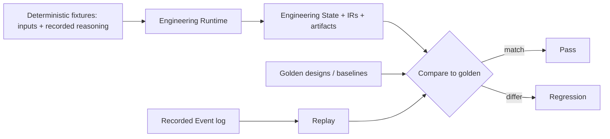

# Testing & Validation Strategy

> **Ring:** Quality (cross-cutting process). This document defines how the **runtime itself is validated** — how we gain confidence that the deterministic [Engineering Runtime](../core/engineering-runtime.md) produces correct, reproducible engineering outputs. It exists because a system whose thesis is *determinism and ownership of knowledge* must be testable *as a deterministic machine*: given fixed inputs and recorded reasoning, it must yield the same [Engineering State](../core/shared-state-model.md) every time, and that state must be engineering-correct. The strategy leans on the architecture's own guarantees — [determinism](../core/determinism-and-reproducibility.md), [Event](../core/event-bus.md) sourcing, [IRs](../compiler/compiler-ir.md), and typed [contracts](../core/contracts.md) — to make testing tractable. This is explicitly about **runtime correctness**; measuring **reasoning quality** is the separate concern of [agent evaluation](agent-evaluation.md).

---

## 1. Purpose & responsibilities

### What it owns
- **The validation approach for the runtime:** golden designs, deterministic fixtures, regression of engineering outputs, a simulation harness, and replay-based testing.
- **Correctness criteria.** What it means for a runtime output to be "right": invariants from the [domain model](../foundation/engineering-domain-model.md) hold, [IR](../compiler/compiler-ir.md) transformations preserve their invariants, and outputs match known-good baselines.
- **Reproducibility verification.** Proving that the same inputs + recorded reasoning reproduce the same state ([P4](../foundation/principles.md)).
- **The harness design (conceptually).** How fixtures, golden artifacts, and replay are organized so engineering regressions are caught.

### What it does NOT own
- **Reasoning-quality measurement** — eval suites, benchmarks, confidence scoring, and regression of agent *decisions* are [agent evaluation](agent-evaluation.md).
- **The determinism mechanism** — owned by [determinism & reproducibility](../core/determinism-and-reproducibility.md); testing *exercises* it.
- **The simulators** — owned by the [simulation interface](../integration/simulation-interface.md); the harness *uses* recorded/fixture results.
- **Test tooling/frameworks** — deferred technology ([Phase 0](../README.md)); this fixes the *strategy*.
- **Production observability** — runtime telemetry is [observability](../crosscutting/logging-and-observability.md); tests may assert on it but do not own it.

---

## 2. Position in the architecture

*Figure: fixtures and recorded reasoning drive the runtime; outputs and replays are compared to golden baselines. From the validation viewpoint.*

- **Depends on:** [determinism & reproducibility](../core/determinism-and-reproducibility.md), the [Event Sink/Source](../core/contracts.md#event-sink-event-source) (replay), the [IRs](../compiler/compiler-ir.md) (output comparison points), and the [domain model](../foundation/engineering-domain-model.md) (invariants to assert).
- **Depended on by:** [quality attributes](../foundation/quality-attributes.md) (testability), and the development process at large.

---

## 3. The five pillars

| Pillar | What it validates | How |
|--------|-------------------|-----|
| **Golden designs** | End-to-end correctness on representative designs. | Curated reference [Projects](../GLOSSARY.md#project); their outputs ([IRs](../compiler/compiler-ir.md), BOM, artifacts) are baselined; a run must match the baseline. |
| **Deterministic fixtures** | Behavior under fixed inputs. | Inputs *plus recorded reasoning outputs* are pinned, removing stochasticity so a test is repeatable ([P4](../foundation/principles.md)). |
| **Regression of engineering outputs** | That a change doesn't silently alter results. | Diff current outputs against golden baselines at [IR](../compiler/compiler-ir.md) boundaries; any change is either expected (baseline updated deliberately) or a regression. |
| **Simulation harness** | Analysis-dependent behavior. | Drive flows with recorded/fixture [Analysis Results](../foundation/engineering-domain-model.md#analysis-result) so [simulation](../integration/simulation-interface.md)-dependent logic is testable without live solvers. |
| **Replay-based testing** | Reproducibility & no hidden non-determinism. | Replay a recorded [Event](../core/event-bus.md) log and assert the reconstructed state is identical ([determinism](../core/determinism-and-reproducibility.md)). |

## 4. Why determinism makes this tractable

Required by [P13](../foundation/principles.md). Testing an AI system is normally hard precisely because it is stochastic. This architecture isolates stochasticity to one boundary (the [Reasoning Engine port](../core/reasoning-engine-interface.md)) and *records every reasoning output* ([P3](../foundation/principles.md), [P4](../foundation/principles.md)). That single decision is what makes the runtime testable like ordinary deterministic software: pin the recorded reasoning, and the entire kernel becomes a pure function of its inputs — fixtures, golden comparison, and replay all become possible. Testability is thus a *consequence* of the determinism principle, not a separate effort.

## 5. Testing at contract and IR boundaries

The typed [contracts](../core/contracts.md) and [IRs](../compiler/compiler-ir.md) are natural test seams. Each [IR transformation](../compiler/transformations.md) has declared invariants that can be asserted independently; each port can be exercised with test doubles so a component is validated in isolation. This keeps tests focused (a routing regression is caught at the [PCB IR](../compiler/ir/pcb-ir.md) boundary, not only end-to-end) and aligns the test structure with the architecture.

## Contracts

- **Consumes:** the [Event Sink/Source](../core/contracts.md#event-sink-event-source) (replay), the [Simulation port](../integration/simulation-interface.md) (via recorded/fixture results), and every [contract](../core/contracts.md) (via test doubles at boundaries).
- **Asserts against:** [domain-model](../foundation/engineering-domain-model.md) invariants and [IR](../compiler/compiler-ir.md) transformation invariants.
- **No port of its own** — it is a process discipline over existing contracts.

## Failure modes

| Failure (of the strategy) | Effect | Mitigation |
|---------------------------|--------|------------|
| **Flaky test from hidden non-determinism** | Unreliable signal. | Any flakiness is a *real defect* — it means non-determinism escaped the recorded boundary; it is fixed at the source, not retried. |
| **Golden baseline rot** | Baselines drift from intent. | Baseline updates are deliberate, reviewed, and recorded; an unexplained diff fails the build. |
| **Over-reliance on end-to-end** | Slow, coarse signal. | Test at [IR](../compiler/compiler-ir.md)/contract seams for fast, localized failures. |
| **Live-solver dependence in tests** | Slow/non-deterministic. | Simulation harness uses recorded [Analysis Results](../foundation/engineering-domain-model.md#analysis-result). |
| **Untested invariant** | Silent correctness gap. | Domain-model and IR invariants are enumerated as required assertions. |

## Open decisions

- [ADR-0009](../decisions/0009-determinism-and-replay-strategy.md) — the replay strategy testing depends on.
- [ADR-0004](../decisions/0004-event-sourcing-decision.md) — event sourcing underpinning replay-based tests.
- [ADR-0005](../decisions/0005-ir-as-canonical-phase-boundary-representation.md) — IR boundaries as test seams.

## Related documents

[`core/determinism-and-reproducibility.md`](../core/determinism-and-reproducibility.md) · [`quality/agent-evaluation.md`](agent-evaluation.md) · [`compiler/compiler-ir.md`](../compiler/compiler-ir.md) · [`compiler/transformations.md`](../compiler/transformations.md) · [`core/event-bus.md`](../core/event-bus.md) · [`integration/simulation-interface.md`](../integration/simulation-interface.md) · [`foundation/engineering-domain-model.md`](../foundation/engineering-domain-model.md) · [`foundation/quality-attributes.md`](../foundation/quality-attributes.md) · [`foundation/principles.md`](../foundation/principles.md)
