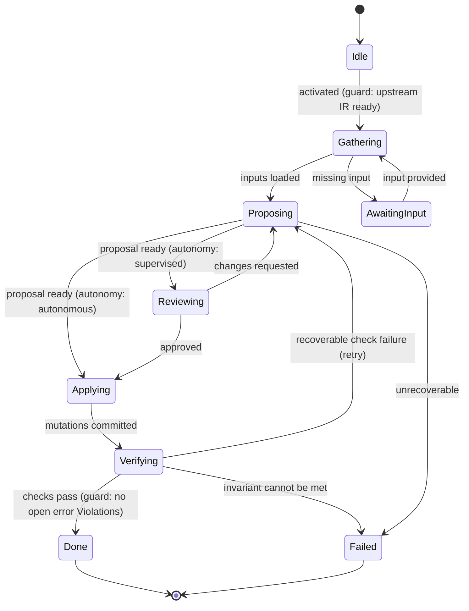

# Phase State Machines

> **Ring:** Use cases / runtime (inner) — **instances**. This directory holds the **14 concrete [State Machine](../GLOSSARY.md#state-machine-fsm) instances**, one per engineering [Phase](../GLOSSARY.md#phase). Each instance *conforms to* the reusable [State-Machine Framework](../core/state-machine-framework.md) (the meta-model) and is *run* by the [Execution Engine](../core/execution-engine.md); the order in which they run is the [Workflow Orchestrator's](../core/workflow-orchestration.md) [workflow plan](../GLOSSARY.md#the-word-planning-disambiguation). This README is the index and the statement of the pattern every instance shares.

A phase machine is *just a position in the process*. It holds **no engineering knowledge** of its own — that lives in [Engineering State](../core/shared-state-model.md). A machine's transitions invoke a [driving Agent](../agents/README.md), which proposes change; the change is validated and committed by the Execution Engine; and the machine's progress is recorded entirely as [Events](../core/event-bus.md). The 14 machines differ only in their concrete states, guards, effects, the agent they drive, the engines they call, and the [IR](../compiler/compiler-ir.md) they read and write.

Because a phase is just a framework-conforming instance plus a workflow-plan position, **new phases can be contributed by the [Plugin System](../integration/plugin-system.md)** without changing the kernel: a plugin supplies a framework-conforming machine and its driving agent, and the [Workflow Orchestrator](../core/workflow-orchestration.md) splices it into the [workflow plan](../GLOSSARY.md#the-word-planning-disambiguation).

---

## 1. The instance index (mirrors the canonical map)

This table mirrors the authoritative [phase → state-machine → agent → engine → IR map](../foundation/architecture-views.md) in `foundation/architecture-views.md`. If the two ever disagree, that document wins.

| # | Phase | State machine (this dir) | Driving agent | Engines used | IR read → written |
|---|-------|--------------------------|---------------|--------------|-------------------|
| 1 | Requirement Planning | [requirement-planning](requirement-planning.md) | [Requirement Agent](../agents/requirement-agent.md) | [Planning](../engineering/planning-engine.md) | Design Intent → **produces** [Requirement IR](../compiler/ir/requirement-ir.md) |
| 2 | Engineering Analysis | [engineering-analysis](engineering-analysis.md) | [Planning Agent](../agents/planning-agent.md) | [Planning](../engineering/planning-engine.md), [Constraint](../engineering/constraint-engine.md) | [Requirement IR](../compiler/ir/requirement-ir.md) → **produces** [Engineering IR](../compiler/ir/engineering-ir.md) |
| 3 | Constraint Extraction | [constraint-extraction](constraint-extraction.md) | [Planning Agent](../agents/planning-agent.md) | [Constraint](../engineering/constraint-engine.md) | **enriches** [Engineering IR](../compiler/ir/engineering-ir.md) |
| 4 | Datasheet Intelligence | [datasheet-intelligence](datasheet-intelligence.md) | [Datasheet Agent](../agents/datasheet-agent.md) | — (feeds [Knowledge Graph](../knowledge/knowledge-graph.md)) | **enriches** [Engineering IR](../compiler/ir/engineering-ir.md) |
| 5 | BOM Planning | [bom-planning](bom-planning.md) | [BOM Agent](../agents/bom-agent.md) | [Constraint](../engineering/constraint-engine.md) | **produces** [BOM IR](../compiler/ir/bom-ir.md) |
| 6 | Schematic Planning | [schematic-planning](schematic-planning.md) | [Schematic Agent](../agents/schematic-agent.md) | [Planning](../engineering/planning-engine.md), [Constraint](../engineering/constraint-engine.md) | **produces** [Schematic IR](../compiler/ir/schematic-ir.md) |
| 7 | ERC Verification | [erc-verification](erc-verification.md) | [ERC Agent](../agents/erc-agent.md) | [Verification](../engineering/verification-engine.md) | **checks** [Schematic IR](../compiler/ir/schematic-ir.md) · fail ↺ Schematic |
| 8 | PCB Floor Planning | [pcb-floor-planning](pcb-floor-planning.md) | [Placement Agent](../agents/placement-agent.md) | [Planning](../engineering/planning-engine.md), [Constraint](../engineering/constraint-engine.md) | [Schematic IR](../compiler/ir/schematic-ir.md) → **produces** [PCB IR](../compiler/ir/pcb-ir.md) |
| 9 | Component Placement | [component-placement](component-placement.md) | [Placement Agent](../agents/placement-agent.md) | [Constraint](../engineering/constraint-engine.md) | **enriches** [PCB IR](../compiler/ir/pcb-ir.md) |
| 10 | Routing Planning | [routing-planning](routing-planning.md) | [Routing Agent](../agents/routing-agent.md) | [Constraint](../engineering/constraint-engine.md), [Planning](../engineering/planning-engine.md) | **enriches** [PCB IR](../compiler/ir/pcb-ir.md) |
| 11 | DRC Verification | [drc-verification](drc-verification.md) | [DRC Agent](../agents/drc-agent.md) | [Verification](../engineering/verification-engine.md) | **checks** [PCB IR](../compiler/ir/pcb-ir.md) · fail ↺ Routing |
| 12 | DFM Verification | [dfm-verification](dfm-verification.md) | [DFM Agent](../agents/dfm-agent.md) | [Verification](../engineering/verification-engine.md) | **checks** [PCB IR](../compiler/ir/pcb-ir.md) · fail ↺ Placement |
| 13 | EMC Analysis | [emc-analysis](emc-analysis.md) | [EMC Agent](../agents/emc-agent.md) | [Verification](../engineering/verification-engine.md) (analysis) | **analyzes** [PCB IR](../compiler/ir/pcb-ir.md) · fail ↺ Routing |
| 14 | Manufacturing Generation | [manufacturing-generation](manufacturing-generation.md) | [Manufacturing Agent](../agents/manufacturing-agent.md) | [Verification](../engineering/verification-engine.md) (gate) | [PCB IR](../compiler/ir/pcb-ir.md) → **produces** [Manufacturing IR](../compiler/ir/manufacturing-ir.md) |

The [Learning Agent](../agents/learning-agent.md) is cross-cutting and bound to **no** phase, so it has no state machine — it observes the [Event](../core/event-bus.md) stream of all 14. That is the "15 subsystems / 14 phases / 13 agents" reconciliation explained in [architecture-views](../foundation/architecture-views.md).

---

## 2. The common lifecycle pattern

Every phase machine specializes one shared shape — the generic phase machine of the [framework](../core/state-machine-framework.md#4-a-generic-phase-machine), expressed here in the vocabulary the instances use. Concrete state names differ per phase (e.g. *StructuringRequirements*, *ProposingPlacement*, *EvaluatingRules*), but each maps onto one of these roles:

| Pattern role | [Kind](../core/state-machine-framework.md#states) | What happens |
|--------------|------|--------------|
| **Idle** | Initial | Created and at rest; awaits activation by the [Workflow Orchestrator](../core/workflow-orchestration.md) when its upstream IR is ready. |
| **Gathering** | Normal | Reads the inputs it needs — the upstream [IR](../compiler/compiler-ir.md), resolved [Constraints](../foundation/engineering-domain-model.md#constraint), [Knowledge-Graph](../knowledge/knowledge-graph.md) facts — into the working scope. |
| **Proposing** | Normal | Invokes the [driving Agent](../agents/README.md), which uses the [Reasoning Engine](../core/reasoning-engine-interface.md) to propose change. The machine holds the proposal; it is not yet committed. |
| **Reviewing** | Waiting / HITL | Pauses for human approval at the project's [Autonomy Level](../engineering/human-in-the-loop.md) ([P10](../foundation/principles.md)). The runtime is *idle*, not busy ([P13](../foundation/principles.md)). |
| **Applying** | Normal | The Execution Engine validates the proposal and commits the mutations atomically, writing/enriching the phase's [IR](../compiler/compiler-ir.md). |
| **Verifying** | Normal | Runs the deterministic [engine](../GLOSSARY.md#engine) checks for this phase (constraint check, or a [Verification-Engine](../engineering/verification-engine.md) rule set) over the result. |
| **Done** | Terminal (success) | Phase complete; the orchestrator may advance. |
| **Failed** | Terminal (failure) | Phase cannot complete; surfaces an outcome the orchestrator routes (for verification phases, a loop-back edge). |

*Figure: the common phase lifecycle every instance specializes, from the runtime's viewpoint. The split out of **Proposing** realizes [human-in-the-loop](../engineering/human-in-the-loop.md): a supervised project goes through **Reviewing**; an autonomous one applies directly. Each phase doc renames these states to its domain.*

---

## 3. The loop-back-on-failure model

Verification and analysis phases (ERC, DRC, DFM, EMC) reach a **Terminal (failure)** state when an unwaived error remains. A machine never edits an upstream phase itself — its `Failed` terminal is an *outcome*. The [Workflow Orchestrator](../core/workflow-orchestration.md), which owns the [default workflow plan](../foundation/architecture-views.md), translates that outcome into a **loop-back edge** that re-activates the phase best able to fix the defect:

| Verification phase | On `Failed`, orchestrator loops back to | Why |
|--------------------|------------------------------------------|-----|
| [ERC](erc-verification.md) | [Schematic Planning](schematic-planning.md) | electrical defects are connectivity defects |
| [DRC](drc-verification.md) | [Routing Planning](routing-planning.md) | clearance/geometry defects are routing defects |
| [DFM](dfm-verification.md) | [Component Placement](component-placement.md) | manufacturability defects are usually placement-driven |
| [EMC](emc-analysis.md) | [Routing Planning](routing-planning.md) | emissions/coupling are dominated by routing |

This matches the dashed edges in the [default workflow plan](../foundation/architecture-views.md#default-workflow-plan). The loop-back is *policy* (orchestrator), not *mechanism* (the machine) — [P7](../foundation/principles.md). Manufacturing Generation is the special case: it is **gated**, not looping — it refuses to start while open error-severity [Violations](../foundation/engineering-domain-model.md#violation) exist.

---

## 4. Shared rollback / recovery / persistence semantics

All 14 instances inherit the framework's hooks; the per-phase docs only state where they *differ*:

- **Rollback.** Pre-commit is the common case: if an *Applying* effect fails validation before the commit boundary, the unit of work is abandoned and the machine stays in its *from* state — nothing was committed, nothing to undo. Post-commit reversal is done by a *compensating* transition or by restoring a [Checkpoint](../core/checkpoint-system.md), per [error-handling](../core/error-handling.md).
- **Recovery.** A machine's position is reconstructed by the [Runtime Lifecycle](../core/runtime-lifecycle.md) by replaying [Events](../core/event-bus.md) from the nearest [Checkpoint](../core/checkpoint-system.md), resuming at its last committed state. Each doc marks its **resumable** vs **non-resumable** states (e.g. a state mid–external-simulation is non-resumable and restarts the run).
- **Persistence.** There is no hidden in-memory machine state. Position ("entered state X", "transition T committed", "phase terminal") is expressed *only* as Events ([P5](../foundation/principles.md)); the resulting engineering facts are persisted via the [State Repository](../core/contracts.md); the phase's IR is a serialization of that state.

---

## 5. Anti-duplication rule (state machines vs agents)

Per [CONVENTIONS](../CONVENTIONS.md): the **state machine owns** *States · Transitions · Events · Rollback · Recovery · Persistence*. The **[agent](../agents/README.md)** owns *Purpose · Inputs · Outputs · reasoning strategy · failure-of-reasoning*. These docs cross-link their driving agent for *why* and *how it reasons*; they do **not** restate it. When a transition's effect "invokes the agent," the *what-it-decides* is in the agent doc; the *when-and-how-it-commits* is here. The agent/FSM split is [ADR-0006](../decisions/0006-agent-fsm-separation.md).

---

## 6. Related documents

[`core/state-machine-framework.md`](../core/state-machine-framework.md) (the meta-model) · [`core/execution-engine.md`](../core/execution-engine.md) · [`core/workflow-orchestration.md`](../core/workflow-orchestration.md) · [`core/event-bus.md`](../core/event-bus.md) · [`core/checkpoint-system.md`](../core/checkpoint-system.md) · [`foundation/architecture-views.md`](../foundation/architecture-views.md) (canonical map) · [`agents/README.md`](../agents/README.md) · [`compiler/compiler-ir.md`](../compiler/compiler-ir.md) · [`engineering/verification-engine.md`](../engineering/verification-engine.md)
