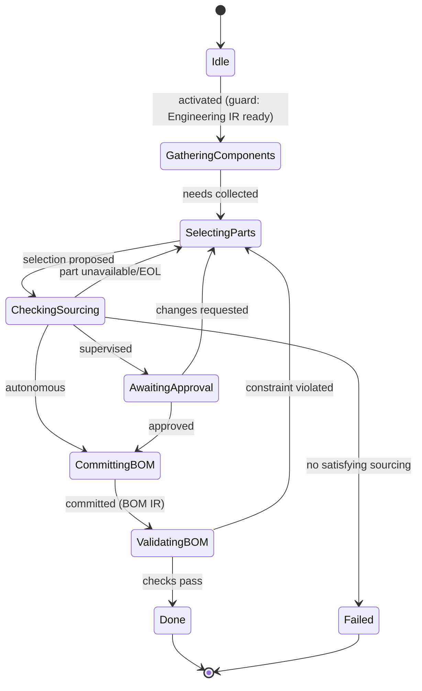

# State Machine — BOM Planning

> **Ring:** Use cases / runtime (inner) — a [State Machine](../GLOSSARY.md#state-machine-fsm) **instance** ([framework](../core/state-machine-framework.md)). This is **Phase 5**: it selects orderable [Parts](../foundation/engineering-domain-model.md#part-manufacturer-part) for the design's [Components](../foundation/engineering-domain-model.md#component) and **produces the [BOM IR](../compiler/ir/bom-ir.md)** — [BOM Line Items](../foundation/engineering-domain-model.md#bom-line-item) with quantities, sourcing, cost, and lifecycle. Driven by the [BOM Agent](../agents/bom-agent.md); uses the [Constraint Engine](../engineering/constraint-engine.md) (cost/availability/compliance constraints) and the [Parts-data port](../core/contracts.md). This doc owns *States · Transitions · Events · Rollback · Recovery · Persistence*; the [agent](../agents/bom-agent.md) owns part-selection reasoning ([anti-duplication](../CONVENTIONS.md)).

## Bindings

| Binding | Value |
|---------|-------|
| Driving agent | [BOM Agent](../agents/bom-agent.md) |
| Engines used | [Constraint Engine](../engineering/constraint-engine.md) |
| Contracts | [Parts-data port](../core/contracts.md) (sourcing) |
| IR | reads [Engineering IR](../compiler/ir/engineering-ir.md) → **produces** [BOM IR](../compiler/ir/bom-ir.md) |
| Upstream | [Datasheet Intelligence](datasheet-intelligence.md) |
| Downstream | [Schematic Planning](schematic-planning.md) |
| Framework | conforms to [state-machine-framework](../core/state-machine-framework.md) |

## States

| State | Kind | Meaning |
|-------|------|---------|
| `Idle` | Initial | Awaits activation after [Datasheet Intelligence](datasheet-intelligence.md). |
| `GatheringComponents` | Normal (Gathering) | Reads the components/candidate-part needs from the [Engineering IR](../compiler/ir/engineering-ir.md) and cost/compliance constraints. |
| `SelectingParts` | Normal (Proposing) | [BOM Agent](../agents/bom-agent.md) selects [Parts](../foundation/engineering-domain-model.md#part-manufacturer-part), using [Knowledge-Graph](../knowledge/knowledge-graph.md) facts and [Parts-data](../core/contracts.md) queries. |
| `CheckingSourcing` | Normal | Resolves availability, lead time, price, lifecycle via the [Parts-data port](../core/contracts.md). **External side effect.** |
| `AwaitingApproval` | Waiting / HITL | Cost/sourcing tradeoffs presented for approval at the [Autonomy Level](../engineering/human-in-the-loop.md). |
| `CommittingBOM` | Normal (Applying) | Persists [BOM Line Items](../foundation/engineering-domain-model.md#bom-line-item) and produces the [BOM IR](../compiler/ir/bom-ir.md). |
| `ValidatingBOM` | Normal (Verifying) | [Constraint Engine](../engineering/constraint-engine.md) checks: every Component has a Part; cost within budget; no EOL part without a [Waiver](../foundation/engineering-domain-model.md#waiver). |
| `Done` | Terminal (success) | BOM IR produced. |
| `Failed` | Terminal (failure) | No constraint-satisfying sourcing exists for a required part. |

## Transitions

| From → To | Guard | Effect (agent / engine) | Events emitted |
|-----------|-------|-------------------------|----------------|
| `Idle → GatheringComponents` | Engineering IR ready | open scope | `PhaseEntered` |
| `GatheringComponents → SelectingParts` | component needs collected | agent selects parts | `ComponentsGathered`, `PartsSelected` |
| `SelectingParts → CheckingSourcing` | selection proposed | query [Parts-data port](../core/contracts.md) | `SourcingRequested` |
| `CheckingSourcing → SelectingParts` | a part unavailable/EOL | re-select alternate | `SourcingIssueFound` |
| `CheckingSourcing → AwaitingApproval` | sourcing OK, autonomy = supervised | present BOM | `ReviewRequested` |
| `CheckingSourcing → CommittingBOM` | sourcing OK, autonomy = autonomous | proceed | — |
| `AwaitingApproval → CommittingBOM` | approved | accept | `BOMApproved` |
| `AwaitingApproval → SelectingParts` | changes requested | re-select | `ChangesRequested` |
| `CommittingBOM → ValidatingBOM` | mutations validated | persist + produce BOM IR | `BOMCommitted`, `BOMIRProduced` |
| `ValidatingBOM → Done` | all checks pass | finalize | `PhaseCompleted` |
| `ValidatingBOM → SelectingParts` | constraint violated (recoverable) | re-select offending lines | `ValidationFailed` |
| `CheckingSourcing → Failed` | no satisfying sourcing exists | abort | `PhaseFailed` |

## Events

- **Consumed:** `PhaseActivated`, `EngineeringIREnriched` (datasheet facts ready), `KnowledgeFactAsserted` (lifecycle), `BOMApproved` / `ChangesRequested`.
- **Emitted:** `PhaseEntered`, `ComponentsGathered`, `PartsSelected`, `SourcingRequested`, `SourcingIssueFound`, `BOMCommitted`, `BOMIRProduced`, `PhaseCompleted`, `PhaseFailed`. `PartSelected` events also re-trigger [Datasheet Intelligence](datasheet-intelligence.md) for any newly chosen part lacking facts.

## Rollback

- **Pre-commit:** an unsourced or rejected selection is dropped before commit; the machine holds in `CheckingSourcing`/`AwaitingApproval`. No BOM Line Item is persisted until validated.
- **Post-commit:** committed BOM Line Items are reversed by a compensating transition recording the re-selection [Decision](../foundation/engineering-domain-model.md#decision), or via [Checkpoint](../core/checkpoint-system.md) restore — because the [Schematic](schematic-planning.md) phase consumes chosen parts ([error-handling](../core/error-handling.md)).

## Recovery

- **Resumable:** `GatheringComponents`, `SelectingParts`, `AwaitingApproval`, `CommittingBOM`, `ValidatingBOM`.
- **Non-resumable:** `CheckingSourcing` — in-flight external sourcing queries are **restarted** after a crash; results are point-in-time, so re-query rather than resume. The recorded query result is what replay uses for [determinism](../core/determinism-and-reproducibility.md).

## Persistence

Position is event-sourced. BOM Line Items persist in [Engineering State](../core/shared-state-model.md); the [BOM IR](../compiler/ir/bom-ir.md) is the serialization downstream phases read. Point-in-time sourcing snapshots (price/availability) are recorded as [Evidence](../foundation/engineering-domain-model.md#evidence) on the selection [Decision](../foundation/engineering-domain-model.md#decision) so the BOM is reproducible even as the market moves.

## Diagram

*Figure: the BOM Planning machine; `CheckingSourcing` reaches the external supply chain and is non-resumable. Viewpoint: the runtime.*

## Failure modes

- **No satisfying sourcing** (every candidate is EOL/over-budget) → `Failed`; orchestrator may loop back to [Constraint Extraction](constraint-extraction.md) to relax a constraint or to [Requirement Planning](requirement-planning.md) for cost.
- **EOL part without waiver** caught in `ValidatingBOM` → re-select; never silently shipped.
- **Sourcing outage** → `CheckingSourcing` retries; the BOM is not produced on fabricated data.

## Related documents

[`agents/bom-agent.md`](../agents/bom-agent.md) · [`compiler/ir/bom-ir.md`](../compiler/ir/bom-ir.md) · [`engineering/constraint-engine.md`](../engineering/constraint-engine.md) · [`integration/supply-chain-and-parts-data.md`](../integration/supply-chain-and-parts-data.md) · [`state-machines/datasheet-intelligence.md`](datasheet-intelligence.md) · [`state-machines/schematic-planning.md`](schematic-planning.md) · [`state-machines/README.md`](README.md)
