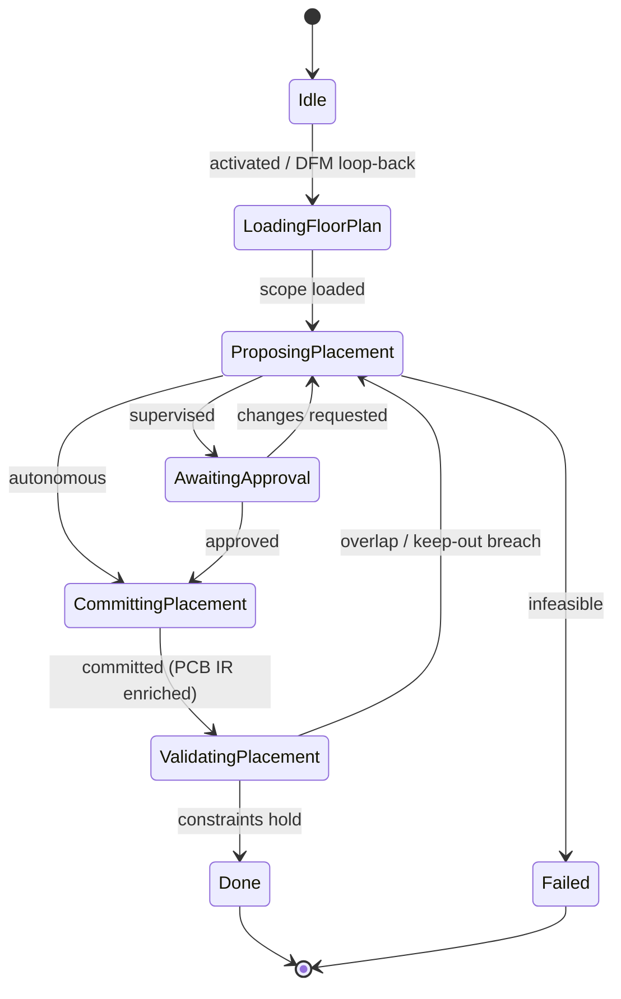

# State Machine — Component Placement

> **Ring:** Use cases / runtime (inner) — a [State Machine](../GLOSSARY.md#state-machine-fsm) **instance** ([framework](../core/state-machine-framework.md)). This is **Phase 9**: it decides each [Component's](../foundation/engineering-domain-model.md#component) [Placement](../foundation/engineering-domain-model.md#placement) — position, rotation, and side — within the floor-planned regions, and **enriches the [PCB IR](../compiler/ir/pcb-ir.md)**. Driven by the [Placement Agent](../agents/placement-agent.md) (its second phase); uses the [Constraint Engine](../engineering/constraint-engine.md). On a [DFM](dfm-verification.md) failure, the [orchestrator](../core/workflow-orchestration.md) loops **back to this phase**. This doc owns *States · Transitions · Events · Rollback · Recovery · Persistence*; the [agent](../agents/placement-agent.md) owns placement reasoning ([anti-duplication](../CONVENTIONS.md)).

## Bindings

| Binding | Value |
|---------|-------|
| Driving agent | [Placement Agent](../agents/placement-agent.md) |
| Engines used | [Constraint Engine](../engineering/constraint-engine.md) |
| IR | **enriches** [PCB IR](../compiler/ir/pcb-ir.md) with [Placement](../foundation/engineering-domain-model.md#placement) |
| Upstream | [PCB Floor Planning](pcb-floor-planning.md) |
| Downstream | [Routing Planning](routing-planning.md) |
| Loop-back target | receives **↺** from [DFM Verification](dfm-verification.md) |
| Framework | conforms to [state-machine-framework](../core/state-machine-framework.md) |

## States

| State | Kind | Meaning |
|-------|------|---------|
| `Idle` | Initial | Awaits activation; also re-activated on a [DFM](dfm-verification.md) loop-back. |
| `LoadingFloorPlan` | Normal (Gathering) | Reads the [PCB IR](../compiler/ir/pcb-ir.md): regions, components, [Footprints](../foundation/engineering-domain-model.md#footprint), and placement constraints (keep-outs, thermal, clearance). |
| `ProposingPlacement` | Normal (Proposing) | [Placement Agent](../agents/placement-agent.md) proposes X/Y, rotation, and side for each Component within its block's region. |
| `AwaitingApproval` | Waiting / HITL | Placement presented for approval at the [Autonomy Level](../engineering/human-in-the-loop.md). |
| `CommittingPlacement` | Normal (Applying) | Persists [Placement](../foundation/engineering-domain-model.md#placement) entities and enriches the [PCB IR](../compiler/ir/pcb-ir.md). |
| `ValidatingPlacement` | Normal (Verifying) | [Constraint Engine](../engineering/constraint-engine.md) checks: courtyards do not overlap; placements stay inside their region; keep-out and thermal constraints hold. |
| `Done` | Terminal (success) | PCB IR enriched with placement. |
| `Failed` | Terminal (failure) | No placement satisfies the region/keep-out constraints. |

## Transitions

| From → To | Guard | Effect (agent / engine) | Events emitted |
|-----------|-------|-------------------------|----------------|
| `Idle → LoadingFloorPlan` | PCB IR with regions ready | open scope | `PhaseEntered` |
| `LoadingFloorPlan → ProposingPlacement` | scope loaded | agent proposes placement | `FloorPlanLoaded`, `PlacementProposed` |
| `ProposingPlacement → AwaitingApproval` | autonomy = supervised | present | `ReviewRequested` |
| `ProposingPlacement → CommittingPlacement` | autonomy = autonomous | proceed | — |
| `AwaitingApproval → CommittingPlacement` | approved | accept | `PlacementApproved` |
| `AwaitingApproval → ProposingPlacement` | changes requested | re-propose | `ChangesRequested` |
| `CommittingPlacement → ValidatingPlacement` | mutations validated | persist + enrich PCB IR | `PlacementCommitted`, `PCBIREnriched` |
| `ValidatingPlacement → Done` | constraints hold | finalize | `PhaseCompleted` |
| `ValidatingPlacement → ProposingPlacement` | overlap / keep-out breach (recoverable) | re-propose offenders | `ValidationFailed` |
| `ProposingPlacement → Failed` | infeasible within regions | abort | `PhaseFailed` |

## Events

- **Consumed:** `PhaseActivated`, `PCBIRProduced` (floor plan ready), `DFMFailed` (loop-back re-activation), `PlacementApproved` / `ChangesRequested`.
- **Emitted:** `PhaseEntered`, `FloorPlanLoaded`, `PlacementProposed`, `PlacementCommitted`, `PCBIREnriched`, `ValidationFailed`, `PhaseCompleted`, `PhaseFailed`. `PCBIREnriched` activates [Routing Planning](routing-planning.md).

## Rollback

- **Pre-commit:** a rejected or constraint-breaching placement is dropped before commit; the machine holds in `ProposingPlacement`/`AwaitingApproval`.
- **Post-commit:** committed placements are reversed by a compensating transition recording the [Decision](../foundation/engineering-domain-model.md#decision), or via [Checkpoint](../core/checkpoint-system.md) restore. On a [DFM](dfm-verification.md) loop-back, the machine *edits* existing placement (locked components stay fixed); the prior commit remains in history.

## Recovery

- **Resumable:** all states; rebuilt by event replay from the last [Checkpoint](../core/checkpoint-system.md). An uncommitted placement proposal is re-derived from recorded reasoning outputs.
- **Non-resumable:** none (no external side effects).

## Persistence

Position is event-sourced. [Placement](../foundation/engineering-domain-model.md#placement) entities (with `locked` flags) persist in [Engineering State](../core/shared-state-model.md); the enriched [PCB IR](../compiler/ir/pcb-ir.md) is the serialization [Routing Planning](routing-planning.md), [DRC](drc-verification.md), and [DFM](dfm-verification.md) read.

## Diagram

*Figure: the Component Placement machine; it is the loop-back target for [DFM](dfm-verification.md) failures. Viewpoint: the runtime.*

## Failure modes

- **Infeasible placement** → `Failed`; orchestrator may loop back to [PCB Floor Planning](pcb-floor-planning.md) to re-region.
- **Courtyard overlap / keep-out breach** caught in `ValidatingPlacement` → re-propose; a broken placement never reaches routing.
- **DFM loop-back** is the dominant re-entry: [DFM](dfm-verification.md)'s `Failed` is routed here to fix manufacturability at its placement root.

## Related documents

[`agents/placement-agent.md`](../agents/placement-agent.md) · [`compiler/ir/pcb-ir.md`](../compiler/ir/pcb-ir.md) · [`engineering/constraint-engine.md`](../engineering/constraint-engine.md) · [`state-machines/pcb-floor-planning.md`](pcb-floor-planning.md) · [`state-machines/routing-planning.md`](routing-planning.md) · [`state-machines/dfm-verification.md`](dfm-verification.md) · [`state-machines/README.md`](README.md)
