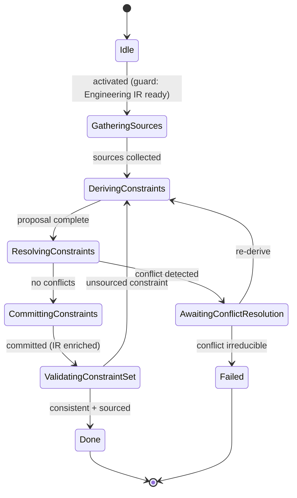

# State Machine — Constraint Extraction

> **Ring:** Use cases / runtime (inner) — a [State Machine](../GLOSSARY.md#state-machine-fsm) **instance** ([framework](../core/state-machine-framework.md)). This is **Phase 3**: it derives machine-checkable [Constraints](../foundation/engineering-domain-model.md#constraint) from [Requirements](../foundation/engineering-domain-model.md#requirement), [standards](../engineering/standards-and-compliance.md), parts, and process, and **enriches the [Engineering IR](../compiler/ir/engineering-ir.md)** with them. Driven by the [Planning Agent](../agents/planning-agent.md) (its second phase); the [Constraint Engine](../engineering/constraint-engine.md) stores, resolves, and checks the constraints. Distinguish *Constraint Extraction* (this phase, which derives) from the *Constraint Engine* (the service). This doc owns *States · Transitions · Events · Rollback · Recovery · Persistence*; the [agent](../agents/planning-agent.md) owns reasoning ([anti-duplication](../CONVENTIONS.md)).

## Bindings

| Binding | Value |
|---------|-------|
| Driving agent | [Planning Agent](../agents/planning-agent.md) |
| Engines used | [Constraint Engine](../engineering/constraint-engine.md) |
| IR | **enriches** [Engineering IR](../compiler/ir/engineering-ir.md) with [Constraints](../foundation/engineering-domain-model.md#constraint) |
| Upstream | [Engineering Analysis](engineering-analysis.md) |
| Downstream | [Datasheet Intelligence](datasheet-intelligence.md) |
| Framework | conforms to [state-machine-framework](../core/state-machine-framework.md) |

## States

| State | Kind | Meaning |
|-------|------|---------|
| `Idle` | Initial | Awaits activation after [Engineering Analysis](engineering-analysis.md). |
| `GatheringSources` | Normal (Gathering) | Collects constraint sources: requirements, applicable [standards](../engineering/standards-and-compliance.md), selected parts' limits, process rules. |
| `DerivingConstraints` | Normal (Proposing) | [Planning Agent](../agents/planning-agent.md) proposes typed [Constraints](../foundation/engineering-domain-model.md#constraint) (clearance, voltage/current limit, impedance, thermal, keep-out, compliance) with [Physical-Quantity](../engineering/units-and-quantities.md) bounds. |
| `ResolvingConstraints` | Normal | [Constraint Engine](../engineering/constraint-engine.md) normalizes and resolves the set, detecting conflicts and unsatisfiable combinations. |
| `AwaitingConflictResolution` | Waiting / HITL | Conflicting or over-tight constraints need human disposition at the [Autonomy Level](../engineering/human-in-the-loop.md). |
| `CommittingConstraints` | Normal (Applying) | Persists resolved Constraints and enriches the [Engineering IR](../compiler/ir/engineering-ir.md). |
| `ValidatingConstraintSet` | Normal (Verifying) | Confirms the resolved set is internally consistent and that each constraint traces to a source. |
| `Done` | Terminal (success) | Engineering IR enriched with a consistent constraint set. |
| `Failed` | Terminal (failure) | An irreducible constraint conflict makes the design infeasible. |

## Transitions

| From → To | Guard | Effect (agent / engine) | Events emitted |
|-----------|-------|-------------------------|----------------|
| `Idle → GatheringSources` | Engineering IR ready | open scope | `PhaseEntered` |
| `GatheringSources → DerivingConstraints` | sources collected | agent derives constraints | `SourcesGathered`, `ConstraintsProposed` |
| `DerivingConstraints → ResolvingConstraints` | proposal complete | [Constraint Engine](../engineering/constraint-engine.md) resolves | `ConstraintsResolved` |
| `ResolvingConstraints → AwaitingConflictResolution` | conflict / unsatisfiable detected | surface conflict | `ConstraintConflictDetected` |
| `AwaitingConflictResolution → DerivingConstraints` | disposition: re-derive | apply human guidance | `ConflictDisposed` |
| `ResolvingConstraints → CommittingConstraints` | no conflicts (or all disposed) | proceed | — |
| `CommittingConstraints → ValidatingConstraintSet` | mutations validated | persist + enrich Engineering IR | `ConstraintsCommitted`, `EngineeringIREnriched` |
| `ValidatingConstraintSet → Done` | set consistent + sourced | finalize | `PhaseCompleted` |
| `ValidatingConstraintSet → DerivingConstraints` | a constraint lacks a source (recoverable) | re-derive | `ValidationFailed` |
| `AwaitingConflictResolution → Failed` | conflict irreducible | abort | `PhaseFailed` |

## Events

- **Consumed:** `PhaseActivated`, `EngineeringIRProduced`, `ConflictDisposed` / `ApprovalGranted` (from [HITL](../engineering/human-in-the-loop.md)), and `KnowledgeFactAsserted` if [Datasheet Intelligence](datasheet-intelligence.md) facts arrive that tighten a limit.
- **Emitted:** `PhaseEntered`, `SourcesGathered`, `ConstraintsProposed`, `ConstraintsResolved`, `ConstraintConflictDetected`, `ConstraintsCommitted`, `EngineeringIREnriched`, `PhaseCompleted`, `PhaseFailed`.

## Rollback

- **Pre-commit:** a rejected or unresolved constraint set is abandoned before commit; the machine holds in `ResolvingConstraints`/`AwaitingConflictResolution`. Nothing reaches the [Engineering IR](../compiler/ir/engineering-ir.md) until resolution succeeds.
- **Post-commit:** committed Constraints are reversed by a compensating transition (the [Constraint Engine](../engineering/constraint-engine.md) marks them superseded) or via [Checkpoint](../core/checkpoint-system.md) restore. Constraints are referenced by many later phases, so reversal records a [Decision](../foundation/engineering-domain-model.md#decision) explaining the change ([error-handling](../core/error-handling.md)).

## Recovery

- **Resumable:** all states; rebuilt by event replay from the last [Checkpoint](../core/checkpoint-system.md). Constraint resolution is deterministic, so re-resolving from the persisted source set yields the same result.
- **Non-resumable:** none.

## Persistence

Position is event-sourced. The resolved constraint set persists in [Engineering State](../core/shared-state-model.md) under the [Constraint Engine's](../engineering/constraint-engine.md) management; the enriched [Engineering IR](../compiler/ir/engineering-ir.md) is the serialization later phases ([BOM](bom-planning.md), [Schematic](schematic-planning.md), placement/routing) read for their constraint checks.

## Diagram

*Figure: the Constraint Extraction machine; the [Constraint Engine](../engineering/constraint-engine.md) does the resolving, this phase decides the deriving. Viewpoint: the runtime.*

## Failure modes

- **Irreducible conflict** (two requirements impose contradictory bounds) → `Failed`; typically loops the workflow back to [Requirement Planning](requirement-planning.md) via the orchestrator.
- **Unsourced constraint** caught in validation → loops to re-derive (every constraint must trace to a source for [provenance](../core/provenance-and-traceability.md)).
- **Indeterminate bound** (missing datasheet limit) is left open and re-checked when [Datasheet Intelligence](datasheet-intelligence.md) supplies the fact.

## Related documents

[`agents/planning-agent.md`](../agents/planning-agent.md) · [`engineering/constraint-engine.md`](../engineering/constraint-engine.md) · [`engineering/standards-and-compliance.md`](../engineering/standards-and-compliance.md) · [`engineering/units-and-quantities.md`](../engineering/units-and-quantities.md) · [`compiler/ir/engineering-ir.md`](../compiler/ir/engineering-ir.md) · [`state-machines/datasheet-intelligence.md`](datasheet-intelligence.md) · [`state-machines/README.md`](README.md)
