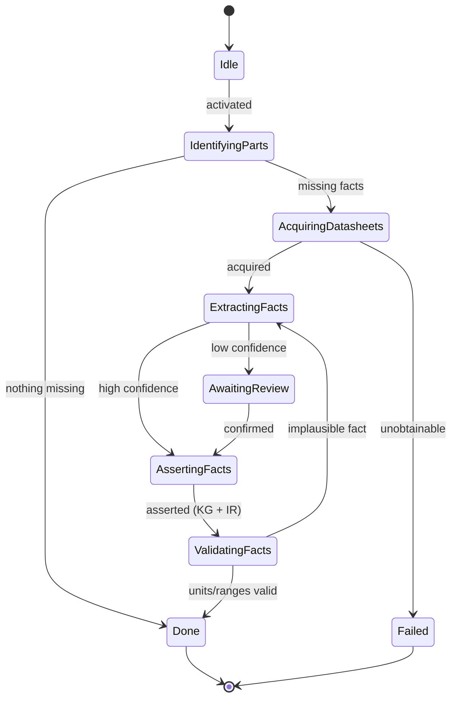

# State Machine — Datasheet Intelligence

> **Ring:** Use cases / runtime (inner) — a [State Machine](../GLOSSARY.md#state-machine-fsm) **instance** ([framework](../core/state-machine-framework.md)). This is **Phase 4**: it extracts structured engineering facts (parameters, pinouts, absolute-maximum limits, lifecycle) from component datasheets into the [Knowledge Graph](../knowledge/knowledge-graph.md), and **enriches the [Engineering IR](../compiler/ir/engineering-ir.md)** with those facts. Driven by the [Datasheet Agent](../agents/datasheet-agent.md); it uses **no [Engine](../GLOSSARY.md#engine)** — instead it *feeds the [Knowledge Graph](../knowledge/knowledge-graph.md)* via the [Knowledge port](../core/contracts.md) and fetches documents via the [Parts-data port](../core/contracts.md). This doc owns *States · Transitions · Events · Rollback · Recovery · Persistence*; the [agent](../agents/datasheet-agent.md) owns extraction reasoning ([anti-duplication](../CONVENTIONS.md)).

## Bindings

| Binding | Value |
|---------|-------|
| Driving agent | [Datasheet Agent](../agents/datasheet-agent.md) |
| Engines used | — (feeds the [Knowledge Graph](../knowledge/knowledge-graph.md)) |
| Contracts | [Parts-data port](../core/contracts.md) (acquire), [Knowledge port](../core/contracts.md) (assert) |
| IR | **enriches** [Engineering IR](../compiler/ir/engineering-ir.md) with [Part](../foundation/engineering-domain-model.md#part-manufacturer-part) facts |
| Upstream | [Constraint Extraction](constraint-extraction.md) |
| Downstream | [BOM Planning](bom-planning.md) |
| Framework | conforms to [state-machine-framework](../core/state-machine-framework.md) |

## States

| State | Kind | Meaning |
|-------|------|---------|
| `Idle` | Initial | Awaits activation; may also be re-triggered on demand when a new [Part](../foundation/engineering-domain-model.md#part-manufacturer-part) is referenced. |
| `IdentifyingParts` | Normal (Gathering) | Determines which Components/candidate Parts need datasheet facts not already in the [Knowledge Graph](../knowledge/knowledge-graph.md). |
| `AcquiringDatasheets` | Normal (Gathering) | Fetches datasheet documents via the [Parts-data port](../core/contracts.md). **Has an external side effect.** |
| `ExtractingFacts` | Normal (Proposing) | [Datasheet Agent](../agents/datasheet-agent.md) extracts typed parameters, pinouts, and limits, each with a confidence and a source reference. |
| `AwaitingReview` | Waiting / HITL | Low-confidence extractions are held for human confirmation at the [Autonomy Level](../engineering/human-in-the-loop.md). |
| `AssertingFacts` | Normal (Applying) | Asserts facts and [Evidence](../foundation/engineering-domain-model.md#evidence) into the [Knowledge Graph](../knowledge/knowledge-graph.md) and enriches the [Engineering IR](../compiler/ir/engineering-ir.md). |
| `ValidatingFacts` | Normal (Verifying) | Cross-checks units/ranges (a limit must be dimensionally valid and within plausible bounds) before they harden constraints. |
| `Done` | Terminal (success) | Facts asserted; Engineering IR enriched. |
| `Failed` | Terminal (failure) | Required datasheets unobtainable or unparseable for a part with no alternate. |

## Transitions

| From → To | Guard | Effect (agent / contract) | Events emitted |
|-----------|-------|---------------------------|----------------|
| `Idle → IdentifyingParts` | activated / new part referenced | open scope | `PhaseEntered` |
| `IdentifyingParts → AcquiringDatasheets` | parts with missing facts exist | fetch via [Parts-data port](../core/contracts.md) | `PartsIdentified`, `DatasheetRequested` |
| `IdentifyingParts → Done` | nothing missing | short-circuit | `PhaseCompleted` |
| `AcquiringDatasheets → ExtractingFacts` | document(s) acquired | [Datasheet Agent](../agents/datasheet-agent.md) extracts facts | `DatasheetAcquired`, `FactsExtracted` |
| `ExtractingFacts → AwaitingReview` | any extraction below confidence threshold | hold for review | `ReviewRequested` |
| `ExtractingFacts → AssertingFacts` | all extractions high-confidence | proceed | — |
| `AwaitingReview → AssertingFacts` | confirmed/corrected | accept | `ExtractionConfirmed` |
| `AssertingFacts → ValidatingFacts` | mutations validated | assert to [Knowledge Graph](../knowledge/knowledge-graph.md) + enrich IR | `KnowledgeFactAsserted`, `EngineeringIREnriched` |
| `ValidatingFacts → Done` | units/ranges valid | finalize | `PhaseCompleted` |
| `ValidatingFacts → ExtractingFacts` | dimensional/implausible fact (recoverable) | re-extract | `ValidationFailed` |
| `AcquiringDatasheets → Failed` | unobtainable, no alternate part | abort | `PhaseFailed` |

## Events

- **Consumed:** `PhaseActivated`, `PartSelected` / `ComponentCreated` (which parts need facts), `ExtractionConfirmed` (from [HITL](../engineering/human-in-the-loop.md)).
- **Emitted:** `PhaseEntered`, `PartsIdentified`, `DatasheetRequested`, `DatasheetAcquired`, `FactsExtracted`, `KnowledgeFactAsserted`, `EngineeringIREnriched`, `PhaseCompleted`, `PhaseFailed`. `KnowledgeFactAsserted` is consumed by [Constraint Extraction](constraint-extraction.md) (limits) and [BOM Planning](bom-planning.md) (lifecycle).

## Rollback

- **Pre-commit:** an extraction not yet asserted is dropped; the machine stays in `ExtractingFacts`/`AwaitingReview`. The acquired document itself is a cached input, not engineering state.
- **Post-commit:** asserted facts are reversed by retracting them from the [Knowledge Graph](../knowledge/knowledge-graph.md) with a compensating assertion (provenance preserved), or via [Checkpoint](../core/checkpoint-system.md) restore. Because constraints may already build on a fact, retraction records a [Decision](../foundation/engineering-domain-model.md#decision).

## Recovery

- **Resumable:** `IdentifyingParts`, `ExtractingFacts`, `AwaitingReview`, `AssertingFacts`, `ValidatingFacts`.
- **Non-resumable:** `AcquiringDatasheets` — an in-flight external fetch ([Parts-data port](../core/contracts.md)) is **restarted** after a crash rather than resumed mid-call ([P4](../foundation/principles.md)); the fetch is idempotent on the part identifier.

## Persistence

Position is event-sourced. Extracted facts persist in the [Knowledge Graph](../knowledge/knowledge-graph.md) (via the [Knowledge port](../core/contracts.md)) with [Evidence](../foundation/engineering-domain-model.md#evidence) linking each fact to its datasheet source; the [Engineering IR](../compiler/ir/engineering-ir.md) carries the projection used by downstream phases. Acquired datasheet documents are cached as [Artifacts](../GLOSSARY.md#artifact-store), not as engineering knowledge.

## Diagram

*Figure: the Datasheet Intelligence machine; `AcquiringDatasheets` is the only externally side-effecting (non-resumable) state. Viewpoint: the runtime.*

## Failure modes

- **Datasheet unobtainable / unparseable** with no alternate part → `Failed`; orchestrator surfaces it (often loops back to [BOM Planning](bom-planning.md) to choose an alternate).
- **Implausible extracted limit** caught in validation → re-extract; never asserted as fact.
- **External fetch outage** ([Parts-data port](../core/contracts.md)) degrades to indeterminate and retries; facts are not fabricated ([P3](../foundation/principles.md)).

## Related documents

[`agents/datasheet-agent.md`](../agents/datasheet-agent.md) · [`knowledge/knowledge-graph.md`](../knowledge/knowledge-graph.md) · [`integration/supply-chain-and-parts-data.md`](../integration/supply-chain-and-parts-data.md) · [`compiler/ir/engineering-ir.md`](../compiler/ir/engineering-ir.md) · [`engineering/units-and-quantities.md`](../engineering/units-and-quantities.md) · [`state-machines/bom-planning.md`](bom-planning.md) · [`state-machines/README.md`](README.md)
