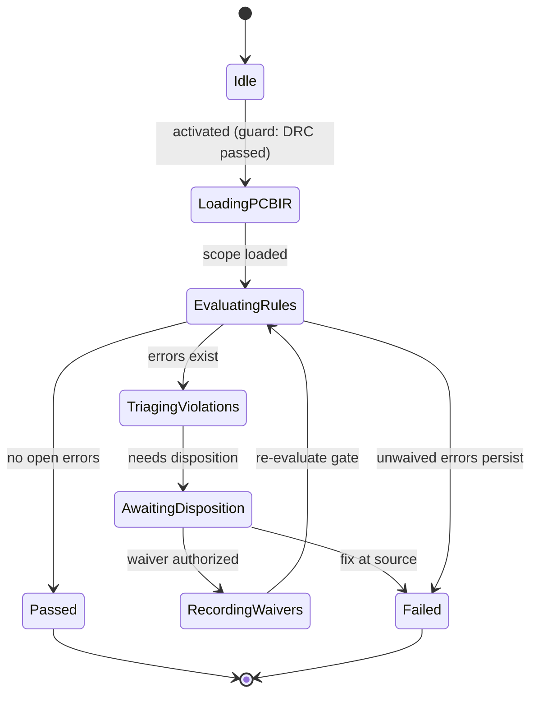

# State Machine — DFM Verification

> **Ring:** Use cases / runtime (inner) — a [State Machine](../GLOSSARY.md#state-machine-fsm) **instance** ([framework](../core/state-machine-framework.md)). This is **Phase 12**: it runs the **Design For Manufacturability** check over the [PCB IR](../compiler/ir/pcb-ir.md) — a fab-process specialization of the generic [Verification Engine](../engineering/verification-engine.md) [Rule → Violation → Waiver](../engineering/verification-engine.md#3-the-generic-rule--violation--waiver-lifecycle) lifecycle. Driven by the [DFM Agent](../agents/dfm-agent.md). On unwaived error, its `Failed` terminal is routed by the [orchestrator](../core/workflow-orchestration.md) **back to [Component Placement](component-placement.md)** (manufacturability defects are usually placement-driven). This doc owns *States · Transitions · Events · Rollback · Recovery · Persistence*; the [agent](../agents/dfm-agent.md) owns reasoning ([anti-duplication](../CONVENTIONS.md)).

## Bindings

| Binding | Value |
|---------|-------|
| Driving agent | [DFM Agent](../agents/dfm-agent.md) |
| Engines used | [Verification Engine](../engineering/verification-engine.md) (manufacturability rule set) |
| IR | **checks** [PCB IR](../compiler/ir/pcb-ir.md) (writes [Violations](../foundation/engineering-domain-model.md#violation)/[Waivers](../foundation/engineering-domain-model.md#waiver)) |
| Upstream | [DRC Verification](drc-verification.md) (pass) |
| Downstream (pass) | [EMC Analysis](emc-analysis.md) |
| Loop-back (fail) | **↺ [Component Placement](component-placement.md)** |
| Framework | conforms to [state-machine-framework](../core/state-machine-framework.md) |

## States

| State | Kind | Meaning |
|-------|------|---------|
| `Idle` | Initial | Awaits activation after [DRC](drc-verification.md) passes. |
| `LoadingPCBIR` | Normal (Gathering) | Reads the physical-domain scope against fab-process limits ([standards](../engineering/standards-and-compliance.md), IPC classes, assembly rules). |
| `EvaluatingRules` | Normal (Working) | [Verification Engine](../engineering/verification-engine.md) evaluates manufacturability rules (acid traps, solder-mask slivers, component spacing for assembly, panelization) and creates/deduplicates [Violations](../foundation/engineering-domain-model.md#violation). |
| `TriagingViolations` | Normal (Reviewing) | [DFM Agent](../agents/dfm-agent.md) explains violations and suggests fixes (severity/gating remain deterministic). |
| `AwaitingDisposition` | Waiting / HITL | Engineer adjusts the design, or authorizes [Waivers](../foundation/engineering-domain-model.md#waiver) at the [Autonomy Level](../engineering/human-in-the-loop.md). |
| `RecordingWaivers` | Normal (Applying) | Persists authorized waivers with rationale, scope, expiry, and [provenance](../core/provenance-and-traceability.md). |
| `Passed` | Terminal (success) | No open error-severity violations; orchestrator advances to [EMC Analysis](emc-analysis.md). |
| `Failed` | Terminal (failure) | Open error-severity violations remain → orchestrator loops back to [Component Placement](component-placement.md). |

## Transitions

| From → To | Guard | Effect (agent / engine) | Events emitted |
|-----------|-------|-------------------------|----------------|
| `Idle → LoadingPCBIR` | DRC passed, PCB IR present | open scope | `PhaseEntered` |
| `LoadingPCBIR → EvaluatingRules` | scope loaded | [Verification Engine](../engineering/verification-engine.md) runs rule set | `DFMRunStarted` |
| `EvaluatingRules → Passed` | no open error violations | finalize | `ViolationsRecorded`, `DFMPassed`, `PhaseCompleted` |
| `EvaluatingRules → TriagingViolations` | error violations exist | agent triages | `ViolationsRecorded` |
| `TriagingViolations → AwaitingDisposition` | needs human disposition | present | `DispositionRequested` |
| `AwaitingDisposition → RecordingWaivers` | waiver(s) authorized | record waivers | `ViolationWaived` |
| `AwaitingDisposition → Failed` | engineer chooses to fix at source | abort phase | `DFMFailed`, `PhaseFailed` |
| `RecordingWaivers → EvaluatingRules` | waivers recorded | re-evaluate gate | `DFMReRun` |
| `EvaluatingRules → Failed` | unwaived errors persist after re-run | abort phase | `DFMFailed`, `PhaseFailed` |

## Events

- **Consumed:** `PhaseActivated`, `DRCPassed`, `WaiverAuthorized` / `FixRequested` (from [HITL](../engineering/human-in-the-loop.md)).
- **Emitted:** `PhaseEntered`, `DFMRunStarted`, `ViolationsRecorded`, `ViolationWaived`, `DFMReRun`, `DFMPassed`, `DFMFailed`, `PhaseCompleted`, `PhaseFailed`. `DFMFailed` is the **loop-back signal** the [orchestrator](../core/workflow-orchestration.md) routes to [Component Placement](component-placement.md); `DFMPassed` advances the workflow.

## Rollback

- **Pre-commit:** read-mostly; only Violation status and Waivers mutate. A waiver failing authorization is abandoned before commit — the violation stays open.
- **Post-commit:** a recorded waiver is reversed by a compensating transition (the [Verification Engine](../engineering/verification-engine.md) reverts the covered violation to *Open*); the audit trail is preserved. Violations are evaluation facts, never deleted.

## Recovery

- **Resumable:** `LoadingPCBIR`, `TriagingViolations`, `AwaitingDisposition`, `RecordingWaivers` — rebuilt by event replay from the last [Checkpoint](../core/checkpoint-system.md).
- **Non-resumable:** `EvaluatingRules` — a crashed evaluation is **re-run** from a clean read of the [PCB IR](../compiler/ir/pcb-ir.md); evaluation is deterministic and idempotent ([P4](../foundation/principles.md)).

## Persistence

Position is event-sourced. Each evaluation run, its inputs, the resulting [Violations](../foundation/engineering-domain-model.md#violation), and any [Waivers](../foundation/engineering-domain-model.md#waiver) persist in [Engineering State](../core/shared-state-model.md). The manufacturing gate result is a pure function of the persisted violation set across **all** rule-check phases (ERC/DRC/DFM).

## Diagram

*Figure: the DFM Verification machine. `Failed` is an outcome the [orchestrator](../core/workflow-orchestration.md) turns into a loop-back to [Component Placement](component-placement.md). Viewpoint: the runtime.*

## Failure modes

- **Unwaived manufacturability errors** → `Failed` → loop-back to [Component Placement](component-placement.md) ([P7](../foundation/principles.md)).
- **Indeterminate rule** (unknown fab-process limit) is treated as *not passable*; the design is not falsely passed.
- **Expired/out-of-scope waiver** re-arms its covered violation, re-blocking the gate.

## Related documents

[`agents/dfm-agent.md`](../agents/dfm-agent.md) · [`engineering/verification-engine.md`](../engineering/verification-engine.md) · [`engineering/standards-and-compliance.md`](../engineering/standards-and-compliance.md) · [`compiler/ir/pcb-ir.md`](../compiler/ir/pcb-ir.md) · [`state-machines/drc-verification.md`](drc-verification.md) · [`state-machines/component-placement.md`](component-placement.md) · [`state-machines/emc-analysis.md`](emc-analysis.md) · [`state-machines/README.md`](README.md)
