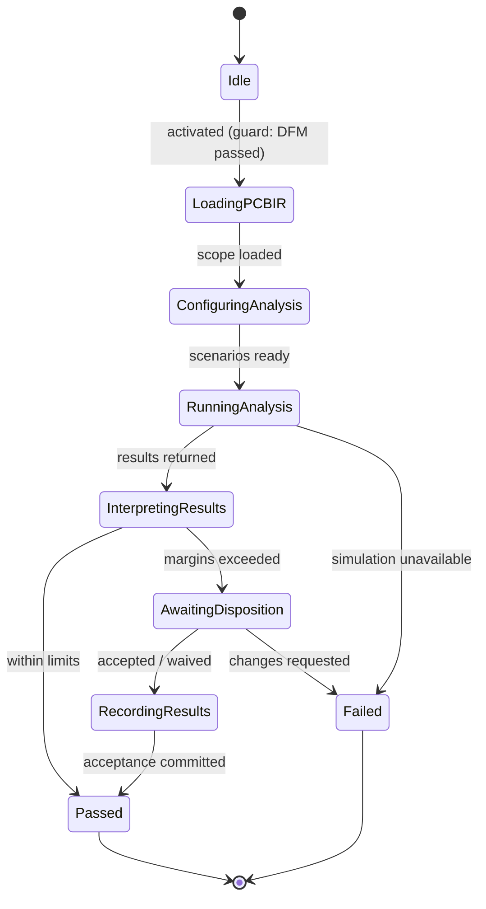

# State Machine — EMC Analysis

> **Ring:** Use cases / runtime (inner) — a [State Machine](../GLOSSARY.md#state-machine-fsm) **instance** ([framework](../core/state-machine-framework.md)). This is **Phase 13**: it analyzes the [PCB IR](../compiler/ir/pcb-ir.md) for **Electromagnetic Compatibility**. Unlike ERC/DRC/DFM, EMC is **analysis, not pass/fail rule-checking** — it produces [Analysis Results](../foundation/engineering-domain-model.md#analysis-result) (interpreted datasets) via the [Simulation port](../core/contracts.md), using the [Verification Engine](../engineering/verification-engine.md) in its analysis mode to compare results against EMC limits. Driven by the [EMC Agent](../agents/emc-agent.md). When results exceed limits, its `Failed` terminal is routed by the [orchestrator](../core/workflow-orchestration.md) **back to [Routing Planning](routing-planning.md)**. This doc owns *States · Transitions · Events · Rollback · Recovery · Persistence*; the [agent](../agents/emc-agent.md) owns interpretation reasoning ([anti-duplication](../CONVENTIONS.md)).

## Bindings

| Binding | Value |
|---------|-------|
| Driving agent | [EMC Agent](../agents/emc-agent.md) |
| Engines used | [Verification Engine](../engineering/verification-engine.md) (analysis mode) |
| Contracts | [Simulation port](../core/contracts.md) (external EMC/SI/PI analysis) |
| IR | **analyzes** [PCB IR](../compiler/ir/pcb-ir.md) → produces [Analysis Results](../foundation/engineering-domain-model.md#analysis-result) (no IR mutation) |
| Upstream | [DFM Verification](dfm-verification.md) (pass) |
| Downstream (pass) | [Manufacturing Generation](manufacturing-generation.md) |
| Loop-back (fail) | **↺ [Routing Planning](routing-planning.md)** |
| Framework | conforms to [state-machine-framework](../core/state-machine-framework.md) |

## States

| State | Kind | Meaning |
|-------|------|---------|
| `Idle` | Initial | Awaits activation after [DFM](dfm-verification.md) passes. |
| `LoadingPCBIR` | Normal (Gathering) | Reads the routed [PCB IR](../compiler/ir/pcb-ir.md), stack-up, net classes, and applicable EMC [standards](../engineering/standards-and-compliance.md)/limits. |
| `ConfiguringAnalysis` | Normal (Gathering) | Sets up the analysis scenarios (frequency ranges, ports, scenarios) for the [Simulation port](../core/contracts.md). |
| `RunningAnalysis` | Normal (Working) | Invokes external EMC/SI/PI simulation via the [Simulation port](../core/contracts.md). **Has an external side effect; long-running.** |
| `InterpretingResults` | Normal (Reviewing) | [EMC Agent](../agents/emc-agent.md) interprets the [Analysis Results](../foundation/engineering-domain-model.md#analysis-result) against EMC limits, with margins and confidence. |
| `AwaitingDisposition` | Waiting / HITL | Engineer accepts margins, records a [Waiver](../foundation/engineering-domain-model.md#waiver), or requests changes at the [Autonomy Level](../engineering/human-in-the-loop.md). |
| `RecordingResults` | Normal (Applying) | Persists the Analysis Result and the accepting/justifying [Decision](../foundation/engineering-domain-model.md#decision) + [Evidence](../foundation/engineering-domain-model.md#evidence). |
| `Passed` | Terminal (success) | Within EMC limits (or accepted margins); orchestrator advances to [Manufacturing Generation](manufacturing-generation.md). |
| `Failed` | Terminal (failure) | Results exceed limits and are not accepted → orchestrator loops back to [Routing Planning](routing-planning.md). |

## Transitions

| From → To | Guard | Effect (agent / contract) | Events emitted |
|-----------|-------|---------------------------|----------------|
| `Idle → LoadingPCBIR` | DFM passed, PCB IR present | open scope | `PhaseEntered` |
| `LoadingPCBIR → ConfiguringAnalysis` | scope loaded | prepare scenarios | `PCBIRLoaded` |
| `ConfiguringAnalysis → RunningAnalysis` | scenarios ready | invoke [Simulation port](../core/contracts.md) | `EMCAnalysisStarted` |
| `RunningAnalysis → InterpretingResults` | results returned | agent interprets vs. limits | `AnalysisResultsReturned` |
| `RunningAnalysis → Failed` | simulation unavailable / indeterminate | abort (not falsely passed) | `EMCIndeterminate`, `PhaseFailed` |
| `InterpretingResults → Passed` | within limits | finalize | `EMCPassed`, `PhaseCompleted` |
| `InterpretingResults → AwaitingDisposition` | margins exceeded | present | `DispositionRequested` |
| `AwaitingDisposition → RecordingResults` | margins accepted / waiver authorized | record acceptance | `AnalysisAccepted` |
| `AwaitingDisposition → Failed` | changes requested | abort phase | `EMCFailed`, `PhaseFailed` |
| `RecordingResults → Passed` | acceptance committed | finalize | `EMCPassed`, `PhaseCompleted` |

## Events

- **Consumed:** `PhaseActivated`, `DFMPassed`, `AnalysisAccepted` / `ChangesRequested` (from [HITL](../engineering/human-in-the-loop.md)).
- **Emitted:** `PhaseEntered`, `PCBIRLoaded`, `EMCAnalysisStarted`, `AnalysisResultsReturned`, `EMCIndeterminate`, `EMCPassed`, `EMCFailed`, `PhaseCompleted`, `PhaseFailed`. `EMCFailed` is the **loop-back signal** the [orchestrator](../core/workflow-orchestration.md) routes to [Routing Planning](routing-planning.md); `EMCPassed` advances the workflow.

## Rollback

- **Pre-commit:** an interpretation not yet recorded is dropped; the machine holds in `InterpretingResults`/`AwaitingDisposition`. The external analysis run is a side-effecting input, not committed engineering state until `RecordingResults`.
- **Post-commit:** a recorded acceptance/waiver is reversed by a compensating transition (reverting acceptance, re-arming the margin exceedance), or via [Checkpoint](../core/checkpoint-system.md) restore. Analysis Results are immutable facts of a run and are retained, not deleted.

## Recovery

- **Resumable:** `LoadingPCBIR`, `ConfiguringAnalysis`, `InterpretingResults`, `AwaitingDisposition`, `RecordingResults`.
- **Non-resumable:** `RunningAnalysis` — an in-flight external simulation ([Simulation port](../core/contracts.md)) is **restarted** after a crash rather than resumed mid-run; the recorded result is what replay uses, so determinism holds even though the simulator is external ([P4](../foundation/principles.md), [determinism](../core/determinism-and-reproducibility.md)).

## Persistence

Position is event-sourced. The [Analysis Result](../foundation/engineering-domain-model.md#analysis-result) (typed quantities + interpretation + confidence + simulation source) persists in [Engineering State](../core/shared-state-model.md) with [Evidence](../foundation/engineering-domain-model.md#evidence); margin-acceptance is a justified [Decision](../foundation/engineering-domain-model.md#decision). EMC produces no IR mutation — it annotates the [PCB IR](../compiler/ir/pcb-ir.md) with analysis provenance.

## Diagram

*Figure: the EMC Analysis machine; `RunningAnalysis` reaches an external simulator and is non-resumable. `Failed` loops back to [Routing Planning](routing-planning.md). Viewpoint: the runtime.*

## Failure modes

- **Limits exceeded, not accepted** → `Failed` → loop-back to [Routing Planning](routing-planning.md) (emissions/coupling are routing-dominated) ([P7](../foundation/principles.md)).
- **Simulation unavailable / indeterminate** → `Failed` via `EMCIndeterminate`; the design is *never* falsely passed on missing analysis ([Verification Engine](../engineering/verification-engine.md) policy).
- **Low-confidence result** is surfaced to the engineer rather than auto-accepted; acceptance is a recorded [Decision](../foundation/engineering-domain-model.md#decision).

## Phase-3 implementation note (increment 6)

The shipped `EmcAnalysisMachine` (in `eak-phases`) is the **deterministic subset** of this spec, built like the DFM gate before it: it runs a [Verification Engine](../engineering/verification-engine.md) rule set over the routed [PCB IR](../compiler/ir/pcb-ir.md) rather than calling an external [Simulation port](../core/contracts.md). The single rule, `EmcAntennaLengthRule` (`emc-antenna-length`), is a closed-form proxy for the dominant emission mechanism: a routed `Track` longer than the *electrically-long* threshold — one tenth of the wavelength (`c / (10·f)`) at the design's **highest stated operating/emission frequency** — radiates efficiently and is a blocking Error. The frequency is read from the largest `Frequency`-dimensioned requirement target (a different dimension than the trace-width rule's length floor, so the two never contend); absent any stated frequency the rule is **silent** rather than guessing a spectrum. The free-space speed of light is used (a lenient first-order model — a velocity-factor/`√εeff` refinement would only tighten the limit; a noted scope boundary).

Each new finding becomes a first-class [Violation](../foundation/engineering-domain-model.md#violation) linked to the implicated `Track`, so it is fully traceable (`Violation → Track → Net → … → Requirement → Intent`). Re-verification is idempotent (dedup by rule + subjects), and the gate scopes to its **own** rule via `count_open_blocking` (per-phase gating, increment 5), so an open DRC/DFM violation seen while EMC re-runs on a loop-back does not fail EMC. The `Failed` terminal loops back to [Routing Planning](routing-planning.md). The full external-simulation / [Analysis Result](../foundation/engineering-domain-model.md#analysis-result) path described above (HITL disposition, margins, confidence) remains the documented target and is **deferred** (reasoning/external-tool-driven, like Datasheet Intelligence).

## Related documents

[`agents/emc-agent.md`](../agents/emc-agent.md) · [`engineering/verification-engine.md`](../engineering/verification-engine.md) · [`integration/simulation-interface.md`](../integration/simulation-interface.md) · [`compiler/ir/pcb-ir.md`](../compiler/ir/pcb-ir.md) · [`state-machines/routing-planning.md`](routing-planning.md) · [`state-machines/dfm-verification.md`](dfm-verification.md) · [`state-machines/manufacturing-generation.md`](manufacturing-generation.md) · [`state-machines/README.md`](README.md)
