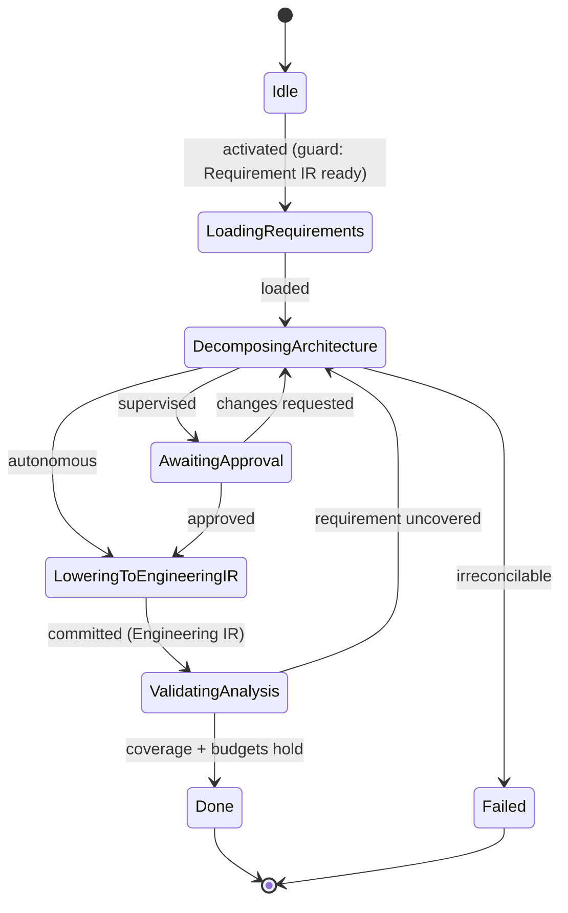

# State Machine — Engineering Analysis

> **Ring:** Use cases / runtime (inner) — a [State Machine](../GLOSSARY.md#state-machine-fsm) **instance** ([framework](../core/state-machine-framework.md)). This is **Phase 2**: it analyzes the [Requirement IR](../compiler/ir/requirement-ir.md) into an engineering architecture — [Functional Blocks](../foundation/engineering-domain-model.md#functional-block), topologies, and budgets — and **lowers Requirement IR → [Engineering IR](../compiler/ir/engineering-ir.md)** ([transformation](../compiler/transformations.md)). Driven by the [Planning Agent](../agents/planning-agent.md) (which also covers [Constraint Extraction](constraint-extraction.md)); uses the [Planning Engine](../engineering/planning-engine.md) and [Constraint Engine](../engineering/constraint-engine.md). This doc owns *States · Transitions · Events · Rollback · Recovery · Persistence*; the [agent doc](../agents/planning-agent.md) owns purpose and reasoning ([anti-duplication](../CONVENTIONS.md)).

## Bindings

| Binding | Value |
|---------|-------|
| Driving agent | [Planning Agent](../agents/planning-agent.md) |
| Engines used | [Planning Engine](../engineering/planning-engine.md), [Constraint Engine](../engineering/constraint-engine.md) |
| IR | reads [Requirement IR](../compiler/ir/requirement-ir.md) → **produces** [Engineering IR](../compiler/ir/engineering-ir.md) |
| Upstream | [Requirement Planning](requirement-planning.md) |
| Downstream | [Constraint Extraction](constraint-extraction.md) |
| Framework | conforms to [state-machine-framework](../core/state-machine-framework.md) |

## States

| State | Kind | Meaning |
|-------|------|---------|
| `Idle` | Initial | Awaits activation when [Requirement IR](../compiler/ir/requirement-ir.md) is ready. |
| `LoadingRequirements` | Normal (Gathering) | Reads the Requirement IR and any prior reference designs from [Vector Memory](../knowledge/vector-memory.md). |
| `DecomposingArchitecture` | Normal (Proposing) | [Planning Agent](../agents/planning-agent.md) proposes [Functional Blocks](../foundation/engineering-domain-model.md#functional-block), interfaces, and electrical budgets (power/thermal/area). |
| `AwaitingApproval` | Waiting / HITL | Proposed architecture presented for approval at the [Autonomy Level](../engineering/human-in-the-loop.md). |
| `LoweringToEngineeringIR` | Normal (Applying) | Lowers Requirement IR → [Engineering IR](../compiler/ir/engineering-ir.md), persisting Functional Blocks and their requirement links. |
| `ValidatingAnalysis` | Normal (Verifying) | Checks coverage: every accepted [Requirement](../foundation/engineering-domain-model.md#requirement) maps to ≥1 Functional Block; budgets are internally consistent. |
| `Done` | Terminal (success) | Engineering IR produced. |
| `Failed` | Terminal (failure) | Requirements cannot be reconciled into a coherent architecture. |

## Transitions

| From → To | Guard | Effect (agent / engine) | Events emitted |
|-----------|-------|-------------------------|----------------|
| `Idle → LoadingRequirements` | Requirement IR present | open scope | `PhaseEntered` |
| `LoadingRequirements → DecomposingArchitecture` | requirements loaded | agent decomposes into blocks ([Planning Engine](../engineering/planning-engine.md)) | `RequirementsLoaded`, `ArchitectureProposed` |
| `DecomposingArchitecture → AwaitingApproval` | autonomy = supervised | present | `ReviewRequested` |
| `DecomposingArchitecture → LoweringToEngineeringIR` | autonomy = autonomous | proceed | — |
| `AwaitingApproval → LoweringToEngineeringIR` | approved | accept | `ArchitectureApproved` |
| `AwaitingApproval → DecomposingArchitecture` | changes requested | re-decompose | `ChangesRequested` |
| `LoweringToEngineeringIR → ValidatingAnalysis` | mutations validated | lower IR + persist blocks | `EngineeringIRProduced` |
| `ValidatingAnalysis → Done` | coverage + budgets hold | finalize | `PhaseCompleted` |
| `ValidatingAnalysis → DecomposingArchitecture` | a requirement uncovered (recoverable) | re-decompose gap | `ValidationFailed` |
| `DecomposingArchitecture → Failed` | requirements irreconcilable / over-constrained | abort | `PhaseFailed` |

## Events

- **Consumed:** `PhaseActivated`, `RequirementIRProduced` (upstream readiness), `ApprovalGranted` / `ChangesRequested`.
- **Emitted:** `PhaseEntered`, `RequirementsLoaded`, `ArchitectureProposed`, `ReviewRequested`, `ArchitectureApproved`, `EngineeringIRProduced`, `ValidationFailed`, `PhaseCompleted`, `PhaseFailed`.

## Rollback

- **Pre-commit:** an invalid or rejected decomposition is dropped before the commit boundary in `LoweringToEngineeringIR`; the machine stays in its *from* state. The Engineering IR is written only on a validated lowering.
- **Post-commit:** a committed but later-rejected architecture is reversed by a compensating transition that supersedes the affected Functional Blocks, or by restoring a [Checkpoint](../core/checkpoint-system.md) ([error-handling](../core/error-handling.md)).

## Recovery

- **Resumable:** all working/waiting states; rebuilt by event replay from the last [Checkpoint](../core/checkpoint-system.md). An uncommitted decomposition is re-derived deterministically from the same recorded reasoning outputs ([determinism](../core/determinism-and-reproducibility.md)).
- **Non-resumable:** none (no external side effects).

## Persistence

Position is event-sourced ([Event Bus](../core/event-bus.md) → [Event Store](../GLOSSARY.md#event-store)). Functional Blocks and their requirement-traceability links persist via the [State Repository](../core/contracts.md); the [Engineering IR](../compiler/ir/engineering-ir.md) is the serialization the next phases read.

## Diagram

*Figure: the Engineering Analysis machine; it lowers [Requirement IR](../compiler/ir/requirement-ir.md) into [Engineering IR](../compiler/ir/engineering-ir.md). Viewpoint: the runtime.*

## Failure modes

- **Uncovered requirement** caught in `ValidatingAnalysis` → loops back to decomposition, never passed silently.
- **Over-constrained / contradictory requirements** → `Failed`; surfaced for the engineer; often resolved by looping the *workflow* back to [Requirement Planning](requirement-planning.md) (orchestrator policy).
- **Budget inconsistency** (e.g. allocated power exceeds the requirement) is a recoverable validation failure.

## Related documents

[`agents/planning-agent.md`](../agents/planning-agent.md) · [`compiler/ir/engineering-ir.md`](../compiler/ir/engineering-ir.md) · [`compiler/transformations.md`](../compiler/transformations.md) · [`engineering/planning-engine.md`](../engineering/planning-engine.md) · [`engineering/constraint-engine.md`](../engineering/constraint-engine.md) · [`state-machines/constraint-extraction.md`](constraint-extraction.md) · [`state-machines/README.md`](README.md)
