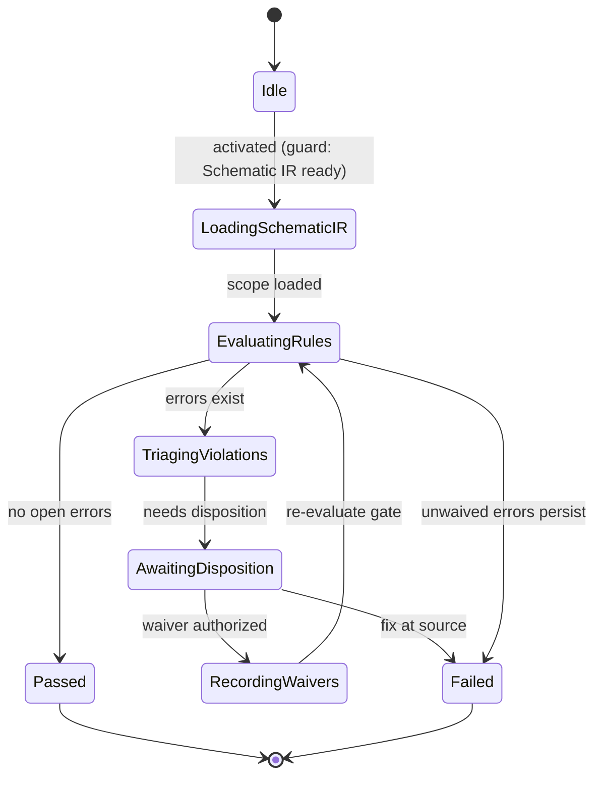

# State Machine — ERC Verification

> **Ring:** Use cases / runtime (inner) — a [State Machine](../GLOSSARY.md#state-machine-fsm) **instance** ([framework](../core/state-machine-framework.md)). This is **Phase 7**: it runs the **Electrical Rule Check** over the [Schematic IR](../compiler/ir/schematic-ir.md) — an electrical-rule specialization of the generic [Verification Engine](../engineering/verification-engine.md) [Rule → Violation → Waiver](../engineering/verification-engine.md#3-the-generic-rule--violation--waiver-lifecycle) lifecycle. Driven by the [ERC Agent](../agents/erc-agent.md). On unwaived error, its `Failed` terminal is routed by the [orchestrator](../core/workflow-orchestration.md) **back to [Schematic Planning](schematic-planning.md)**. This doc owns *States · Transitions · Events · Rollback · Recovery · Persistence*; the [agent](../agents/erc-agent.md) owns violation-explanation/fix-suggestion reasoning ([anti-duplication](../CONVENTIONS.md)).

## Bindings

| Binding | Value |
|---------|-------|
| Driving agent | [ERC Agent](../agents/erc-agent.md) |
| Engines used | [Verification Engine](../engineering/verification-engine.md) (electrical rule set) |
| IR | **checks** [Schematic IR](../compiler/ir/schematic-ir.md) (produces no IR; writes [Violations](../foundation/engineering-domain-model.md#violation)/[Waivers](../foundation/engineering-domain-model.md#waiver)) |
| Upstream | [Schematic Planning](schematic-planning.md) |
| Downstream (pass) | [PCB Floor Planning](pcb-floor-planning.md) |
| Loop-back (fail) | **↺ [Schematic Planning](schematic-planning.md)** |
| Framework | conforms to [state-machine-framework](../core/state-machine-framework.md) |

## States

| State | Kind | Meaning |
|-------|------|---------|
| `Idle` | Initial | Awaits activation when [Schematic IR](../compiler/ir/schematic-ir.md) is ready. |
| `LoadingSchematicIR` | Normal (Gathering) | Reads the schematic domain scope ([Pins](../foundation/engineering-domain-model.md#pin)/[Nets](../foundation/engineering-domain-model.md#net)) the rule set evaluates. |
| `EvaluatingRules` | Normal (Working) | [Verification Engine](../engineering/verification-engine.md) evaluates the electrical rule set (e.g. output-driving-output, unconnected power, no-connect violations) and creates/deduplicates [Violations](../foundation/engineering-domain-model.md#violation). |
| `TriagingViolations` | Normal (Reviewing) | [ERC Agent](../agents/erc-agent.md) explains violations and suggests fixes (reasoning *explains*; it never alters severity — gating is deterministic). |
| `AwaitingDisposition` | Waiting / HITL | Engineer fixes the schematic, or authorizes [Waivers](../foundation/engineering-domain-model.md#waiver) at the [Autonomy Level](../engineering/human-in-the-loop.md). |
| `RecordingWaivers` | Normal (Applying) | Persists authorized waivers with rationale, scope, expiry, and [provenance](../core/provenance-and-traceability.md). |
| `Passed` | Terminal (success) | No open error-severity violations; orchestrator advances to [PCB Floor Planning](pcb-floor-planning.md). |
| `Failed` | Terminal (failure) | Open error-severity violations remain → orchestrator loops back to [Schematic Planning](schematic-planning.md). |

## Transitions

| From → To | Guard | Effect (agent / engine) | Events emitted |
|-----------|-------|-------------------------|----------------|
| `Idle → LoadingSchematicIR` | Schematic IR present | open scope | `PhaseEntered` |
| `LoadingSchematicIR → EvaluatingRules` | scope loaded | [Verification Engine](../engineering/verification-engine.md) runs rule set | `ERCRunStarted` |
| `EvaluatingRules → Passed` | no open error violations | finalize | `ViolationsRecorded`, `ERCPassed`, `PhaseCompleted` |
| `EvaluatingRules → TriagingViolations` | error violations exist | agent triages | `ViolationsRecorded` |
| `TriagingViolations → AwaitingDisposition` | needs human disposition | present | `DispositionRequested` |
| `AwaitingDisposition → RecordingWaivers` | waiver(s) authorized | record waivers | `ViolationWaived` |
| `AwaitingDisposition → Failed` | engineer chooses to fix at source | abort phase | `ERCFailed`, `PhaseFailed` |
| `RecordingWaivers → EvaluatingRules` | waivers recorded | re-evaluate gate | `ERCReRun` |
| `EvaluatingRules → Failed` | unwaived errors persist after re-run | abort phase | `ERCFailed`, `PhaseFailed` |

## Events

- **Consumed:** `PhaseActivated`, `SchematicIRProduced`, `WaiverAuthorized` / `FixRequested` (from [HITL](../engineering/human-in-the-loop.md)).
- **Emitted:** `PhaseEntered`, `ERCRunStarted`, `ViolationsRecorded`, `ViolationWaived`, `ERCReRun`, `ERCPassed`, `ERCFailed`, `PhaseCompleted`, `PhaseFailed`. `ERCFailed` is the **loop-back signal** the [orchestrator](../core/workflow-orchestration.md) consumes to re-activate [Schematic Planning](schematic-planning.md); `ERCPassed` advances the workflow.

## Rollback

- **Pre-commit:** verification is read-mostly; the only mutations are Violation status and Waivers. A waiver that fails authorization in `RecordingWaivers` is abandoned before commit — the violation stays open.
- **Post-commit:** a recorded waiver is reversed by a compensating transition (the [Verification Engine](../engineering/verification-engine.md) reverts the covered violation to *Open*), preserving the audit trail. Violations themselves are facts of an evaluation run and are never deleted, only re-evaluated.

## Recovery

- **Resumable:** `LoadingSchematicIR`, `TriagingViolations`, `AwaitingDisposition`, `RecordingWaivers` — rebuilt by event replay from the last [Checkpoint](../core/checkpoint-system.md).
- **Non-resumable:** `EvaluatingRules` — a crashed evaluation is **re-run** from a clean read of the [Schematic IR](../compiler/ir/schematic-ir.md) rather than resumed mid-pass; evaluation is deterministic and idempotent, so the same violation set results ([P4](../foundation/principles.md)).

## Persistence

Position is event-sourced. Each evaluation run, its inputs, the resulting [Violations](../foundation/engineering-domain-model.md#violation) (with stable identity for deduplication across iterations), and any [Waivers](../foundation/engineering-domain-model.md#waiver) persist in [Engineering State](../core/shared-state-model.md) for replay and [provenance](../core/provenance-and-traceability.md). The gate result (clear/blocked) is a pure function of the persisted violation set.

## Diagram

*Figure: the ERC Verification machine. `Failed` is an outcome the [orchestrator](../core/workflow-orchestration.md) turns into a loop-back to [Schematic Planning](schematic-planning.md) (dashed edge in the [default workflow plan](../foundation/architecture-views.md#default-workflow-plan)). Viewpoint: the runtime.*

## Failure modes

- **Unwaived error violations** → `Failed` → loop-back to [Schematic Planning](schematic-planning.md). The machine never edits the schematic itself ([P7](../foundation/principles.md)).
- **Indeterminate rule** (insufficient schematic data) is treated as *not passable*, never a pass ([Verification Engine](../engineering/verification-engine.md) policy).
- **Expired/out-of-scope waiver** re-arms its covered violation, which re-blocks the gate on the next run.

## Related documents

[`agents/erc-agent.md`](../agents/erc-agent.md) · [`engineering/verification-engine.md`](../engineering/verification-engine.md) · [`compiler/ir/schematic-ir.md`](../compiler/ir/schematic-ir.md) · [`core/workflow-orchestration.md`](../core/workflow-orchestration.md) · [`state-machines/schematic-planning.md`](schematic-planning.md) · [`state-machines/pcb-floor-planning.md`](pcb-floor-planning.md) · [`state-machines/README.md`](README.md)
