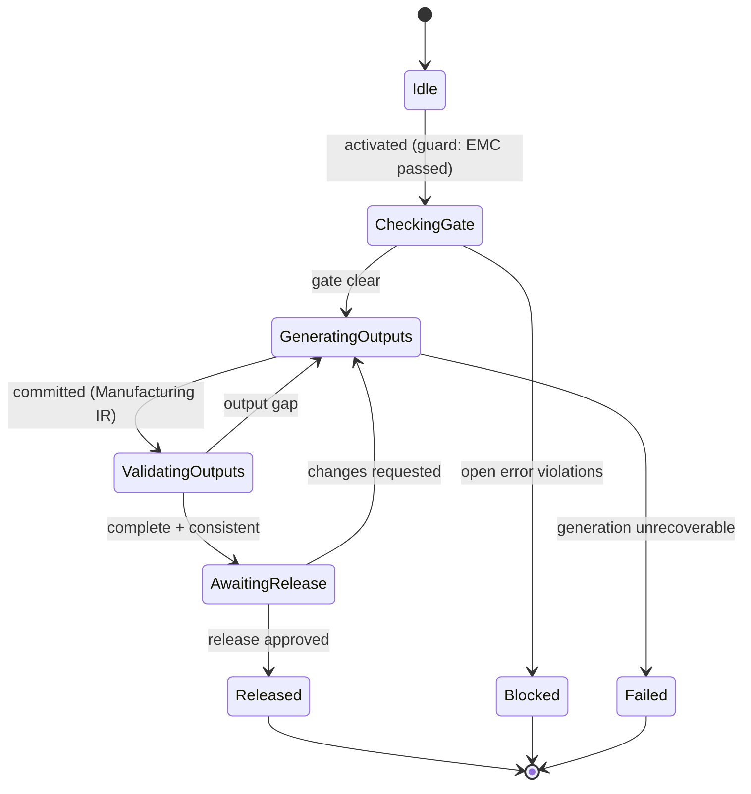

# State Machine — Manufacturing Generation

> **Ring:** Use cases / runtime (inner) — a [State Machine](../GLOSSARY.md#state-machine-fsm) **instance** ([framework](../core/state-machine-framework.md)). This is **Phase 14** (final): it generates the manufacturing outputs — fabrication, drill, pick-and-place, and assembly data — and **lowers [PCB IR](../compiler/ir/pcb-ir.md) → [Manufacturing IR](../compiler/ir/manufacturing-ir.md)** ([transformation](../compiler/transformations.md)). It is **gated**: it cannot start while the design has open error-severity [Violations](../foundation/engineering-domain-model.md#violation) — the [Verification Engine's](../engineering/verification-engine.md#severity--the-gate) [manufacturing gate](../core/workflow-orchestration.md), enforcing the [domain invariant](../foundation/engineering-domain-model.md#violation). Driven by the [Manufacturing Agent](../agents/manufacturing-agent.md). This doc owns *States · Transitions · Events · Rollback · Recovery · Persistence*; the [agent](../agents/manufacturing-agent.md) owns output reasoning ([anti-duplication](../CONVENTIONS.md)).

## Bindings

| Binding | Value |
|---------|-------|
| Driving agent | [Manufacturing Agent](../agents/manufacturing-agent.md) |
| Engines used | [Verification Engine](../engineering/verification-engine.md) (the gate) |
| IR | reads [PCB IR](../compiler/ir/pcb-ir.md) → **produces** [Manufacturing IR](../compiler/ir/manufacturing-ir.md) |
| Outputs | manufacturing artifacts to the [Artifact Store](../GLOSSARY.md#artifact-store), delivered to the [fab/assembly house](../foundation/architecture-views.md) |
| Upstream | [EMC Analysis](emc-analysis.md) (pass) |
| Downstream | *(terminal phase)* |
| Gate | **blocked by open error-severity [Violations](../foundation/engineering-domain-model.md#violation)** |
| Framework | conforms to [state-machine-framework](../core/state-machine-framework.md) |

## States

| State | Kind | Meaning |
|-------|------|---------|
| `Idle` | Initial | Awaits activation after [EMC](emc-analysis.md) passes. |
| `CheckingGate` | Normal (Guard) | Consults the [Verification Engine's](../engineering/verification-engine.md#severity--the-gate) manufacturing gate: are there open error-severity [Violations](../foundation/engineering-domain-model.md#violation) (across ERC/DRC/DFM, no valid waiver)? |
| `Blocked` | Terminal (failure) | Gate failed — open errors remain. The phase cannot proceed; the [orchestrator](../core/workflow-orchestration.md) routes back to the relevant verification/fix phase. |
| `GeneratingOutputs` | Normal (Applying) | [Manufacturing Agent](../agents/manufacturing-agent.md) generates fabrication/drill/pick-and-place/assembly outputs and lowers [PCB IR](../compiler/ir/pcb-ir.md) → [Manufacturing IR](../compiler/ir/manufacturing-ir.md). |
| `ValidatingOutputs` | Normal (Verifying) | Checks output completeness/consistency: all required layers present, IR invariants hold, BOM/placement cross-consistent. |
| `AwaitingRelease` | Waiting / HITL | Final release approval at the [Autonomy Level](../engineering/human-in-the-loop.md) before artifacts are published. |
| `Released` | Terminal (success) | Manufacturing IR produced; artifacts persisted to the [Artifact Store](../GLOSSARY.md#artifact-store). |
| `Failed` | Terminal (failure) | Output generation/validation failed irrecoverably. |

## Transitions

| From → To | Guard | Effect (agent / engine) | Events emitted |
|-----------|-------|-------------------------|----------------|
| `Idle → CheckingGate` | EMC passed, PCB IR present | consult gate | `PhaseEntered`, `GateChecked` |
| `CheckingGate → Blocked` | open error-severity violations exist | refuse | `ManufacturingBlocked`, `PhaseFailed` |
| `CheckingGate → GeneratingOutputs` | gate clear (no open errors) | generate outputs + lower IR | `GenerationStarted` |
| `GeneratingOutputs → ValidatingOutputs` | mutations validated | produce Manufacturing IR | `ManufacturingIRProduced` |
| `ValidatingOutputs → AwaitingRelease` | outputs complete + consistent | present for release | `ReleaseRequested` |
| `ValidatingOutputs → GeneratingOutputs` | output gap (recoverable) | regenerate | `ValidationFailed` |
| `AwaitingRelease → Released` | release approved | publish artifacts | `ArtifactsPublished`, `ManufacturingReleased`, `PhaseCompleted` |
| `AwaitingRelease → GeneratingOutputs` | changes requested | regenerate | `ChangesRequested` |
| `GeneratingOutputs → Failed` | generation unrecoverable | abort | `PhaseFailed` |

## Events

- **Consumed:** `PhaseActivated`, `EMCPassed`, `ReleaseApproved` / `ChangesRequested` (from [HITL](../engineering/human-in-the-loop.md)).
- **Emitted:** `PhaseEntered`, `GateChecked`, `ManufacturingBlocked`, `GenerationStarted`, `ManufacturingIRProduced`, `ArtifactsPublished`, `ManufacturingReleased`, `PhaseCompleted`, `PhaseFailed`. `ManufacturingBlocked` tells the [orchestrator](../core/workflow-orchestration.md) which verification phase to re-enter.

## Rollback

- **Pre-commit:** a generation that fails validation in `GeneratingOutputs`/`ValidatingOutputs` is abandoned before the commit boundary; no [Manufacturing IR](../compiler/ir/manufacturing-ir.md) is produced and no artifact is published.
- **Post-commit:** once `Released`, the artifacts and Manufacturing IR are immutable for that release; a change is a **new** release (a compensating transition producing a superseding IR), never an edit in place — published manufacturing data must be auditable ([P5](../foundation/principles.md)). [Checkpoint](../core/checkpoint-system.md) restore is available for pre-release positions.

## Recovery

- **Resumable:** `CheckingGate`, `GeneratingOutputs`, `ValidatingOutputs`, `AwaitingRelease` — rebuilt by event replay from the last [Checkpoint](../core/checkpoint-system.md). The gate is re-checked on resume so a violation introduced meanwhile cannot slip through.
- **Non-resumable:** none in-phase, but **re-checking the gate is mandatory** on any resume into generation — output generation always re-derives from a gate-clear read of the [PCB IR](../compiler/ir/pcb-ir.md).

## Persistence

Position is event-sourced. The [Manufacturing IR](../compiler/ir/manufacturing-ir.md) and generated artifacts persist to the [Artifact Store](../GLOSSARY.md#artifact-store); the release [Decision](../foundation/engineering-domain-model.md#decision) and the gate-check result persist in [Engineering State](../core/shared-state-model.md) for full [provenance](../core/provenance-and-traceability.md). A release is a durable, immutable record of "this exact design was authorized to manufacture."

## Diagram

*Figure: the Manufacturing Generation machine; `CheckingGate` enforces the open-error gate before any output is generated. Viewpoint: the runtime.*

## Failure modes

- **Open error violations** → `Blocked`; the orchestrator routes back to the verification/fix phase that owns the defect. The gate is the engine's most consequential output ([Verification Engine](../engineering/verification-engine.md#severity--the-gate)).
- **Incomplete output** caught in `ValidatingOutputs` → regenerate; an inconsistent manufacturing set is never published.
- **Generation failure** (e.g. an un-exportable geometry) → `Failed`; surfaced to the engineer; the design state is untouched because nothing was committed.

## Related documents

[`agents/manufacturing-agent.md`](../agents/manufacturing-agent.md) · [`compiler/ir/manufacturing-ir.md`](../compiler/ir/manufacturing-ir.md) · [`compiler/transformations.md`](../compiler/transformations.md) · [`engineering/verification-engine.md`](../engineering/verification-engine.md) · [`core/workflow-orchestration.md`](../core/workflow-orchestration.md) · [`state-machines/emc-analysis.md`](emc-analysis.md) · [`state-machines/README.md`](README.md)
