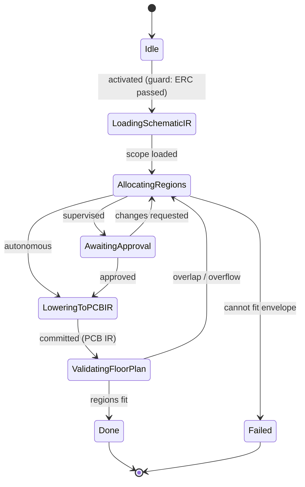

# State Machine — PCB Floor Planning

> **Ring:** Use cases / runtime (inner) — a [State Machine](../GLOSSARY.md#state-machine-fsm) **instance** ([framework](../core/state-machine-framework.md)). This is **Phase 8**: it allocates [Board](../foundation/engineering-domain-model.md#board--layer-stack) regions to [Functional Blocks](../foundation/engineering-domain-model.md#functional-block), defines the board outline and layer stack-up, and **lowers [Schematic IR](../compiler/ir/schematic-ir.md) → [PCB IR](../compiler/ir/pcb-ir.md)** ([transformation](../compiler/transformations.md)). Driven by the [Placement Agent](../agents/placement-agent.md) (which also covers [Component Placement](component-placement.md)); uses the [Planning Engine](../engineering/planning-engine.md) and [Constraint Engine](../engineering/constraint-engine.md). This doc owns *States · Transitions · Events · Rollback · Recovery · Persistence*; the [agent](../agents/placement-agent.md) owns floor-planning reasoning ([anti-duplication](../CONVENTIONS.md)).

## Bindings

| Binding | Value |
|---------|-------|
| Driving agent | [Placement Agent](../agents/placement-agent.md) |
| Engines used | [Planning Engine](../engineering/planning-engine.md), [Constraint Engine](../engineering/constraint-engine.md) |
| IR | reads [Schematic IR](../compiler/ir/schematic-ir.md) → **produces** [PCB IR](../compiler/ir/pcb-ir.md) (board, regions, stack-up) |
| Upstream | [ERC Verification](erc-verification.md) (pass) |
| Downstream | [Component Placement](component-placement.md) |
| Framework | conforms to [state-machine-framework](../core/state-machine-framework.md) |

## States

| State | Kind | Meaning |
|-------|------|---------|
| `Idle` | Initial | Awaits activation after [ERC](erc-verification.md) passes. |
| `LoadingSchematicIR` | Normal (Gathering) | Reads Functional Blocks, Nets, and mechanical/board constraints. |
| `AllocatingRegions` | Normal (Proposing) | [Placement Agent](../agents/placement-agent.md) proposes the board outline, layer stack-up, and region-to-block assignment. |
| `AwaitingApproval` | Waiting / HITL | Floor plan presented for approval at the [Autonomy Level](../engineering/human-in-the-loop.md). |
| `LoweringToPCBIR` | Normal (Applying) | Lowers Schematic IR → [PCB IR](../compiler/ir/pcb-ir.md), persisting the Board, its stack-up, and regions. |
| `ValidatingFloorPlan` | Normal (Verifying) | [Constraint Engine](../engineering/constraint-engine.md) checks: regions fit within the outline; block areas are non-overlapping; keep-outs and mechanical limits are honored. |
| `Done` | Terminal (success) | PCB IR produced (board frame established). |
| `Failed` | Terminal (failure) | The blocks cannot be allocated within the board envelope. |

## Transitions

| From → To | Guard | Effect (agent / engine) | Events emitted |
|-----------|-------|-------------------------|----------------|
| `Idle → LoadingSchematicIR` | ERC passed, Schematic IR ready | open scope | `PhaseEntered` |
| `LoadingSchematicIR → AllocatingRegions` | scope loaded | agent allocates regions ([Planning Engine](../engineering/planning-engine.md)) | `SchematicIRLoaded`, `FloorPlanProposed` |
| `AllocatingRegions → AwaitingApproval` | autonomy = supervised | present | `ReviewRequested` |
| `AllocatingRegions → LoweringToPCBIR` | autonomy = autonomous | proceed | — |
| `AwaitingApproval → LoweringToPCBIR` | approved | accept | `FloorPlanApproved` |
| `AwaitingApproval → AllocatingRegions` | changes requested | re-allocate | `ChangesRequested` |
| `LoweringToPCBIR → ValidatingFloorPlan` | mutations validated | lower IR + persist board/regions | `PCBIRProduced` |
| `ValidatingFloorPlan → Done` | regions fit + constraints hold | finalize | `PhaseCompleted` |
| `ValidatingFloorPlan → AllocatingRegions` | overlap / outline overflow (recoverable) | re-allocate | `ValidationFailed` |
| `AllocatingRegions → Failed` | blocks cannot fit envelope | abort | `PhaseFailed` |

## Events

- **Consumed:** `PhaseActivated`, `ERCPassed`, `SchematicIRProduced`, `FloorPlanApproved` / `ChangesRequested`.
- **Emitted:** `PhaseEntered`, `SchematicIRLoaded`, `FloorPlanProposed`, `PCBIRProduced`, `ValidationFailed`, `PhaseCompleted`, `PhaseFailed`. `PCBIRProduced` activates [Component Placement](component-placement.md).

## Rollback

- **Pre-commit:** a rejected or infeasible floor plan is dropped before commit; the machine holds in `AllocatingRegions`/`AwaitingApproval`. The [PCB IR](../compiler/ir/pcb-ir.md) is created only on a validated lowering.
- **Post-commit:** the committed board/regions are reversed by a compensating transition recording the [Decision](../foundation/engineering-domain-model.md#decision), or via [Checkpoint](../core/checkpoint-system.md) restore — downstream placement depends on the regions ([error-handling](../core/error-handling.md)).

## Recovery

- **Resumable:** all states; rebuilt by event replay from the last [Checkpoint](../core/checkpoint-system.md). An uncommitted allocation is re-derived from recorded reasoning outputs.
- **Non-resumable:** none (no external side effects).

## Persistence

Position is event-sourced. The [Board](../foundation/engineering-domain-model.md#board--layer-stack), layer stack-up, and regions persist in [Engineering State](../core/shared-state-model.md); the [PCB IR](../compiler/ir/pcb-ir.md) is the serialization [Component Placement](component-placement.md) and [Routing Planning](routing-planning.md) enrich.

## Diagram

*Figure: the PCB Floor Planning machine; it lowers the schematic into the first [PCB IR](../compiler/ir/pcb-ir.md), establishing the board frame. Viewpoint: the runtime.*

## Failure modes

- **Blocks exceed envelope** → `Failed`; orchestrator may loop the workflow back to [Engineering Analysis](engineering-analysis.md) (re-budget area) or surface a mechanical-requirement conflict.
- **Region overlap / outline overflow** caught in `ValidatingFloorPlan` → re-allocate.
- **Stack-up infeasible for net classes** (e.g. impedance target needs more layers) is a recoverable validation failure that re-proposes the stack-up.

## Related documents

[`agents/placement-agent.md`](../agents/placement-agent.md) · [`compiler/ir/pcb-ir.md`](../compiler/ir/pcb-ir.md) · [`compiler/transformations.md`](../compiler/transformations.md) · [`engineering/planning-engine.md`](../engineering/planning-engine.md) · [`engineering/constraint-engine.md`](../engineering/constraint-engine.md) · [`state-machines/component-placement.md`](component-placement.md) · [`state-machines/README.md`](README.md)
