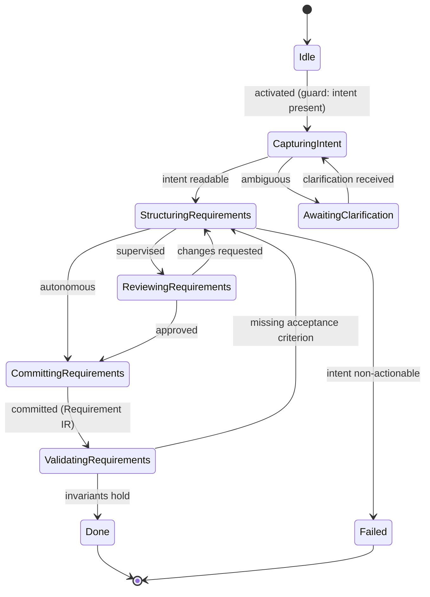

# State Machine — Requirement Planning

> **Ring:** Use cases / runtime (inner) — a [State Machine](../GLOSSARY.md#state-machine-fsm) **instance** conforming to the [framework](../core/state-machine-framework.md). This is **Phase 1**: it turns human [Design Intent](../foundation/engineering-domain-model.md#design-intent) into a structured, testable set of [Requirements](../foundation/engineering-domain-model.md#requirement) and **produces the [Requirement IR](../compiler/ir/requirement-ir.md)** — the root of the whole [traceability](../core/provenance-and-traceability.md) tree. It is driven by the [Requirement Agent](../agents/requirement-agent.md) and uses the [Planning Engine](../engineering/planning-engine.md) for the agent's [reasoning plan](../GLOSSARY.md#the-word-planning-disambiguation). This doc owns the phase's *States · Transitions · Events · Rollback · Recovery · Persistence*; the agent doc owns *why* and *how it reasons* ([anti-duplication rule](../CONVENTIONS.md)).

## Bindings

| Binding | Value |
|---------|-------|
| Driving agent | [Requirement Agent](../agents/requirement-agent.md) |
| Engines used | [Planning Engine](../engineering/planning-engine.md) |
| IR | reads [Design Intent](../foundation/engineering-domain-model.md#design-intent) (state) → **produces** [Requirement IR](../compiler/ir/requirement-ir.md) |
| Upstream | *(none — first phase; activated when a [Project](../GLOSSARY.md#project) opens with intent)* |
| Downstream | [Engineering Analysis](engineering-analysis.md) |
| Framework | conforms to [state-machine-framework](../core/state-machine-framework.md) |

## States

| State | Kind | Meaning |
|-------|------|---------|
| `Idle` | Initial | Created; awaits activation by the [Workflow Orchestrator](../core/workflow-orchestration.md). |
| `CapturingIntent` | Normal (Gathering) | Reads natural-language [Design Intent](../foundation/engineering-domain-model.md#design-intent) and any external standards cited from the [Session](../GLOSSARY.md#session). |
| `StructuringRequirements` | Normal (Proposing) | Invokes the [Requirement Agent](../agents/requirement-agent.md) to propose discrete, testable [Requirements](../foundation/engineering-domain-model.md#requirement) with categories, priorities, and acceptance criteria. |
| `AwaitingClarification` | Waiting / HITL | Intent is ambiguous or incomplete; paused for the engineer to disambiguate. |
| `ReviewingRequirements` | Waiting / HITL | Proposed requirement set presented for approval at the [Autonomy Level](../engineering/human-in-the-loop.md). |
| `CommittingRequirements` | Normal (Applying) | Persists accepted Requirements via the [State Repository](../core/contracts.md) and serializes the [Requirement IR](../compiler/ir/requirement-ir.md). |
| `ValidatingRequirements` | Normal (Verifying) | Checks completeness invariants: every accepted Requirement is testable and carries an acceptance criterion and a source. |
| `Done` | Terminal (success) | Requirement IR produced; orchestrator may advance to [Engineering Analysis](engineering-analysis.md). |
| `Failed` | Terminal (failure) | No coherent, testable requirement set could be derived from intent. |

## Transitions

| From → To | Guard | Effect (agent / engine) | Events emitted |
|-----------|-------|-------------------------|----------------|
| `Idle → CapturingIntent` | project has Design Intent | open working scope | `PhaseEntered` |
| `CapturingIntent → StructuringRequirements` | intent readable | [Requirement Agent](../agents/requirement-agent.md) drafts structured requirements ([Planning Engine](../engineering/planning-engine.md) plans the steps) | `IntentCaptured`, `RequirementsProposed` |
| `CapturingIntent → AwaitingClarification` | intent ambiguous/empty | request disambiguation | `ClarificationRequested` |
| `AwaitingClarification → CapturingIntent` | clarification received | merge new intent | `ClarificationProvided` |
| `StructuringRequirements → ReviewingRequirements` | autonomy = supervised | present proposal | `ReviewRequested` |
| `StructuringRequirements → CommittingRequirements` | autonomy = autonomous | proceed | — |
| `ReviewingRequirements → CommittingRequirements` | approved | accept set | `RequirementsApproved` |
| `ReviewingRequirements → StructuringRequirements` | changes requested | re-draft | `ChangesRequested` |
| `CommittingRequirements → ValidatingRequirements` | mutations validated | persist + serialize Requirement IR | `RequirementCommitted`, `RequirementIRProduced` |
| `ValidatingRequirements → Done` | all invariants hold | finalize | `PhaseCompleted` |
| `ValidatingRequirements → StructuringRequirements` | a requirement lacks an acceptance criterion (recoverable) | re-draft offending items | `ValidationFailed` |
| `StructuringRequirements → Failed` | intent fundamentally non-actionable | abort | `PhaseFailed` |

## Events

- **Consumed (from the [Event Bus](../core/event-bus.md)):** `PhaseActivated` (orchestrator), `UserIntentSubmitted`, `ClarificationProvided`, `ApprovalGranted` / `ChangesRequested` (from [HITL](../engineering/human-in-the-loop.md)).
- **Emitted (committed atomically with each transition):** `PhaseEntered`, `IntentCaptured`, `RequirementsProposed`, `ClarificationRequested`, `RequirementsApproved`, `RequirementCommitted`, `RequirementIRProduced`, `PhaseCompleted`, `PhaseFailed`. Every committed move emits at least one event ([P5](../foundation/principles.md)).

## Rollback

- **Pre-commit (common):** a rejected or invalid proposal in `StructuringRequirements`/`CommittingRequirements` is abandoned before the commit boundary; the machine stays put. No requirement enters [Engineering State](../core/shared-state-model.md) until validated.
- **Post-commit:** because Design Intent is *never deleted, only refined*, reversing committed Requirements uses a **compensating** transition that supersedes them with a new Decision (history is immutable) or restores a [Checkpoint](../core/checkpoint-system.md); policy per [error-handling](../core/error-handling.md).

## Recovery

- **Resumable:** `CapturingIntent`, `StructuringRequirements`, `AwaitingClarification`, `ReviewingRequirements` — reconstructed by replaying [Events](../core/event-bus.md) from the nearest [Checkpoint](../core/checkpoint-system.md); pending proposals not yet committed are re-derived.
- **Non-resumable:** none — no external side-effecting calls in this phase, so any state safely resumes.

## Persistence

Position is persisted purely as Events ("entered `StructuringRequirements`", "`RequirementCommitted`"). The committed Requirements are persisted as [Engineering State](../core/shared-state-model.md) via the [State Repository](../core/contracts.md); the [Requirement IR](../compiler/ir/requirement-ir.md) is its phase-boundary serialization. Nothing is held only in memory.

## Diagram

*Figure: the Requirement Planning machine. Viewpoint: the runtime. `Done` yields the [Requirement IR](../compiler/ir/requirement-ir.md) consumed by [Engineering Analysis](engineering-analysis.md).*

## Failure modes

- **Non-actionable intent** → `Failed`; orchestrator surfaces the reason to the engineer ([P10](../foundation/principles.md)).
- **Untestable requirement** caught in `ValidatingRequirements` → loops to `StructuringRequirements`, never silently passed.
- **Reasoning failure** (agent cannot produce a schema-valid set) is the [agent's](../agents/requirement-agent.md) concern; the machine treats it as a recoverable effect failure and retries or fails the phase.

## Related documents

[`agents/requirement-agent.md`](../agents/requirement-agent.md) · [`compiler/ir/requirement-ir.md`](../compiler/ir/requirement-ir.md) · [`engineering/planning-engine.md`](../engineering/planning-engine.md) · [`core/state-machine-framework.md`](../core/state-machine-framework.md) · [`state-machines/engineering-analysis.md`](engineering-analysis.md) · [`state-machines/README.md`](README.md)
