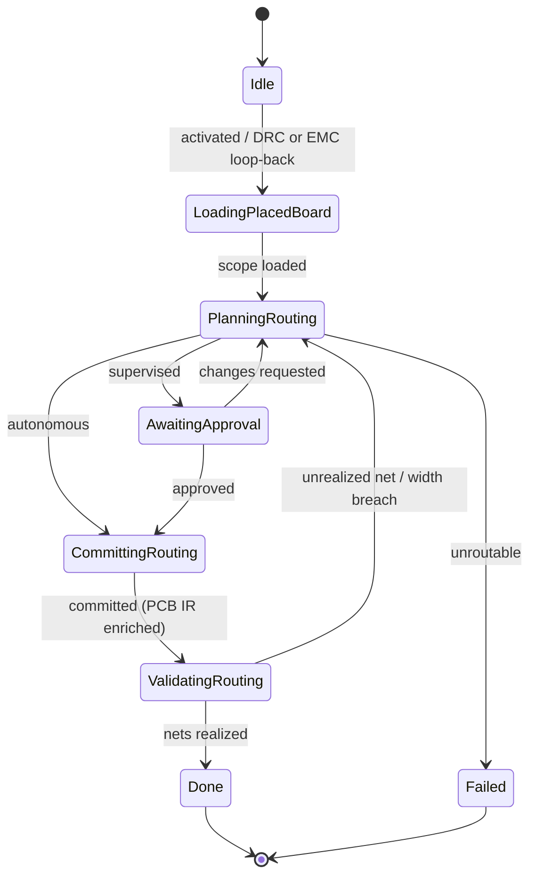

# State Machine — Routing Planning

> **Ring:** Use cases / runtime (inner) — a [State Machine](../GLOSSARY.md#state-machine-fsm) **instance** ([framework](../core/state-machine-framework.md)). This is **Phase 10**: it realizes [Nets](../foundation/engineering-domain-model.md#net) physically as [Tracks/Routing](../foundation/engineering-domain-model.md#track--routing) (layers, widths, vias, differential pairs) and **enriches the [PCB IR](../compiler/ir/pcb-ir.md)**. Driven by the [Routing Agent](../agents/routing-agent.md); uses the [Constraint Engine](../engineering/constraint-engine.md) and [Planning Engine](../engineering/planning-engine.md). It is the loop-back target for **both** [DRC](drc-verification.md) and [EMC](emc-analysis.md) failures. This doc owns *States · Transitions · Events · Rollback · Recovery · Persistence*; the [agent](../agents/routing-agent.md) owns routing reasoning ([anti-duplication](../CONVENTIONS.md)).

## Bindings

| Binding | Value |
|---------|-------|
| Driving agent | [Routing Agent](../agents/routing-agent.md) |
| Engines used | [Constraint Engine](../engineering/constraint-engine.md), [Planning Engine](../engineering/planning-engine.md) |
| IR | **enriches** [PCB IR](../compiler/ir/pcb-ir.md) with [Tracks](../foundation/engineering-domain-model.md#track--routing) |
| Upstream | [Component Placement](component-placement.md) |
| Downstream | [DRC Verification](drc-verification.md) |
| Loop-back target | receives **↺** from [DRC](drc-verification.md) and [EMC](emc-analysis.md) |
| Framework | conforms to [state-machine-framework](../core/state-machine-framework.md) |

## States

| State | Kind | Meaning |
|-------|------|---------|
| `Idle` | Initial | Awaits activation; also re-activated on a [DRC](drc-verification.md) or [EMC](emc-analysis.md) loop-back. |
| `LoadingPlacedBoard` | Normal (Gathering) | Reads the placed [PCB IR](../compiler/ir/pcb-ir.md): nets, net classes, placement, stack-up, and routing constraints (clearance, impedance, current). |
| `PlanningRouting` | Normal (Proposing) | [Routing Agent](../agents/routing-agent.md) plans a routing strategy and proposes [Tracks](../foundation/engineering-domain-model.md#track--routing) — layer assignment, widths, via usage, differential-pair handling. |
| `AwaitingApproval` | Waiting / HITL | Routing presented for approval at the [Autonomy Level](../engineering/human-in-the-loop.md). |
| `CommittingRouting` | Normal (Applying) | Persists Tracks and enriches the [PCB IR](../compiler/ir/pcb-ir.md). |
| `ValidatingRouting` | Normal (Verifying) | Checks net-realization completeness (every Net's [Connections](../foundation/engineering-domain-model.md#connection) are realized — no more, no less) and a width/clearance pre-check via the [Constraint Engine](../engineering/constraint-engine.md). |
| `Done` | Terminal (success) | PCB IR enriched with routing. |
| `Failed` | Terminal (failure) | The board is unroutable under the current placement/constraints. |

## Transitions

| From → To | Guard | Effect (agent / engine) | Events emitted |
|-----------|-------|-------------------------|----------------|
| `Idle → LoadingPlacedBoard` | placed PCB IR ready | open scope | `PhaseEntered` |
| `LoadingPlacedBoard → PlanningRouting` | scope loaded | agent plans routing ([Planning Engine](../engineering/planning-engine.md)) | `PlacedBoardLoaded`, `RoutingProposed` |
| `PlanningRouting → AwaitingApproval` | autonomy = supervised | present | `ReviewRequested` |
| `PlanningRouting → CommittingRouting` | autonomy = autonomous | proceed | — |
| `AwaitingApproval → CommittingRouting` | approved | accept | `RoutingApproved` |
| `AwaitingApproval → PlanningRouting` | changes requested | re-plan | `ChangesRequested` |
| `CommittingRouting → ValidatingRouting` | mutations validated | persist + enrich PCB IR | `RoutingCommitted`, `PCBIREnriched` |
| `ValidatingRouting → Done` | nets realized + pre-check passes | finalize | `PhaseCompleted` |
| `ValidatingRouting → PlanningRouting` | unrealized net / width breach (recoverable) | re-plan offenders | `ValidationFailed` |
| `PlanningRouting → Failed` | board unroutable | abort | `PhaseFailed` |

## Events

- **Consumed:** `PhaseActivated`, `PCBIREnriched` (placement ready), `DRCFailed` / `EMCFailed` (loop-back re-activation), `RoutingApproved` / `ChangesRequested`.
- **Emitted:** `PhaseEntered`, `PlacedBoardLoaded`, `RoutingProposed`, `RoutingCommitted`, `PCBIREnriched`, `ValidationFailed`, `PhaseCompleted`, `PhaseFailed`. `PCBIREnriched` activates [DRC Verification](drc-verification.md).

## Rollback

- **Pre-commit:** a rejected or incomplete routing is dropped before commit; the machine holds in `PlanningRouting`/`AwaitingApproval`.
- **Post-commit:** committed Tracks are reversed by a compensating transition recording the [Decision](../foundation/engineering-domain-model.md#decision), or via [Checkpoint](../core/checkpoint-system.md) restore. On a [DRC](drc-verification.md)/[EMC](emc-analysis.md) loop-back, the machine *edits* the existing routing (often rerouting only offending nets); prior commits remain in history.

## Recovery

- **Resumable:** all states; rebuilt by event replay from the last [Checkpoint](../core/checkpoint-system.md). An uncommitted routing proposal is re-derived from recorded reasoning outputs.
- **Non-resumable:** none (no external side effects in this phase; any autorouter assist is recorded so its output replays deterministically).

## Persistence

Position is event-sourced. [Tracks](../foundation/engineering-domain-model.md#track--routing) (segments, arcs, vias, diff-pair partners) persist in [Engineering State](../core/shared-state-model.md); the enriched [PCB IR](../compiler/ir/pcb-ir.md) is the serialization [DRC](drc-verification.md), [DFM](dfm-verification.md), and [EMC](emc-analysis.md) read.

## Diagram

*Figure: the Routing Planning machine; it is the loop-back target for both [DRC](drc-verification.md) and [EMC](emc-analysis.md). Viewpoint: the runtime.*

## Failure modes

- **Unroutable board** → `Failed`; orchestrator may loop back to [Component Placement](component-placement.md) or [PCB Floor Planning](pcb-floor-planning.md).
- **Unrealized net** caught in `ValidatingRouting` → re-plan; the net-realization invariant (Tracks realize exactly the Net's Connections) is never violated downstream.
- **DRC/EMC loop-back** is the dominant re-entry: both verification phases route their `Failed` outcomes here per the [default workflow plan](../foundation/architecture-views.md#default-workflow-plan).

## Related documents

[`agents/routing-agent.md`](../agents/routing-agent.md) · [`compiler/ir/pcb-ir.md`](../compiler/ir/pcb-ir.md) · [`engineering/constraint-engine.md`](../engineering/constraint-engine.md) · [`engineering/planning-engine.md`](../engineering/planning-engine.md) · [`state-machines/component-placement.md`](component-placement.md) · [`state-machines/drc-verification.md`](drc-verification.md) · [`state-machines/emc-analysis.md`](emc-analysis.md) · [`state-machines/README.md`](README.md)
