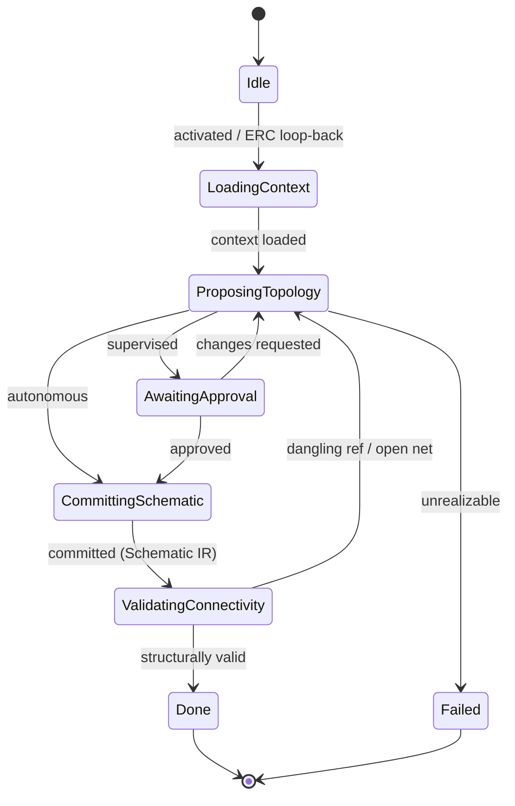

# State Machine — Schematic Planning

> **Ring:** Use cases / runtime (inner) — a [State Machine](../GLOSSARY.md#state-machine-fsm) **instance** ([framework](../core/state-machine-framework.md)). This is **Phase 6**: it captures the logical design — [Components](../foundation/engineering-domain-model.md#component), [Pins](../foundation/engineering-domain-model.md#pin), [Connections](../foundation/engineering-domain-model.md#connection), and [Nets](../foundation/engineering-domain-model.md#net) — and **produces the [Schematic IR](../compiler/ir/schematic-ir.md)**. Driven by the [Schematic Agent](../agents/schematic-agent.md); uses the [Planning Engine](../engineering/planning-engine.md) (topology reasoning plan) and [Constraint Engine](../engineering/constraint-engine.md). Electrical correctness is *not* checked here — that is the separate [ERC Verification](erc-verification.md) phase. This doc owns *States · Transitions · Events · Rollback · Recovery · Persistence*; the [agent](../agents/schematic-agent.md) owns topology reasoning ([anti-duplication](../CONVENTIONS.md)).

## Bindings

| Binding | Value |
|---------|-------|
| Driving agent | [Schematic Agent](../agents/schematic-agent.md) |
| Engines used | [Planning Engine](../engineering/planning-engine.md), [Constraint Engine](../engineering/constraint-engine.md) |
| IR | reads [Engineering IR](../compiler/ir/engineering-ir.md) + [BOM IR](../compiler/ir/bom-ir.md) → **produces** [Schematic IR](../compiler/ir/schematic-ir.md) |
| Upstream | [BOM Planning](bom-planning.md) |
| Downstream | [ERC Verification](erc-verification.md) |
| Framework | conforms to [state-machine-framework](../core/state-machine-framework.md) |

## States

| State | Kind | Meaning |
|-------|------|---------|
| `Idle` | Initial | Awaits activation; also re-activated on an [ERC](erc-verification.md) loop-back. |
| `LoadingContext` | Normal (Gathering) | Reads [Functional Blocks](../foundation/engineering-domain-model.md#functional-block), constraints, [Knowledge-Graph](../knowledge/knowledge-graph.md) facts, and chosen [Parts](../foundation/engineering-domain-model.md#part-manufacturer-part). |
| `ProposingTopology` | Normal (Proposing) | [Schematic Agent](../agents/schematic-agent.md) proposes connectivity: Components, their [Symbols](../foundation/engineering-domain-model.md#symbol), Pins, Connections, and Nets with net classes. |
| `AwaitingApproval` | Waiting / HITL | Proposed schematic presented for approval at the [Autonomy Level](../engineering/human-in-the-loop.md). |
| `CommittingSchematic` | Normal (Applying) | Persists Components/Nets and produces the [Schematic IR](../compiler/ir/schematic-ir.md). |
| `ValidatingConnectivity` | Normal (Verifying) | Structural checks: no dangling Pin references; every Net is the transitive closure of its Connections; symbol/part consistency. (Electrical-rule checks belong to [ERC](erc-verification.md).) |
| `Done` | Terminal (success) | Schematic IR produced. |
| `Failed` | Terminal (failure) | No structurally valid schematic realizes the architecture. |

## Transitions

| From → To | Guard | Effect (agent / engine) | Events emitted |
|-----------|-------|-------------------------|----------------|
| `Idle → LoadingContext` | Engineering IR + BOM IR ready | open scope | `PhaseEntered` |
| `LoadingContext → ProposingTopology` | context loaded | agent proposes topology ([Planning Engine](../engineering/planning-engine.md)) | `ContextLoaded`, `TopologyProposed` |
| `ProposingTopology → AwaitingApproval` | autonomy = supervised | present | `ReviewRequested` |
| `ProposingTopology → CommittingSchematic` | autonomy = autonomous | proceed | — |
| `AwaitingApproval → CommittingSchematic` | approved | accept | `SchematicApproved` |
| `AwaitingApproval → ProposingTopology` | changes requested | re-propose | `ChangesRequested` |
| `CommittingSchematic → ValidatingConnectivity` | mutations validated | persist + produce Schematic IR | `SchematicCommitted`, `SchematicIRProduced` |
| `ValidatingConnectivity → Done` | structurally valid | finalize | `PhaseCompleted` |
| `ValidatingConnectivity → ProposingTopology` | dangling ref / open net (recoverable) | re-propose | `ValidationFailed` |
| `ProposingTopology → Failed` | architecture unrealizable | abort | `PhaseFailed` |

## Events

- **Consumed:** `PhaseActivated`, `BOMIRProduced`, `EngineeringIREnriched`, `ERCFailed` (loop-back re-activation from [ERC](erc-verification.md)), `SchematicApproved` / `ChangesRequested`.
- **Emitted:** `PhaseEntered`, `ContextLoaded`, `TopologyProposed`, `SchematicCommitted`, `SchematicIRProduced`, `PhaseCompleted`, `PhaseFailed`. `SchematicIRProduced` activates [ERC Verification](erc-verification.md).

## Rollback

- **Pre-commit:** a rejected or structurally invalid topology is dropped before commit; the machine holds in `ProposingTopology`/`AwaitingApproval`.
- **Post-commit:** committed schematic entities are reversed by a compensating transition recording the change [Decision](../foundation/engineering-domain-model.md#decision), or via [Checkpoint](../core/checkpoint-system.md) restore. On an [ERC](erc-verification.md) loop-back, the machine re-enters at `LoadingContext` and *edits* the existing schematic (it does not blank it) — the prior commit stays in history.

## Recovery

- **Resumable:** all states; rebuilt by event replay from the last [Checkpoint](../core/checkpoint-system.md). An uncommitted topology proposal is re-derived from recorded reasoning outputs.
- **Non-resumable:** none (no external side effects in this phase).

## Persistence

Position is event-sourced. Components, Pins, Connections, and Nets persist in [Engineering State](../core/shared-state-model.md); the [Schematic IR](../compiler/ir/schematic-ir.md) is the serialization [ERC](erc-verification.md) and [PCB Floor Planning](pcb-floor-planning.md) read.

## Diagram

*Figure: the Schematic Planning machine; structural validity only — electrical rules are [ERC](erc-verification.md). Viewpoint: the runtime.*

## Failure modes

- **Unrealizable architecture** → `Failed`; orchestrator may loop the workflow back to [Engineering Analysis](engineering-analysis.md).
- **Dangling pin / open net** caught in `ValidatingConnectivity` → re-propose; structurally broken IR never reaches [ERC](erc-verification.md).
- **ERC loop-back** is the dominant re-entry: [ERC](erc-verification.md)'s `Failed` outcome is routed here by the [orchestrator](../core/workflow-orchestration.md) to fix electrical defects at their source.

## Related documents

[`agents/schematic-agent.md`](../agents/schematic-agent.md) · [`compiler/ir/schematic-ir.md`](../compiler/ir/schematic-ir.md) · [`engineering/planning-engine.md`](../engineering/planning-engine.md) · [`engineering/constraint-engine.md`](../engineering/constraint-engine.md) · [`engineering/component-library.md`](../engineering/component-library.md) · [`state-machines/erc-verification.md`](erc-verification.md) · [`state-machines/README.md`](README.md)
