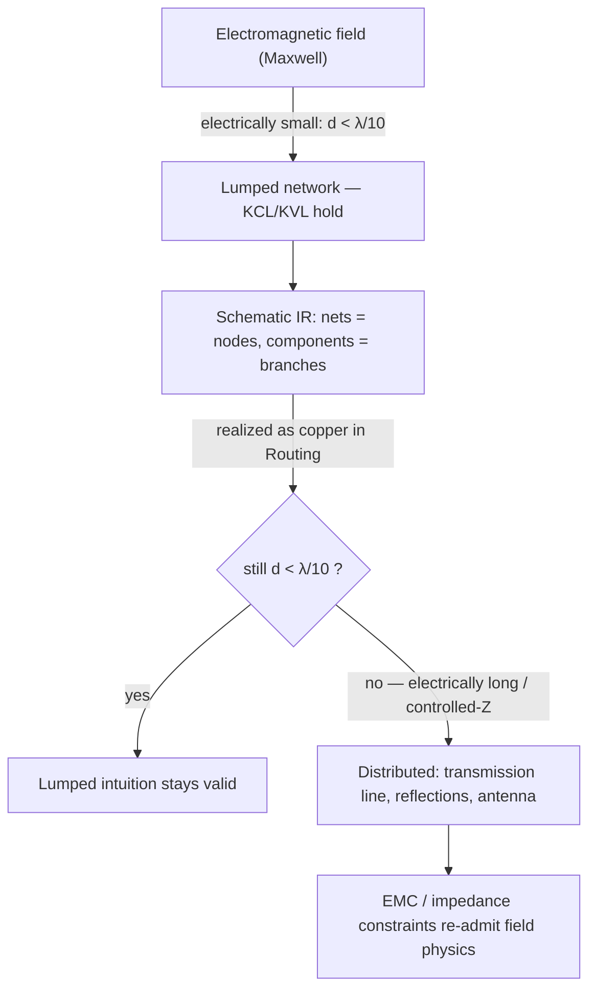
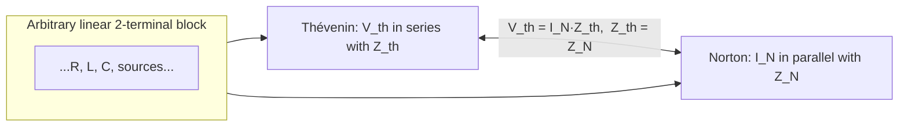

# Circuit Theory

**Summary.** Circuit theory is the engineering science that reduces the continuous electromagnetic field of a real board to a finite, solvable network of idealized elements — resistors, capacitors, inductors, sources, and ports — connected at equipotential nodes, governed by Kirchhoff's laws and a handful of exact network theorems. It belongs in the Engineering Science Layer because it *is the abstraction the schematic lives in*: the [Schematic IR](../../docs/compiler/ir/schematic-ir.md) is, formally, a lumped-element network — [Components](../../docs/foundation/engineering-domain-model.md#component) are branches, [Nets](../../docs/foundation/engineering-domain-model.md#net) are nodes, and "[Net] = the transitive closure of [Connections](../../docs/foundation/engineering-domain-model.md#connection)" is precisely the lumped assumption that every point on a net shares one voltage. This document states the laws and theorems that make that abstraction valid, derives the single condition under which it *holds* (electrical smallness, the `λ/10` boundary shared with [Maxwell's equations](../physics/maxwell-equations.md)), and maps each result to the EAK engine, IR, or rule that depends on it — including where the abstraction *breaks* and the runtime must re-admit distributed physics (impedance-controlled nets, the regulator VIN/VOUT split, the EMC electrically-long check).

---

## Core principles

### The lumped abstraction and its single precondition

A *lumped element* is a component whose internal physical extent is ignored: all of its electromagnetic behavior is concentrated into a terminal relation between the voltage across it and the current through it. The lumped model is legitimate **only** when the circuit is *electrically small* — its largest dimension `d` is small compared with the wavelength `λ` of the highest significant frequency:

```text
d ≪ λ = v / f        (v = c / √ε_eff, the signal velocity in the medium)
Practical boundary:  d < λ/10     ⇒  lumped circuit theory applies
                     d ≥ λ/10     ⇒  distributed (transmission-line) theory required
```

Under electrical smallness, propagation delay across the element is negligible, so charge does not accumulate along a wire and the magnetic flux threading a loop can be assigned to discrete inductances. The two consequences are **Kirchhoff's laws** — themselves the quasi-static limit of the continuity equation and Faraday's law derived in [Maxwell's equations](../physics/maxwell-equations.md):

```text
KCL (Kirchhoff's Current Law):   Σ i_k = 0  at every node   ⟸  ∇·J = 0  (charge continuity, no node storage)
KVL (Kirchhoff's Voltage Law):   Σ v_k = 0  around every loop ⟸  ∮ E·dl = 0  (no net enclosed dΦ/dt)
```

KCL is why a [Net](../../docs/foundation/engineering-domain-model.md#net) can be treated as one node; KVL is why a [Connection](../../docs/foundation/engineering-domain-model.md#connection) carries one well-defined potential. When `d ≥ λ/10`, KVL fails along the conductor (voltage varies with position), the net is no longer one node, and the schematic abstraction must hand off to the distributed model.


*Figure: circuit theory is the middle layer — the schematic is valid lumped network only while electrical smallness holds; routing can break it, and the runtime re-checks.*

### Element constitutive laws and impedance

Each lumped element is defined by its terminal relation. In the time domain and, for sinusoidal steady state, as a complex **impedance** `Z(jω) = V/I` (the phasor ratio):

```text
Element     Time domain            Impedance Z(jω)        Admittance Y(jω)=1/Z
--------    -------------------    -------------------    --------------------
Resistor    v = R·i                Z_R = R                Y_R = G = 1/R
Inductor    v = L·di/dt            Z_L = jωL              Y_L = 1/(jωL)
Capacitor   i = C·dv/dt            Z_C = 1/(jωC) = −j/ωC  Y_C = jωC
```

Impedance generalizes resistance to the complex plane: `Z = R + jX` (resistance `R`, reactance `X`); admittance is `Y = G + jB` (conductance `G`, susceptance `B`). The magnitude `|Z|` scales voltage to current; the angle `∠Z` sets the phase between them and therefore the real vs. reactive power split. Series elements add impedance (`Z = ΣZ_k`); parallel elements add admittance (`Y = ΣY_k`). This is the algebra the runtime uses whenever a net carries a *target impedance* rather than a bare resistance.

### Network theorems (exact, for linear time-invariant networks)

For any network of linear elements, four theorems let the runtime reason about a sub-circuit without solving the whole board:

- **Superposition.** The response (any branch voltage or current) to several independent sources equals the sum of responses to each source acting alone, with the others *zeroed* — voltage sources shorted, current sources opened. Valid because linear elements obey a linear operator; it fails the moment a nonlinear part (diode, transistor in large signal) enters, which is why it is a *small-signal* tool.

- **Thévenin's theorem.** Any linear two-terminal network reduces to one voltage source `V_th` in series with one impedance `Z_th`, where `V_th` is the open-circuit terminal voltage and `Z_th` is the impedance seen with all independent sources zeroed.

- **Norton's theorem.** The dual: one current source `I_N` in parallel with `Z_N`. The equivalences are exact and interchangeable:

```text
Z_th = Z_N            V_th = I_N · Z_th            I_N = V_th / Z_th
```

- **Maximum power transfer.** A source `(V_th, Z_th)` delivers maximum power to a load when `Z_load = Z_th*` (complex conjugate); for purely resistive networks, `R_load = R_th`. This is the formal basis of *impedance matching* — and the reason a controlled-impedance net exists at all.

- **Reciprocity.** In a linear, passive, bilateral network the transfer impedance between two ports is symmetric (`Z_21 = Z_12`); a stimulus at port A producing a response at port B yields the identical transfer if swapped. It underwrites the symmetry of the two-port parameters below.


*Figure: every linear sub-network collapses to a single source plus a single port impedance — the model behind treating a regulator output or a driver pin as a source with a source impedance.*

### The three analysis regimes: DC, AC, transient

The same network is solved in three regimes; each is a specialization of the nodal equations.

- **DC (operating point).** Set `d/dt = 0`: capacitors become open circuits, inductors become shorts. KCL at every node gives a linear system, **Modified Nodal Analysis**:

```text
G · v = i        (G = nodal conductance matrix, v = node voltages, i = source currents)
```

This `G·v = i` is a real linear system — the same `Ax = b` solved in [linear algebra](../mathematics/linear-algebra.md). It answers "what is the steady DC voltage on this rail and how much current does each branch carry" — the question behind IR-drop and current-limit checks (see [Ohm's law](ohms-law.md)).

- **AC (sinusoidal steady state).** Replace each element by its complex impedance and each source by a phasor; the system becomes complex-valued, solved per frequency:

```text
Y(jω) · V = I        (Y complex nodal admittance matrix; V, I complex phasors)
```

Sweeping `ω` yields the transfer function `H(jω)` — gain and phase vs. frequency — the basis of filter response, decoupling effectiveness, and the impedance a net presents at a given frequency.

- **Transient (time domain).** Keep the derivatives: the network is a system of first-order ODEs in the energy-storage states (capacitor voltages, inductor currents). Canonical cases:

```text
First-order (RC):   v(t) = V_∞ + (V_0 − V_∞)·e^(−t/τ),   τ = R·C   (RL: τ = L/R)
Second-order (RLC): ω_0 = 1/√(LC),  ζ = (R/2)·√(C/L)
                    ζ<1 underdamped (ringing) · ζ=1 critical · ζ>1 overdamped
```

The time constant `τ` and damping `ζ` govern edge rates, settling, and overshoot — exactly the quantities that decide whether a fast edge stays electrically short or rings, linking back to the `λ/10` boundary.

### Two-port networks: the interface contract

A great deal of a board is *blocks with an input port and an output port* — amplifiers, filters, regulators, connectors. A two-port abstracts a sub-circuit to a 2×2 matrix relating its terminal voltages and currents, hiding internal structure behind an interface:

```text
Impedance (Z):   [V1]   [Z11 Z12][I1]        Admittance (Y):  [I1] = [Y11 Y12][V1]
                 [V2] = [Z21 Z22][I2]                         [I2]   [Y21 Y22][V2]

Cascade (ABCD):  [V1]   [A B][ V2]            High frequency:  scattering (S) params
                 [I1] = [C D][−I2]                             relate incident/reflected waves
```

Two-port parameters compose: cascaded blocks multiply their ABCD matrices, so a signal chain's overall behavior is the matrix product of its stages. Reciprocity forces `Z12 = Z21` for passive blocks. The two-port view is the formal reason the runtime treats a regulator as a device with *distinct input and output ports* — different terminal pairs, different impedances, different return loops — rather than one undifferentiated node.

---

## Why it matters for electronics & PCB design

Circuit theory is the layer in which a design is *first* a circuit rather than a drawing. Every schematic-level decision is a circuit-theory statement:

- **A net is an equipotential node.** Connecting pins onto one net asserts KCL holds there and that all those pins see the same voltage. That assertion is only true while the net is electrically small — which is why the same connection can be correct as a schematic net yet wrong as a long unterminated trace.
- **Source/load compatibility is a Thévenin/Norton question.** Whether a driver pin can drive a load, whether a divider sets the intended voltage, whether a rail sags under current — all are `V_th`, `Z_th`, and KCL computations. Pin electrical-type rules (output-driving-output, input-floating) are circuit-theory legality checks.
- **Impedance matching is maximum-power-transfer made physical.** A "50 Ω" or "100 Ω differential" net is a controlled `Z_0` so that the load impedance matches the line and reflections vanish — the lumped theorem `Z_load = Z_th*` projected onto distributed geometry.
- **Decoupling is an AC-impedance design.** A decoupling capacitor is chosen so the power net's `|Z(jω)|` stays low across the load's spectrum; this is an `Y(jω)·V = I` problem, not a DC one.
- **Edge timing is a transient `τ`/`ζ` problem.** Whether an edge rings or settles cleanly is the second-order RLC response of the trace-plus-load loop.

Because these are theorems on a *linear* model, they are exact within their domain — and the one thing that invalidates them is leaving that domain (nonlinearity, or loss of electrical smallness). A runtime that respects where the lumped model is valid is correct by construction; one that treats the schematic as an abstract netlist with no notion of *when a net stops being a node* is electrically blind exactly where boards fail.

---

## Mapping to the runtime

This is the point of the layer: the results above are *implemented assumptions* of specific EAK artifacts. Where the runtime would silently produce an electrically wrong board if the principle were ignored, that is an engineering bug.

| Circuit-theory result | Runtime artifact that embodies / depends on it | Why violating it is a runtime bug |
|---|---|---|
| Net = one equipotential node (KCL + electrical smallness) | The [Schematic IR](../../docs/compiler/ir/schematic-ir.md) invariant *"Net = transitive closure of Connections"* and *"every Pin resolves into exactly one Net"* | The invariant literally encodes the lumped node. If the IR admitted a "net" that is electrically long without flagging it, it would assert one voltage where physics has many — a graph-valid, circuit-invalid net. |
| Lumped abstraction valid only below `λ/10` | The `λ/10 = c/(10·f)` electrically-long check in [EMC Analysis](../../docs/state-machines/emc-analysis.md) (Phase 13) over the [Verification Engine](../../docs/engineering/verification-engine.md) | This is the exact boundary where the schematic's lumped assumption stops holding. The EMC rule is the runtime's guard that a net the schematic treated as a node has not become a distributed line/antenna once routed. |
| Controlled impedance `Z_0` (max-power-transfer / matching) | [Net class](../../docs/compiler/ir/schematic-ir.md) "target impedance" property carried into the [Constraint Engine](../../docs/engineering/constraint-engine.md), realized by [per-net-class trace widths](../../docs/state-machines/routing-planning.md) (Phase-3 increment 10) | A net tagged with a target impedance is one where the lumped node abstraction has been *deliberately replaced* by a distributed `Z_0` requirement. Choosing width without honoring that `Z_0` mismatches the line and produces reflections — a circuit-theory error the width constraint exists to prevent. |
| Thévenin/Norton source-vs-load + pin legality | [ERC Verification](../../docs/state-machines/erc-verification.md) (Phase 7) over pin electrical types (output/input/power/passive) on the [Schematic IR](../../docs/compiler/ir/schematic-ir.md) | ERC's pin-conflict rules (two outputs driving, floating input, power-vs-output clash) are Thévenin/KCL legality checks. Passing an illegal source/load pairing ships a circuit that cannot satisfy KCL with consistent voltages. |
| Distinct ports have distinct impedances/return loops (two-port) | The **regulator VIN/VOUT power-rail split** (Phase-3 increment 11) separating the collapsed rail into input and output [Nets](../../docs/foundation/engineering-domain-model.md#net) | A regulator is a two-port: its input port (`V_th`, ripple current) and output port (regulated, load current) are electrically different. Merging them into one net violates the two-port model and shares source impedance, coupling input noise onto the output — the bug the split fixes. |
| DC nodal solution `G·v = i` (IR drop, current limits) | Net `max current` / `voltage` electrical properties as typed [Physical Quantities](../../docs/engineering/units-and-quantities.md), checked against trace ampacity in routing/DRC | These limits are the DC operating-point answer for the net. Carrying them as bare numbers or ignoring them would let a branch exceed its `i = v/R` current without a violation — a missed DC-overstress bug. |
| Impedance/voltage/current are typed quantities, not scalars | [Units & quantities](../../docs/engineering/units-and-quantities.md) typing consumed across ERC/DRC/constraints | `Z`, `V`, `I` are dimensioned. A runtime that compared an impedance target to a width as plain floats would conflate quantities the theory keeps distinct — a units bug masquerading as a value. |
| A net's distributed reality is decided in layout | Orchestrator routes EMC/impedance failures **back to [Routing Planning](../../docs/state-machines/routing-planning.md)**, where geometry (width, length, reference) is set | Whether the lumped abstraction survives is a *geometry* outcome. A length/impedance failure must be corrected where geometry is chosen; looping back to the schematic would treat a layout-caused distributed problem at the wrong phase. |

In short: the [Schematic IR](../../docs/compiler/ir/schematic-ir.md) *is* the lumped network and its node/branch invariants are circuit theory written as data constraints; the [Constraint Engine](../../docs/engineering/constraint-engine.md) holds the quantities (impedance target, max current, voltage) the theorems compute; [ERC](../../docs/state-machines/erc-verification.md) enforces the linear-network legality of sources and nodes; and [Routing Planning](../../docs/state-machines/routing-planning.md) plus [EMC Analysis](../../docs/state-machines/emc-analysis.md) are where the runtime checks whether the lumped abstraction still holds once nets become copper. The [Planning Engine](../../docs/engineering/planning-engine.md) proposes the circuit; the deterministic checks ensure it is a *valid* circuit.

---

## Failure modes if violated

- **Treating an electrically-long net as a single node.** The schematic asserts one voltage; the routed copper has many. Reflections, timing, and emission failures result. If the runtime lacks the `λ/10` re-check ([EMC Analysis](../../docs/state-machines/emc-analysis.md)), it ships a net that is circuit-valid on paper and distributed-broken in copper.
- **Ignoring the controlled-impedance handoff.** A net carrying a `Z_0` target but routed with a geometry-blind width is a mismatched line; the max-power-transfer condition is violated and energy reflects. The [per-net-class width](../../docs/state-machines/routing-planning.md) constraint exists precisely to prevent this.
- **Illegal source/load topology.** Two outputs on a net, a floating input, or a power pin tied to a signal output cannot satisfy KCL with a consistent Thévenin voltage. Without [ERC](../../docs/state-machines/erc-verification.md) pin-type checks, such a circuit passes connectivity validation yet has no physical operating point.
- **Collapsing distinct ports.** Merging a regulator's input and output nets denies the two-port model; the shared return impedance lets input ripple modulate the regulated output. The [VIN/VOUT split](../../docs/state-machines/routing-planning.md) is the corrective.
- **Applying superposition across a nonlinearity.** Superposition and the linear network theorems hold only for LTI elements; using them where a diode or large-signal transistor sits gives wrong predictions. The runtime must scope linear reasoning to linear sub-circuits.
- **Dropping reactance / treating AC as DC.** Decoupling and filtering are `Y(jω)·V = I` problems; reducing them to a DC `G·v = i` ignores the very impedance vs. frequency behavior that makes them work, under-predicting rail noise.

Each failure is, at root, the lumped model used outside its domain of validity. The Engineering Science Layer exists so the runtime's invariants and rules are understood as circuit theorems with a known validity boundary, not arbitrary netlist conventions.

---

## Related documents

- [Ohm's law](ohms-law.md) — the DC special case `V = IR`, IR drop, and current density; the simplest element law in this network model.
- [Transmission lines & impedance](transmission-lines.md) — what the schematic's lumped net *becomes* past `λ/10`: `Z_0 = √(L/C)`, reflections, and the distributed model that supersedes the node abstraction.
- [Maxwell's equations](../physics/maxwell-equations.md) — the field axioms from which KCL/KVL and the `λ/10` electrical-smallness boundary are derived.
- [Electromagnetics](../physics/electromagnetics.md) — fields, energy, and the constitutive relations behind the element impedances.
- [Linear algebra](../mathematics/linear-algebra.md) — `G·v = i` and `Y(jω)·V = I` as the matrix systems a circuit solve reduces to.
- [Graph theory](../mathematics/graph-theory.md) — nets and connections as a graph; the transitive closure that defines a node.
- Runtime anchors: [Schematic IR](../../docs/compiler/ir/schematic-ir.md) · [Engineering Domain Model](../../docs/foundation/engineering-domain-model.md) · [Constraint Engine](../../docs/engineering/constraint-engine.md) · [ERC Verification](../../docs/state-machines/erc-verification.md) · [Routing Planning](../../docs/state-machines/routing-planning.md) · [EMC Analysis](../../docs/state-machines/emc-analysis.md) · [Verification Engine](../../docs/engineering/verification-engine.md) · [Units & quantities](../../docs/engineering/units-and-quantities.md) · [GLOSSARY](../../docs/GLOSSARY.md).
</content>
</invoke>
