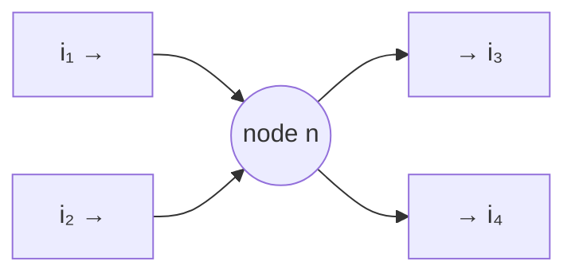
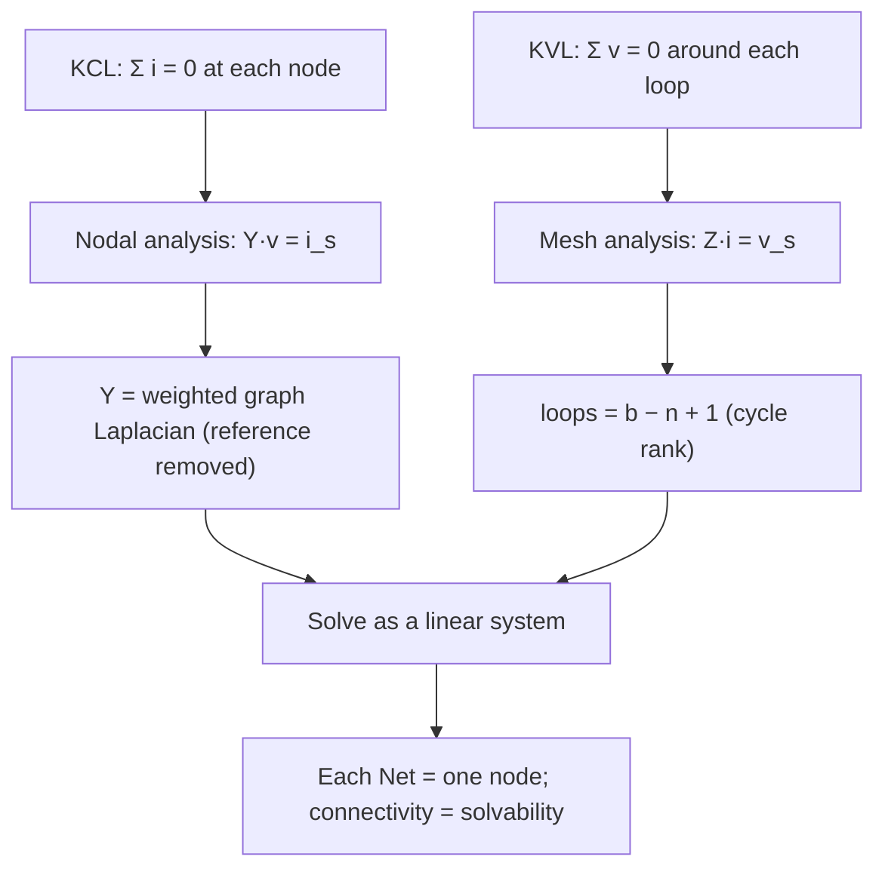
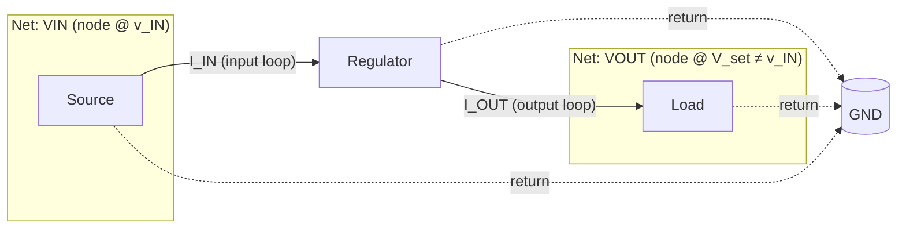

# Kirchhoff's Laws

**Summary.** Kirchhoff's Current Law (KCL) and Voltage Law (KVL) are the two conservation laws that turn a tangle of components into a solvable circuit: charge is conserved at every node, and energy is conserved around every loop. They belong in the Engineering Science Layer because they are the *axioms of connectivity itself* — the reason a [Net](../../docs/foundation/engineering-domain-model.md#net) is a meaningful object, the reason an [ERC](../../docs/state-machines/erc-verification.md) rule can declare a schematic electrically wrong, the reason a power rail can be reasoned about as a budget, and the reason a regulator's input and output are two different nets rather than one. The EAK runtime never "solves the circuit" with a SPICE-style matrix, yet every connectivity check, every current/voltage constraint, and every power-rail decision it makes is a special case of these two laws applied to the design graph. This document states KCL/KVL precisely, derives them from charge and energy conservation, develops the nodal and mesh formulations that make them computable, and maps each consequence to the EAK engine, IR, state machine, or verification rule that silently assumes it — culminating in a first-principles proof of why a [voltage regulator's](../../docs/agents/planning-agent.md) VIN and VOUT must be distinct nets.

---

## Core principles

### The lumped-element regime (where Kirchhoff is exact)

Kirchhoff's laws are the *quasi-static, lumped-element* specialization of [Maxwell's equations](../physics/maxwell-equations.md). They hold whenever every conductor in the circuit is **electrically short** — its physical length is small compared with the wavelength `λ` of the highest significant frequency, conventionally `length < λ/10`. In that regime, propagation delay along a wire is negligible, no significant time-varying magnetic flux threads the gaps between components, and the electric field outside components is conservative. Then, and only then, can we speak of "the voltage at a node" and "the current in a branch" as single well-defined numbers. Above `λ/10` the lumped abstraction breaks and one must use transmission-line / full-wave models instead (see [Transmission lines & impedance](transmission-lines.md) and the `λ/10` antenna boundary in [Maxwell's equations](../physics/maxwell-equations.md)). The EAK runtime relies on the lumped regime for connectivity and DC/low-frequency reasoning, and switches to the field-aware rules ([EMC](../../docs/state-machines/emc-analysis.md)) exactly where this boundary is crossed.

### KCL — conservation of charge at a node

> **Kirchhoff's Current Law.** At every node `n`, at every instant `t`, the algebraic sum of currents entering the node is zero.

```text
KCL:   Σ_{k ∈ branches(n)} i_k(t) = 0        for every node n, every time t
       (currents leaving the node counted negative)
```

This is not an independent postulate; it is the **continuity equation** `∇·J + ∂ρ/∂t = 0` integrated over a closed surface around the node. A lumped node holds negligible net charge (`∂Q/∂t ≈ 0`), so the total conduction current crossing its boundary must be zero. Charge cannot accumulate or vanish at a junction — what flows in must flow out. Where a "current" appears to terminate (a capacitor plate, a gate input), the loop is closed by **displacement current** `∂D/∂t`, which continuity counts on equal footing; the lumped surrogate for that term is the capacitor element. KCL is therefore the law that makes the very idea of an electrical *node* — a set of pins that are all electrically common — physically coherent.


*Figure: KCL at a node — `i₁ + i₂ = i₃ + i₄`; charge in equals charge out, instant by instant.*

### KVL — conservation of energy around a loop

> **Kirchhoff's Voltage Law.** Around every closed loop, at every instant, the algebraic sum of the branch voltages is zero.

```text
KVL:   Σ_{k ∈ loop(ℓ)} v_k(t) = 0           for every closed loop ℓ, every time t
       (equivalently: Σ EMF rises = Σ voltage drops)
```

KVL is **Faraday's law** `∮ E·dl = −dΦ_B/dt` in the lumped limit. When no time-varying magnetic flux threads the loop (or all such flux is lumped into inductor elements counted as branch voltages `v_L = L·di/dt`), the line integral of `E` around any closed path is zero. That is exactly the statement that the electrostatic potential is **single-valued and path-independent**: going around any loop and returning to the start must bring you back to the same potential. KVL is therefore energy conservation — moving a unit charge around a closed loop does zero net work — and it is what licenses assigning one number, the *node voltage*, to each node.

### The two laws together: Tellegen and power balance

KCL and KVL are *topological* — they depend only on how the graph is wired, not on what the elements are. A striking consequence is **Tellegen's theorem**: for any circuit graph, with branch currents `i_k` obeying KCL and branch voltages `v_k` obeying KVL,

```text
Σ_k v_k · i_k = 0          (instantaneous power summed over all branches is zero)
```

i.e. power delivered by sources exactly equals power absorbed by the rest — energy is conserved with no leftover. This is the formal statement of "the power has to go somewhere," and it is the ledger the runtime must respect when it reasons about a regulator that dissipates `V·I` as heat (see [Thermal physics](../physics/thermal-physics.md)) or a rail that must source the sum of its loads' currents.

### Reference node, sign convention, and superposition

Two practical points the laws depend on. First, KVL fixes only *potential differences*; absolute node voltages are meaningful only relative to a chosen **reference node** (ground, defined as `v = 0`). Choosing that reference is what makes the node-voltage vector `v` well-defined and the Laplacian `Y` invertible — it removes the one degree of freedom (a uniform potential shift) that KVL leaves free. In the runtime this is why a design needs an explicit ground/return net: without a reference node there is no absolute voltage to check a rail against.

Second, both laws are **linear** in the source quantities. For a linear circuit, superposition holds: the response to several independent sources is the sum of the responses to each alone. This is what lets a power rail be analysed as an additive **current budget** — each load contributes its KCL term independently, and the rail must source their sum at worst case. The linearity is also why nodal/mesh analysis is a *linear* system (`Y·v = i_s`) solvable by [linear algebra](../mathematics/linear-algebra.md) rather than a general nonlinear solve, for the resistive/reactive elements the runtime reasons about at the connectivity level.

### A Net *is* a node — the bridge to the runtime

The single most important mapping in this whole document: the EAK [Net](../../docs/foundation/engineering-domain-model.md#net) — *"the transitive closure of [Connections](../../docs/foundation/engineering-domain-model.md#connection): a set of [Pins](../../docs/foundation/engineering-domain-model.md#pin) that are all electrically common"* — is precisely a **KCL node**. Calling a set of pins "electrically common" is an assertion that they share one node voltage (KVL) and that the currents into them sum to zero (KCL). Every downstream fact follows from taking that identity seriously:

- A net with **one pin** has no possible current loop — KCL is trivially unsatisfiable for any non-zero current. It is a dangling node and an ERC error.
- A net with **two or more drivers** (two low-impedance voltage sources at different setpoints on the same node) is a KVL contradiction: the node cannot simultaneously be at two voltages; KCL then predicts unbounded fault current. This is the *output-driving-output* ERC rule.
- A **power net** must contain at least one source and at least one sink, or KCL can carry no steady current — the *unconnected-power* ERC rule.

### Nodal analysis — KCL made computable

Nodal analysis is the systematic application of KCL. Pick a reference node (ground, `v = 0`); write KCL at each of the remaining `n−1` nodes, expressing each branch current through its element law (for resistors, [Ohm's law](ohms-law.md) `i = G·v`). The result is a linear system:

```text
Y · v = i_s
  Y    = node-conductance matrix  (symmetric, weighted graph Laplacian of the circuit, reference row/col removed)
  v    = vector of unknown node voltages
  i_s  = vector of independent source currents injected at each node
```

`Y` is, exactly, the **weighted Laplacian** of the circuit graph (off-diagonal `−G_ij` for the conductance between nodes `i,j`; diagonal the sum of incident conductances) with the reference node deleted — the same Laplacian studied in [Graph theory](../mathematics/graph-theory.md) and solved by the methods in [Linear algebra](../mathematics/linear-algebra.md). Connectivity of the design graph is what makes `Y` non-singular; an isolated net is a zero pivot. This is the deep reason connectivity checking and solvability are the same question.

### Mesh analysis — KVL made computable, and a graph-theory invariant

Mesh analysis is the dual: write KVL around each independent loop, expressing each branch voltage through its element law, and solve for loop currents. The number of *independent* loops is not a matter of taste — it is fixed by the topology:

```text
independent loops  ℓ = b − n + 1        (connected graph: b branches, n nodes)
```

This `b − n + 1` is the **cyclomatic number / first Betti number** of the graph — the dimension of its cycle space — borrowed directly from [Graph theory](../mathematics/graph-theory.md). It equals the number of branches that a spanning tree leaves out; each such "chord" closes exactly one fundamental loop. Nodal analysis uses the `n−1` node equations; mesh analysis uses the `b−n+1` loop equations; together they account for all `b` branch unknowns. The runtime never builds these matrices, but the *counting* matters: it tells the [Routing Planning](../../docs/state-machines/routing-planning.md) machine that realizing a net means connecting a spanning set of its pins so that a current loop physically exists.


*Figure: the two laws become the two computable formulations, both of which reduce to graph + linear-algebra objects the runtime already understands.*

### Why a regulator's VIN and VOUT are distinct nets — a proof

This is the headline consequence and a real EAK implementation increment (the *regulator VIN/VOUT power-rail split*). Treat the regulator as a two-port whose **device equation** fixes the output: `v_OUT ≈ V_set`, a constant determined by the part's feedback setpoint, generally **not equal** to `v_IN`. Now suppose, for contradiction, that the VIN pin and the VOUT pin were placed on the *same* [Net](../../docs/foundation/engineering-domain-model.md#net):

1. **KVL contradiction.** A Net is one equipotential node, so one node voltage `v_n`. Merging forces `v_IN = v_OUT = v_n`. But the device equation requires `v_OUT = V_set ≠ v_IN`. A single node cannot hold two distinct potentials — direct violation of the single-valued-potential meaning of KVL.
2. **KCL / loop contradiction.** The input draws current `I_IN` through the *input loop* (source → regulator → ground); the output sources current `I_OUT` through a *different output loop* (regulator → load → ground). In general `I_IN ≠ I_OUT`. These are two distinct fundamental loops with distinct return currents; one node cannot bookkeep both current balances correctly.
3. **Energy-ledger contradiction (Tellegen).** A real regulator dissipates `P_loss = V_IN·I_IN − V_OUT·I_OUT > 0` as heat. That loss term is carried by the *difference* between the input and output loops. Collapse them into one node and the loop that accounts for the dissipated power vanishes from the model — the energy ledger no longer balances (see [Thermal physics](../physics/thermal-physics.md) for where that heat goes).

All three contradictions disappear the instant VIN and VOUT are **separate nodes / separate Nets**. Therefore the split is not a stylistic convention; it is forced by KCL, KVL, and energy conservation. A runtime that merged them would be producing an electrically impossible model.


*Figure: VIN and VOUT are two nodes at two potentials carrying two loop currents — collapsing them violates KVL, KCL, and the energy ledger simultaneously.*

---

## Why it matters for electronics & PCB design

Connectivity is the first thing that is true or false about a design, and Kirchhoff's laws are what "connected correctly" *means*:

- **Connectivity = a well-formed node graph.** A schematic is electrically valid only if every net is a sensible KCL node: drivers and loads in the right counts, no two sources fighting, no floating single-pin islands. ERC is mechanized KCL/KVL bookkeeping over the net graph.
- **Power-rail integrity is a KCL budget plus an Ohmic correction.** At a rail node, KCL says the regulator/plane must source the sum of every load's current, simultaneously, at the worst case. The *ideal* rail is one equipotential node; reality adds [Ohm's-law](ohms-law.md) `IR` drop and `L·di/dt` along the distribution, so the single-node idealization degrades unless the copper is wide/low-impedance enough — which is exactly why trace width is a current-carrying decision, not cosmetics.
- **Distinct loops must stay distinct.** Merging two current loops onto one net (regulator input/output, analog/digital ground, sensitive/noisy returns) shares return impedance and injects one loop's `di/dt` noise into another. The fix is topological: keep them as separate nodes/nets and join them at one controlled point.
- **Every signal needs a return.** KCL forbids a current that does not return; routing a forward net without guaranteeing a return path produces a graph that is connection-complete but loop-broken — valid in the abstract netlist, impossible in physics (the field-level version of this is in [Maxwell's equations](../physics/maxwell-equations.md)).

Because these are conservation theorems and not heuristics, a runtime that models nets as KCL nodes and enforces the loop/source/sink obligations is *correct by construction*; one that treats a net as a mere undirected connection set is blind to whether current can actually flow.

---

## Mapping to the runtime

This is the point of the layer: KCL/KVL are *implemented assumptions* of specific EAK artifacts. Where the runtime would silently accept an electrically impossible design if the law were ignored, that is an engineering bug.

| Kirchhoff consequence | Runtime artifact that embodies / depends on it | Why violating it is a runtime bug |
|---|---|---|
| A [Net](../../docs/foundation/engineering-domain-model.md#net) is one equipotential **KCL node** | The Net entity in the [Schematic IR](../../docs/compiler/ir/schematic-ir.md) and [PCB IR](../../docs/compiler/ir/pcb-ir.md); the "transitive closure of [Connections](../../docs/foundation/engineering-domain-model.md#connection)" definition | If the IR let one Net hold two distinct potentials or pins that are not truly common, every downstream current/voltage reasoning step would be computing on a fiction. |
| Two drivers on a node is a KVL conflict; a one-pin net cannot satisfy KCL | The **output-driving-output**, **unconnected-power**, and no-connect rules in [ERC Verification](../../docs/state-machines/erc-verification.md) (Phase 7) over the [Verification Engine](../../docs/engineering/verification-engine.md) | These rules are mechanized KCL/KVL. Failing to flag them ships a schematic that cannot carry the currents/voltages it implies; `ERCFailed` correctly loops back to [Schematic Planning](../../docs/state-machines/schematic-planning.md). |
| Every node needs a closed current loop (KCL: no current that doesn't return) | The `drc-unrouted-net` rule in [DRC Verification](../../docs/state-machines/drc-verification.md) — *"every committed net must be realized by at least one routed track; an unrouted net is an electrical break"* | A net realized as an open (no physical path) is a node with no loop — KCL can carry no current through it. The rule promotes that silent break to a traceable violation. |
| Realizing a net means physically closing its loop | [Routing Planning](../../docs/state-machines/routing-planning.md) (Phase 10) net-realization completeness check (every Net's Connections realized, *no more, no less*) | Over-realizing creates an unintended loop (a short / KVL contradiction); under-realizing leaves a KCL-dead node. The "exactly the connections" invariant is the topological correctness condition. |
| Rail current = KCL sum of loads; single-node ideal degrades by `IR` drop | **Per-net-class trace widths** (Phase-3 increment 10) carried as [Constraint Engine](../../docs/engineering/constraint-engine.md) net-class `max current` / impedance constraints; the power/ground/signal net classes on the [Net](../../docs/foundation/engineering-domain-model.md#net) entity | Width sized below the KCL current budget makes the rail's `IR` drop break the equipotential-node assumption — brown-out at the far load. Width is a KCL/[Ohm](ohms-law.md) quantity. |
| Distinct loops must be distinct nodes (regulator VIN ≠ VOUT) | The **regulator VIN/VOUT power-rail split** (Phase-3 increment 11) separating the collapsed rail into input and output [Nets](../../docs/foundation/engineering-domain-model.md#net) | Merging them is a simultaneous KVL, KCL, and energy-ledger contradiction (proven above). The split exists precisely so the runtime never emits that impossible model. |
| Voltages/currents are typed conserved quantities | [Units & quantities](../../docs/engineering/units-and-quantities.md) typing of `Voltage`- and `Current`-dimensioned targets, consumed by ERC and the rail constraints | KCL sums currents and KVL sums voltages; adding a current to a voltage, or summing mismatched units, is a dimensional bug the quantity types prevent before the laws are even applied. |
| Power balances (Tellegen): dissipation must be accounted | The regulator's `P_loss = V_IN·I_IN − V_OUT·I_OUT` flowing into [thermal](../physics/thermal-physics.md) constraints; loss-bearing loop preserved by the VIN/VOUT split | If the model collapses the loop that carries the dissipated power, the thermal budget loses its source term and under-predicts heating. |
| Connectivity = solvability of the node Laplacian | The connectivity guarantees the [Constraint Engine](../../docs/engineering/constraint-engine.md) and verification phases assume when they reason per-net | A disconnected or ill-formed net graph is a singular Laplacian — the circuit is unsolvable. Verification must treat an indeterminate net as *not passable*, never a silent pass ([Verification Engine](../../docs/engineering/verification-engine.md) policy). |

In short: the [Schematic IR](../../docs/compiler/ir/schematic-ir.md) and [PCB IR](../../docs/compiler/ir/pcb-ir.md) encode each Net as a KCL node; [ERC](../../docs/state-machines/erc-verification.md) and [DRC](../../docs/state-machines/drc-verification.md) enforce that those nodes have well-formed loops, sources, and sinks; the [Constraint Engine](../../docs/engineering/constraint-engine.md) holds the KCL/Ohm numeric limits (current, width, impedance); and the [Workflow Orchestrator](../../docs/core/workflow-orchestration.md) routes a violated electrical law back to the phase that can fix it. The [Reasoning Engine](../../docs/engineering/planning-engine.md) proposes; these conservation laws are the truth it must respect.

---

## Failure modes if violated

- **Floating / single-pin net.** A node with no possible current loop. KCL is unsatisfiable for any non-zero current; the pin's state is undefined. Caught by ERC; if the rule set is blind to it, the runtime ships a schematic with a dead node.
- **Contending drivers (output-driving-output).** Two low-impedance sources at different setpoints on one node — a KVL contradiction predicting unbounded fault current. An ERC gap here ships a guaranteed-damage schematic.
- **Unrouted / loop-broken net.** A net that is connection-complete in the netlist but realized as an open has no closed current loop — KCL-dead. The `drc-unrouted-net` rule exists to convert this from a silent assumption into a traceable [Violation](../../docs/foundation/engineering-domain-model.md#violation).
- **Under-sized power rail.** Treating a rail as a perfect single node while routing it too thin lets `IR` drop and `L·di/dt` violate the equipotential assumption — the far load sees a collapsed voltage. The per-net-class width constraint is the guard; ignore it and KCL's current budget silently fails Ohm's correction.
- **Merged distinct loops (VIN/VOUT, AGND/DGND).** Sharing one node across two current loops injects one loop's `di/dt` noise into the other and, for a regulator, makes the model electrically impossible. The VIN/VOUT split is the structural fix; without it the runtime emits a circuit that violates three conservation statements at once.
- **Unit-mismatched conservation sum.** Summing a current into a KVL voltage loop, or mixing units in a KCL sum, is a dimensional error that corrupts the law before it is applied — prevented by typed [quantities](../../docs/engineering/units-and-quantities.md), dangerous without them.

Each failure is detectable from the net graph the runtime already holds; the Engineering Science Layer exists so these checks are understood as Kirchhoff theorems — conservation of charge and energy — rather than arbitrary lint rules.

---

## Related documents

- [Ohm's law](ohms-law.md) — the branch element law `v = i·R` that closes the KCL/KVL system and turns node equations into a solvable matrix; the source of rail `IR` drop.
- [Maxwell's equations](../physics/maxwell-equations.md) — the field axioms from which KCL (continuity) and KVL (Faraday) are the lumped, quasi-static specialization; the `λ/10` boundary where Kirchhoff stops being exact.
- [Transmission lines & impedance](transmission-lines.md) — what replaces lumped Kirchhoff once a conductor is electrically long.
- [Thermal physics](../physics/thermal-physics.md) — where the regulator's `P_loss` energy-ledger term (Tellegen) actually goes.
- [Graph theory](../mathematics/graph-theory.md) — the net graph, the weighted Laplacian behind nodal analysis, and the `b − n + 1` cycle rank behind mesh analysis.
- [Linear algebra](../mathematics/linear-algebra.md) — solving `Y·v = i_s`; singularity of the Laplacian as the signature of a disconnected net.
- Runtime anchors: [ERC Verification](../../docs/state-machines/erc-verification.md) · [DRC Verification](../../docs/state-machines/drc-verification.md) · [Routing Planning](../../docs/state-machines/routing-planning.md) · [Verification Engine](../../docs/engineering/verification-engine.md) · [Constraint Engine](../../docs/engineering/constraint-engine.md) · [Schematic IR](../../docs/compiler/ir/schematic-ir.md) · [PCB IR](../../docs/compiler/ir/pcb-ir.md) · [Units & quantities](../../docs/engineering/units-and-quantities.md) · [Engineering domain model](../../docs/foundation/engineering-domain-model.md#net) · [GLOSSARY](../../docs/GLOSSARY.md).
