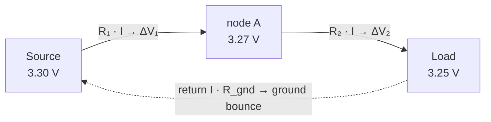
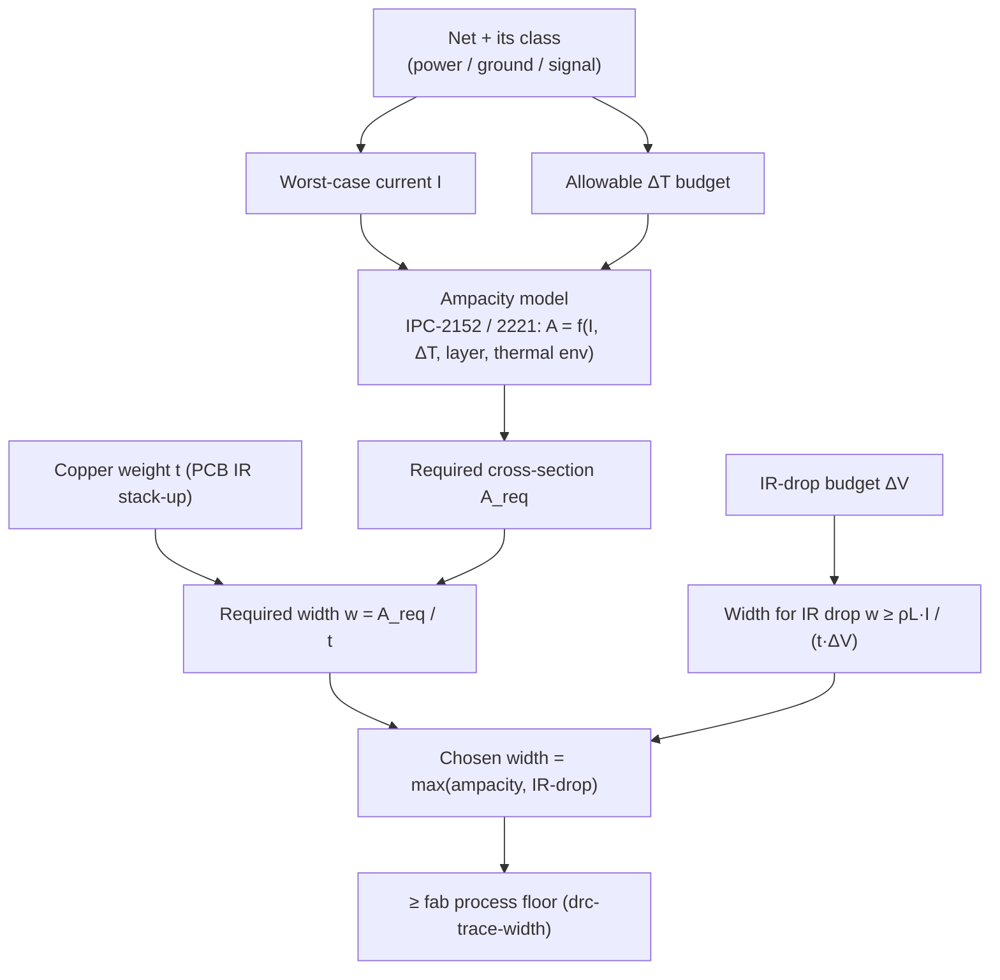

# Ohm's Law & Power

**Summary.** Ohm's law (`V = I·R`) and the power relation (`P = V·I`) are the two algebraic facts that turn a piece of copper geometry into an electrical prediction: how much voltage a current loses crossing a trace, and how much heat that loss deposits in the laminate. They belong in the Engineering Science Layer because a routed [Track](../../docs/foundation/engineering-domain-model.md#track--routing) is not a zero-resistance wire — its resistance is fixed by its length, width, copper thickness, and temperature, and that resistance both *drops voltage* (an `I·R` budget the load sees as a sagging rail) and *dissipates power* (`I²·R` self-heating that sets how much current the copper may carry before it overheats). This document grounds the DC reasoning that the runtime silently assumes whenever it picks a width: the [per-net-class trace widths](../../docs/state-machines/routing-planning.md) of Phase-3, the `drc-trace-width` process-floor rule in [DRC](../../docs/state-machines/drc-verification.md), the ampacity and IR-drop logic behind power-rail sizing, and the [regulator VIN/VOUT rail split](../../docs/state-machines/schematic-planning.md). It is the DC complement to the AC story in [electromagnetics](../physics/electromagnetics.md) (skin/proximity effect raise this DC resistance at high frequency) and to the return-current / cut-set argument in [graph theory](../mathematics/graph-theory.md) (IR drop along a shared return is the DC face of common-impedance coupling). When the runtime says "this rail is wide enough," it is asserting an Ohm's-law claim.

## Core principles

A vocabulary bridge first — every electrical quantity below names a PCB reality and is a typed [Physical Quantity](../../docs/foundation/engineering-domain-model.md#constraint) in [`units-and-quantities.md`](../../docs/engineering/units-and-quantities.md):

| Quantity | Symbol · unit | PCB meaning |
|----------|---------------|-------------|
| Voltage | `V` · V (volt) | Potential difference across a component or along a trace |
| Current | `I` · A (ampere) | Charge flow through a net's copper |
| Resistance | `R` · Ω (ohm) | Opposition of a conductor; for a trace, set by geometry |
| Power | `P` · W (watt) | Rate of energy delivery / dissipation, `V·I` |
| Resistivity | `ρ` · Ω·m | Material property of copper, `≈ 1.7×10⁻⁸ Ω·m` at 20 °C |
| Sheet resistance | `R_□` · Ω/□ | Resistance per square of a copper layer, `ρ/t` |
| Temp. coefficient | `α` · /°C | Copper `≈ +0.0039 /°C` (`+0.39 %/°C`) |
| Temperature rise | `ΔT` · K (or °C) | Self-heating of copper above ambient |

### 1. The two laws

For a linear (ohmic) conductor the voltage across it is proportional to the current through it, and the constant of proportionality is its resistance:

```
V = I · R                          (Ohm's law)
P = V · I = I² · R = V² / R        (electrical power)
```

`V = I·R` and `P = V·I` are exact for DC and low-frequency conditions; the three forms of `P` are algebraic rewrites using Ohm's law. Two of them dominate PCB reasoning: `P = I²·R` is the **self-heating** of a current-carrying trace (the loss is quadratic in current — doubling current quadruples the heat), and `V = I·R` is the **IR drop** a load sees when its supply current crosses trace resistance. Everything in this document follows from sizing `R` and bounding these two consequences.

### 2. Trace resistance from geometry

A rectangular trace of length `L`, width `w`, and copper thickness `t` has resistance

```
R = ρ · L / A = ρ · L / (w · t)
```

It is convenient to separate the layer property from the planar shape using **sheet resistance** `R_□ = ρ / t` (units Ω per *square*, because a square of any size has the same resistance — `L = w` cancels). Then

```
R = R_□ · (L / w)        "ohms = sheet-resistance × number of squares"
```

Copper thickness on a PCB is specified by **copper weight** in ounces per square foot:

| Copper weight | Thickness `t` | Sheet resistance `R_□` (20 °C) |
|---------------|---------------|--------------------------------|
| 0.5 oz | ≈ 17.5 µm | ≈ 1.0 mΩ/□ |
| 1 oz | ≈ 35 µm | ≈ 0.5 mΩ/□ |
| 2 oz | ≈ 70 µm | ≈ 0.25 mΩ/□ |

**Worked example.** A 25 mm long, 0.5 mm wide trace on 1 oz copper spans `L/w = 50` squares, so `R ≈ 50 × 0.5 mΩ = 25 mΩ`. Carrying 1 A it drops `V = I·R = 25 mV`. This is small but not zero — and it scales linearly with length and inversely with width, which is exactly the lever the router pulls when it assigns a width to a net class.

### 3. Temperature dependence

Copper's resistivity rises with temperature, so a trace's resistance is not a constant — it grows as the trace heats itself:

```
R(T) = R₀ · [ 1 + α · (T − T₀) ] ,   α_Cu ≈ +0.0039 /°C
```

A 50 °C rise above the 20 °C reference therefore raises copper resistance by `≈ 0.0039 × 50 ≈ 20 %`. This couples back into both consequences of §1: a hotter trace drops *more* voltage and dissipates *more* power for the same current — a mild positive-feedback that must be checked at the trace's worst-case operating temperature, not at 20 °C. The 25 mΩ trace above becomes `≈ 30 mΩ` when 50 °C hot. This is why ampacity (§6) is stated as a current that produces a bounded **temperature rise**, not a current the copper "can take."

### 4. IR-drop budgets

A power rail is not an equipotential: the supply current flowing from the source through the rail's copper to each load drops `ΔV = I·R_path` along the way, so the voltage *at the load* is lower than the voltage *at the source*. The **IR-drop budget** is the maximum tolerable `ΔV`, usually expressed as a fraction of the nominal rail voltage:

```
ΔV_load = I_load · R_path           ≤    budget (e.g. 3 % of V_rail)
```

For a 3.3 V rail a common budget is 1–3 % (≈ 33–100 mV). Because `R_path` is set by geometry (§2), the budget becomes a **minimum-width / maximum-length** constraint on the rail's copper. The same algebra applies to the **return path**: current returning through a shared ground conductor develops `I·R` across it, lifting the local ground reference — *ground bounce*. When two circuits share that conductor, one circuit's return current shifts the other's reference: this is **common-impedance coupling** at DC, the static cousin of the AC mechanism in [electromagnetics §9](../physics/electromagnetics.md), and the direct reason a sensitive rail wants its own return and a regulator's input and output must not collapse onto one conductor (§ *Mapping*, the VIN/VOUT split).


*Figure: a rail is a resistive ladder; each segment's `I·R` subtracts from the voltage the load sees, and the return leg lifts the local ground.*

### 5. Self-heating and power dissipation

Every trace is a resistive heater dissipating `P = I²·R` watts as the current crosses it. In steady state that heat is removed to ambient through the trace's **thermal resistance** `θ` (°C/W) to its surroundings, so the copper settles at a temperature rise

```
ΔT = P · θ = I² · R · θ
```

The trace's heat sink is the board itself: the surrounding laminate and any adjacent copper planes conduct heat away (good thermal conductors lower `θ`), while a thin, isolated trace in still air runs hot (high `θ`). This is why ampacity depends on far more than the trace's own cross-section — it depends on the *thermal environment*, which is the central refinement of IPC-2152 (§6).

### 6. Ampacity vs. temperature rise (IPC-2152)

**Ampacity** is the current a conductor may carry for a chosen, allowable temperature rise `ΔT`. It is a *thermal* limit, not a hard electrical one: push more current and the copper simply runs hotter (oxidation, laminate degradation, delamination, and ultimately fusing), so the design picks a `ΔT` it can tolerate (commonly 10–20 °C) and sizes copper to stay under it.

The classic closed-form model is the legacy **IPC-2221** curve fit:

```
I = k · ΔT^0.44 · A^0.725
      ΔT in °C,  A = cross-section in mil²,  I in A
      k ≈ 0.048  (external/surface layer, cooled by air)
      k ≈ 0.024  (internal layer, legacy blanket 2:1 derate)
```

**Worked example.** A 0.5 mm × 1 oz external trace has `A ≈ 19.7 mil × 1.38 mil ≈ 27 mil²`. For `ΔT = 10 °C`: `I ≈ 0.048 × 10^0.44 × 27^0.725 ≈ 1.4 A`; for `ΔT = 20 °C`, `≈ 2.0 A`. So a half-millimetre 1 oz trace is good for roughly 1–2 A — consistent with common practice.

**IPC-2152** (2009) supersedes IPC-2221 with empirical charts rather than one formula, because the older fit (rooted in 1950s open-wire data) mis-modelled the board's thermal environment. Its findings that matter to a runtime:

- The legacy **internal-layer 2:1 derate is often too conservative**: when the board has copper planes and laminate to spread heat, an internal trace can carry *more* than `k = 0.024` predicted.
- Conversely an **isolated trace in still air runs hotter** than IPC-2221 said.
- Ampacity is therefore a function of copper weight, trace width, board thickness, **board thermal conductivity**, presence of planes, and ambient/airflow — not of cross-section alone.

The engineering consequence: ampacity is *not* a pure function of `(width, copper weight)`; it is a function of those *plus the thermal context*. A runtime that hard-codes a single current-per-width number is using a first-order proxy and must say so. (At high frequency the conducting cross-section also shrinks to a skin-depth shell — see [electromagnetics §6](../physics/electromagnetics.md) — so AC ampacity is lower again; this section is the DC floor.)


*Figure: width is sized by the binding of two constraints — ampacity (thermal) and IR drop (electrical) — then clamped to the manufacturable process floor.*

### 7. The sizing rule, assembled

Putting §2–§6 together, a power/ground net's width is the **maximum** of two independently-derived widths, then floored by manufacturability:

1. **Ampacity width** — the width whose cross-section keeps `ΔT` under budget at the net's worst-case current (§6).
2. **IR-drop width** — the width keeping `I·R_path = ρ·L·I/(w·t)` under the rail's `ΔV` budget (§4).
3. **Process floor** — both must be at least the fabricator's minimum manufacturable width (§ *Mapping*, `drc-trace-width`).

Signal nets, carrying little current, are dominated not by these DC limits but by impedance and crosstalk ([electromagnetics](../physics/electromagnetics.md)); power and ground nets are dominated by ampacity and IR drop. This is the physical reason a net's *class* is the right granularity for choosing a width — and exactly what the runtime encodes.

## Why it matters for electronics & PCB design

- **A trace is a resistor.** Treating routed copper as an ideal wire silently assumes `R = 0`; real `R` drops rail voltage and heats the board. There is no firmware fix for an under-sized rail.
- **Current sizing is thermal, not electrical.** Copper rarely "fails" electrically below fusing; it overheats first. Ampacity is a temperature-rise budget, which is why width tracks `I` and `ΔT` together.
- **IR drop is a system error.** A sagging rail browns out loads, shifts ADC references, and corrupts feedback. The budget is set at design time, in copper.
- **Shared conductors couple.** Two circuits on one rail or one return share that conductor's `I·R`; separating them removes the coupling — the DC case for splitting power domains.
- **Geometry is the only knob.** `R = ρL/(wt)` says length, width, and copper weight are the entire DC design space; the layout *is* the power-integrity design.

## Mapping to the runtime

This is the section that makes Ohm's law load-bearing. Each principle is embodied by a concrete EAK artifact.

- **Per-net-class width ↔ Routing Planning (Phase-3 increment 10).** [`eak/crates/eak-phases/src/routing_planning.rs`](../../eak/crates/eak-phases/src/routing_planning.rs) assigns each [Track](../../docs/foundation/engineering-domain-model.md#track--routing) a width by net class via `class_width_mm(NetClass)` — `Power` and `Ground` at 0.50 mm, `Signal` at 0.25 mm — carried as a typed `PhysicalQuantity` in millimetres. The *ordering* it encodes (power/ground strictly wider than signal) is precisely the §7 conclusion: power and ground nets are ampacity/IR-drop-bound and must carry more copper, while signal nets are not. The [Routing Planning](../../docs/state-machines/routing-planning.md) machine then `ValidatingRouting` does a "width/clearance pre-check" against the [Constraint Engine](../../docs/engineering/constraint-engine.md). A runtime that gave a power rail the signal width would be committing the §6 ampacity error in code.

- **Process floor ↔ the `drc-trace-width` rule.** [DRC Verification](../../docs/state-machines/drc-verification.md) carries `DrcTraceWidthRule` (id `drc-trace-width`) in [`eak/crates/eak-engines/src/lib.rs`](../../eak/crates/eak-engines/src/lib.rs): it flags any track *finer than the fabrication process floor* (the first Fabrication-category length target), and stays silent when no floor is stated rather than guessing one. This is step 3 of §7 — the manufacturability clamp under the physically-derived widths. It is a *manufacturing* floor, not yet an ampacity-derived width; the honest scope boundary is that §6's IPC-2152 current→width computation is the reasoning-driven refinement that would turn the constant `class_width_mm` into a current-and-`ΔT`-derived width. The physics here justifies the ordering the constants encode and names where the computed width slots in.

- **IR drop & shared conductors ↔ the regulator VIN/VOUT rail split (Phase-3 increment 11).** [`eak/crates/eak-phases/src/schematic_planning.rs`](../../eak/crates/eak-phases/src/schematic_planning.rs) splits a regulator's input and output into two distinct single-driver rails (`VBUS` input, `VOUT` output) instead of one collapsed net. The §4 reason is direct: a shared conductor carries both rails' currents, and its `I·R` drop couples one rail's load transients onto the other (common-impedance coupling at DC). Distinct nets at distinct potentials with distinct return domains remove the shared `R`. This also keeps [ERC](../../docs/state-machines/erc-verification.md) clean (two single-driver rails, no multiple-driver/short defect) — so the same split that fixes the electrical-rules violation is justified by Ohm's law.

- **Current & voltage limits ↔ the Constraint Engine.** [Constraint Extraction](../../docs/state-machines/constraint-extraction.md) derives typed `voltage/current limit` [Constraints](../../docs/foundation/engineering-domain-model.md#constraint) with [Physical-Quantity](../../docs/engineering/units-and-quantities.md) bounds, stored by the [Constraint Engine](../../docs/engineering/constraint-engine.md). A current-limit constraint *is* an ampacity budget; a voltage-limit/IR-drop target *is* a `V = I·R` bound. The engine is where §4 and §6 budgets become machine-checkable bounds that [DRC](../../docs/state-machines/drc-verification.md)/[DFM](../../docs/state-machines/dfm-verification.md) enforce.

- **Copper weight ↔ the PCB IR stack-up.** §2's `R = ρL/(wt)` needs `t`, the copper thickness; the [PCB IR](../../docs/compiler/ir/pcb-ir.md) [Board / Layer Stack](../../docs/foundation/engineering-domain-model.md#board--layer-stack) **specifies** the copper weight that fixes `t` (and hence `R_□`), so a [lowering](../../docs/compiler/transformations.md) that dropped it would make both resistance and ampacity uncomputable — a power-integrity bug. **Implementation gap:** the implemented `eak-domain::Board` (`{ id, width, height, layers: u32 }`) carries only the outline and a layer *count* — no copper weight, dielectric, or per-layer thickness — so `t` is not yet available and the ampacity/IR-drop width of §6–§7 remains a documented gap (the reason `class_width_mm` is a fixed constant rather than IPC-2152-computed; see the [compliance report](../compliance/compliance-report.md)). Width itself lives on the `Track` ([`routing_planning.rs`](../../eak/crates/eak-phases/src/routing_planning.rs)).

- **Typed quantities ↔ units-and-quantities.** `eak-units` defines the exact dimensions this document uses — `Volt`, `Ampere`, `Watt`, `Ohm`/`Kilohm` (the `Resistance` dimension), and `Kelvin`/`DegreeCelsius` for `ΔT`. Per [`units-and-quantities.md`](../../docs/engineering/units-and-quantities.md), a current target and a resistance are dimensioned quantities, so `V = I·R` and `P = I²R` are dimensionally checked, never bare floats. The [Verification Engine](../../docs/engineering/verification-engine.md) is where an IR-drop or ampacity margin becomes a pass/fail with a recorded value, and an accepted over-budget margin becomes a [Waiver](../../docs/engineering/human-in-the-loop.md) under the Autonomy Level.

- **Self-heating ↔ DFM / Manufacturing gate.** §5's `ΔT = I²R·θ` is the thermal claim behind DFM's current-density and copper-thermal checks; the [Manufacturing Generation](../../docs/state-machines/manufacturing-generation.md) global gate is the cross-phase all-clear that no released board carries an un-waived width-or-current violation. The board-edge copper keep-out (DFM increment 9) interacts with this too: pulling copper off the edge keeps a rail's heat in the laminate's thermal mass.

## Failure modes if violated

- **Modelling a trace as an ideal wire.** Ignore §2 and the rail's `I·R` drop is invisible until silicon browns out — an IR-drop defect with no schematic-level cause.
- **Under-sized power/ground copper.** Give a high-current net the signal width (§6/§7) and it overheats: `ΔT` blows the thermal budget, resistivity climbs (§3), and the failure compounds toward delamination or fusing.
- **Ampacity from cross-section alone.** Use one current-per-width number and ignore §6's thermal context — internal vs. external layer, planes, airflow — and the copper runs hotter (or is needlessly wide) than IPC-2152 predicts.
- **No IR-drop budget on a rail.** Skip §4 and a long, thin rail sags below the load's minimum, or a shared return develops ground bounce that corrupts a reference.
- **Collapsing power domains.** Merge VIN and VOUT or share a sensitive return (§4) and one rail's `I·R` couples onto the other — the exact defect the regulator-rail-split increment prevents, and an ERC multiple-driver violation besides.
- **Sizing at 20 °C.** Ignore §3's temperature coefficient and the rail's real (hot) resistance is ~20 % higher than designed — both IR drop and self-heating are under-counted.

## Related documents

- [`../physics/electromagnetics.md`](../physics/electromagnetics.md) — the AC sequel: skin and proximity effects raise this DC resistance at high frequency, and common-impedance coupling here is the static face of §9 there.
- [`../physics/maxwell-equations.md`](../physics/maxwell-equations.md) — the field laws from which `J = σE` (hence `R = ρL/A`) and the constitutive relations derive.
- [`../mathematics/graph-theory.md`](../mathematics/graph-theory.md) — nets, return paths, and the cut-set view; IR drop along a shared return is the DC reading of return-path integrity.
- [`../../docs/state-machines/routing-planning.md`](../../docs/state-machines/routing-planning.md) — assigns per-net-class widths and pre-checks width; where ampacity/IR-drop sizing lives.
- [`../../docs/state-machines/drc-verification.md`](../../docs/state-machines/drc-verification.md) · [`../../docs/state-machines/dfm-verification.md`](../../docs/state-machines/dfm-verification.md) — the `drc-trace-width` process floor and the manufacturability/thermal checks.
- [`../../docs/state-machines/schematic-planning.md`](../../docs/state-machines/schematic-planning.md) · [`../../docs/state-machines/erc-verification.md`](../../docs/state-machines/erc-verification.md) — the VIN/VOUT rail split and the single-driver-rail rule it enables.
- [`../../docs/engineering/constraint-engine.md`](../../docs/engineering/constraint-engine.md) · [`../../docs/engineering/verification-engine.md`](../../docs/engineering/verification-engine.md) — where current/voltage limits become machine-checkable bounds and margins.
- [`../../docs/compiler/ir/pcb-ir.md`](../../docs/compiler/ir/pcb-ir.md) · [`../../docs/foundation/engineering-domain-model.md`](../../docs/foundation/engineering-domain-model.md) — the stack-up (copper weight) and Track/Net entities the resistance lives on.
- [`../../docs/engineering/units-and-quantities.md`](../../docs/engineering/units-and-quantities.md) · [`../../docs/engineering/standards-and-compliance.md`](../../docs/engineering/standards-and-compliance.md) — the typed V/A/W/Ω/K quantities and the IPC-2152/2221 ampacity standards.
