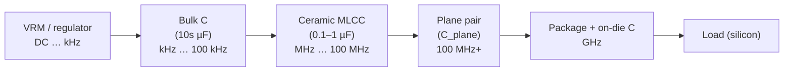

# Power Integrity

**Summary.** Power integrity (PI) is the discipline of guaranteeing that every load on a board sees a clean, stable supply voltage — within tolerance, at DC *and* across the whole frequency band over which the load draws current. The object it studies is the **Power Delivery Network (PDN)**: the regulator, the bulk and ceramic decoupling capacitors, the power/ground plane pair, the package, and the on-die capacitance, viewed as one distributed RLC network from source to silicon. The central claim of this document — and the reason PI belongs in the Engineering Science Layer — is that a power rail is **not a node**, it is a *frequency-dependent impedance* `Z(f)`, and a correct PDN is one whose `Z(f)` stays below a designed **target impedance** `Z_target` from DC up to the load's bandwidth. The runtime silently assumes this every time it treats `Power` and `Ground` as net classes that deserve more copper, every time it splits a regulator's input and output into two single-driver rails, and every time the [Constraint Engine](../../docs/engineering/constraint-engine.md) admits "impedance target" as a constraint type. This is the AC sequel to the DC story in [ohms-law](ohms-law.md): IR drop sets the floor of `Z(f)` at DC; decoupling, plane capacitance, and loop inductance shape it everywhere above DC.

## Core principles

A vocabulary bridge first — every quantity below is a typed [Physical Quantity](../../docs/engineering/units-and-quantities.md), consistent with the [GLOSSARY](../../docs/GLOSSARY.md):

| Quantity | Symbol · unit | PDN meaning |
|----------|---------------|-------------|
| Target impedance | `Z_target` · Ω | The largest impedance the rail may present and still hold tolerance |
| PDN impedance | `Z(f)` · Ω | Source-to-load impedance of the whole network, vs. frequency |
| Equivalent series resistance | `ESR` · Ω | A real capacitor's series loss; sets its minimum impedance |
| Equivalent series inductance | `ESL` · H | A real capacitor's series inductance (body + mounting loop) |
| Self-resonant frequency | `f_SRF` · Hz | Where a capacitor's `C` and `ESL` cancel; `|Z| = ESR` |
| Loop / mounting inductance | `L_loop` · H | Inductance of the cap-pad-via-plane current loop, `∝` loop area |
| Plane capacitance | `C_plane` · F | Distributed capacitance of a power/ground plane pair |
| Transient current | `ΔI` · A | Worst-case step in load current (`di/dt` drives droop) |
| Allowed ripple | `ΔV` · V | Tolerance window on the rail (e.g. `±3 %` of `V_dd`) |
| Knee frequency | `f_knee` · Hz | Bandwidth of a switching edge, `≈ 0.35 / t_rise` |

### 1. Target impedance — the PDN's specification

A load that switches its current by `ΔI` will pull the rail off nominal by `ΔV = ΔI · Z(f)` at whatever frequency that switching happens. To hold the rail inside its tolerance window for *any* current the load can demand, the PDN impedance must satisfy:

```
Z_target = ΔV_allowed / ΔI_transient = (V_dd · ripple_fraction) / ΔI
```

**Worked example.** A `1.0 V` core rail with `±5 %` tolerance feeding a part whose current can step by `10 A`:
`Z_target = (1.0 V × 0.05) / 10 A = 0.05 V / 10 A = 5 mΩ`. The PDN must look like *5 milliohms or less* — not at DC only, but **across the entire band from DC up to `f_knee`**, the frequency content of the load's fastest current edge. This single number turns power integrity from intuition into a falsifiable spec: build `Z(f)` and check it against a horizontal line at `Z_target`.

> **Why a flat impedance, not just low DC resistance?** Because current is drawn at all frequencies up to the edge bandwidth. A rail that is `1 mΩ` at DC but `200 mΩ` at 50 MHz fails for a load whose 50 MHz current content develops `ΔV = ΔI · 200 mΩ` of droop. PI is fundamentally a *frequency-domain* requirement.

### 2. The real capacitor is a series RLC

No decoupling capacitor is a pure `C`. Each is a series resonant circuit of its capacitance, its `ESR`, and its `ESL` (the inductance of the body plus the mounting loop):

```
Z_cap(ω) = ESR + jωL_ESL + 1 / (jωC)            (ω = 2πf)
```

Its magnitude is V-shaped: capacitive (`1/ωC`, falling) below resonance, inductive (`ωL`, rising) above, with a minimum at the **self-resonant frequency**:

```
f_SRF = 1 / (2π · √(L_ESL · C))        |Z|_min = ESR   (at f_SRF)
```

The consequence that governs PDN design: **above its `f_SRF` a capacitor is an inductor** and stops decoupling. A `10 µF` part with `2 nH` of `ESL` self-resonates near `1.1 MHz`; past that it is useless for decoupling and you need a smaller, lower-`ESL` capacitor whose `f_SRF` is higher. This is why a PDN uses a *ladder of values* (bulk → mid → small ceramic), each covering the band where the previous one has gone inductive.


*Figure: the PDN as a hand-off ladder — each stage holds `Z(f)` down over the band where the stage to its left has become inductive.*

### 3. Anti-resonance — why values are chosen, not guessed

Paralleling two capacitor banks does not simply add capacitance. Between the `f_SRF` of the larger value and the `f_SRF` of the smaller, the larger bank is already **inductive** while the smaller is still **capacitive**. That inductor-in-parallel-with-capacitor is a parallel LC tank, and a parallel LC tank has an impedance *peak* — **anti-resonance** — at:

```
f_anti = 1 / (2π · √(L_big · C_small))
```

At that peak `Z(f)` can spike *above* `Z_target` even though every individual capacitor is below it — a PDN can fail in the gaps between its capacitors. The cure is engineering, not luck: choose values whose resonances overlap, multiply parts to lower the envelope, and rely on `ESR` to damp the tank (a little loss flattens the peak). This is the precise reason decoupling is a *designed network* and not "scatter 0.1 µF parts."

```
|Z|                       anti-resonance peak (must stay < Z_target)
 ^                              /\
 |   bulk \                    /  \                    / inductive
 |         \   ___            /    \    ___           /
 |  Z_target ----------------------------------------  <- spec line
 |           \ /   \        /        \ /   \         /
 |            V     \______/          V     \_______/
 |          f_SRF(bulk)   f_anti    f_SRF(MLCC)
 +-------------------------------------------------------> f
```
*Figure (schematic): the PDN impedance envelope must stay under the `Z_target` line at every frequency — including the anti-resonant peaks between capacitor banks.*

### 4. Placement is electrical — mounting inductance

Above a few megahertz, a ceramic capacitor's impedance is dominated not by its capacitance but by its **mounting loop inductance** `L_loop` — the area enclosed by the current path out of the cap, through its pads and vias, across the plane, and back. Inductance scales with that loop area, so:

```
ΔV_high-f ≈ L_loop · (di/dt)
```

A capacitor placed far from the load, or stitched to the planes through long vias, has a large `L_loop` and decouples poorly *no matter its value*. "Place decoupling close to the power pin, with short, fat vias" is therefore not folklore — it is a statement that `L_loop`, and hence high-frequency `Z(f)`, is set by **geometry**. The capacitor value chooses the band; the placement chooses whether it works there. This is the inductive twin of the geometric `R = ρL/(wt)` argument in [ohms-law §2](ohms-law.md), and it draws directly on the loop-inductance physics of [electromagnetics](../physics/electromagnetics.md).

### 5. Plane capacitance and plane resonance

A power plane over a ground plane is a parallel-plate capacitor providing fast, low-inductance, distributed decoupling:

```
C_plane = ε₀ · ε_r · A / d          (A = overlap area, d = dielectric thickness)
```

Thin `d` and high `ε_r` buy more `C_plane` and lower spreading inductance — excellent above ~100 MHz where discrete caps have gone inductive (§2). But the same plane pair is also a **2-D resonant cavity** (a patch). It resonates when a plane dimension is a half-wavelength multiple of the dielectric wave speed:

```
f_mn = (c / (2·√ε_r)) · √( (m/a)² + (n/b)² )      (a, b = plane dimensions; m,n = 0,1,2…)
```

At a cavity resonance the plane impedance *spikes* and the structure radiates from its open edges — a power-integrity failure that is simultaneously an **EMC** failure. Mitigations are geometric: tight plane spacing (raises `f_mn` energy storage, lowers loop inductance), stitching/decoupling capacitors near edges, and pulling copper back from the board edge so fringing fields do not launch off the rim. The cavity-mode mathematics is the same boundary-value problem as the resonator in [rf-physics](../physics/rf-physics.md) and rests on the parallel-plate and wave solutions of [maxwell-equations](../physics/maxwell-equations.md).

### 6. IR drop and transient response — the time-domain face

`Z(f)` has a time-domain dual. A load current step `ΔI` produces two distinct deficits:

- **Static IR drop** (DC): `ΔV = ΔI · R_path`, the resistive sag from [ohms-law §4](ohms-law.md). This is `Z(f→0)`.
- **Transient droop** (dynamic): the network is inductive, so it cannot deliver charge instantly. The first instants of a step are supplied by on-die and package capacitance; then board ceramics; then bulk; finally the VRM, which has finite bandwidth, catches up. Each "droop region" in time corresponds to one impedance band in frequency.

```
V_rail
  |‾‾‾‾\         ___________  <- VRM recovers (slow loop)
  |     \      /
  |      \    /     <- bulk + ceramic refill
  |       \  /
  |        \/  <- 1st droop: on-die/package C only
  +-----------------------------> t
        load step ΔI at t0
```
*Figure: the multi-stage voltage droop after a current step — early droop is an inductive (`L·di/dt`) effect supplied by the closest capacitance; late recovery is the VRM control loop.*

The depth of the first droop is `≈ L_pkg · di/dt` divided across the available near-die charge; the VRM's recovery is a closed-loop control problem with bandwidth and phase margin (see [control-theory](../mathematics/control-theory.md)). A PDN flat in `Z(f)` to `f_knee` is, by construction, a PDN whose droop stays within `ΔV` for the worst step — the frequency spec and the time spec are one requirement.

### 7. Ground bounce and simultaneous-switching noise

The return path is half the PDN. When `N` outputs switch together, their aggregate return current `di/dt` flows through the inductance of the ground connection (bond wires, vias, plane spreading), and develops:

```
ΔV_gnd = L_return · (di/dt)          (simultaneous-switching noise / ground bounce)
```

This lifts the local ground reference: a quiet receiver now sees a shifted "0 V," and a sensitive ADC reads an offset. It is the **inductive** sibling of the DC common-impedance coupling in [ohms-law §4](ohms-law.md) — there the shared term was `R`, here it is `L·di/dt`. The defenses are the same in spirit: minimize shared return inductance (more ground vias, continuous reference planes, no split-plane gaps under fast nets) and keep aggressor return current out of victim reference. A PDN that ignores the return treats ground as an equipotential — which it provably is not above DC.

### 8. Why the PDN is a designed system

Collecting §1–§7: a power rail is a distributed RLC network with a **frequency-domain acceptance test** — `Z(f) ≤ Z_target` for all `f` in `[DC, f_knee]` — backed by a **time-domain test** that droop stays within `ΔV`. The knee that sets the upper band edge is fixed by the load's fastest edge, `f_knee ≈ 0.35 / t_rise`. None of this is satisfied by "add a wire and some caps": it requires choosing capacitor values to tile the band (§2), multiplying and damping them to kill anti-resonance (§3), placing them to control `L_loop` (§4), spacing planes to add `C_plane` while pushing resonances out of band (§5), and budgeting both static and transient drop (§6–§7). The PDN is *engineered to an impedance target*, which is exactly why "impedance target" is a first-class constraint type in the runtime.

## Why it matters for electronics & PCB design

- **A rail is an impedance, not a node.** Schematic-level thinking shows one wire at one potential; the real rail has a different voltage at every frequency and every load. PI is what makes the schematic's assumption true.
- **Decoupling is a network, not a sprinkle.** Values, counts, ESR, ESL, and placement form a designed filter. Random caps leave anti-resonant holes (§3) where the rail fails.
- **Placement carries electrical meaning.** `L_loop` (§4) means a correctly *chosen* capacitor in the *wrong place* does nothing. Layout *is* the high-frequency PDN.
- **Planes do double duty.** A plane pair is both decoupling capacitor and resonant antenna (§5); the PI win and the EMC risk live in the same copper.
- **Power and signal integrity are coupled.** Ground bounce (§7) corrupts signals; a noisy rail jitters clocks. The PDN is the shared substrate of both.

## Mapping to the runtime

This is the load-bearing section: each principle is tied to a concrete EAK artifact, and violating the principle is named as a runtime bug.

- **The PDN is the `Power` + `Ground` net classes ↔ Routing Planning.** [`eak/crates/eak-phases/src/routing_planning.rs`](../../eak/crates/eak-phases/src/routing_planning.rs) gives `Power` and `Ground` nets a wider default (`0.50 mm`) than `Signal` (`0.25 mm`) via `class_width_mm(NetClass)`. That ordering is the **DC floor of `Z(f)`** (§6): wider copper lowers `R_path` and spreading inductance. The honest scope boundary — stated plainly, per house style — is that the *AC* PDN (the decoupling ladder of §2–§3, plane capacitance of §5) is reasoning-driven synthesis that is **not yet** an implemented rule; what the runtime encodes today is the physically-correct *ordering* (current-carrying rails get more copper) and the *topology* on which a future `Z(f)` check would run. The [Routing Planning](../../docs/state-machines/routing-planning.md) machine's `ValidatingRouting` width/clearance pre-check against the [Constraint Engine](../../docs/engineering/constraint-engine.md) is exactly where a computed PDN-impedance margin would slot in.

- **Every power rail must have a source ↔ `erc-power-net-undriven`.** [`eak/crates/eak-engines/src/lib.rs`](../../eak/crates/eak-engines/src/lib.rs) carries the `erc-power-net-undriven` rule, which iterates every `NetClass::Power` net and flags any with no driving source. This is a **PDN invariant in code**: a power net with no source has *infinite* impedance — `Z_target` (§1) is unmeetable because there is no `Z` at all. [ERC Verification](../../docs/state-machines/erc-verification.md) makes "the rail is actually fed" machine-checkable; a runtime that skipped it could release a board whose PDN is an open circuit.

- **Impedance target is a typed constraint ↔ Constraint Engine.** The [Constraint Engine](../../docs/engineering/constraint-engine.md) lists "impedance target" among its constraint *types* and treats every bound as a [Physical Quantity](../../docs/engineering/units-and-quantities.md). `Z_target` (§1) is precisely such a bound — an `Ohm`-dimensioned ceiling over the `Power`/`Ground` scope. Crucially, the engine's **Conflict** mechanism is the PDN-infeasibility detector: its own example of a conflict is "an impedance target that no available stack-up can meet alongside a thickness limit" — i.e. a `Z_target` (or `C_plane`, §5) that the chosen dielectric `d` cannot satisfy. The engine refuses to invent a bound and surfaces the conflict to the engineer, which is the correct response to an unbuildable PDN.

- **The regulator is the low-frequency PDN stage ↔ the VIN/VOUT rail split.** [`eak/crates/eak-phases/src/schematic_planning.rs`](../../eak/crates/eak-phases/src/schematic_planning.rs) splits a regulator's input and output into two distinct single-driver rails (`VBUS` in, `VOUT` out) rather than one collapsed net. The VRM *is* the DC-to-kHz stage of the ladder (§2); its input and output are different impedance environments with different decoupling needs, and collapsing them shares a conductor whose `I·R` and `L·di/dt` couple input ripple onto the output (the common-impedance and ground-bounce mechanisms of §6–§7). Keeping them separate is the topological precondition for giving each rail its own PDN — and it keeps [ERC](../../docs/state-machines/erc-verification.md) clean (two single-driver rails, no `erc-multiple-drivers` short).

- **Plane geometry lives in the stack-up ↔ PCB IR.** `C_plane = ε₀ε_r·A/d` and the resonance set `f_mn` (§5) are computable only from the plane overlap area `A`, the dielectric thickness `d`, and `ε_r` — all carried by the [PCB IR](../../docs/compiler/ir/pcb-ir.md) [Board / Layer Stack](../../docs/foundation/engineering-domain-model.md#board--layer-stack). A [lowering](../../docs/compiler/transformations.md) that dropped plane spacing would make plane capacitance and plane resonance uncomputable — a silent power-integrity (and EMC) regression. This is the same stack-up that fixes copper weight `t` for the DC resistance in [ohms-law](ohms-law.md).

- **Plane resonance is an EMC concern ↔ EMC analysis + board-edge keep-out.** Plane-edge radiation at `f_mn` (§5) is where PI meets EMI. [EMC Analysis](../../docs/state-machines/emc-analysis.md) is a loop-back target of [Routing Planning](../../docs/state-machines/routing-planning.md), and the implemented `emc-antenna-length` rule reasons about radiating geometry; the DFM board-edge copper keep-out (Phase-3 increment 9, `dfm-trace-edge-clearance` / `dfm-edge-clearance` in [`eak/crates/eak-engines/src/lib.rs`](../../eak/crates/eak-engines/src/lib.rs)) pulls copper off the rim, reducing the fringing fields that let a resonant plane pair radiate. The honest boundary: a full plane-resonance solver is not implemented; the edge keep-out is the geometric mitigation that *is*.

- **Decoupling-part facts ↔ Component Library / BOM.** Choosing a decoupling capacitor by value, `ESR`, `ESL`, and package (§2–§4) is a [Component Library](../../docs/engineering/component-library.md) and [BOM IR](../../docs/compiler/ir/bom-ir.md) concern; the `Capacitor` `ComponentClass` already exists in [`eak/crates/eak-phases/src/schematic_planning.rs`](../../eak/crates/eak-phases/src/schematic_planning.rs). The scope boundary, consistent with the project's deferred work: decoupling-network *synthesis* (picking values/counts to meet `Z_target`) and the `ESR`/`ESL` facts it needs are reasoning-driven — a [Datasheet Intelligence](../../docs/GLOSSARY.md) / live-LLM concern — so this physics names *what those facts mean* and *which bound they must meet*, not a heuristic count.

- **The release gate ↔ Verification + Manufacturing Generation.** A PDN-impedance or droop margin becomes a pass/fail with a recorded value in the [Verification Engine](../../docs/engineering/verification-engine.md), and an accepted over-budget margin becomes a [Waiver](../../docs/engineering/human-in-the-loop.md) under the Autonomy Level. The global gate in [`eak/crates/eak-phases/src/manufacturing_generation.rs`](../../eak/crates/eak-phases/src/manufacturing_generation.rs) — "no design with an open blocking defect is ever released" — is the cross-phase all-clear that, once PDN rules exist, would refuse to release a board with an un-waived `Z(f) > Z_target` or `erc-power-net-undriven` defect.

## Failure modes if violated

- **Sizing the PDN for DC only.** Meet `R_path` but ignore `Z(f)` (§1) and the rail droops under fast load steps that the DC test never sees — a transient brown-out with no schematic cause.
- **Decoupling by sprinkling.** Skip §2–§3 and the random capacitor mix leaves anti-resonant peaks above `Z_target`; the rail fails in narrow frequency bands that look fine "on average."
- **Right cap, wrong place.** Ignore §4 and a correctly chosen ceramic with a large `L_loop` decouples nothing above a few MHz — the value is on the BOM, the inductance is in the layout.
- **Plane pair as pure capacitor.** Forget §5's cavity modes and the plane resonates and radiates: a PI hole and an EMC emission at the same `f_mn`, surfacing in [EMC Analysis](../../docs/state-machines/emc-analysis.md).
- **Treating ground as equipotential.** Ignore §7 and simultaneous switching lifts the local reference; clean signals acquire ground-bounce offset and the rail couples noise into victims.
- **Collapsing the regulator rails.** Merge `VIN` and `VOUT` (§6) and input ripple rides onto the output through the shared conductor — the exact defect the VIN/VOUT split prevents, and an `erc-multiple-drivers` short besides.
- **No impedance target at all.** Omit `Z_target` (§1) and there is no acceptance test; the PDN is "probably fine," which is not an engineering statement and not machine-checkable.

## Related documents

- [`ohms-law.md`](ohms-law.md) — the DC complement: IR drop is `Z(f→0)`, ampacity sizes the copper, and common-impedance coupling is the resistive sibling of ground bounce.
- [`../physics/electromagnetics.md`](../physics/electromagnetics.md) — loop and mounting inductance (`L_loop`, `ESL`), spreading inductance, and the inductive coupling behind §4 and §7.
- [`../physics/maxwell-equations.md`](../physics/maxwell-equations.md) — the parallel-plate capacitance and cavity boundary-value problem under `C_plane` and `f_mn`.
- [`../physics/rf-physics.md`](../physics/rf-physics.md) — resonant-cavity modes and edge radiation, the EMC face of plane resonance.
- [`../mathematics/control-theory.md`](../mathematics/control-theory.md) — the VRM as a finite-bandwidth feedback loop with phase margin, setting the late-droop recovery (§6).
- [`circuit-theory.md`](circuit-theory.md) — the series/parallel RLC resonance algebra behind `f_SRF` and anti-resonance.
- [`../../docs/state-machines/routing-planning.md`](../../docs/state-machines/routing-planning.md) · [`../../docs/state-machines/erc-verification.md`](../../docs/state-machines/erc-verification.md) — per-net-class widths, the VIN/VOUT split, and the power-net-undriven rule.
- [`../../docs/engineering/constraint-engine.md`](../../docs/engineering/constraint-engine.md) · [`../../docs/engineering/verification-engine.md`](../../docs/engineering/verification-engine.md) — impedance target as a typed bound, conflict on an unmeetable target, and the margin/waiver lifecycle.
- [`../../docs/compiler/ir/pcb-ir.md`](../../docs/compiler/ir/pcb-ir.md) · [`../../docs/state-machines/emc-analysis.md`](../../docs/state-machines/emc-analysis.md) — the stack-up that carries plane geometry, and the analysis phase where plane resonance becomes an emission.
- [`../../docs/engineering/units-and-quantities.md`](../../docs/engineering/units-and-quantities.md) · [`../../docs/engineering/component-library.md`](../../docs/engineering/component-library.md) — the typed Ω/F/H quantities and the decoupling-part facts the PDN network is built from.
