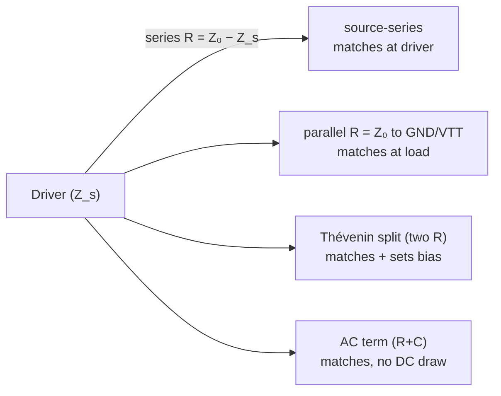
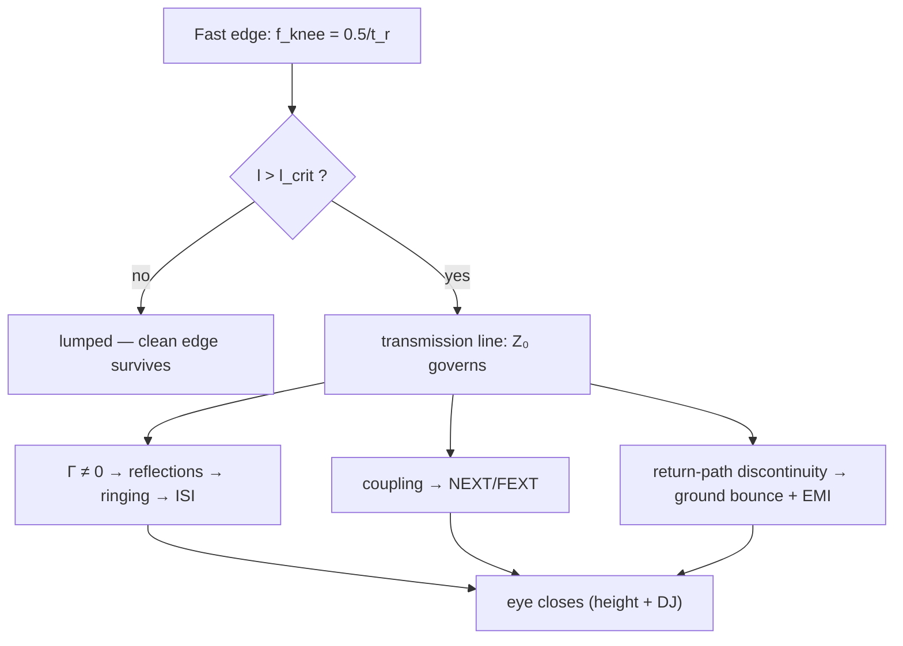

# Signal Integrity

**Summary.** Signal integrity (SI) is the engineering science of preserving the *shape and timing* of a logic edge as it travels from a driver, through copper, to a receiver — the discipline that decides whether a `1` still reads as a `1` after the interconnect has had its way with it. It belongs in the Engineering Science Layer because the runtime's physical-design phases silently assume that a routed [Net](../../docs/foundation/engineering-domain-model.md#net) *transports* a signal faithfully, yet nothing in the lumped [Schematic IR](../../docs/compiler/ir/schematic-ir.md) guarantees it — the guarantee is bought by geometry chosen in [Routing Planning](../../docs/state-machines/routing-planning.md) and checked in [DRC](../../docs/state-machines/drc-verification.md)/[EMC](../../docs/state-machines/emc-analysis.md). This document states the laws that govern reflections, crosstalk, intersymbol interference, ringing, ground bounce, and jitter; derives the single quantity (the signal's *knee frequency*, set by rise time, not clock rate) from which every SI budget follows; and maps each result to the EAK engine, IR field, or verification rule that embodies it — including the [per-net-class trace widths](../../docs/state-machines/routing-planning.md), the [regulator VIN/VOUT rail split](../../docs/state-machines/manufacturing-generation.md), and the [EMC electrically-long check](../../docs/state-machines/emc-analysis.md).

---

## Core principles

### Rise time sets bandwidth — the master quantity

A digital signal is not its clock frequency; it is its *edges*. The spectral content of a trapezoidal pulse rolls off at `−20 dB/decade` until the corner imposed by the transition time, then at `−40 dB/decade` past it. The corner — the **knee frequency** — is the highest frequency a designer must respect, and it depends on the edge rate `t_r` (10–90 %), **not** on the toggle rate:

```text
f_knee ≈ 0.5 / t_r          (Johnson & Graham knee frequency)
BW    ≈ 0.35 / t_r          (single-pole −3 dB bandwidth of the edge)

Example: a 10 MHz clock with t_r = 1 ns has f_knee ≈ 500 MHz.
The interconnect must behave well to 500 MHz, not to 10 MHz.
```

This is the most-violated intuition in PCB design: a "slow" bus with a fast driver is an RF problem. Every downstream SI budget — when a trace becomes a transmission line, how much it radiates, how strongly it couples — is computed *at the knee frequency*, not the data rate. The lumped boundary of [circuit theory](circuit-theory.md) (`d < λ/10`) and the radiation boundary of [RF physics](../physics/rf-physics.md) both take their `λ` from `f_knee`.

### When copper becomes a transmission line

A trace must be treated as a distributed [transmission line](../physics/rf-physics.md) — not a wire — once its one-way propagation delay is an appreciable fraction of the edge. The standard threshold uses the *critical length*: reflections become significant when the round-trip delay exceeds the rise time.

```text
t_pd = 1 / v = √(ε_eff) / c        propagation delay per unit length
v    = c / √(ε_eff)                signal velocity in the dielectric

l_crit = t_r / (2 · t_pd) = (t_r · v) / 2     ← above this, route as a transmission line

Equivalently: electrically long when  l > λ_knee / 10 = v / (10 · f_knee).
```

For FR-4 (`ε_eff ≈ 4`, `v ≈ 15 cm/ns`), a `1 ns` edge gives `l_crit ≈ 7.5 cm`. Below it, lumped intuition survives; above it, the geometry's **characteristic impedance** `Z₀` governs behavior:

```text
Z₀ = √(L / C)        (per-unit-length series inductance L, shunt capacitance C)
```

`Z₀` is fixed by the conductor cross-section and the [stack-up](../../docs/compiler/ir/pcb-ir.md): trace width, copper thickness, dielectric height, and the dielectric constant `ε_r`. Microstrip (outer layer, one reference plane) and stripline (inner layer, two planes) have distinct closed forms; both make `Z₀` a deterministic function of geometry the runtime *chooses*. This is why "controlled impedance" is a layout constraint, not a component choice.

### Reflections, ringing, and termination

Where `Z₀` changes — a width step, a via, a connector, a stub, an unmatched load — part of the wave reflects. The fraction is the **reflection coefficient**:

```text
Γ = (Z_L − Z₀) / (Z_L + Z₀)        Γ ∈ [−1, +1]

Z_L = Z₀  ⇒ Γ = 0   (matched: no reflection — the goal)
Z_L = ∞   ⇒ Γ = +1  (open: full positive reflection — overshoot)
Z_L = 0   ⇒ Γ = −1  (short: full inverted reflection — undershoot)
```

An unterminated fast edge bounces between source and load; each round trip is attenuated by the end reflection coefficients, producing **ringing** — decaying overshoot/undershoot superimposed on the settled level. Ringing that crosses a logic threshold is a *false edge*; overshoot beyond the receiver's absolute-maximum rating degrades or destroys the input. Four termination strategies kill it by forcing `Γ → 0` at one or both ends:


*Figure: the four canonical terminations, each driving the relevant reflection coefficient toward zero.*

### Intersymbol interference (ISI)

Two mechanisms smear one bit into the next. (1) **Bandwidth limiting**: the interconnect is a low-pass filter (`BW ≈ 0.35/t_r`); when the channel's rise time approaches the bit period `T_b`, an edge has not settled before the next arrives, so the level the receiver samples depends on prior bits. (2) **Residual reflections**: energy from a previous transition, bouncing late, adds to or subtracts from the current bit. Both shift the threshold-crossing instant and the sampled voltage — ISI is *data-dependent jitter and amplitude error*. Its visible signature is eye closure (below).

### Crosstalk — NEXT and FEXT

Two parallel traces are coupled by **mutual capacitance** `C_m` (electric field) and **mutual inductance** `L_m` (magnetic field). An aggressor's edge injects noise into a quiet victim, split into two directions:

```text
Near-end (NEXT, backward):  K_b = ¼ · (C_m/C + L_m/L)      ← grows with coupled length, saturates
Far-end  (FEXT, forward):   K_f = ½ · (C_m/C − L_m/L)      ← grows linearly with length; ∝ dV/dt

NEXT voltage  ≈ K_b · V_aggressor           (for couplings longer than the edge)
FEXT voltage  ≈ −K_f · (l / v) · dV/dt       (a narrow pulse at the receiver)
```

Two consequences the runtime must encode. First, capacitive and inductive coupling **add** at the near end but **subtract** at the far end — in a homogeneous stripline (`C_m/C = L_m/L`) FEXT can vanish while NEXT does not. Second, coupling falls steeply with separation, motivating the **3W rule** (centre-to-centre spacing ≥ 3× trace width keeps coupling roughly an order of magnitude down). Crosstalk is therefore a *clearance* property, enforceable as a geometric constraint, and an [electromagnetics](../physics/electromagnetics.md) field-coupling phenomenon at root.

### Ground bounce and simultaneous switching noise (SSN)

A return current must flow somewhere. Driving it through a *shared, inductive* return path develops a voltage that moves the local reference for every signal sharing that path:

```text
V_bounce = L_return · (di/dt) = N · L_return · (ΔI / t_r)   (N outputs switching together)
```

`di/dt` is large precisely because edges are fast (`∝ 1/t_r`). The cure is to *minimize* `L_return`: a continuous, uninterrupted reference plane directly beneath the signal (so return current flows image-like under the trace), low-inductance decoupling near each device, and a clean power-distribution network (PDN) — the [power-integrity](../physics/electromagnetics.md) twin of SI. A *gap or split* in the reference plane forces the return current to detour, which simultaneously raises `L_return` (ground bounce), opens a loop (radiation), and couples neighboring nets (crosstalk) — one layout error, three failure modes.

### Jitter and the eye diagram

Overlaying many unit intervals of a serial signal produces an **eye diagram**; its open area is the receiver's joint timing-and-voltage margin.

```text
Eye height  = vertical opening  → voltage noise margin (ISI, crosstalk, ground bounce eat it)
Eye width   = horizontal opening → timing margin       (jitter eats it)

Jitter = DJ (deterministic, bounded: ISI + crosstalk + duty-cycle distortion)
       + RJ (random, unbounded, Gaussian: thermal/shot noise)

Total jitter at a target BER:  TJ(BER) = DJ + n(BER) · RJ_rms     (dual-Dirac model)
```

Because RJ is unbounded, the timing margin is quoted *at a bit-error rate* (e.g. `10⁻¹²`) via the bathtub curve — there is no "zero error" point, only a probability. Every SI defect above maps to a measurable shrink of the eye: reflections and ISI close it vertically and add DJ; crosstalk closes it both ways; ground bounce shifts its reference. The eye is the integrated scorecard.


*Figure: one fast edge, three corruption paths, all converging on a closed eye — the chain SI engineering must keep open.*

### What a clean edge requires

1. **Controlled `Z₀`** — trace geometry matched to the target impedance through the stack-up, continuous from driver to receiver.
2. **A continuous reference plane** — an unbroken return path directly under every signal, so `L_return` stays minimal.
3. **Termination** where `l > l_crit` — forcing `Γ → 0` at the impedance discontinuities that remain.
4. **Spacing** — separation (e.g. 3W) and, on critical buses, guard structure, to hold crosstalk below the noise budget.
5. **A low-inductance PDN** — decoupling and a clean power/return system so switching does not bounce the reference.
6. **Length control** — matched lengths within differential pairs and parallel buses to bound skew-induced jitter.

How layout corrupts it: width steps and vias (impedance discontinuity → reflection); reference-plane gaps and splits (return discontinuity → bounce, crosstalk, radiation); tight routing (coupling); shared inadequate returns (SSN); unmatched lengths (skew/DJ); stubs (resonant reflections). SI is the budget that says *which* of these the runtime may permit.

---

## Why it matters for electronics & PCB design

The schematic is correct and the board still fails — this is the canonical SI story, and it is why SI cannot live in the schematic abstraction. The [Schematic IR](../../docs/compiler/ir/schematic-ir.md) is a lumped network ([circuit theory](circuit-theory.md)): a [Net](../../docs/foundation/engineering-domain-model.md#net) is one equipotential node. SI is precisely the regime where that node *stops being one voltage* — a point on the net near the driver and a point near the load differ by the reflected and coupled waves. Every defect above is invisible until the abstraction is realized as physical copper with a finite `Z₀`, a finite return path, and finite neighbors. A design tool that routes only for connectivity and clearance ships boards that pass DRC and fail in the lab: corrupted reads, marginal timing, intermittent errors that move when a scope probe is attached. SI converts "looks connected" into "actually transmits," and it does so with quantities — `f_knee`, `Z₀`, `Γ`, `K_b/K_f`, eye margin — that are computable from the geometry the runtime already owns. That computability is what lets EAK treat SI as constraints and verification rather than as expert folklore.

---

## Mapping to the runtime

This is the layer's point: every SI quantity above must be the *reason* behind a specific EAK artifact.

- **Knee frequency → the EMC electrically-long rule.** [EMC Analysis](../../docs/state-machines/emc-analysis.md) ships `EmcAntennaLengthRule` (`emc-antenna-length`): a routed [Track](../../docs/foundation/engineering-domain-model.md#track--routing) longer than `c / (10·f)` — the `λ/10` boundary — is a blocking [Violation](../../docs/foundation/engineering-domain-model.md#violation). That `λ/10` is the *same* electrical-length threshold that makes a trace a transmission line here; radiation (EMC) and reflection (SI) are two readings of one boundary. The SI-exact frequency is `f_knee ≈ 0.5/t_r`, which for a fast driver is far above the stated operating `f` the rule currently reads — a documented [scope boundary](../../docs/state-machines/emc-analysis.md): the rule is *lenient* (it under-counts electrically-long nets) precisely because it lacks an edge-rate model. Recording rise time on signal nets and deriving `f_knee` is the principled tightening this document grounds.

- **Characteristic impedance → the PCB IR stack-up + per-net-class widths.** `Z₀` is a function of geometry the runtime chooses: the [PCB IR](../../docs/compiler/ir/pcb-ir.md) carries the layer stack-up — dielectric thicknesses and dielectric constants — as typed [Physical Quantities](../../docs/engineering/units-and-quantities.md), and impedance is a *Carried Constraint* scoping a [Net](../../docs/foundation/engineering-domain-model.md#net). The shipped **per-net-class trace widths** (Routing Planning increment 10) are the first half of controlled impedance: a net class fixes width, and width + stack determines `Z₀`. The engineering-science consequence is that a width-only net class is *incomplete* — width must be solved *jointly* with the stack to hit a target `Z₀`, and the [Constraint Engine](../../docs/engineering/constraint-engine.md) width/clearance pre-check in `ValidatingRouting` is where that joint constraint belongs.

- **Reflection coefficient → impedance constraints + Manufacturing Generation.** Driving `Γ → 0` means the [Constraint Engine](../../docs/engineering/constraint-engine.md) must hold a *target-impedance* constraint (not a bare width) on controlled nets, [Routing Planning](../../docs/state-machines/routing-planning.md) must propose geometry that meets it continuously (no unmatched width steps), and [Manufacturing Generation](../../docs/state-machines/manufacturing-generation.md) must emit a controlled-impedance fabrication note so the fab back-computes the width for the actual laminate. An impedance constraint that is dropped between IR lowering passes is a silent SI regression — a [transformation](../../docs/compiler/transformations.md) invariant the runtime must preserve.

- **Crosstalk → DRC clearance, per net class.** NEXT/FEXT fall with spacing, so the 3W rule is a *clearance constraint* — exactly the kind [DRC Verification](../../docs/state-machines/drc-verification.md) enforces over the [Verification Engine](../../docs/engineering/verification-engine.md). Critical buses need a *larger* clearance than the manufacturing minimum the [board-edge keep-out](../../docs/state-machines/dfm-verification.md) and default rules supply; this is why clearance is correctly a **per-net-class** property, parallel to per-net-class widths, and why a single global clearance is an SI bug for high-speed nets.

- **Ground bounce / PDN → the regulator VIN/VOUT rail split.** SSN is `N·L_return·di/dt`; modeling and bounding it requires the power input and output to be *distinct nets* with distinct return and decoupling structure. The shipped **regulator VIN/VOUT rail split** (increment 11) — splitting the previously collapsed power rail so a regulator's `VIN` and `VOUT` are separate [Nets](../../docs/foundation/engineering-domain-model.md#net) — is the runtime's structural precondition for power integrity: a collapsed rail makes the PDN, its decoupling, and its return path un-representable, so ground bounce is *invisible by construction*. The split is SI/PI made tractable in the IR.

- **Reference-plane continuity → a layer-assignment invariant for Routing Planning.** The deepest SI rule — "every signal has a continuous reference plane and an unbroken return path" — is an invariant `PlanningRouting` must respect when it assigns layers and the [PCB IR](../../docs/compiler/ir/pcb-ir.md) records the stack. A route that crosses a plane split or changes reference layer without a stitching path violates `L_return` minimization; encoding it as a [Verification Engine](../../docs/engineering/verification-engine.md) rule (return-path discontinuity) is the natural next SI check, dual to the existing unrouted-net DRC rule.

- **Eye / jitter → EMC analysis-mode Analysis Results.** Full SI (eye height/width, jitter, BER) is field-and-time simulation, which the [EMC Analysis](../../docs/state-machines/emc-analysis.md) phase reaches through the Simulation port to produce [Analysis Results](../../docs/foundation/engineering-domain-model.md#analysis-result) — interpreted, margin-bearing, never pass/fail. The shipped deterministic subset (the antenna rule) is the closed-form floor under that deferred simulation path; this document is the specification of what that path must eventually measure.

Violating any of these is an engineering bug *in the runtime*, not merely in a user's design: if Routing assigns a width without the stack, the board's `Z₀` is wrong though every rule "passes"; if a transformation drops an impedance constraint, the fab builds the wrong geometry; if the power rail stays collapsed, PI is unmodelable. The runtime's job is to make SI *checkable*, and these mappings are where it does.

---

## Failure modes if violated

- **Electrically-long net treated as lumped.** Reflections and ringing go unmodeled; overshoot exceeds the receiver's absolute-maximum rating (latent damage) or ringing crosses threshold (false edges). The `λ/10` check exists to catch exactly this; using clock `f` instead of `f_knee` lets fast-edge nets slip through — the known lenient boundary.
- **Width-only controlled impedance.** A net class sets width but not the joint width-plus-stack `Z₀`; the realized impedance is off-target, `Γ ≠ 0`, and the bus rings — passing DRC, failing in the lab.
- **Dropped impedance constraint across IR lowering.** [Manufacturing Generation](../../docs/state-machines/manufacturing-generation.md) emits no controlled-impedance note; the fab uses nominal width on a different laminate; `Z₀` is wrong board-wide. A transformation-invariant violation.
- **Global clearance on high-speed nets.** NEXT/FEXT exceed the noise budget though clearance "passes"; intermittent, data-dependent errors. Crosstalk margin demands *per-net-class* clearance.
- **Collapsed power rail (the pre-increment-11 bug).** `VIN` and `VOUT` share a net; decoupling, PDN impedance, and return path are un-representable; ground bounce is invisible until silicon misbehaves. The rail split is the fix this principle requires.
- **Reference-plane split crossed without stitching.** One layout error yields ground bounce, radiation, and crosstalk at once; the return path is the most under-checked SI invariant and the highest-leverage rule to add.
- **No eye/jitter budget at a BER.** Timing margin quoted as "works on the bench" rather than `TJ(BER)`; the link fails statistically in the field where RJ is unbounded.

---

## Related documents

- [`electrical/circuit-theory.md`](circuit-theory.md) — the lumped abstraction SI is the breakdown of; the shared `λ/10` boundary.
- [`physics/rf-physics.md`](../physics/rf-physics.md) — transmission lines, `Z₀`, propagation velocity, and the distributed model SI invokes.
- [`physics/electromagnetics.md`](../physics/electromagnetics.md) — the field origin of coupling (crosstalk) and return-current behavior (ground bounce).
- [`physics/maxwell-equations.md`](../physics/maxwell-equations.md) — the first-principles source of propagation, reflection, and radiation.
- [`electrical/ohms-law.md`](ohms-law.md) — termination resistances and the DC half of the PDN.
- Runtime: [Routing Planning](../../docs/state-machines/routing-planning.md) · [DRC](../../docs/state-machines/drc-verification.md) · [EMC Analysis](../../docs/state-machines/emc-analysis.md) · [PCB IR](../../docs/compiler/ir/pcb-ir.md) · [Constraint Engine](../../docs/engineering/constraint-engine.md) · [Verification Engine](../../docs/engineering/verification-engine.md) · [Manufacturing Generation](../../docs/state-machines/manufacturing-generation.md) · [Units & Quantities](../../docs/engineering/units-and-quantities.md).
