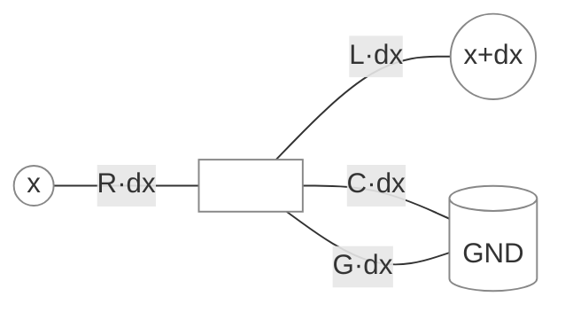
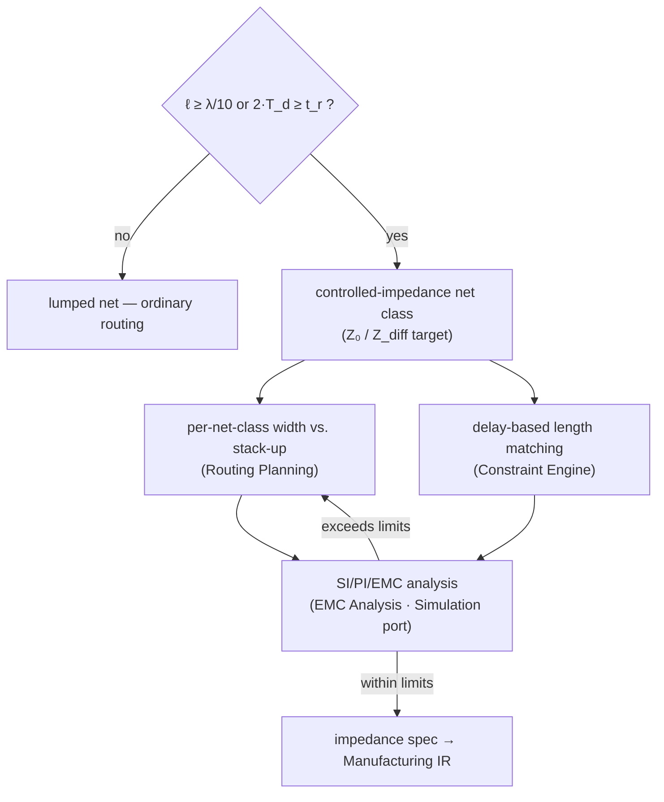

# Transmission Lines

**Summary.** A transmission line is the model that supersedes the lumped node once a conductor is *electrically long* — when the time a signal takes to travel its length is no longer negligible against the signal's own rate of change. Below that boundary a [Net](../../docs/foundation/engineering-domain-model.md#net) is a single node at one voltage (the assumption [circuit theory](circuit-theory.md) and [Ohm's law](ohms-law.md) make). Above it, the same copper has a *different voltage at every point* and behaves as a distributed structure with a characteristic impedance `Z_0`, a finite propagation delay `t_pd`, and reflections at every impedance discontinuity. This document belongs in the Engineering Science Layer because the EAK runtime routes nets, assigns trace widths, sets a layer stack-up, and matches lengths *as if it understood this boundary* — yet the rule "a routed net realizes its schematic net" silently assumes the net is still a single node. The theory here grounds the runtime's controlled-impedance constraints, per-net-class trace widths, the [PCB IR](../../docs/compiler/ir/pcb-ir.md) stack-up, length-matching constraints, and the signal-integrity portion of [EMC Analysis](../../docs/state-machines/emc-analysis.md). It is the principled answer to "when is a trace a wire, and when is it a waveguide?"

---

## Core principles

### When a trace is a transmission line

A conductor must be treated as a transmission line when the **propagation delay along it is a significant fraction of the fastest electrical event it carries**. There are two equivalent statements of the boundary.

- **Frequency domain (the `λ/10` rule).** Let `λ = v / f` be the wavelength of the highest significant frequency `f` on the net, where `v` is the signal's propagation velocity in the medium. The lumped (single-node) model holds while the physical length `ℓ` satisfies `ℓ < λ/10`. Past `ℓ ≈ λ/10` the phase varies enough across the conductor that the distributed model is required. (Some houses use `λ/16` or `λ/20` for stricter margins; the factor is a convention, the scaling is not.)
- **Time domain (the rise-time rule).** Digital edges, not sine waves, dominate PCB signaling. An edge of rise time `t_r` occupies a spatial extent; the line is electrically long when the **round-trip delay** approaches the rise time:

```text
Critical length:   ℓ_crit ≈ t_r / (2 · t_pd_per_length)
Line is "long" when round-trip 2·T_d ≥ t_r , i.e. ℓ ≥ ℓ_crit
where  T_d = ℓ · t_pd_per_length   (one-way flight time)
```

The two views are reconciled by the **knee frequency** `f_knee ≈ 0.5 / t_r`: the spectral content of a digital edge is significant up to roughly `f_knee` (bandwidth `≈ 0.35 / t_r`). A 1 ns edge has meaningful energy to ~500 MHz regardless of the clock rate, so a slow bus with fast edges can still be a transmission line. **The edge, not the clock, sets the boundary** — a critical, counter-intuitive fact the runtime must encode.

### The telegrapher equations

A transmission line is modeled as an infinite ladder of infinitesimal lumped segments, each of length `dx`, with four **per-unit-length** parameters: series resistance `R`, series inductance `L`, shunt conductance `G`, and shunt capacitance `C`.


*Figure: one differential segment of the distributed (telegrapher) model — series `R·dx`, `L·dx` and shunt `G·dx`, `C·dx` repeated to infinity.*

Applying KVL and KCL to a segment and taking the limit `dx → 0` yields the **telegrapher equations**, two coupled first-order PDEs in voltage `v(x,t)` and current `i(x,t)`:

```text
∂v/∂x = −( R·i + L·∂i/∂t )      (voltage drops across series R, L)
∂i/∂x = −( G·v + C·∂v/∂t )      (current shunts through G, C)
```

For the **lossless line** (`R = 0`, `G = 0`) these decouple into the one-dimensional wave equation:

```text
∂²v/∂x² = L·C · ∂²v/∂t²
```

whose general solution is the superposition of a forward and a backward traveling wave, `v(x,t) = v⁺(x − u·t) + v⁻(x + u·t)`. Two quantities fall directly out of this solution.

- **Propagation velocity** `u = 1/√(L·C) = c/√(ε_eff)`, where `c` is the speed of light and `ε_eff` the effective relative permittivity of the dielectric the field traverses. Equivalently the **propagation delay** per unit length is `t_pd = √(L·C) = √(ε_eff)/c`.
- **Characteristic impedance** `Z_0` — the ratio `v⁺/i⁺` a wave sees as it advances, independent of length:

```text
General:   Z_0 = √( (R + jωL) / (G + jωC) )
Lossless:  Z_0 = √( L / C )            (real, frequency-independent)
```

`Z_0` is **not** a resistance that dissipates power — a lossless line stores energy. It is the impedance the source "sees" until a reflection returns from the far end. Representative PCB values: `Z_0` of 50 Ω single-ended and 90–100 Ω differential are the dominant targets; `t_pd` is ≈ 6.0 ps/mm (≈ 150 ps/inch) for FR-4 microstrip and ≈ 6.9 ps/mm (≈ 180 ps/inch) for FR-4 stripline.

### Reflections and termination

When a forward wave of amplitude `V⁺` on a line of impedance `Z_0` reaches a termination `Z_L`, continuity of `V = I·Z` at the boundary forces a reflected wave. The **reflection coefficient** is:

```text
Γ_L = (Z_L − Z_0) / (Z_L + Z_0)          (−1 ≤ Γ_L ≤ +1 for passive loads)
Reflected wave: V⁻ = Γ_L · V⁺
```

Three cases anchor intuition: `Z_L = Z_0 → Γ = 0` (matched, no reflection — the line is "invisible"); `Z_L = ∞` (open) `→ Γ = +1` (full positive reflection, voltage doubling); `Z_L = 0` (short) `→ Γ = −1`. A mismatch at the *source* end, `Γ_S = (Z_S − Z_0)/(Z_S + Z_0)`, re-reflects whatever returns, producing the multiple-bounce ringing seen on under-terminated nets. The steady-state standing-wave ratio `VSWR = (1 + |Γ|)/(1 − |Γ|)` summarizes the mismatch.

Termination removes (or pre-cancels) reflections by matching impedance. The principal strategies:

| Strategy | Where | Condition | Note |
|---|---|---|---|
| **Series (source)** | at the driver | `R_s + Z_out = Z_0` | absorbs the reflection on its return; one resistor per line, no DC load |
| **Parallel (end)** | at the receiver | `R_t = Z_0` to a rail/ground | clean match, but draws static current |
| **Thévenin** | at the receiver | two resistors `∥ = Z_0` | sets a bias point; steady DC power |
| **AC / RC** | at the receiver | `R = Z_0` in series with `C` | matches AC, blocks DC current |
| **Differential** | across a pair | `R = Z_diff` between the two lines | terminates the odd mode of a differential link |


*Figure: a forward wave, its reflection at a mismatched load `Γ_L`, and the re-reflection at the source `Γ_S` — the bounce sequence that termination is designed to kill.*

### Microstrip vs. stripline

The same `Z_0 = √(L/C)` physics yields different geometry depending on where the trace sits in the [layer stack](../../docs/foundation/engineering-domain-model.md#board--layer-stack). The distinguishing variable is **how much of the field lives in the dielectric versus in air**.

- **Microstrip** — a trace on an **outer** layer over one reference plane. Its field is *inhomogeneous*: part in the board dielectric (`ε_r`), part in air (`ε = 1`). The wave therefore travels at a velocity set by an **effective permittivity** `1 < ε_eff < ε_r`, making microstrip faster than stripline and **dispersive** (`ε_eff` rises slightly with frequency). It is easier to route and probe but radiates more and couples to the environment.
- **Stripline** — a trace on an **inner** layer buried between two reference planes. Its field is fully in dielectric, so `ε_eff = ε_r` (homogeneous, non-dispersive to first order). It is slower, shielded (low emission, low crosstalk), and needs no solder-mask correction — at the cost of vias to reach it and tighter fabrication tolerance.

```text
Microstrip (IPC-2141 approximation):
  Z_0 ≈ (87 / √(ε_r + 1.41)) · ln( 5.98·h / (0.8·w + t) )

Stripline (IPC-2141 approximation):
  Z_0 ≈ (60 / √(ε_r)) · ln( 4·b / (0.67·π·(0.8·w + t)) )

  w = trace width, t = copper thickness, h = height over plane,
  b = plane-to-plane spacing, ε_r = dielectric constant
```

These closed forms are **engineering approximations to the full electromagnetic boundary-value problem** — adequate for first-pass width selection, but the runtime must treat the field solver / fabricator's stack-up calculator as authoritative for controlled-impedance builds. The dependency is the operative point: **`Z_0` is fixed by `w`, `h`/`b`, `t`, and `ε_r` together** — width alone is meaningless without its reference geometry. This is exactly why impedance is a *net-class* property bound to the stack-up, not a per-trace number.

### Length matching

When several signals must arrive coincident (a parallel bus, a clock-vs-data pair, the two halves of a differential pair), the controlled quantity is **flight-time skew**, not physical length per se:

```text
Skew between two nets:  Δt = | ℓ₁ − ℓ₂ | · t_pd
Length-match tolerance: Δℓ_max = skew_budget / t_pd
```

Because `t_pd` differs between microstrip and stripline, **matching by physical length across layer changes is wrong** — two equal-length traces on different layers have different delays. Matching must be by delay. Skew budgets derive from the link: setup/hold windows for source-synchronous buses; a fraction of the unit interval (UI) for serial links; and tight **intra-pair** skew for differential pairs, where mismatch converts the wanted differential mode into common mode (an emissions and immunity problem). Serpentine/accordion detours add the deficit length, subject to a minimum spacing so the trace does not couple to itself.

---

## Why it matters for electronics & PCB design

Every failure of high-speed design that is not a logic error is, at root, an unmodeled transmission-line effect:

- **Signal integrity.** Un-terminated or mismatched lines ring, overshoot past the receiver's absolute-maximum rating, and produce false edges when ringing crosses the switching threshold. Reflection control via termination and `Z_0` matching is the cure.
- **Timing.** On an electrically long net, `T_d` is a real component of the timing budget. Skew between matched signals directly erodes setup/hold margin; flight time, not just gate delay, decides whether a bus closes timing.
- **EMC / emissions.** A mismatched line is an efficient antenna at `f_knee` and its harmonics; common-mode current from intra-pair skew radiates. Controlled impedance and length matching are as much EMC controls as they are SI controls — which is why both live in [EMC Analysis](../../docs/state-machines/emc-analysis.md).
- **Power integrity.** The same distributed `L`, `C` view governs the power-delivery network: a plane pair is a transmission line for return current, and the return path under a signal *is* part of that signal's line. A split or gap in the reference plane changes `Z_0` and forces the return current to detour, creating both an SI discontinuity and an emission loop.

Ignoring the boundary does not make a design "simpler" — it makes it silently, intermittently wrong in ways that pass a connectivity check and fail on the bench.

---

## Mapping to the runtime

This theory is not decorative: it is the justification for several concrete EAK runtime artifacts. A violation of the principle is, in each case, an engineering bug in the runtime — a design that the kernel would mark valid but copper would not honor.

- **Controlled-impedance net classes → [per-net-class trace widths](../../docs/state-machines/routing-planning.md) (increment 10).** A net class carrying a `Z_0` (or `Z_diff`) target is a transmission-line declaration. The runtime's per-net-class width assignment is the *implementation* of `Z_0 = √(L/C)`: width is chosen so the trace, **on its assigned layer and stack-up**, hits the target impedance. The bug this prevents is a geometry-blind width — a net that names 50 Ω but is routed at a width that yields 75 Ω is a mismatched line by construction, and `Γ ≠ 0` follows deterministically.
- **Stack-up and `ε_r` as typed quantities → [PCB IR](../../docs/compiler/ir/pcb-ir.md) invariant 5.** The PCB IR stores layer thicknesses, copper weight, and **dielectric constants** as [Physical Quantities](../../docs/engineering/units-and-quantities.md). This is precisely the `{w, h/b, t, ε_r}` set that fixes `Z_0` and `t_pd`. Impedance and delay are *not free parameters* — they are functions of the stored stack-up, so the runtime must compute width against the stack-up, never against a bare number. A stack-up missing `ε_r` cannot, in principle, support a controlled-impedance net; the constraint is unsatisfiable, and the runtime should surface that rather than route blindly.
- **Impedance & length-match constraints → [Constraint Engine](../../docs/engineering/constraint-engine.md).** "This net class is 100 Ω differential, ±10 %" and "match this byte lane to ±5 ps" are machine-checkable [Constraints](../../docs/GLOSSARY.md#constraint). The Constraint Engine stores and resolves them; [Routing Planning](../../docs/state-machines/routing-planning.md) consumes them when proposing tracks; the validation step pre-checks width/clearance before commit. The skew constraint must be expressed in **delay**, per the length-matching principle, because matching by raw length across a microstrip↔stripline transition is wrong.
- **Reflections & SI/PI → [EMC Analysis](../../docs/state-machines/emc-analysis.md) via the Simulation port.** EMC is *analysis, not pass/fail*: it runs SI/PI/EMC simulation over the routed [PCB IR](../../docs/compiler/ir/pcb-ir.md), comparing reflection, overshoot, and emission against limits. The telegrapher model is the physics that simulation embodies. A `Failed` EMC outcome loops back to [Routing Planning](../../docs/state-machines/routing-planning.md) — the runtime's mechanism for "this line is mismatched; re-route or re-terminate." Without the `λ/10` / rise-time boundary encoded, EMC would have no principled basis for deciding *which* nets even need this scrutiny.
- **Electrically-long detection → the boundary the runtime must apply.** The `λ/10` (or `ℓ_crit = t_r/(2·t_pd)`) test is the trigger that promotes a [Net](../../docs/foundation/engineering-domain-model.md#net) from "ordinary connection" to "controlled transmission line." It decides whether [Routing Planning](../../docs/state-machines/routing-planning.md) must honor an impedance target and whether [EMC Analysis](../../docs/state-machines/emc-analysis.md) must scrutinize the net. Applying the test against the **edge rate**, not the clock rate, is the subtle correctness point.
- **Return path & reference planes → [DRC Verification](../../docs/state-machines/drc-verification.md) and floor planning.** Because a signal's return current is part of its transmission line, a reference-plane split or gap under a controlled net is an impedance discontinuity. DRC rules over reference continuity, and the [board-edge keep-out](../../docs/state-machines/routing-planning.md) that keeps high-speed copper away from the board boundary (where the plane and field truncate), are physical-design expressions of "do not break `Z_0`."
- **Quiet vs. switched rails → the [regulator VIN/VOUT rail split](../../docs/state-machines/routing-planning.md) (increment 11).** Keeping a regulator's input and output as distinct nets with distinct routing is the power-integrity analogue of impedance discipline: a shared, distributed return impedance between `VIN` and `VOUT` lets input ripple couple to the regulated output through the line's `L` and `C`. The split denies that shared transmission path. (See also [circuit theory](circuit-theory.md) for the lumped two-port view of the same split.)
- **Controlled-impedance fabrication note → [Manufacturing IR](../../docs/compiler/ir/manufacturing-ir.md).** When the design carries impedance-controlled net classes, that intent must survive lowering into manufacturing outputs as an impedance/stack-up specification the fabricator builds and tests to. Dropping it would let a board be *fabricated* with the wrong `ε_r` or layer heights and silently miss `Z_0` — a manufacturing-stage violation of the same principle.


*Figure: how the electrically-long boundary drives the runtime from net classification through width, matching, analysis, and into the fabrication spec.*

---

## Failure modes if violated

- **Routing an electrically-long net as a plain wire.** The schematic asserts one node at one voltage; the copper has many. The runtime "realizes the net" and passes connectivity, yet the line rings, overshoots, and may double-clock the receiver. If the runtime never applies the `λ/10` / rise-time test, it cannot know the net needed an impedance target at all.
- **Width without reference geometry.** Choosing a trace width independent of `h`/`b`, `t`, and `ε_r` produces an impedance the designer never specified. Because `Z_0 = √(L/C)` couples width to the whole stack-up, a geometry-blind width is a guaranteed mismatch — `Γ ≠ 0` is not a possibility but a certainty.
- **Matching by length instead of delay.** Equal-length traces on microstrip and stripline have different `t_pd`, hence different flight times. A length-only match across a layer change ships skew the constraint claimed to remove — wrong in exactly the cases (high-speed buses) where it matters most.
- **Using the clock instead of the edge to gauge "fast."** A 10 MHz bus with 300 ps edges is a transmission-line problem to ~1.5 GHz. A runtime that tests against clock frequency will under-classify nets and skip termination they require.
- **Breaking the return path.** Routing a controlled net over a plane split or gap changes `Z_0` mid-line and detours the return current. The forward connectivity looks perfect; the line is discontinuous and radiates. This is the SI bug a connectivity check structurally cannot see.
- **Dropping impedance intent at the manufacturing boundary.** If the controlled-impedance net class does not lower into a [Manufacturing IR](../../docs/compiler/ir/manufacturing-ir.md) stack-up/impedance spec, the board can be built to the wrong `ε_r` and miss `Z_0` while every upstream check stays green.

Each failure is the same root error as in [circuit theory](circuit-theory.md): the **lumped model used past its domain of validity**. The transmission-line model is what is valid on the far side of the `λ/10` boundary, and the Engineering Science Layer exists so the runtime's impedance, width, length-match, and EMC rules are understood as consequences of the telegrapher equations — not as arbitrary routing conventions.

---

## Related documents

- [Circuit theory](circuit-theory.md) — the lumped network model this document supersedes once a net is electrically long; defines the node abstraction and the `λ/10` validity boundary from the lumped side.
- [Ohm's law](ohms-law.md) — the DC element law that holds only while the net is a single node; the simplest case the distributed model generalizes.
- [Maxwell's equations](../physics/maxwell-equations.md) — the field axioms from which the telegrapher equations, `Z_0`, and the wave solution are derived.
- [Electromagnetics](../physics/electromagnetics.md) — fields, energy storage, and the per-unit-length `L`, `C` extraction that fixes `Z_0` and `t_pd` for a given geometry.
- [RF physics](../physics/rf-physics.md) — high-frequency regime, `S`-parameters, and reflection/standing-wave behavior at and beyond the boundary covered here.
- [Materials science](../physics/materials-science.md) — dielectric constant `ε_r`, loss tangent, and copper roughness that set propagation velocity and line loss.
- Runtime anchors: [PCB IR](../../docs/compiler/ir/pcb-ir.md) · [Manufacturing IR](../../docs/compiler/ir/manufacturing-ir.md) · [Routing Planning](../../docs/state-machines/routing-planning.md) · [EMC Analysis](../../docs/state-machines/emc-analysis.md) · [DRC Verification](../../docs/state-machines/drc-verification.md) · [Constraint Engine](../../docs/engineering/constraint-engine.md) · [Units & quantities](../../docs/engineering/units-and-quantities.md) · [Engineering Domain Model](../../docs/foundation/engineering-domain-model.md) · [GLOSSARY](../../docs/GLOSSARY.md).
