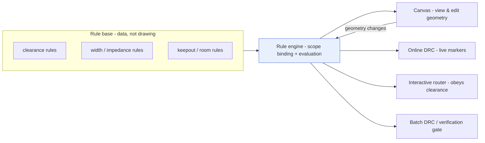
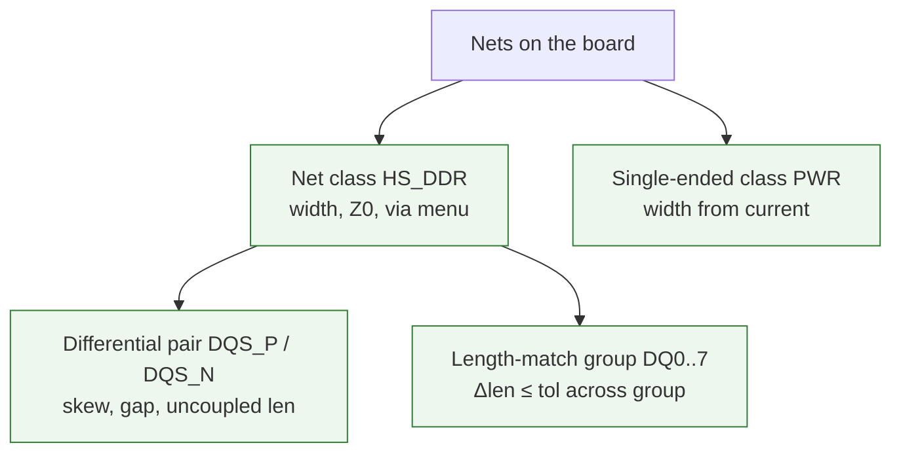
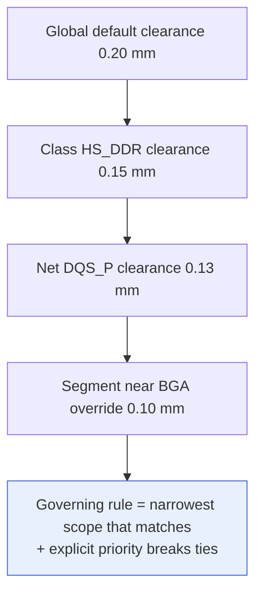
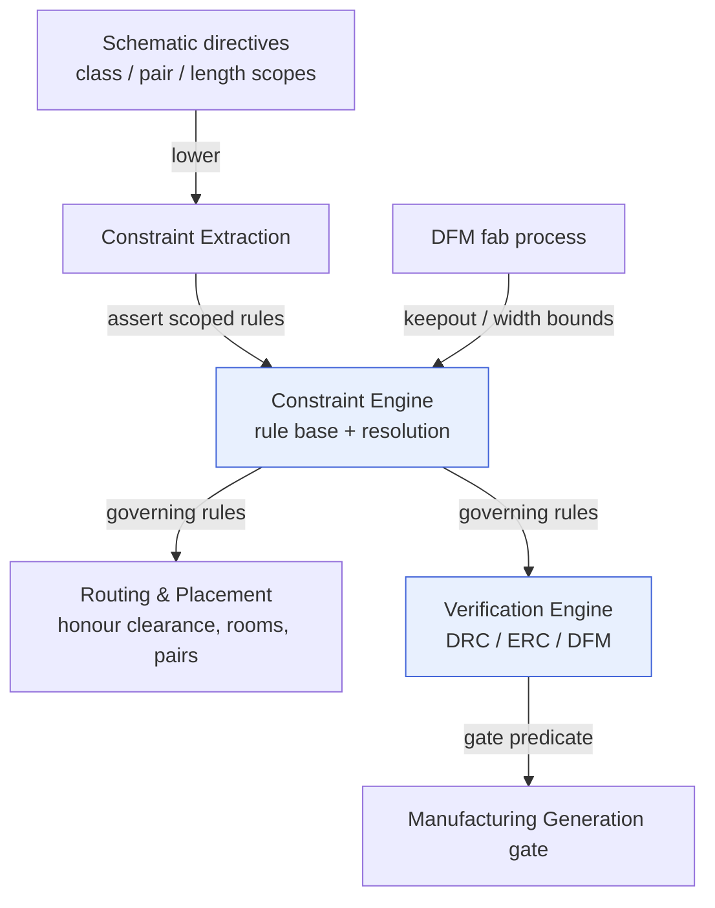

# Constraint Systems in EDA

**Summary.** A *constraint system* is the architectural pattern by which professional electronic-design-automation (EDA) tools encode design rules as **declarative data, scoped to named groups of objects, resolved by inheritance, and evaluated by an engine that is deliberately separate from the geometric canvas**. This document belongs in the Engineering Science Layer because it names the industry-proven shape that the EAK runtime silently re-implements: EAK did not invent net classes, rooms, keepouts, differential-pair groups, or a rule base independent of the drawing — every mainstream schematic/PCB tool converges on these, for reasons that are engineering necessities, not stylistic choices. It grounds the [Constraint Engine](../../docs/engineering/constraint-engine.md) (the rule base that *stores, resolves, and checks*), the [Verification Engine](../../docs/engineering/verification-engine.md) (rule → violation → gate), the separation of the canonical [IR](../../docs/compiler/compiler-ir.md) from any UI canvas ([principle P11](../../docs/foundation/principles.md): the UI *displays* diagnostics, it never *computes* them), and the constraint-scoping machinery behind EAK's per-net-class trace widths, board-edge keep-out, and floor-planning regions. Where [constraint-satisfaction](../mathematics/constraint-satisfaction.md) supplies the *mathematics* (`⟨X, D, C⟩`, propagation, decidability), this document supplies the *engineering architecture* that organizes those constraints so a human and a machine can author, scope, and reconcile them at the scale of a real board.

---

## Core principles

### Principle 1 — the rule base is separated from the canvas

The foundational decision in every serious EDA tool is that the **rule base** — the body of constraints — is a first-class data structure that exists *independently of the graphical editor*. The canvas (schematic sheet, PCB layout surface) is a view-and-edit surface over geometric and topological objects: pads, tracks, vias, courtyards, symbols, nets. The constraint system is a *separate* subsystem that

1. stores each rule as data: a `(scope, predicate, priority, source)` tuple, not a property baked into a drawn object;
2. **binds** each rule to a set of target objects through a *scope expression* (a query over the object model) rather than by pointing at individual shapes;
3. **evaluates** rules continuously as geometry changes, feeding online DRC, interactive (push-and-shove) routing, the autorouter, and the batch verification gate from *one* rule semantics.


*Figure: one rule base, one engine, many consumers; the canvas is a client of the engine, never the owner of the rules.*

The reasons this separation is non-negotiable are concrete engineering ones:

- **Single source of truth.** The drawing is *checked against* the rules; it does not *contain* them. Two designers editing the same board see the same legality verdict because legality lives in the rule base, not in either editor session.
- **One semantics, many consumers.** The exact clearance that the interactive router honours while shoving a track must equal the clearance the batch DRC flags and the clearance the autorouter respects. If clearance were a property of the canvas, three subsystems would re-derive it and drift.
- **Rules survive edits.** Moving a track, re-pouring copper, or swapping a footprint must not mutate the rule that governs it. Because the rule targets a *scope* (e.g. "the `HS_DDR` net class"), not a shape, edits to geometry leave the rule untouched and simply re-trigger evaluation.

This is the model–view–controller discipline applied to engineering rules, and it is the industry analogue of EAK's hard line that the [Engineering State](../../docs/core/shared-state-model.md)/IR is canonical while any canvas is a projection.

### Principle 2 — scope: a rule targets a *query*, not an object

A constraint in this pattern is `⟨scope, predicate, priority, source⟩`:

- **Scope** — a query over the object model selecting *which* entities the rule governs: an object class (all nets, all SMD pads), a named group (a net class), a spatial region (a room), or a boolean combination of attributes. Scope is the industry surface of the formal *constraint scope* `Sⱼ ⊆ X` from [constraint-satisfaction](../mathematics/constraint-satisfaction.md).
- **Predicate** — the testable bound: a comparison of [physical quantities](../../docs/engineering/units-and-quantities.md) (`clearance ≥ 0.20 mm`), an enumerated allowance (`via ∈ {through, blind-1-2}`), or a relation between members of a group (`|len(A) − len(B)| ≤ 5 mil`).
- **Priority** — an explicit ordering token used to break ties between rules of equal specificity.
- **Source** — provenance: a requirement, a standard clause, a datasheet limit, a fabrication-process rule, or a human override. (EAK carries this as a [Provenance Link](../../docs/foundation/engineering-domain-model.md#provenance-link).)

Authoring rules against *queries* is what makes a 2000-net board tractable: you write the width rule once against a class, and every present and future member inherits it.

### Principle 3 — the grouping abstractions

Professional tools provide a small, recurring vocabulary of named groups that constrain *together*. Each is a reusable scope.

- **Net class.** A named set of nets sharing electrical/physical rules — trace width, clearance, impedance target, permitted via styles, layer set. Membership is explicit (assign net → class) or rule-based (nets matching a pattern). A net's *effective* rule is that of the most-specific scope targeting it (see Principle 5). This is the single most-used grouping on a board and maps directly to EAK's **per-net-class trace widths** (increment 10).
- **Differential pair.** Two nets bound as `P`/`N` partners, carrying rules *over the pair*: intra-pair skew, edge-to-edge gap (which sets the differential impedance), and maximum uncoupled run. The constraint is relational — it constrains the two nets *relative to each other*. See the sibling [differential-pairs](../pcb/differential-pairs.md) for the field physics.
- **Length-match / tuning group.** A set of nets (or pairs) that must share an electrical length within tolerance — a parallel bus, an address/data group, a source-synchronous interface. The bound is *equality-within-tolerance across the group*, the engineering form of a global relational constraint (cf. the `alldifferent`/`cumulative`-style global constraints in [constraint-satisfaction](../mathematics/constraint-satisfaction.md)). It cannot be decomposed into independent per-net bounds without losing meaning, because no single net has an absolute target length — only the group's *spread* matters.
- **Pin pairs / from-to.** A directed sub-segment of a net (source pin → load pin) so a length or topology rule applies to one branch of a multi-load net rather than the whole equipotential.


*Figure: grouping abstractions are nested scopes — a pair and a tuning group live inside a class, each adding relational rules the class alone cannot express.*

### Principle 4 — spatial scoping: rooms and keepouts

Not all scopes are net-based; many are *regional*. The industry pattern provides spatial scopes whose membership is "any object whose geometry falls in (or out of) this area":

- **Room / placement region.** A named board area that scopes placement and routing rules to a functional block — "keep this regulator's parts inside this rectangle," "use the analog rule set in this region." Rooms turn a partition of the board into a partition of the rule base, and are the industry form of EAK's [PCB floor-planning](../../docs/state-machines/pcb-floor-planning.md) regions.
- **Keepout / keep-in.** A region that forbids (keepout) or confines (keep-in) a class of object: copper keepout, route keepout, via keepout, placement keepout, component-height keepout. A **board-edge clearance band** is exactly a keepout: a ring near the rim from which copper and parts are excluded. This is EAK's **board-edge keep-out**, now sourced from the [DFM](../../docs/state-machines/dfm-verification.md) fabrication process (increment 9) rather than guessed.

A spatial scope is, formally, a *unary* constraint on the position attribute of every placeable/routable object — it prunes forbidden positions from each object's domain before any pairwise rule runs ([node consistency](../mathematics/constraint-satisfaction.md)).

### Principle 5 — constraint inheritance and deterministic precedence

Because scopes overlap (a net belongs to a class, sits in a room, and may carry its own override), several rules can target one object. The system must reduce them to **one governing rule, deterministically and explainably**. The universal industry pattern is *most-specific-wins with explicit priority as tie-breaker*, over an inheritance ladder:

```
global default  ⊏  net class (← parent class)  ⊏  net  ⊏  from-to / segment / local override
broadest scope  ──────────── increasing specificity ────────────▶  narrowest scope
```


*Figure: the inheritance ladder; the most-specific matching scope governs, with a priority number resolving same-specificity ties.*

Two refinements matter:

- **Inheritance between classes.** A net class may inherit from a parent class (a high-speed class refining a general signal class), so shared rules are written once and specialized where needed — the object-oriented inheritance pattern applied to rule scopes.
- **Most-restrictive-within-tier.** When two rules of *equal* specificity and priority apply, the tighter bound governs (a 0.25 mm clearance beats a 0.20 mm one). Authority (a human or safety/regulatory override) outranks a derived default regardless of specificity.

This is precisely the [Constraint Engine](../../docs/engineering/constraint-engine.md)'s recorded precedence — **source authority → specificity → restrictiveness** — and it must be a *function* (same inputs → same governing bound) so that resolution is reproducible and auditable.

### Principle 6 — constraint directives flow from capture to layout

The last reusable principle is *where* constraints are authored. Professional flows let the engineer attach **constraint directives** at schematic capture — net-class assignment, differential-pair designation, length/skew rules, room hints — and propagate them through the netlist into layout. Intent is recorded next to the design source, not re-entered by hand in the PCB editor. Architecturally this is a transformation: the rule-bearing scopes ride the lowering from a [Schematic IR](../../docs/compiler/ir/schematic-ir.md) to a [PCB IR](../../docs/compiler/ir/pcb-ir.md), preserving the binding from intent to enforced rule.

---

## Why it matters for electronics & PCB design

Design rules are the discretized shadow of physics — a clearance is field breakdown and creepage rendered as a geometric inequality; a width floor is [Ohm's-law](../electrical/ohms-law.md) ampacity and IR-drop rendered as `width ≥ f(I)`; a matched-length group is the timing budget of a synchronous bus rendered as a length spread. The constraint-system pattern gives a real board four properties it cannot otherwise have:

- **Authoring at scale.** A modern board has thousands of nets and tens of thousands of geometric objects. Without scopes (classes, rooms, groups), every rule would be a per-object annotation — unmaintainable and un-auditable. Scopes let a handful of rules govern the whole board and *stay correct as it grows*.
- **Relational rules that no per-object bound can express.** Skew, matched length, and intra-pair gap constrain nets *relative to each other*. Only a grouping abstraction (pair, tuning group) can carry them; a tool that only knows per-net widths physically cannot describe DDR or a serial-link lane.
- **Locality of intent and recompute.** A change to one net propagates only along the scopes it participates in, so live DRC re-evaluates a neighbourhood, not the board — the engineering payoff of separating the rule engine from the canvas.
- **An honest, named over-constraint.** When the most-specific rules on an object contradict (an impedance target with a clearance/stack-up that cannot meet it), the pattern surfaces a *conflict* with the contributing scopes named, instead of silently picking a value — the difference between an auditable tool and an opaque one.

---

## Mapping to the runtime

This is the load-bearing section: each industry principle is embodied by a concrete EAK artifact, and violating the principle would be an engineering bug in the runtime.

### The rule base separated from the canvas → Constraint Engine + IR-as-canonical

EAK's [Constraint Engine](../../docs/engineering/constraint-engine.md) *is* the rule base of Principle 1: it stores constraints as `(type, scope, bound, severity, source)`, computes applicability by scope, and checks subsets — with **no canvas and no stochastic reasoning** inside it. The canonical [Engineering State](../../docs/core/shared-state-model.md)/[IR](../../docs/compiler/compiler-ir.md) is the model; any UI is a projection that, per [principle P11](../../docs/foundation/principles.md), *displays* diagnostics the engine computes and never computes its own. If the UI canvas ever computed a clearance verdict locally, EAK would have two rule semantics — the exact drift Principle 1 exists to forbid, and a reportable defect.

### Scope and grouping → net classes, diff-pairs, and per-net-class trace widths

Principle 2's `⟨scope, predicate, priority, source⟩` is the Constraint Engine's constraint record one-for-one. Principle 3's net class is realized directly by EAK's **per-net-class trace widths** (increment 10): each class carries its own width domain, and every member net inherits it — a *domain template by class*, replacing one global width with a finite family of class-scoped domains. Differential pairs and length-match groups are the relational scopes that [Routing Planning](../../docs/state-machines/routing-planning.md) must honour and that the [EMC analysis](../../docs/state-machines/emc-analysis.md) and signal-integrity checks read; their bounds are quantity comparisons typed through [units-and-quantities](../../docs/engineering/units-and-quantities.md). Authoring a width as a bare number instead of a class-scoped rule would forfeit inheritance and force per-net annotation — un-maintainable at board scale.

### Spatial scoping → floor-planning rooms and the fab-sourced board-edge keep-out

Principle 4's rooms are EAK's [PCB floor-planning](../../docs/state-machines/pcb-floor-planning.md) regions: a partition of the board that scopes placement/routing rules to functional blocks, respected by [Component Placement](../../docs/state-machines/component-placement.md). The **board-edge keep-out** is the canonical keepout band, and EAK's hardening to *source it from the [DFM](../../docs/state-machines/dfm-verification.md) fabrication process* (increment 9) is Principle 2's `source` facet taken seriously — the bound traces to a real fab capability, not a guess, so its [provenance](../../docs/core/provenance-and-traceability.md) survives audit. A keepout authored as a hand-typed margin would violate the provenance contract.

### Inheritance and precedence → the Constraint Engine's resolution function

Principle 5's most-specific-wins ladder is the Constraint Engine's recorded precedence — **source authority → specificity → restrictiveness** — producing the *governing bound*. It must be a deterministic function: the same overlapping scopes must always reduce to the same effective rule, or [reproducibility](../../docs/foundation/principles.md) breaks and incremental re-checking could disagree with the gate. When the ladder yields no satisfiable bound (e.g. an impedance target no stack-up can meet under a thickness limit), the engine raises a **Conflict** and, by contract, *refuses to invent a compromise* — the runtime honouring the pattern's "surface, never fabricate" discipline.

### Directives flow → constraint extraction and IR lowering

Principle 6 is realized by the [Constraint Extraction](../../docs/state-machines/constraint-extraction.md) phase writing scoped constraints into the engine, and by the [transformation](../../docs/compiler/transformations.md) that lowers a [Schematic IR](../../docs/compiler/ir/schematic-ir.md) to a [PCB IR](../../docs/compiler/ir/pcb-ir.md) carrying class/pair/length scopes forward. The **regulator VIN/VOUT rail split** (increment 11) is a constraint-modelling fix in this spirit: one collapsed power net carried two contradictory voltage scopes at once (input and output rail) — an inherent over-constraint. Splitting it into two scoped nets, each with a consistent rule, makes the model satisfiable. This is the industry move of *introducing a distinct constrained object to remove a scope collision*, which is why it is a correctness fix, not cosmetics.

### Verification consumes resolved rules; the gate inherits their decidability

[DRC](../../docs/state-machines/drc-verification.md), [ERC](../../docs/state-machines/erc-verification.md), and [DFM](../../docs/state-machines/dfm-verification.md) are specializations of the [Verification Engine](../../docs/engineering/verification-engine.md): each binds a rule slice to a state scope and evaluates the realized design — *checking*, not search. The **manufacturing gate** that blocks [Manufacturing Generation](../../docs/state-machines/manufacturing-generation.md) on open error-severity violations is therefore a pure predicate over the governing rules the constraint system resolved. The same separation that lets one rule base feed interactive routing and batch DRC in commercial tools is what lets EAK's online diagnostics and its gate agree by construction.


*Figure: directives and fab inputs populate the rule base; the engine resolves governing rules consumed by both the synthesis (routing/placement) and the checking (verification) halves, terminating in the gate.*

---

## Failure modes if violated

- **Rules embedded in the canvas.** If a clearance or width is stored as a property of a drawn object instead of in the rule base, two editors or two subsystems (router vs. DRC) re-derive it and drift; legality becomes view-dependent. The cure is Principle 1 — one rule base, the canvas as client. In EAK this is the P11 line the UI must never cross.
- **Per-object rules instead of scopes.** Annotating thousands of nets individually is unmaintainable and silently goes stale as the board grows; a new net inherits nothing. Net classes and class inheritance exist precisely to prevent this; EAK's per-net-class widths enforce it.
- **Relational rules forced into per-object bounds.** Expressing a matched-length group or intra-pair skew as independent per-net targets is *meaningless* — no single net has an absolute length target. The group abstraction must remain a first-class relational scope, or high-speed interfaces cannot be described at all.
- **Non-deterministic or undocumented precedence.** If overlapping scopes do not reduce to one governing rule by a recorded function, the same design yields different verdicts across runs, and incremental checking can disagree with the gate — a direct breach of [reproducibility](../../docs/foundation/principles.md). Precedence must stay *source authority → specificity → restrictiveness*, recorded.
- **Fabricating a bound to dodge a scope collision.** Filling an over-constrained object (the un-split VIN/VOUT net) with an invented compromise asserts a rule the constraints prove cannot hold. The engine must surface the [Conflict](../../docs/engineering/constraint-engine.md) and name the contributing scopes, never patch over it.
- **Keepouts/rooms without provenance.** A spatial bound typed by hand instead of sourced (e.g. board-edge clearance not traced to the fab process) cannot be audited or updated when the manufacturer changes; increment 9 exists to keep that bound fab-sourced and traceable.
- **Directives lost in lowering.** If class/pair/length scopes authored at the schematic do not propagate into the PCB IR, intent silently drops and layout is checked against weaker rules than the engineer specified — an invisible loss of constraint that the transformation must preserve.

---

## Related documents

- Engineering-Science siblings: [`../mathematics/constraint-satisfaction.md`](../mathematics/constraint-satisfaction.md) (the formal `⟨X, D, C⟩`, propagation, and decidability under these scopes) · [`../mathematics/graph-theory.md`](../mathematics/graph-theory.md) (the net/constraint graph scopes traverse) · [`../pcb/differential-pairs.md`](../pcb/differential-pairs.md) (the physics behind pair/length-group rules) · [`../electrical/ohms-law.md`](../electrical/ohms-law.md) (ampacity/IR-drop behind class width rules) · [`../manufacturing/dfm-principles.md`](../manufacturing/dfm-principles.md) (where fab-sourced keepout/width bounds originate)
- Runtime engines: [`constraint-engine`](../../docs/engineering/constraint-engine.md) · [`verification-engine`](../../docs/engineering/verification-engine.md) · [`planning-engine`](../../docs/engineering/planning-engine.md) · [`units-and-quantities`](../../docs/engineering/units-and-quantities.md) · [`standards-and-compliance`](../../docs/engineering/standards-and-compliance.md) · [`component-library`](../../docs/engineering/component-library.md)
- Compiler / IR: [`compiler-ir`](../../docs/compiler/compiler-ir.md) · [`schematic-ir`](../../docs/compiler/ir/schematic-ir.md) · [`pcb-ir`](../../docs/compiler/ir/pcb-ir.md) · [`transformations`](../../docs/compiler/transformations.md)
- Phases (state machines): [`constraint-extraction`](../../docs/state-machines/constraint-extraction.md) · [`pcb-floor-planning`](../../docs/state-machines/pcb-floor-planning.md) · [`component-placement`](../../docs/state-machines/component-placement.md) · [`routing-planning`](../../docs/state-machines/routing-planning.md) · [`drc-verification`](../../docs/state-machines/drc-verification.md) · [`erc-verification`](../../docs/state-machines/erc-verification.md) · [`dfm-verification`](../../docs/state-machines/dfm-verification.md) · [`manufacturing-generation`](../../docs/state-machines/manufacturing-generation.md)
- Foundations: [`engineering-domain-model`](../../docs/foundation/engineering-domain-model.md) (Constraint, Rule, Violation, Net, Net class, Track) · [`principles`](../../docs/foundation/principles.md) (P11 UI-displays-not-computes, determinism) · [`GLOSSARY`](../../docs/GLOSSARY.md)
