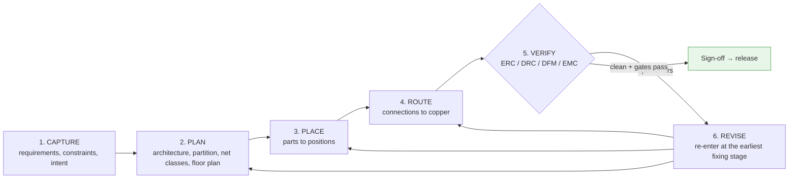
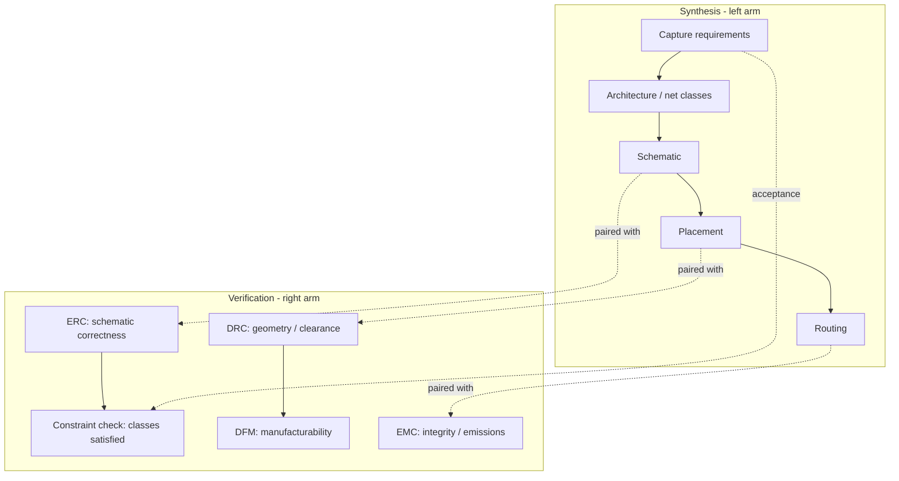
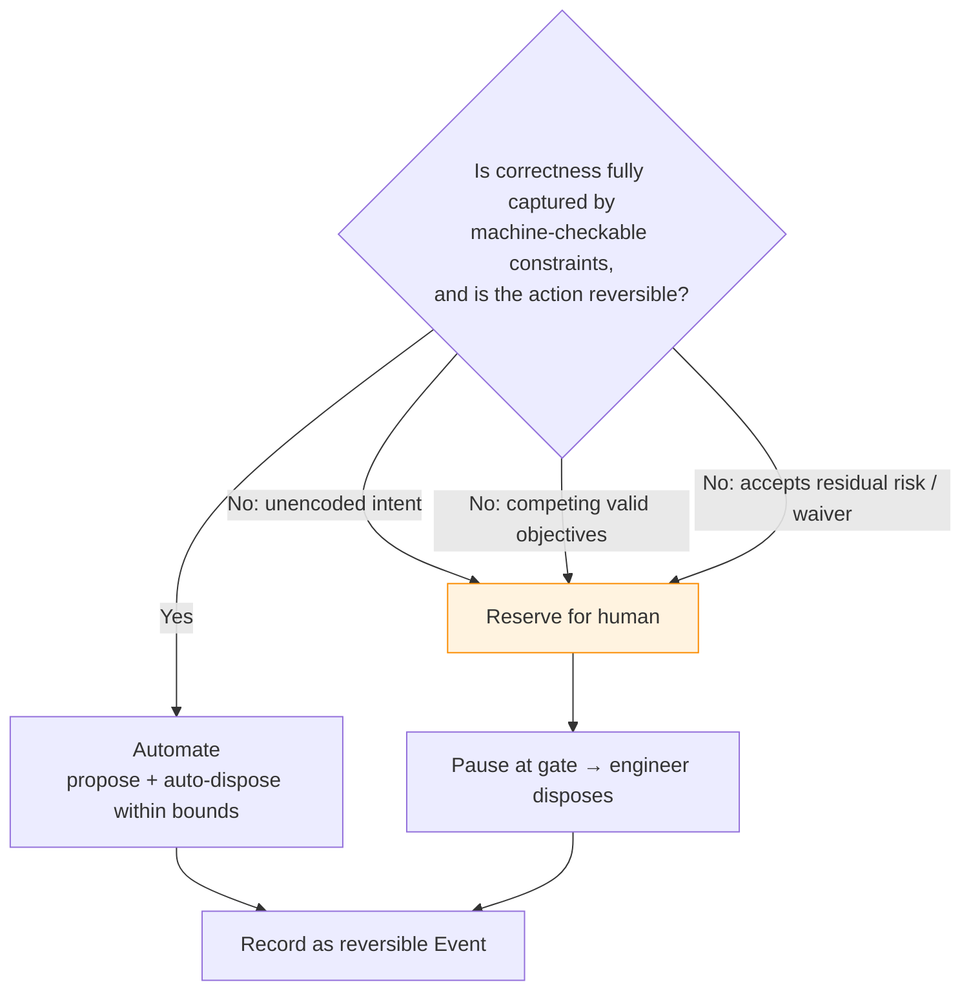
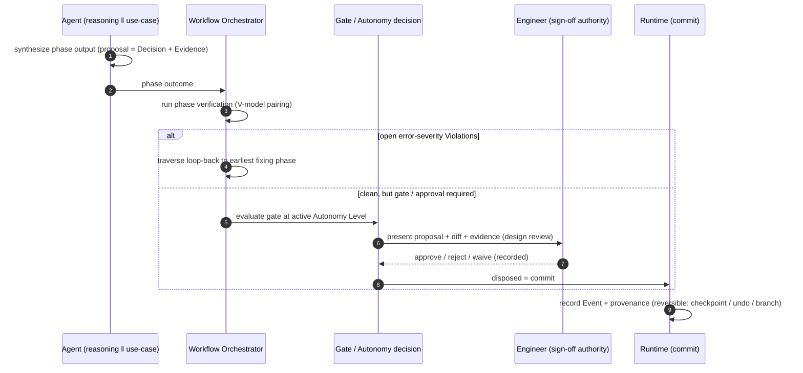

# The Engineering Human Workflow

**Summary.** This document distills the *process discipline* a working hardware engineer follows to turn an intent into a manufacturable board — the **iterative engineering loop** (capture → plan → place → route → verify → revise), the **design-review gates** that punctuate it, the **sign-off** that ends it, and the **automate-versus-decide boundary** that governs who does what along the way. It is vendor- and tool-neutral: it describes the human method, not any one CAD package. It belongs in the Engineering Science Layer because the EAK runtime is, structurally, a *mechanization of this human loop*: the [Workflow Orchestrator's](../../docs/core/workflow-orchestration.md) phase DAG **is** the loop, its **gates** are the design reviews, its **loop-backs** are the "revise" arrow, and the [Human-in-the-Loop](../../docs/engineering/human-in-the-loop.md) propose/dispose seam is the sign-off discipline made executable. Where the sibling [placement-philosophy.md](placement-philosophy.md) and [routing-philosophy.md](routing-philosophy.md) ground the *per-stage* methods, this document grounds the *whole-loop governance* that sequences and accepts those stages. It is the engineering rationale beneath the runtime's [Autonomy Levels](../../docs/engineering/human-in-the-loop.md), its gate conditions, its verification loop-backs, and its insistence that every design-significant change be a [Decision](../../docs/foundation/engineering-domain-model.md#decision) an accountable human can dispose, trace, and reverse.

---

## Core principles

The professional flow is **not a pipeline**. It is a *convergent refinement loop* punctuated by *human decision gates*, and it ends with an *accountable signature*. Four laws govern it: the loop converges to a verified fixed point; defects cost more the later they are caught; synthesis and verification are paired (the V-model); and a residual-risk decision is reserved to an accountable human.

### 1. The iterative loop is a convergent refinement, not a linear pass

A professional does not produce a finished board in one forward sweep. They run a loop — **capture, plan, place, route, verify, revise** — re-entering on any verification failure, until the design reaches a state with no open error-severity findings. The loop is a *contraction toward feasibility*: each pass should reduce the open-violation set, not enlarge it.


*Figure: the engineer loop — synthesis stages feed verification; failures re-enter at the cheapest stage that can fix them; only a clean, gated design reaches sign-off.*

Formally, treat each pass as a state update on the design `S`:

```text
S_{n+1} = revise( S_n , verify(S_n) )           # one iteration of the loop
verify(S) = set of open error-severity Violations of S
TERMINATE when verify(S*) = ∅                    # S* is a feasible fixed point: a releasable design
```
*Listing: the loop as a fixed-point iteration. "Done" is defined by verification (an empty error set), never by "I drew everything." A loop that does not shrink `verify(S)` is diverging and must be escalated, not repeated.*

The discipline has two non-obvious consequences. First, **"complete" and "correct" are different predicates**: a board can be 100% captured, placed and routed (complete) yet carry open violations (incorrect). Termination is a property of `verify`, not of coverage. Second, **the loop must be bounded**: an oscillating design that never reaches the fixed point is a real failure mode, so a professional caps re-tries and escalates a non-converging design to human judgement rather than churning forever.

### 2. The cost-of-change law — catch defects in the phase that injects them

The economic engine behind every review gate is the empirical **cost-of-change curve**: the cost to fix a defect grows steeply with the distance between the phase that *injected* it and the phase that *detected* it. The widely-observed "rule of ten" (Boehm's cost-of-change data; the 1:10:100 escalation in quality engineering) approximates it:

```text
C_fix(injected at phase i, detected at phase j) ≈ C0 · k^(j − i) ,   k ≈ 10 ,  j ≥ i
```
*Listing: fixing a defect at the phase that created it (j = i) is the cheapest case; each downstream phase it survives multiplies the cost. A symbol error caught at ERC costs minutes; the same error caught at board bring-up costs a re-spin and weeks.*

Two design rules follow directly, and both are reusable beyond PCB work. **Pair each synthesis phase with an immediate verification** so `j − i` stays near zero (principle 3). And **when a defect does escape, route the fix to the *earliest* stage that can resolve it**, not to wherever it surfaced — a routing-time DRC failure caused by a bad placement must re-enter at *placement*, because fixing it in routing is the expensive, downstream patch.

### 3. The V-model — synthesis and verification are mirror images

Mature hardware practice pairs every *synthesis* (design-creating) phase with a *verification* phase that checks exactly that phase's output against exactly the requirements it was meant to satisfy. Drawn as a "V", synthesis descends the left arm (abstract → concrete) and verification climbs the right arm (concrete → abstract), with horizontal correspondence between each level.


*Figure: the V-model correspondence. Each synthesis level has a matching verification that asks "did this level satisfy its own inputs?" — the structural reason EAK has one verification phase per synthesis phase.*

The V-model is *why* verification is not a single end-of-line test but a sequence of phase-local checks. It also encodes the cost-of-change law geometrically: the horizontal pairings keep `j − i` small.

### 4. Design-review gates — a go/no-go decision under uncertainty

Between phases sit **gates**: explicit points where work *pauses* and a human (or an authorized policy) decides go / no-go / rework. Two flavours recur. A **peer/design review** is a human inspection of a proposed artifact against intent and convention — it catches the unencoded errors that no rule-checker can see (is this the *right* topology? is the part *appropriate*?). A **milestone/stage gate** (the stage-gate or phase-gate process) is a project-level go/no-go that may not advance until invariants hold — e.g. "no open error-severity findings." A gate is a *decision under uncertainty*: the reviewer weighs evidence (verification results, [Evidence](../../docs/foundation/engineering-domain-model.md#evidence) behind each [Decision](../../docs/foundation/engineering-domain-model.md#decision)) against the cost of advancing a latent defect (principle 2). This is decision theory, not ceremony — the formal treatment is in [decision-theory.md](../mathematics/decision-theory.md).

### 5. Sign-off — accountability is non-delegable

A design *ends* with **sign-off**: an accountable human signature attesting that the design meets requirements and is fit for fabrication. Sign-off is the operational form of professional accountability — the "engineer of record" pattern that regulated regimes (functional-safety and aerospace hardware practice; the documented-review expectation in IPC and quality-management systems, see [standards-and-compliance.md](../../docs/engineering/standards-and-compliance.md)) make mandatory. The signer carries the liability, so the signature **cannot be delegated to a tool that carries none**. A signature is only meaningful if the signer can answer "what changed, why, and on what evidence" for every design-significant decision — which is exactly why traceability ([P5](../../docs/foundation/principles.md)) is a precondition for sign-off, not a nicety.

### 6. The automate-versus-decide boundary

The defining professional judgement of the whole loop is *what to automate and what to reserve for a human*, and it follows one rule: **automate where the objective is fully captured by machine-checkable constraints; reserve for human decision where intent, trade-offs, or residual risk exceed what the rules encode.** Four things are intrinsically human:

- **Unencoded intent.** Automation can only honour constraints that were *written down*; intent living only in the engineer's head is invisible to it (the same asymmetry that governs the autoroute boundary in [routing-philosophy.md](routing-philosophy.md)).
- **Trade-offs among valid objectives.** Cost vs. performance vs. size vs. EMC margin is a multi-objective problem with a *Pareto front*, not a single optimum ([optimization-theory.md](../mathematics/optimization-theory.md)). Choosing a point on that front is a value judgement.
- **Acceptance of residual risk.** Declaring "this violation is acceptable for this product" — a *waiver* — accepts risk on behalf of the organization and is reserved to an authorized human.
- **The go/no-go at gates** (principle 4) and the **sign-off** (principle 5).

Everything else — the mechanical, repetitive, fully-specified, and verifiable — is a candidate for automation. The boundary is not fixed; as more intent is *encoded* as constraints, more of the loop becomes safely automatable. That migration is the whole point of an AI-native runtime.


*Figure: the automate-versus-decide test — delegate only when the constraint set is the complete specification of correctness and the action is reversible; otherwise reserve the call for an accountable human.*

---

## Why it matters for electronics & PCB design

PCB design is unforgiving of process error precisely because its outputs are *physical and expensive to iterate*: a fabricated board cannot be patched in place, and a re-spin costs weeks and tooling money. The loop's structure is the engineering response to that economics.

- **Path-dependence makes ordering load-bearing.** Capture constrains plan, plan constrains placement, placement constrains routing. A defect injected upstream and detected downstream is the most expensive case (principle 2), so the gates that catch it early pay for themselves many times over. This is why ERC sits *before* floor-planning and not after routing.
- **Connected is not correct, and complete is not done.** A schematic can be drawn yet violate ERC; a board can be fully routed yet fail DRC, DFM, or EMC. The loop's verification stages exist to separate *built* from *works* — the same distinction grounded electrically in [signal-integrity.md](../electrical/signal-integrity.md) and [power-integrity.md](../electrical/power-integrity.md) and dimensionally in [units-and-quantities.md](../../docs/engineering/units-and-quantities.md) ([P9](../../docs/foundation/principles.md)).
- **Automation without judgement ships latent failures.** A tool optimizing an under-specified objective produces an artifact that passes every written rule and still fails in the field. The human-decision reservations (principle 6) are the engineering admission that not all correctness is yet encoded.
- **Liability is real.** Someone is accountable when a board ships. Sign-off with full provenance is how that accountability is discharged honestly — and is exactly why an AI may *propose* but only an engineer may *dispose* ([P10](../../docs/foundation/principles.md)).

---

## Mapping to the runtime

This is the load-bearing section: the human loop is not advisory prose, it is the *specification* the EAK kernel implements. The runtime is a deterministic mechanization of this workflow, and each principle maps to a concrete artifact whose violation would be an engineering bug.

| Principle (this doc) | Runtime artifact that embodies it | Why a violation is a bug |
|---|---|---|
| **The loop is a phase graph, not a line** | The [Workflow Orchestrator](../../docs/core/workflow-orchestration.md) owns the *workflow plan*: a declarative DAG with forward edges, gate edges, and **loop-back edges** (ERC→Schematic, DRC→Routing, DFM→Placement, EMC→Routing). The loop-backs *are* the "revise" arrow. | Hardcoding a linear pipeline would make verification failure unrecoverable; the loop-back edges are how iteration is expressed declaratively ([P7](../../docs/foundation/principles.md)). |
| **Capture → plan → place → route → verify → revise** | The phase stages: [Requirement Planning](../../docs/state-machines/requirement-planning.md)+[Constraint Extraction](../../docs/state-machines/constraint-extraction.md) (capture) → [Schematic](../../docs/state-machines/schematic-planning.md)+[Floor Planning](../../docs/state-machines/pcb-floor-planning.md) (plan) → [Component Placement](../../docs/state-machines/component-placement.md) (place) → [Routing Planning](../../docs/state-machines/routing-planning.md) (route) → [ERC](../../docs/state-machines/erc-verification.md)/[DRC](../../docs/state-machines/drc-verification.md)/[DFM](../../docs/state-machines/dfm-verification.md)/[EMC](../../docs/state-machines/emc-analysis.md) (verify). Each is a [state-machine instance](../../docs/state-machines/README.md). | Each stage lowers one [IR](../../docs/compiler/compiler-ir.md) to the next ([Requirement](../../docs/compiler/ir/requirement-ir.md) → [Schematic](../../docs/compiler/ir/schematic-ir.md) → [PCB](../../docs/compiler/ir/pcb-ir.md) → [Manufacturing](../../docs/compiler/ir/manufacturing-ir.md)). Skipping a stage means lowering from an unverified IR — a provenance gap. |
| **Fixed-point termination (`verify(S*) = ∅`)** | The **global gate on open error-severity [Violations](../../docs/foundation/engineering-domain-model.md#violation)** before [Manufacturing Generation](../../docs/state-machines/manufacturing-generation.md); the orchestrator's **convergence safeguards** bound loop-back cycles. | If the gate certified a design with open errors, the runtime would release an un-converged board — defining "done" as coverage, not correctness. Unbounded loop-backs would let a design oscillate forever silently. |
| **Cost-of-change → fix at the earliest stage** | Loop-back edges target the *fixing* phase, not the detecting phase: a DRC failure rooted in placement loops to [Placement](../../docs/state-machines/component-placement.md); an ERC failure loops to [Schematic](../../docs/state-machines/schematic-planning.md). Each loop-back is a recorded [Event](../../docs/core/event-bus.md). | Routing the fix to the wrong (downstream) phase applies the expensive patch instead of the cheap upstream correction — the runtime would systematically choose the costly repair. |
| **V-model pairing** | One verification phase per synthesis phase, with the **ERC pass-gate guarding the schematic→PCB boundary** ("no open errors" before [Floor Planning](../../docs/state-machines/pcb-floor-planning.md)). Verifications are specializations of the [Verification Engine](../../docs/engineering/verification-engine.md). | Advancing to PCB on an un-ERC'd schematic carries logical errors into copper where they cost a re-spin — the gate is the V-model's horizontal correspondence made enforceable. |
| **Design-review / milestone gates** | The orchestrator's **gate edges** plus the [Autonomy Level](../../docs/engineering/human-in-the-loop.md) approval gate: a phase may pause at `AwaitingApproval` until the engineer disposes. The decision is grounded in [decision-theory.md](../mathematics/decision-theory.md). | A gate that advanced without checking its invariant (or without the required approval at the active level) would let a no-go design proceed — the gate machinery is the runtime's refusal to do so. |
| **Sign-off = accountable disposal** | The **"AI proposes, engineer disposes"** seam ([P10](../../docs/foundation/principles.md), [P3](../../docs/foundation/principles.md)): every design-significant change is a [Decision](../../docs/foundation/engineering-domain-model.md#decision) with [Evidence](../../docs/foundation/engineering-domain-model.md#evidence), committed only on disposal, and the disposal is itself a recorded [Event](../../docs/core/event-bus.md) with [provenance](../../docs/foundation/principles.md). | An unrecorded mutation, or an autonomous commit with no traceable human authority, breaks the audit trail a real sign-off depends on ([P2](../../docs/foundation/principles.md), [P5](../../docs/foundation/principles.md)). The signer could not answer "what/why/by whom." |
| **Automate-versus-decide boundary** | The graduated [Autonomy Levels](../../docs/engineering/human-in-the-loop.md) (advisory / supervised / autonomous) combined with each [Capability's](../../docs/engineering/component-library.md) declared side-effects; **waiver authorization** is reserved to an authorized human. | Auto-committing an action whose correctness exceeds the encoded constraints (the unencoded-intent case) ships a rule-clean, field-broken board. The autonomy gate is the architectural guard for the human-only reservations. |
| **Trade-offs are human / typed** | Per-net-class [Constraints](../../docs/engineering/constraint-engine.md) capture the *encoded* trade-offs: **increment 10 (per-net-class trace widths)** sizes width by class, **increment 11 (regulator VIN/VOUT rail split)** sizes input and output rails by their own currents, **increment 9 (fabrication-sourced edge keep-out)** sources a DFM keep-out from the process. | Collapsing a per-class trade-off into one global rule (one width for a power rail and a bulk signal; one net for VIN and VOUT) mis-applies ampacity ([ohms-law.md](../electrical/ohms-law.md)) and certifies an under-sized rail — the very correctness bug the increments exist to prevent. |
| **Reversibility underwrites delegation** | [Checkpoints](../../docs/GLOSSARY.md#checkpoint), [Undo/Redo](../../docs/GLOSSARY.md#undoredo), and design branches make every action — human or autonomous — reversible and traceable ([P4](../../docs/foundation/principles.md)). | Delegation is only safe if mistakes are cheap to undo; an irreversible autonomous action would turn "let the AI route overnight" into an unrecoverable gamble. |


*Figure: the human loop as runtime states — verification drives loop-backs, gates honour the autonomy level, and disposal (the sign-off analogue) is a recorded, reversible Event.*

The architecture deliberately splits *synthesis* (agents propose) from *acceptance* (gates + disposal) so that no single phase can mistake "I produced an artifact" for "this artifact is accepted." That split is this document's loop, expressed as kernel mechanism.

---

## Failure modes if violated

- **Pipeline-not-loop (drop the loop-backs).** Verification becomes an end-of-line report with nowhere to send failures; the only recovery is to restart by hand. In the runtime this is a workflow plan with no loop-back edges — a [DRC](../../docs/state-machines/drc-verification.md) failure has no path back to [Routing](../../docs/state-machines/routing-planning.md), so iteration cannot be expressed and the project dead-ends on the first failure.
- **Fix-where-it-surfaced (ignore cost-of-change).** A placement-rooted DRC failure is patched in routing instead of placement; the patch papers over the cause, the next pass re-breaks it, and the loop never contracts. The runtime guard is loop-backs that target the *earliest fixing* phase, not the detecting phase.
- **Verify-once-at-the-end (collapse the V-model).** Logical errors ride an un-ERC'd schematic into copper and surface only at DRC or bring-up, where `j − i` is large and the fix is a re-spin. The **ERC pass-gate before floor-planning** is the runtime's refusal to advance unverified synthesis.
- **Complete = done (skip the fixed-point test).** The board is "fully routed," declared finished, and shipped with open error-severity findings. The **global gate on open errors** before [Manufacturing Generation](../../docs/state-machines/manufacturing-generation.md) exists precisely to forbid releasing a non-fixed-point design.
- **Unbounded iteration (no convergence safeguard).** Verification keeps failing, the loop-back fires forever, and the project churns without progress. The orchestrator's bounded loop-backs escalate a non-converging design to a human gate instead of spinning silently ([P13](../../docs/foundation/principles.md)).
- **Sign-off by tool (delegate accountability).** An autonomous commit lands with no traceable human authority and no evidence chain; when the board fails, no one can answer "why was this accepted?" The propose/dispose seam and full [provenance](../../docs/foundation/principles.md) make every acceptance an attributable, reversible [Decision](../../docs/foundation/engineering-domain-model.md#decision) — sign-off that actually means something.
- **Automate the unencoded (misplace the boundary).** A capability auto-commits a choice whose correctness was never written as a constraint — an intent-level or residual-risk judgement — and ships a rule-clean, field-broken board. The [Autonomy Levels](../../docs/engineering/human-in-the-loop.md) and human-reserved waivers are the architectural boundary that keeps these decisions with a person.

---

## Related documents

**Engineering Science siblings.** [placement-philosophy.md](placement-philosophy.md) and [routing-philosophy.md](routing-philosophy.md) (the per-stage methods this whole-loop doc sequences) · [mathematics/decision-theory.md](../mathematics/decision-theory.md) (gates and sign-off as decisions under uncertainty) · [mathematics/optimization-theory.md](../mathematics/optimization-theory.md) (the Pareto trade-offs reserved to humans) · [mathematics/constraint-satisfaction.md](../mathematics/constraint-satisfaction.md) (what the loop is solving) · [electrical/ohms-law.md](../electrical/ohms-law.md) (width-for-current behind per-class/rail-split trade-offs) · [electrical/signal-integrity.md](../electrical/signal-integrity.md) and [electrical/power-integrity.md](../electrical/power-integrity.md) (built-vs-works that verify separates) · [physics/maxwell-equations.md](../physics/maxwell-equations.md) (the field reality the loop must respect).

**Runtime anchors.** [core/workflow-orchestration.md](../../docs/core/workflow-orchestration.md) · [core/execution-engine.md](../../docs/core/execution-engine.md) · [engineering/human-in-the-loop.md](../../docs/engineering/human-in-the-loop.md) · [engineering/verification-engine.md](../../docs/engineering/verification-engine.md) · [engineering/planning-engine.md](../../docs/engineering/planning-engine.md) · [engineering/constraint-engine.md](../../docs/engineering/constraint-engine.md) · [engineering/standards-and-compliance.md](../../docs/engineering/standards-and-compliance.md) · [engineering/units-and-quantities.md](../../docs/engineering/units-and-quantities.md) · [foundation/principles.md](../../docs/foundation/principles.md) · [foundation/engineering-domain-model.md](../../docs/foundation/engineering-domain-model.md) · [compiler/compiler-ir.md](../../docs/compiler/compiler-ir.md) · [compiler/transformations.md](../../docs/compiler/transformations.md) · state machines: [requirement-planning](../../docs/state-machines/requirement-planning.md) · [schematic-planning](../../docs/state-machines/schematic-planning.md) · [pcb-floor-planning](../../docs/state-machines/pcb-floor-planning.md) · [component-placement](../../docs/state-machines/component-placement.md) · [routing-planning](../../docs/state-machines/routing-planning.md) · [erc-verification](../../docs/state-machines/erc-verification.md) · [drc-verification](../../docs/state-machines/drc-verification.md) · [dfm-verification](../../docs/state-machines/dfm-verification.md) · [emc-analysis](../../docs/state-machines/emc-analysis.md) · [manufacturing-generation](../../docs/state-machines/manufacturing-generation.md) · [GLOSSARY.md](../../docs/GLOSSARY.md).
