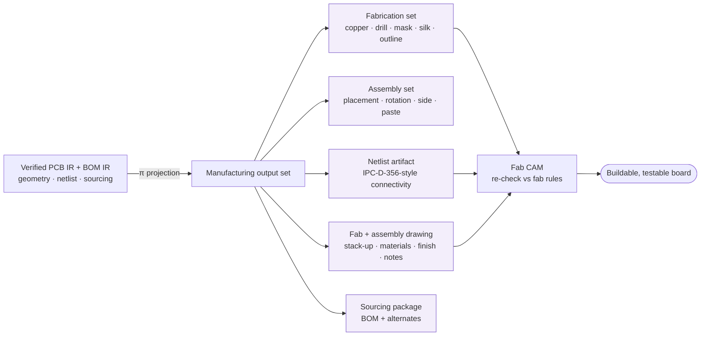

# Manufacturing Hand-off Methodology

**Summary.** The manufacturing hand-off is the moment a *verified internal design* leaves the design organization and becomes a *buildable package* for an external fabricator and assembler. It is a one-way, lossy projection across an organizational and tooling boundary: the receiving shop has none of your CAD database, none of your intent, and a *different* set of process limits — it has only the bytes you ship. This document captures the reusable, vendor-neutral methodology for that transfer: ship a **neutral, self-describing, fab-readable data set**; re-run **design-rule checks against the receiving fabricator's own rules**, not generic ones; encode the **fabrication and assembly drawing *intent*** the geometry alone cannot carry; and **source every design rule from the fab's published capability**, so the design is validated against the envelope it will actually be built in. It belongs in the Engineering Science Layer because the EAK runtime's terminal [Manufacturing Generation](../../docs/state-machines/manufacturing-generation.md) phase and its [Manufacturing IR](../../docs/compiler/ir/manufacturing-ir.md) *are* this hand-off reified — they silently assume that "a set of files = a buildable, auditable board" is governed by laws of completeness, internal consistency, faithful projection, and fab-sourced rule provenance. It grounds the runtime concept of a **released manufacturing output set**: what makes a bundle of artifacts a *correct, buildable, traceable* release rather than just a folder of files.

---

## Core principles

A vocabulary bridge first, consistent with the [GLOSSARY](../../docs/GLOSSARY.md) and the [Manufacturing IR](../../docs/compiler/ir/manufacturing-ir.md):

| Term | Meaning in this methodology |
|------|------------------------------|
| **Manufacturing output set** | The complete bundle handed off: fabrication + assembly + sourcing artifacts that let a shop build the board. |
| **Neutral interchange format** | A fab-readable, CAD-tool-independent encoding of the output set (e.g. Gerber RS-274X, ODB++, IPC-2581). |
| **Fab capability sheet / design-rule set** | The receiving fabricator's published process envelope (min trace/space, drill, annular ring, mask sliver, stack-up, finishes), keyed to a process class. |
| **CAM** | The fab's Computer-Aided Manufacturing step that ingests the set, re-checks it (CAM DFM), and prepares tooling. |
| **Netlist artifact** | A connectivity list (pin → net) shipped alongside geometry so the fab can independently verify connectivity (e.g. IPC-D-356A) and bare-board electrical-test the panel. |
| **Fabrication / assembly drawing** | The document carrying *non-geometric intent* — stack-up, materials, finishes, tolerances, impedance control, notes, polarity, side. |

The governing meta-principle is **faithful, self-describing projection across a boundary**. The hand-off is a function `π` from the verified internal model to an external byte set, and the methodology is the set of laws that make `π` trustworthy: it must lose no *required* information, introduce no *new* information, and travel with enough self-description that a party who has never seen your CAD database can rebuild your intent.


*Figure: the hand-off projects the verified design into a self-describing, neutral output set that the fab's CAM re-checks against its own rules before building.*

### 1. Neutral, self-describing data formats — the *what*, separated from the *how*

A hand-off format encodes the *what* of the board (geometry, connectivity, attributes) so that *any* fab — independent of which CAD tool drew it — can read it. Formats sit on a spectrum from **image-only** to **intelligent / data-driven**:

```text
image-only (e.g. classic Gerber as pure apertures+flashes):
    encode  → per-layer 2-D copper/mask polygons only
    DROPS   → netlist, component data, stack-up, net classes, attributes
    ⇒ fab must RE-EXTRACT connectivity and RE-DERIVE intent from pixels  (lossy projection)

intelligent / data-driven (ODB++, IPC-2581, Gerber X2 attributes):
    encode  → geometry + netlist + layer roles + materials + component data + attributes
    decode∘encode ≈ identity on {geometry, netlist, attributes}          (lossless semantics)
    ⇒ fab reads roles and connectivity directly; less re-interpretation, fewer guesses
```
*Listing: an image-only set forces the fab to reconstruct meaning the design already knew; a data-driven set carries that meaning, making the projection near-lossless and the hand-off self-describing.*

The reusable principle is **maximize self-description, minimize re-interpretation**. Every fact the fab has to *infer* from geometry (which layer is which, which copper is one net, what the stack-up is) is a fact that can be inferred *wrong*. A single intelligent file that bundles fabrication + assembly + netlist + stack-up (the modern IPC-2581 / ODB++ model) collapses the "set of loosely related files" failure surface into one internally-referenced database. The methodology is format-*shape*-driven, not vendor-driven: the runtime defers the concrete format (an explicit deferred decision in the [Manufacturing IR](../../docs/compiler/ir/manufacturing-ir.md)), but the *shape* — neutral, self-describing, connectivity-bearing — is a fixed law.

### 2. The hand-off is a *set*, governed by completeness and internal consistency

A release is not a file; it is a set, and a partial set is not a valid release. Two predicates govern it:

```text
Completeness:
  Set = Fab ∪ Drill ∪ Mask ∪ Silk ∪ Outline ∪ Netlist ∪ Assembly ∪ Drawing ∪ Sourcing
  release_complete ⟺ every REQUIRED member present ∧ each non-empty ∧ schema-valid

Internal consistency (the netlist invariant):
  N_design   = connectivity of the verified design          (pin → net equivalence classes)
  N_fab      = connectivity IMPLIED by the shipped copper + drill geometry
  N_assembly = connectivity implied by placement + footprints + the assembly BOM
  release_consistent ⟺ N_design ≡ N_fab ≡ N_assembly
```
*Listing: a valid release contains every required layer/drill/placement/BOM line, and the three independent views of connectivity — design intent, fabrication geometry, and assembly — describe the **same** net partition.*

Shipping `N_design` as an explicit **netlist artifact** (IPC-D-356A style) lets the fab's CAM verify `N_fab ≡ N_design` mechanically and bare-board-test the panel against it. This is the cheapest, highest-leverage cross-check in the whole flow: it catches a corrupted Gerber, a wrong aperture, or a CAM mistake *before* copies are built, by comparing two independently-produced connectivity views.

### 3. DRC against the *receiving fabricator's* rules, not generic ones

Design-rule checking is run twice, by two parties, against the *same* design but *different* rule sets, and the design must satisfy the tighter of the two for every rule:

```text
R_design = the rule set the design was drawn to (the design's assumed envelope)
R_fab    = the receiving fabricator's published capability   (the real build envelope)

For each rule r with a floor (min trace, min space, min drill, min annular ring, mask sliver, edge clearance):
    buildable(r) ⟺ as_built_feature ≥ max( floor_design(r), floor_fab(r) )

release_buildable ⟺ ∀ r ∈ (R_design ∪ R_fab) : buildable(r)
```
*Listing: feasibility is bounded below by the **tighter** of the design's and the fab's floors; a design that passed its own DRC can still fail the fab's, because the fab's etch/drill/registration limits are the ones that physically build it.*

The fab independently re-runs this as **CAM DFM** on receipt. The methodology's law is therefore: **re-validate against `R_fab` *before* hand-off**, so the design never ships into a rejection. A design DRC-clean against a generic or stale rule set, then thrown over the wall, discovers `R_fab` only as a fab rejection — weeks and a re-spin later. (The physics of *why* each floor exists lives in [manufacturing-constraints](../manufacturing/manufacturing-constraints.md); the *yield* reading in [dfm-principles](../manufacturing/dfm-principles.md). This document concerns *which* rule set the check runs against and *when*.)

### 4. Design-rule sourcing from the fab — provenance is part of the data

Because `R_fab` is what actually builds the board, every manufacturing limit the design is checked against must be **sourced from the chosen fabricator's capability sheet** (or, where the fab quotes to a class, from the [IPC producibility class](../../docs/engineering/standards-and-compliance.md) it commits to). A DFM number is therefore not a preference and not a universal constant — it is a *fab-process fact* that must carry its provenance:

```text
fab capability sheet  ─┐
IPC-6012 / IPC-2221    ├─►  typed manufacturing Constraint
producibility class   ─┘        { value, unit, Source = "fabrication-process rule (Fab X, class N)" }

re-source rule:  change of fab  ⇒  R_fab changes  ⇒  the design MUST be re-checked
                 (a value with no Source cannot be re-validated, so it is silently wrong)
```
*Listing: each manufacturing limit travels with the fab/class it came from; swapping fabs invalidates the prior check, and a limit lacking provenance is un-re-validatable — the worst kind of stale rule.*

This closes the loop: the fab is the *source* of the rules, the design is checked *against* the fab's rules, and the released set is built *by* that fab. Cut any strand — check against a generic rule, drop the Source, build at a different shop — and "passed DFM" becomes a statement about an envelope the board was never built in.

### 5. Fabrication & assembly drawing intent — what geometry cannot say

Copper polygons and drill coordinates describe *shape*; they do not describe *intent*. A large class of build-critical decisions is carried only by the **fabrication drawing** and **assembly drawing** (or their data-driven equivalents as attributes):

- **Fabrication drawing intent** — layer stack-up and order, dielectric materials and thicknesses, copper weights, **controlled-impedance** targets and the nets they apply to, surface finish (e.g. ENIG/HASL), solder-mask and silk colors, plating/finish callouts, dimensional tolerances, IPC producibility **class**, and free-text notes. None of this is recoverable from the Gerber geometry alone; a stack-up drawn but not *stated* is a stack-up the fab will choose for you.
- **Assembly drawing intent** — per-component **placement, rotation, and side** (top/bottom) for pick-and-place, **polarity / pin-1** orientation, do-not-populate (DNP) marks, paste/stencil apertures, and special-handling notes. Orientation is the canonical example: the geometry says *where* a part sits, the assembly drawing says *which way it faces* — and a reversed polarized part is a dead board.

The reusable principle: **separate geometry from intent, and ship both**. The geometry is necessary but not sufficient; the drawing/attribute layer is the contract for everything the polygons leave ambiguous. A data-driven format encodes much of this as machine-readable attributes (preferred); an image-only flow must carry it as an explicit human-readable drawing — but it must be carried *somewhere*, never assumed.

### 6. Faithful projection, immutability, and provenance — "what we built = what we verified"

The hand-off must preserve the verified properties and introduce nothing new:

```text
π : verified design ↦ manufacturing output set
faithfulness:  ∀ property P verified on the design : π preserves P     (shipped board = verified board)
no-edit law:   ∄ untracked mutation between verify(design) and π(design)
immutability:  a released set is frozen + version-stamped; a change is a NEW release, never an edit-in-place
provenance:    every artifact traces back to the design entity it was generated from (P5)
```
*Listing: the projection is faithful (preserves what was verified), edit-free (no change sneaks in after verification), immutable (releases are versioned, not mutated), and fully traced (each byte has a provenance link) — together these make "what we built = what we verified" a provable statement, not a hope.*

This is what turns a folder of files into an *auditable release*: a future investigator can take the shipped set, follow provenance back to the exact verified design version, and confirm the board built is the board approved.

---

## Why it matters for electronics & PCB design

- **The fab has only the bytes.** Unlike an internal phase boundary, the receiving shop cannot ask your CAD tool a question. Every ambiguity in the set is resolved by *the fab's* assumption, which may not be yours. Self-description is not polish; it is the only channel.
- **Hand-off defects are the most expensive defects.** A connectivity error or a sub-minimum feature caught internally is a re-edit; caught at the fab it is a re-spin measured in weeks and tooling cost; caught at assembly or in the field it is scrapped boards. The methodology front-loads the checks precisely because the feedback loop through a physical fab is the longest and costliest in the whole flow.
- **The numbers move with the fab.** A set validated against Fab A's capability is *not* validated against Fab B's. Re-sourcing rules from the receiving fab — and re-running DRC against them — is what makes a quote portable instead of a gamble.
- **Geometry under-specifies the board.** Stack-up, impedance, finish, class, and orientation are build-critical and invisible in copper polygons. The drawing/attribute layer is where a board's *real* spec lives; omit it and the fab silently substitutes defaults.
- **Auditability is a deliverable, not a courtesy.** In regulated and safety-relevant electronics, "prove the built board is the approved board" is a requirement. Faithful, immutable, provenance-stamped releases make that proof mechanical.

---

## Mapping to the runtime

This section is the point of the layer: each principle names the concrete EAK artifact it grounds and why violating it would be an engineering bug.

- **The [Manufacturing IR](../../docs/compiler/ir/manufacturing-ir.md) *is* the output set of Principles 1, 2, 5, 6.** Its conceptual schema — fabrication output set, assembly output set, sourcing package, verification record, release identity & provenance — is exactly this document's set. Its **Completeness** invariant (4) is Principle 2's completeness predicate; its **Internal consistency** invariant (3) is the netlist invariant (assembly placement matches fabrication footprints, assembly BOM matches those footprints, quantities reconcile with the [BOM IR](../../docs/compiler/ir/bom-ir.md)); its **Faithful derivation** invariant (2) is Principle 6's no-edit law; its **Release identity & auditability** invariant (6) is Principle 6's immutability + provenance. The IR's *deferred* concrete-format decision is precisely why this document specifies the format *shape* (Principle 1) and not a product. **Bug if violated:** an IR that is incomplete, internally inconsistent, or edited after verification ships a board that is not the verified board — the exact failure these invariants exist to forbid.
- **[Manufacturing Generation](../../docs/state-machines/manufacturing-generation.md) is the projection `π` and its validation gate.** Its `GeneratingOutputs` state performs `π` (lowering the verified [PCB IR](../../docs/compiler/ir/pcb-ir.md) + [BOM IR](../../docs/compiler/ir/bom-ir.md) into the terminal IR); its `ValidatingOutputs` state is Principle 2 made executable ("all required layers present, IR invariants hold, BOM/placement cross-consistent"); its `AwaitingRelease` HITL state is Principle 6's authorized, version-stamped freeze ([P10](../../docs/foundation/principles.md): the human disposes). The Phase-3 increment-8 build's **`UnsourcedPlacement` completeness invariant** — every placed component must resolve to a BOM line and a real MPN — is literally Principle 2's completeness predicate as a typed error: no assembly directive ships without sourcing. **Bug if violated:** publishing from `GeneratingOutputs` without passing `ValidatingOutputs` would emit a buildable-looking but inconsistent set.
- **The global release gate is Principle 3's "re-validate before hand-off."** Manufacturing Generation's `CheckingGate` (Phase-3 increment 8) refuses to start while any open error-severity [Violation](../../docs/foundation/engineering-domain-model.md#violation) remains across ERC/DRC/DFM/BOM/EMC — the cross-phase all-clear. This is the methodology's law that a design never ships into a rejection: the runtime structurally cannot project a design that has not cleared its rule checks (a *waived* violation is non-blocking and carries its justification into the verification record). **Bug if violated:** any path that produced the IR with an open error would let an un-buildable design escape to a fab house.
- **DFM Verification re-runs DRC against the fab's rules (Principle 3).** [`dfm-verification.md`](../../docs/state-machines/dfm-verification.md) `EvaluatingRules` is the design-side mirror of the fab's CAM DFM — it checks the design against fab-process limits (acid traps, mask slivers, spacing, panelization) *before* hand-off, so an unwaived error loops back to [Component Placement](../../docs/state-machines/component-placement.md) rather than reaching a fab. **Bug if violated:** skipping fab-rule DRC turns the fab's CAM into your DRC, at re-spin latency.
- **The Constraint Engine's manufacturing-constraint Source field is Principle 4 reified.** [`constraint-engine.md`](../../docs/engineering/constraint-engine.md) types each manufacturing limit with a **Source** that explicitly includes "a fabrication-process rule," and [`constraint-extraction.md`](../../docs/state-machines/constraint-extraction.md)'s `GatheringSources` collects "applicable standards, selected parts' limits, process rules." That Source field is design-rule sourcing from the fab made machine-checkable. **Bug if violated:** a DFM number stored without its fab/class Source cannot be re-validated when the fab changes — Principle 4's "silently wrong" failure.
- **[Standards & compliance](../../docs/engineering/standards-and-compliance.md) supplies the producibility class that *is* `R_fab` when the fab quotes to a class.** The IPC-6012 class and IPC-2221 spacing tables are the source of the floors in Principle 3's `buildable(r)`. **Bug if violated:** checking against the wrong class certifies a Class-1 board as Class-3.
- **[Units & quantities](../../docs/engineering/units-and-quantities.md) keeps the projected geometry typed (Principle 1).** The Manufacturing IR carries dimensions, stack-up, and drill as typed [Physical Quantities](../../docs/engineering/units-and-quantities.md) ([P9](../../docs/foundation/principles.md)); a self-describing format that emits unit-less numbers re-opens the mil-vs-millimetre ambiguity the type system closes. **Bug if violated:** an output number without a unit is exactly the re-interpretation Principle 1 forbids.
- **Phase-3 increments are concrete features this methodology governs.** The **board-edge keep-out** (increment 9) is fab-sourced edge clearance (Principle 4) applied as un-routable area, so the projected outline-vs-copper geometry is edge-legal by construction. **Per-net-class trace widths** (increment 10) are the connectivity-class attributes that a data-driven format (Principle 1) carries and that must satisfy the fab's min-trace floor (Principle 3). The **regulator VIN/VOUT rail split** (increment 11) makes two separately-checkable rails, so each is independently width- and via-validated before hand-off rather than hidden in a collapsed net. The **Fabrication rule category + unrouted-net DRC rule** (increment 7) establishes fab-sourced limits and connectivity completeness as first-class checks — the connectivity-completeness side of Principle 2's netlist invariant. **Bug if violated:** any of these projected into the output set without its check (edge-illegal copper, sub-min-trace width, an unrouted net) ships a set the fab's CAM rejects.
- **Provenance & traceability makes the release auditable (Principle 6).** [`provenance-and-traceability.md`](../../docs/core/provenance-and-traceability.md) links every released artifact back to the PCB/BOM IR entity it came from, and Manufacturing Generation persists the release [Decision](../../docs/foundation/engineering-domain-model.md#decision) and gate result; the post-`Released` set is immutable (a change is a new release). **Bug if violated:** an un-traced or mutable release breaks "what we built = what we verified."

---

## Failure modes if violated

- **Lossy, image-only hand-off (Principle 1).** Shipping geometry without connectivity or attributes forces the fab to re-extract the netlist and re-guess layer roles and stack-up; one wrong inference produces a perfectly-fabricated *wrong* board. The defect is the gap between what you knew and what you shipped.
- **Incomplete set (Principle 2).** A missing drill file, layer, placement line, or BOM entry makes the package un-buildable — discovered as a fab query (best case, delay) or a silent fab assumption (worst case, wrong board). The runtime's completeness invariant and `UnsourcedPlacement` error exist to make a partial set un-releasable.
- **Connectivity divergence (Principle 2).** If `N_fab ≢ N_design` (corrupted Gerber, wrong aperture, CAM slip) and no netlist artifact is shipped, the divergence is found only at bare-board test or in the field. The IPC-D-356-style netlist cross-check is the cheap guard that turns this into a pre-build catch.
- **DRC against the wrong rules (Principle 3).** A set DRC-clean against a generic or stale envelope, then sent to a fab whose real floors are tighter, is rejected at CAM — a re-spin caused not by a design error but by checking against the wrong `R_fab`.
- **Un-sourced design rules (Principle 4).** A DFM limit with no fab/class provenance silently certifies the design against an envelope it will never be built in; when the fab or class changes, nothing re-validates and the "passed DFM" stamp is a lie.
- **Geometry without intent (Principle 5).** Omitting stack-up, impedance, finish, class, or orientation lets the fab/assembler substitute defaults: an impedance-controlled board built to an uncontrolled stack-up, or a polarized part placed reversed — functional-looking files, non-functional boards.
- **Edited-after-verification or mutable release (Principle 6).** Any untracked change between verification and projection, or an edit-in-place of a released set, breaks the provability of "built = verified" and destroys auditability — the failure the immutable, provenance-stamped release is designed to make impossible.

---

## Related documents

- [`manufacturing-constraints.md`](../manufacturing/manufacturing-constraints.md) — the fab-process physics *behind* the floors this hand-off re-validates against (`R_fab`); why each minimum exists.
- [`dfm-principles.md`](../manufacturing/dfm-principles.md) — the yield reading of those limits; why pushing to the minimum lowers first-pass yield even when it passes.
- [`computational-geometry.md`](../mathematics/computational-geometry.md) — how copper, mask, and outline become the polygons a neutral format encodes and a CAM re-checks.
- [`constraint-satisfaction.md`](../mathematics/constraint-satisfaction.md) — manufacturing limits as typed constraints in the same satisfaction framework as electrical and geometric rules.
- [`placement.md`](../pcb/placement.md) · [`routing.md`](../pcb/routing.md) — the physical-design domains whose output the assembly and fabrication sets project; where edge keep-out and net-class width originate.
- Runtime: [`manufacturing-generation.md`](../../docs/state-machines/manufacturing-generation.md) · [`manufacturing-ir.md`](../../docs/compiler/ir/manufacturing-ir.md) · [`dfm-verification.md`](../../docs/state-machines/dfm-verification.md) · [`constraint-engine.md`](../../docs/engineering/constraint-engine.md) · [`constraint-extraction.md`](../../docs/state-machines/constraint-extraction.md) · [`verification-engine.md`](../../docs/engineering/verification-engine.md) · [`standards-and-compliance.md`](../../docs/engineering/standards-and-compliance.md) · [`units-and-quantities.md`](../../docs/engineering/units-and-quantities.md) · [`transformations.md`](../../docs/compiler/transformations.md) · [`pcb-ir.md`](../../docs/compiler/ir/pcb-ir.md) · [`bom-ir.md`](../../docs/compiler/ir/bom-ir.md) · [`workflow-orchestration.md`](../../docs/core/workflow-orchestration.md) · [`provenance-and-traceability.md`](../../docs/core/provenance-and-traceability.md) · [`GLOSSARY.md`](../../docs/GLOSSARY.md)
