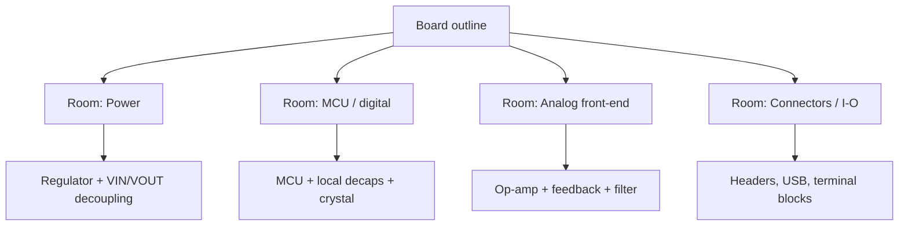
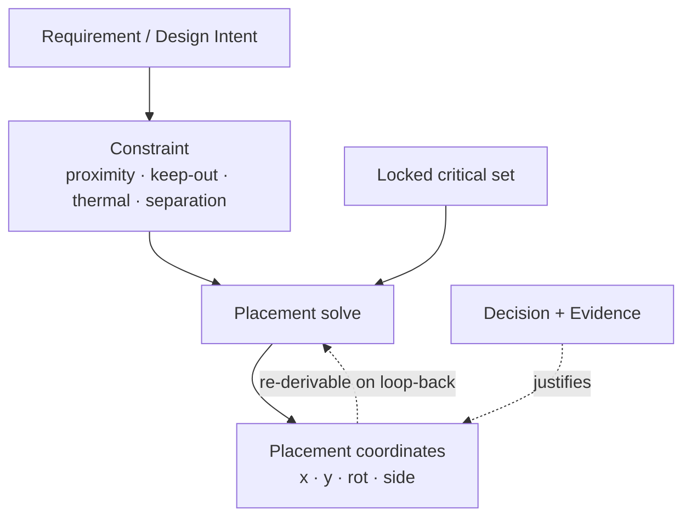

# Professional Placement Philosophy

**Summary.** This document distills the *reusable working method* that experienced PCB engineers and mature EDA tools use to place components — not the physics of why a good placement is good (that companion is [pcb/placement.md](../pcb/placement.md)), but the **process discipline** that reliably *reaches* a good placement: hierarchical *rooms and clusters*, *manual-critical-then-auto*, *lock-and-iterate*, and *design-intent capture*. It belongs in the Engineering Science Layer because the runtime's **Phase 9 [Component Placement](../../docs/state-machines/component-placement.md)** and **Phase 8 [PCB Floor Planning](../../docs/state-machines/pcb-floor-planning.md)** state machines, the [Placement Agent](../../docs/agents/placement-agent.md), the `locked` flag on a [Placement](../../docs/foundation/engineering-domain-model.md#placement), the [Autonomy Levels](../../docs/engineering/human-in-the-loop.md), and the [DFM](../../docs/state-machines/dfm-verification.md)→Placement loop-back all silently presuppose this method. The runtime encodes a *mechanism* (states, transitions, IR enrichment); this layer supplies the *methodology* the mechanism must obey so that an automated placement is indistinguishable in quality from an expert's, and — crucially — survives re-placement on a loop-back. It grounds the proposal/validation cycle of the placement machines and the propose/dispose seam of human-in-the-loop control. Vendor-neutral: the principles below are the common denominator behind Allegro *rooms*, Altium *rooms/rule scopes*, KiCad *groups*, and every senior engineer's habit of "place the connectors and the regulator first."

## Core principles

Placement is not a single optimization; it is a **staged, intent-preserving search**. Four reusable principles structure the staging. They are method, not physics — the underlying laws (wirelength, Rent's rule, loop inductance, thermal spreading) live in [pcb/placement.md](../pcb/placement.md) and [optimization theory](../mathematics/optimization-theory.md); here we govern *the order and granularity in which those laws are applied*.

### 1. Hierarchy first — rooms and clusters (divide and conquer)

A flat board of `N` components has a placement search space that grows combinatorially; an expert never searches it flatly. Instead they impose a **hierarchy**: the netlist is partitioned into [Functional Blocks](../../docs/foundation/engineering-domain-model.md#functional-block), each block is assigned a *room* — a bounded board region — and placement recurses *inside* each room.

```text
place(board)  =  place_rooms(blocks)  then  ⋃_room  place_within(room)
```

A *room* (a.k.a. cluster, region, group) is a named area to which a set of components is bound; components inside it are placed relative to the room, and the room is placed relative to the board. This is the classical min-cut decomposition (Kernighan–Lin / Fiduccia–Mattheyses; see [graph theory](../mathematics/graph-theory.md)): choose the partition that minimizes the weighted connections *crossing* room boundaries, so that most nets stay local and only genuinely inter-block nets traverse the board.


*Figure: hierarchical placement — the board is decomposed into rooms by functional block; detailed placement recurses inside each room.*

Why hierarchy is non-negotiable: it (a) makes the search tractable by divide-and-conquer, (b) gives every net a *locality* so wirelength is reducible, and (c) makes intent legible — a reviewer reasons about "the analog room" rather than 400 loose parts. The runtime performs the *room allocation* one phase early, in [PCB Floor Planning](../../docs/state-machines/pcb-floor-planning.md); [Component Placement](../../docs/state-machines/component-placement.md) then places parts strictly *within* their block's region — the constraint "placement stays inside its region" is the runtime's enforcement of this principle.

### 2. Manual-critical-then-auto (the Pareto seam)

Not all components carry equal consequence. A small minority — connectors and mounting holes (fixed by the enclosure), the crystal/oscillator, high-speed and differential nets, the power regulator and its switching loop, high-dissipation parts — determine the **majority of the electrical, thermal, and mechanical risk**. The professional rule is a Pareto split:

```text
Components  =  Critical (≈ 5–20 %, expert-placed with intent)
            ∪  Bulk     (≈ 80–95 %, auto-placed under the critical set's constraints)
```

The critical set is placed **first and deliberately** — by a human, or by reasoning that encodes human intent — and then *frozen* as boundary conditions. The bulk (decoupling beyond the first cap, pull-ups, series resistors, indicator LEDs) is auto-placed to minimize wirelength *subject to* the frozen critical geometry. This ordering is not stylistic: an analytic placer solves a convex spring system (see [pcb/placement.md §3](../pcb/placement.md) and [linear algebra](../mathematics/linear-algebra.md)) whose *boundary conditions are the fixed parts*. If the critical parts are not fixed first, the interior of the solve collapses onto whatever happens to be anchored, and the result must be torn up. Place the determinants of risk first; let the fill yield to them, never the reverse.


*Figure: the manual-critical-then-auto seam — expert intent on the few, automation on the many.*

This is exactly the propose/dispose discipline of [Human-in-the-Loop](../../docs/engineering/human-in-the-loop.md): at **supervised** autonomy the engineer disposes the critical placement at the `AwaitingApproval` gate; at **autonomous** autonomy the [Placement Agent](../../docs/agents/placement-agent.md) must *reproduce* the same critical-first ordering from recorded intent, within declared bounds.

### 3. Lock-and-iterate (monotone refinement toward a fixed point)

Placement converges by **incremental refinement under a growing frozen set**, never by re-solving the whole board each time. Let `F` be the set of *locked* components. Each iteration perturbs only `Components \ F`; whenever a sub-region is judged good it is added to `F`:

```text
F₀ = ∅
repeat:
    propose placement P_k    s.t.  P_k restricted to F  ≡  P_{k-1} restricted to F   (locked parts immovable)
    validate(P_k)            (courtyards, regions, keep-out, thermal)
    F ← F ∪ { newly-stable components }
until  validate(P_k) holds  and  F covers the critical set
```

Two properties make this work. **Monotonicity:** because the locked set only grows and locked parts never move, each iteration cannot regress an already-good sub-region — the search is a *contraction* toward a fixed point, which is what guarantees termination instead of oscillation. **Boundary stability:** locked parts act as Dirichlet boundary conditions for the analytic solve of the remainder, so the bulk re-flows *around* settled critical geometry rather than dragging it.

The runtime models this directly: a [Placement](../../docs/foundation/engineering-domain-model.md#placement) carries a **`locked` flag** in the [PCB IR](../../docs/compiler/ir/pcb-ir.md), and the [Component Placement](../../docs/state-machines/component-placement.md) machine's recoverable transition `ValidatingPlacement → ProposingPlacement` "re-proposes *offenders*" — it perturbs the violating subset, not the board. The most important application is the **[DFM](../../docs/state-machines/dfm-verification.md) loop-back**: when manufacturability fails, the orchestrator returns to *this* phase and the machine "*edits* existing placement (locked components stay fixed)" — lock-and-iterate is the contract that makes the loop-back converge instead of thrashing the whole layout.

### 4. Design-intent capture (declarative constraints, not coordinates)

The deepest professional principle: **capture *why* a part is where it is, not merely *where* it is.** "U3 is at (42.0, 18.5)" is a brittle fact; "U3's input decoupling cap sits within 2 mm of the VIN pin because loop inductance must stay low" is durable intent. Intent is stored as a [Constraint](../../docs/foundation/engineering-domain-model.md#constraint) (the *enforceable projection* of a [Requirement](../../docs/foundation/engineering-domain-model.md)) plus a [Decision](../../docs/foundation/engineering-domain-model.md#decision) that justifies it — never as a frozen coordinate alone.

```text
INTENT  (declarative, invariant)        →  "decap within 2 mm of VIN; analog kept 5 mm from switcher"
COORDINATE (imperative, derived)        →  (x, y, rotation, side)
                       coordinate = solve(INTENT, board, locked-set)
```

Coordinates are *derived* from intent; intent is the source of truth. This inversion is what lets placement survive change: when a loop-back, a re-region, or an engineer edit forces re-placement, the **intent is invariant** and the coordinates are re-solved to honor it. Storing coordinates as the source of truth (the amateur failure) means every re-placement silently discards the reasoning, and a critical-proximity or separation requirement is lost the moment a part is nudged. This is principle 3 — *Intent is first-class* — of the [Engineering Domain Model](../../docs/foundation/engineering-domain-model.md), made operational for placement, and it is why references are by stable [Entity ID](../../docs/foundation/engineering-domain-model.md), not by position.


*Figure: intent is the invariant source; coordinates are derived and re-derivable, so re-placement preserves the engineer's reasoning.*

### 5. The canonical order of operations

The four principles compose into one repeatable sequence, the spine of every professional placement flow:

```text
1. Partition into rooms        (hierarchy)            → Floor Planning, Phase 8
2. Anchor mechanically-fixed   (boundary conditions)  → connectors, mounting holes
3. Place the critical few      (manual / intent)      → regulator, crystal, hi-speed, hot parts
4. Lock the critical set       (freeze F)             → set `locked`
5. Auto-place the bulk         (optimize remainder)   → minimize Σ w·HPWL under F
6. Validate; iterate offenders (lock-and-iterate)     → re-propose only violators
7. Re-derive on loop-back      (intent-preserving)    → DFM/EMC return, keep F, re-solve
```

Violating the *order* — filling passives before anchoring, or auto-placing before the critical set is locked — is the single most common cause of non-convergence, because the cheap bulk consumes the space the expensive critical nets needed.

### 6. Worked illustration — a regulated MCU board

The method on a minimal but representative board (buck/LDO regulator + MCU + analog sensor + USB), applying the canonical order:

```text
Rooms (1):   Power | Digital | Analog | I-O                       ← Floor Planning partitions by block
Anchor (2):  USB receptacle, mounting holes → board edge          ← enclosure fixes them; edge keep-out honored
Critical (3): regulator + its VIN cap + VOUT cap (compact loop);  ← the few that set PI/EMI/thermal risk
              crystal hugging the MCU; sensor amp by its filter
Lock (4):    set `locked` on the above                            ← freeze the boundary conditions
Auto (5):    pull-ups, series Rs, bulk decaps, LEDs               ← minimize Σ w·HPWL inside each room, around F
Iterate (6): if a passive lands in the edge keep-out, move only   ← re-propose offenders, locked set untouched
              that passive
```

Every later edit — a [DFM](../../docs/state-machines/dfm-verification.md) loop-back widening a clearance, a re-region — re-runs steps 5–6 only, with the locked regulator loop and the captured proximity intent (decap ≤ 2 mm from `VIN`/`VOUT`) intact. The board converges instead of being redrawn. This is the reusable shape of every professional placement, scaled from four parts to four thousand.

## How mature EDA encodes these principles

The four principles are not EAK inventions; they are the convergent design of every professional toolchain. Stating the correspondence vendor-neutrally shows the method is industry consensus, and names the *reusable concept* each tool exposes (never a proprietary mechanism):

| Principle | Reusable concept every mature EDA exposes | Common names in the field |
|---|---|---|
| 1 — Hierarchy / rooms | A named, bounded region binding a component set, placed as a unit | *rooms*, *clusters*, *groups*, *regions*, *blocks* |
| 2 — Critical-then-auto | A two-track flow: interactive placement for the few, batch/auto-placement for the many | *manual place* + *autoplace*, *cluster placement*, *interactive then push* |
| 3 — Lock-and-iterate | A per-object *lock*/*fix* attribute that excludes a part from re-solve | *lock*, *fix*, *protect*, *freeze* |
| 4 — Intent capture | Scoped *rules*/*constraints* attached to objects, independent of coordinates | *rule scopes*, *constraint sets*, *design rules*, *net classes* |

The lesson is that intent and lock are first-class *object attributes* in every credible tool, exactly because coordinates alone are insufficient. EAK's [PCB IR](../../docs/compiler/ir/pcb-ir.md) `locked` flag and its [Constraint](../../docs/foundation/engineering-domain-model.md#constraint)/[Decision](../../docs/foundation/engineering-domain-model.md#decision) entities are the same idea expressed as typed, event-sourced state — the reusable principle made deterministic and replayable rather than buried in a binary project file. Where mature EDA relies on the *engineer* to apply the method, the runtime must apply it programmatically; that is what the [Placement Agent](../../docs/agents/placement-agent.md) and the placement state machines exist to guarantee.

## Why it matters for electronics & PCB design

- **Routability is decided here.** Routing only *realizes* the connectivity placement made possible. A flat, intent-free placement produces congestion that no router can solve; the rooms-and-clusters method is what keeps inter-block crossings — and therefore congestion — bounded ([routing](../pcb/routing.md), [pcb/placement.md](../pcb/placement.md)).
- **Power and signal integrity are proximity problems.** Decoupling effectiveness is a loop-inductance law (`L_loop ∝ loop area`); the critical-first method exists so the decap is placed against its pin *before* the bulk can crowd it out ([power-distribution](../pcb/power-distribution.md), [power integrity](../electrical/power-integrity.md), [return path](../pcb/return-path.md)).
- **Thermal and mechanical limits are non-negotiable boundary conditions.** Connectors must meet the enclosure; hot parts must spread. Anchoring these first (principle 5, step 2) prevents a late, expensive rip-up when an interior solve fights a fixed reality ([thermal physics](../physics/thermal-physics.md)).
- **Change is constant.** Designs loop back (DFM, EMC) and requirements shift. Only intent-capture (principle 4) makes a placement *editable* without losing why it was good — the difference between a maintainable board and a fragile one.

## Mapping to the runtime

This is the point of the document: each principle is a contract some runtime artifact must honor, and violating it is an engineering bug, not a style lapse.

| Principle | Runtime artifact that embodies it | Why a violation is a runtime bug |
|---|---|---|
| 1 — Hierarchy / rooms | [PCB Floor Planning](../../docs/state-machines/pcb-floor-planning.md) allocates board *regions* to [Functional Blocks](../../docs/foundation/engineering-domain-model.md#functional-block); [Component Placement](../../docs/state-machines/component-placement.md) enforces "placement stays inside its region" in `ValidatingPlacement` | A part placed outside its room breaks locality; the [Constraint Engine](../../docs/engineering/constraint-engine.md) region check must reject it or routing inherits unbounded crossings |
| 2 — Critical-then-auto | [Placement Agent](../../docs/agents/placement-agent.md) reasoning half + the `AwaitingApproval` gate under [Autonomy Levels](../../docs/engineering/human-in-the-loop.md); [per-net-class trace widths](../../docs/compiler/ir/pcb-ir.md) and net criticality weight the order | If the agent fills bulk before fixing the critical set, it emits a `PCBIREnriched` IR that is geometrically valid yet electrically compromised — a silent defect |
| 3 — Lock-and-iterate | The `locked` flag on a [Placement](../../docs/foundation/engineering-domain-model.md#placement) in the [PCB IR](../../docs/compiler/ir/pcb-ir.md); `ValidatingPlacement → ProposingPlacement` re-proposes *offenders only*; the [DFM](../../docs/state-machines/dfm-verification.md)→Placement loop-back "edits existing placement, locked stays fixed" | If a loop-back re-solved the whole board, it would discard converged work and risk oscillation — the determinism/replay guarantee ([ADR-0009](../../docs/compiler/ir/pcb-ir.md)) depends on perturbing only the unfrozen set |
| 4 — Intent capture | [Constraint](../../docs/foundation/engineering-domain-model.md#constraint) + [Decision](../../docs/foundation/engineering-domain-model.md#decision) entities; constraints minted by [Constraint Extraction](../../docs/state-machines/constraint-extraction.md); references by [Entity ID](../../docs/foundation/engineering-domain-model.md) | Storing coordinates without the justifying constraint means a re-placement loses proximity/keep-out intent — a traceability ([P4](../../docs/foundation/principles.md)) and correctness violation |
| 5 — Operation order | The phase ordering Floor Planning (8) → Placement (9) → Routing (10) in [workflow orchestration](../../docs/core/workflow-orchestration.md); `ProposingPlacement → Failed` when the leftover space cannot fit the chain | Wrong order makes the critical chain infeasible *within regions*; the machine's `Failed` is the runtime detecting a violated method |

Two concrete, implemented artifacts make the mapping vivid:

- **The board-edge keep-out (Phase 3 increment 9)** is principle 5's "anchor mechanical reality first" expressed as a [DFM](../../docs/state-machines/dfm-verification.md) edge-clearance constraint sourced from the fabrication process. Placement must treat the edge keep-out as a hard boundary condition *before* it places fill; if the bulk is placed first and a part lands in the keep-out, the loop-back to Placement (principle 3) must move it without disturbing the locked critical set.
- **The regulator VIN/VOUT rail split (Phase 3 increment 11)** is a critical-set member par excellence (principle 2). The split into distinct `VIN`/`VOUT` nets is only electrically meaningful if the regulator and its input/output decoupling are placed *together and early*, with the switching loop compact — exactly the part of the design an expert places by hand and locks first. The placement method is what turns a net-level split into a low-noise physical reality.

A placement that passes the [Constraint Engine](../../docs/engineering/constraint-engine.md)'s deterministic geometric checks (no courtyard overlap, in-region, edge clearance honored) can still violate principles 2 and 4 and be a *bad* board. That gap — geometrically valid but methodologically wrong — is precisely why this methodology lives in the Engineering Science Layer and bounds what the [Placement Agent](../../docs/agents/placement-agent.md) is allowed to call "done."

## Failure modes if violated

| Principle violated | Symptom on the bench | Runtime manifestation |
|---|---|---|
| 1 — Flat, no rooms | Congestion, unroutable inter-block nets | [Routing Planning](../../docs/state-machines/routing-planning.md) `Failed` → loop-back to Placement/Floor Planning; recurring `ValidationFailed` |
| 2 — Bulk before critical | Decap crowded off its pin; hi-speed net snaked long | IR passes geometric DRC but fails SI/PI intent — invisible unless [EMC Analysis](../../docs/state-machines/emc-analysis.md) models it |
| 3 — Re-solve instead of lock-and-iterate | Each fix regresses a previously-good region; never settles | Non-convergent loop-back; broken determinism/replay; thrash between `Validating` and `Proposing` |
| 4 — Coordinates as source of truth | A nudge silently drops a proximity/keep-out requirement | [Decision](../../docs/foundation/engineering-domain-model.md#decision)/[Constraint](../../docs/foundation/engineering-domain-model.md#constraint) link missing → [traceability](../../docs/foundation/principles.md) gap; re-placement loses intent |
| 5 — Wrong operation order | Critical chain has no room left; late rip-up | `ProposingPlacement → Failed` (infeasible within regions); cascading re-proposals |
| 2 + 4 together | Autonomous run produces a "valid" but expert-unacceptable board | Engineer rejects at `AwaitingApproval`; trust in [autonomous autonomy](../../docs/engineering/human-in-the-loop.md) erodes |

The unifying lesson: several of these failures **pass every deterministic check the runtime can run** and still yield a board that does not work or cannot be maintained. The methodology is the necessary complement to the checkable constraints — it defines the *objective and the ordering* a passing placement must also satisfy.

## Related documents

- Engineering Science companion — [pcb/placement.md](../pcb/placement.md) (the laws behind this method) · [routing](../pcb/routing.md) · [power-distribution](../pcb/power-distribution.md) · [return-path](../pcb/return-path.md) · [ground-plane](../pcb/ground-plane.md) · [high-speed-design](../pcb/high-speed-design.md) · [analog-layout](../pcb/analog-layout.md)
- Engineering Science siblings — [optimization theory](../mathematics/optimization-theory.md) · [graph theory](../mathematics/graph-theory.md) · [constraint satisfaction](../mathematics/constraint-satisfaction.md) · [linear algebra](../mathematics/linear-algebra.md) · [decision theory](../mathematics/decision-theory.md) · [thermal physics](../physics/thermal-physics.md) · [power integrity](../electrical/power-integrity.md)
- Runtime — [Component Placement](../../docs/state-machines/component-placement.md) · [PCB Floor Planning](../../docs/state-machines/pcb-floor-planning.md) · [Routing Planning](../../docs/state-machines/routing-planning.md) · [DFM Verification](../../docs/state-machines/dfm-verification.md) · [EMC Analysis](../../docs/state-machines/emc-analysis.md) · [Constraint Extraction](../../docs/state-machines/constraint-extraction.md)
- Runtime artifacts — [PCB IR](../../docs/compiler/ir/pcb-ir.md) · [Constraint Engine](../../docs/engineering/constraint-engine.md) · [Planning Engine](../../docs/engineering/planning-engine.md) · [Verification Engine](../../docs/engineering/verification-engine.md) · [Human-in-the-Loop](../../docs/engineering/human-in-the-loop.md) · [Workflow Orchestration](../../docs/core/workflow-orchestration.md) · [Placement Agent](../../docs/agents/placement-agent.md) · [Engineering Domain Model](../../docs/foundation/engineering-domain-model.md) · [Principles](../../docs/foundation/principles.md) · [GLOSSARY](../../docs/GLOSSARY.md)
