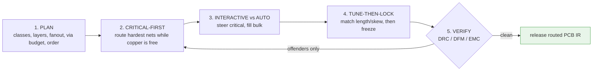
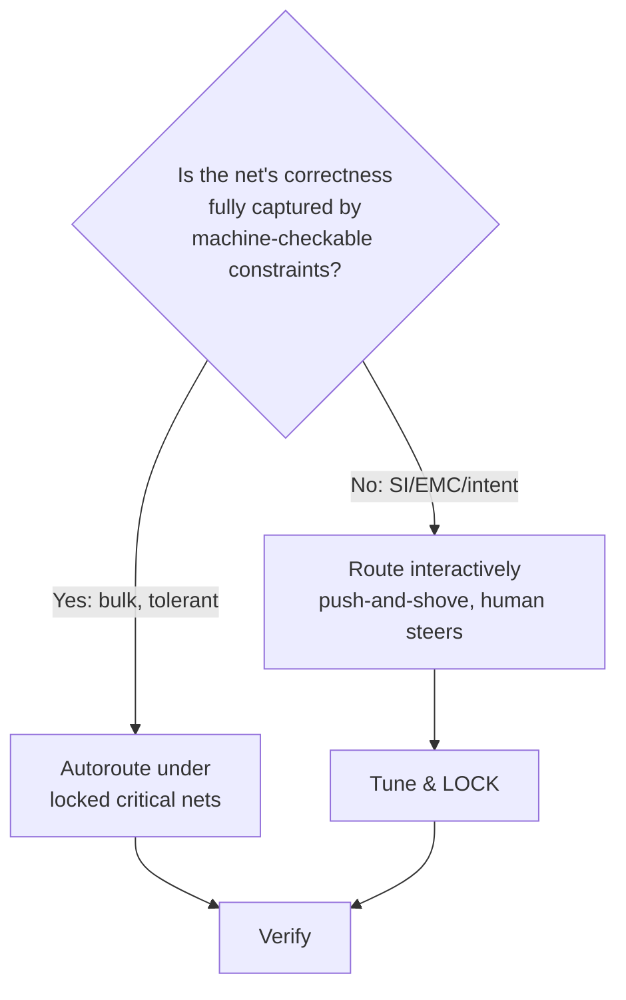
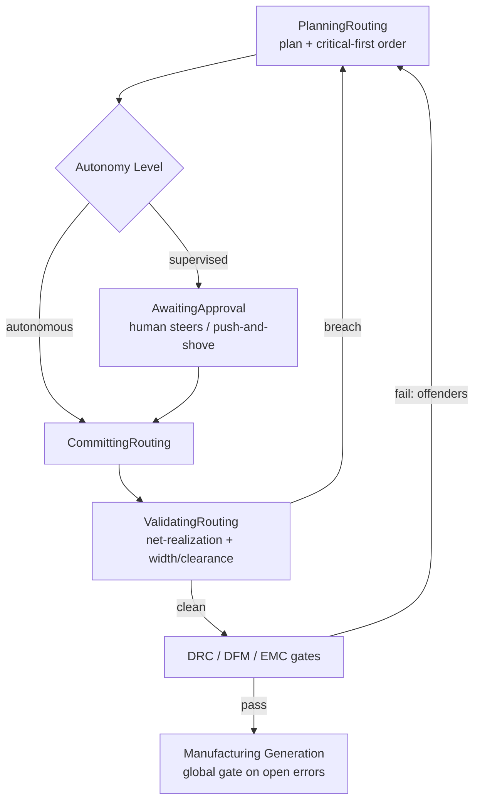

# Professional Routing Philosophy

**Summary.** This document distills the *methodology* a working PCB engineer follows when turning a placed board into finished copper — the **routing loop**: plan before drawing, route the most-constrained nets first, route critical nets interactively while letting automation fill the bulk, then tune timing and *lock* what is correct before touching anything else. It is vendor-neutral: it describes the discipline, not any one CAD tool. It belongs in the Engineering Science Layer because the runtime's [Routing Planning](../../docs/state-machines/routing-planning.md) phase encodes this loop as a state machine — `PlanningRouting → CommittingRouting → ValidatingRouting`, with loop-backs from [DRC](../../docs/state-machines/drc-verification.md) and [EMC](../../docs/state-machines/emc-analysis.md) — but the *why* behind the ordering, the autoroute-versus-interactive boundary, and the lock semantics is engineering judgement that the kernel silently assumes. Where the sibling [pcb/routing.md](../pcb/routing.md) grounds the *physics and algorithms* of a single route, this document grounds the *process discipline* that sequences thousands of routes into a board that ships. It is the engineering rationale beneath the runtime's net ordering, its [Autonomy Level](../../docs/engineering/human-in-the-loop.md) gate, and the [Checkpoint](../../docs/GLOSSARY.md#checkpoint)/lock behaviour that protects a tuned net from later edits.

---

## Core principles

The professional routing loop is five disciplined stages. Each is a *law of sequence*: doing them out of order does not merely cost time — it can make a correct board unreachable from the current placement.


*Figure: the routing loop — plan once, route by priority, tune and lock, verify, and re-enter only on the offending nets.*

### 1. Plan-then-route — decide topology strategy before committing copper

No copper is drawn until a *routing plan* exists. The plan is cheap to change; copper is expensive to change, because every committed track removes routing freedom from its neighbours. The plan fixes, before the first track:

- **Net classification.** Every [Net](../../docs/foundation/engineering-domain-model.md#net) is assigned to a *net class* — power, high-speed differential, clock, sensitive analog, bulk digital — and each class carries its own width, clearance, impedance target and via rules as [Constraints](../../docs/foundation/engineering-domain-model.md#constraint). A net's class is *what it needs*, decided once and enforced everywhere.
- **Layer roles in the stack-up.** Which copper layers carry signals, which are solid reference planes, and which signal layer pairs with which plane to give every fast net an adjacent, unbroken return path (the physics is in [return-path.md](../pcb/return-path.md) and [maxwell-equations.md](../physics/maxwell-equations.md)). Routing direction conventions (e.g. orthogonal H/V on adjacent signal layers) are set here so detailed routing does not fight itself.
- **Escape / fanout.** For fine-pitch parts (BGAs, fine-pitch QFNs), the *escape pattern* — how each pin reaches a routable channel, and on which layer — is planned before any inter-part routing, because escape consumes via and channel resources that the rest of the board must work around.
- **Via budget and order.** A via is a *cost*, not a free convenience (drill reliability, return-path discontinuity, area). The plan budgets vias per class and sets the **routing order** (stage 2).

The plan is a [Reasoning plan](../../docs/GLOSSARY.md#the-word-planning-disambiguation) in the precise runtime sense: a deliberate, recorded sequence produced before mutation, not an emergent by-product of drawing.

### 2. Critical-nets-first — route the most-constrained nets while freedom is maximal

Routing order is not cosmetic; it is the dominant lever on whether a board routes at all. The governing principle is the **degrees-of-freedom argument**: a board starts with maximum free copper, and *every* committed track monotonically reduces the corridors, layers and via sites available to later nets. Therefore route the nets that can tolerate the *fewest* alternatives **first**, while alternatives still exist.

This is exactly the **most-constrained-variable-first** heuristic from constraint satisfaction (see [constraint-satisfaction.md](../mathematics/constraint-satisfaction.md)): assign the variable with the smallest remaining domain first, because deferring it risks a dead end. The professional priority order:

```text
priority(net) ≈  power & high-current rails        # width, IR-drop, copper area — least flexible geometry
              ≻  sensitive analog & references      # return path, guarding, keep-away from aggressors
              ≻  high-speed diff pairs & clocks      # impedance, intra/inter-pair skew, length match
              ≻  bulk general-purpose digital        # most tolerant — routed last, around the above
```
*Listing: route classes in decreasing order of geometric/electrical inflexibility; "≻" means "routed before".*

The rationale per tier is physical, not stylistic. Power and high-current rails have the *least* geometric freedom: width is set by ampacity and IR-drop ([ohms-law.md](../electrical/ohms-law.md)), so they need wide, short, low-via paths that must be claimed before thin signals fill the channels. Controlled-impedance and length-matched nets need *room to tune* (stage 4); routing them late, into leftover space, forecloses the serpentine area they require. Bulk digital is the most tolerant and is routed last, *around* the committed critical nets.

| Tier | Net class | Dominant constraint | Why it routes first |
|---|---|---|---|
| 1 | Power / high-current rail | ampacity, IR-drop, copper area | width and short path are fixed by current; the geometry is the least negotiable, so claim it while channels are empty |
| 2 | Sensitive analog & reference | return path, guarding, aggressor keep-away | needs quiet neighbourhoods that later aggressors would destroy if routed first |
| 3 | High-speed diff pair / clock | impedance window, intra/inter-pair skew, length match | needs reserved area to *tune*; leftover space cannot host serpentine |
| 4 | Bulk general-purpose digital | connectivity only | tolerant of detours and vias; absorbs whatever space remains |
*Table: each tier is ordered by how little freedom its dominant constraint leaves — least-flexible first.*

The ordering rests on a **monotonicity claim**: let `F(n)` be the set of feasible routes available to net `n` given the copper already committed. Committing any track can only shrink, never grow, the feasible sets of the remaining nets — `F` is monotonically non-increasing in committed copper. A net with a small `F` is therefore safest assigned while the most copper is still free; deferring it is the choice most likely to find `F = ∅` (a dead end). Critical-first is the order that maximizes the probability every net retains a non-empty feasible set.

### 3. Interactive push-and-shove vs. autoroute — steer intent, automate tedium

The defining professional judgement is **what to route by hand (interactively) and what to delegate to an autorouter**, and the boundary follows a single rule: *automate where the objective is fully captured by machine-checkable constraints; steer by hand where intent exceeds what the rules encode.*

- **Interactive push-and-shove (shove routing).** The engineer draws a track and the tool treats existing copper as *movable* obstacles — shoving neighbours aside while continuously maintaining clearance. The human owns *topology and intent* (which side of an obstacle, where the return path lives, how a diff pair breaks out); the tool owns *continuous design-rule maintenance*. This is the mode of choice for critical nets, because their correctness depends on judgement the constraint set only partially expresses (EMC return-path quality, crosstalk-aware spacing, field-driven aesthetics that proxy for manufacturability).
- **Autoroute.** An autorouter optimizes an explicit objective (connect all nets, minimize length/vias/congestion) over the encoded rules. It is excellent at the *bulk* — hundreds of tolerant digital nets — and useless at unstated intent: it will happily route a clock across a plane split if no rule forbids it. Industry practice is therefore **locked-critical, autoroute-the-rest**: hand-route and *lock* the critical nets (stage 4), then let automation fill the remainder inside that frozen frame, and treat its output as a *proposal to verify*, never as authority.

The asymmetry is fundamental: an autorouter can only honour constraints that were *written down*. Every piece of routing intent that lives only in the engineer's head is invisible to it. The professional response is not "never autoroute" but "autoroute only where the written constraints are the whole truth."


*Figure: the autoroute boundary — delegate only when the constraint set is the complete specification of correctness.*

### 4. Tune-then-lock — achieve the invariant, then freeze it

Once a critical net's topology is correct, two things happen in order: **tune**, then **lock**.

- **Tune.** Adjust geometry to meet the *quantitative* electrical targets the topology alone does not guarantee: match trace length within a timing-matched bus, equalize intra-pair skew on a differential pair, add serpentine to hit a length-match window, trim a stub. Tuning is the last mile of correctness — the net is already connected and DRC-clean; tuning makes it *meet timing/impedance*.
- **Lock.** Immediately mark the tuned net immutable so that subsequent routing — a neighbour's push-and-shove, an autoroute fill pass, a later edit — *cannot* disturb its hard-won geometry. A lock is a declaration: "this net has reached a verified invariant; protect it." Without locking, the very automation that fills the bulk (stage 3) can shove a tuned diff pair off its matched length, silently breaking a net that was already correct.

Tune-then-lock is what makes critical-first (stage 2) *durable*: routing the hard nets early is only valuable if their result is protected from the easy nets routed later. Lock is the mechanism that turns an achieved property into a maintained invariant.

A **lock is not a [Checkpoint](../../docs/GLOSSARY.md#checkpoint)**, and conflating them is a category error. A Checkpoint is a *restorable snapshot* — it lets you go *back* in time after a disturbance. A lock is a *forward* declaration of immutability — it forbids the disturbance from happening in the first place. The two compose: a lock asserts "do not edit this net," and a Checkpoint guarantees that if some path nonetheless mutates it, the prior, correct geometry is recoverable. The professional relies on the lock for *prevention* and the Checkpoint for *recovery*; a workflow that has only Checkpoints (no locks) will repeatedly break and restore tuned nets, and one that has only locks (no Checkpoints) cannot recover when a lock is deliberately lifted to re-tune.

### 5. Verify-and-reroute-offenders — close the loop incrementally

Routing completes against verification, not against "everything is connected." The board is checked by [DRC](../../docs/state-machines/drc-verification.md) (clearance, width, edge keep-out), [DFM](../../docs/state-machines/dfm-verification.md) (drillable, etchable, registerable) and [EMC](../../docs/state-machines/emc-analysis.md) (return-path integrity, coupling). On failure, the professional reroutes **only the offending nets**, never the whole board — locked, correct nets stay untouched. This incremental re-entry is why stages 2 and 4 matter: they create a stable, locked core that absorbs late changes without cascading rework.

The loop runs at **two granularities** that must not be confused. The *inner* loop is per-net: draw, tune, lock one critical net at a time. The *outer* loop is whole-board: route a tier, verify, reroute offenders, advance to the next tier. The professional **definition of done** is therefore not "all nets drawn" but the conjunction *every net realized (connectivity) ∧ every gate clean (DRC, DFM, EMC) ∧ every critical net tuned and locked*. Only when all three hold is the board releasable to manufacturing — and that conjunction, not bare connectivity, is what the runtime's `ValidatingRouting → Done` transition plus the downstream gates collectively enforce.

### Worked illustration — a buck regulator feeding an MCU and a DDR bus

The loop on a representative board makes the ordering concrete. **Plan:** classify nets — the regulator rails (power), the DDR data/strobe groups (high-speed, length-matched), the crystal (sensitive), and bulk MCU GPIO; assign a signal/plane/plane/signal stack so DDR and the rails sit adjacent to references. **Critical-first:** route tier 1 — the regulator's *input* rail (VIN, from the source) and its *output* rail (VOUT, to the load) as two distinct, separately width-sized nets, wide and short with stitched vias; then tier 2 — the crystal, guarded and kept away from switching copper; then tier 3 — the DDR pairs, broken out and given serpentine room. **Tune-then-lock:** match the DDR group lengths and intra-pair skew, then lock every tier-1, tier-2 and tier-3 net. **Fill:** autoroute the bulk GPIO inside that locked frame. **Verify:** DRC/DFM/EMC; a single clearance offender on one GPIO reroutes that one net — the locked rails and DDR are never touched. Had VIN/VOUT been one collapsed rail (the failure the [VIN/VOUT split](../../docs/state-machines/routing-planning.md) increment prevents), the two different currents would share one width and the rail would be mis-sized — a correctness bug no amount of later rerouting fixes.

---

## Why it matters for electronics & PCB design

Routing is where logical intent meets physical reality, and the loop exists because the failure modes are *path-dependent*: the order in which copper is committed determines which final states are reachable.

- **Routability is not monotone in effort.** A board can become unroutable not because any single net is impossible, but because tolerant nets were committed into corridors that a critical net later needed. Critical-first is the cheap insurance against painting yourself into a corner.
- **Connected ≠ correct.** A length-matched DDR bus can be 100% connected and DRC-clean yet fail timing because skew was never tuned; a clock can be connected yet radiate because its return path crosses a plane split. The loop's tune and verify stages exist precisely to separate *conducts* from *works* — the same distinction grounded electrically in [signal-integrity.md](../electrical/signal-integrity.md) and [power-integrity.md](../electrical/power-integrity.md).
- **Automation cannot supply missing intent.** An autorouter optimizing an under-specified objective produces a board that passes every written rule and still fails in the field. The interactive/auto boundary is the engineering admission that not all correctness is yet encoded — and the lock discipline is how human-verified correctness survives subsequent automation.
- **Late changes are inevitable.** Verification *will* find offenders; placement *will* be tweaked. A board built as a locked critical core plus a tolerant fill survives these shocks with localized rework, where a flat, unordered, unlocked route requires re-solving the whole board.
- **The cost of a defect grows downstream.** A routing fix caught in `ValidatingRouting` is free; the same defect caught at [DRC](../../docs/state-machines/drc-verification.md)/[EMC](../../docs/state-machines/emc-analysis.md) costs a loop-back; reaching fabrication costs a respin in money and weeks. The loop front-loads the hard, judgement-heavy work (planning, critical-first, tuning) precisely because catching a routing error early is orders of magnitude cheaper than catching it late — the same economics that justify the runtime's gate-before-manufacture architecture.
- **Manufacturing yield is decided at routing.** Acid traps, slivers, sub-minimum annular rings and edge encroachment are *routing* choices that a fabricator pays for in yield loss. Routing to [DFM](../../docs/state-machines/dfm-verification.md) rules from the plan forward — not as an afterthought — is what makes a board *cheap to build*, not merely buildable.

---

## Mapping to the runtime

This is the load-bearing section: the loop is not advisory prose, it is the contract the [Routing Planning](../../docs/state-machines/routing-planning.md) state machine and its neighbours are built to honour. Each principle maps to a concrete runtime artifact, and violating it would be an engineering bug.

| Principle (this doc) | Runtime artifact that embodies it | Why a violation is a bug |
|---|---|---|
| **Plan-then-route** | `LoadingPlacedBoard → PlanningRouting` in [Routing Planning](../../docs/state-machines/routing-planning.md): the agent "plans a routing strategy and proposes Tracks — layer assignment, widths, via usage" *before* `CommittingRouting`. The plan is a [Reasoning plan](../../docs/engineering/planning-engine.md). | Committing copper without a recorded plan makes the result non-reproducible and the net ordering arbitrary — it breaks the [determinism](../../docs/GLOSSARY.md#determinism) the runtime guarantees. |
| **Net classification & per-class rules** | The [Constraint Engine](../../docs/engineering/constraint-engine.md) holds per-net-class width/clearance/impedance bounds; **Phase-3 increment 10 (per-net-class trace widths)** makes width a function of class, resolved by the engine's most-specific-wins [precedence](../../docs/engineering/constraint-engine.md). | If width/clearance were board-global rather than per-class, a power rail and a bulk signal would share one rule — the engine would certify an under-width rail as compliant. |
| **Critical-nets-first ordering** | The agent's routing order inside `PlanningRouting`; the ordering rationale is the most-constrained-variable heuristic from [constraint-satisfaction.md](../mathematics/constraint-satisfaction.md), realized over the net set the [Constraint Engine](../../docs/engineering/constraint-engine.md) scopes. | Routing tolerant nets first can render a critical net unroutable, driving `PlanningRouting → Failed` (board unroutable) when a correct order would have succeeded — a sequencing bug, not a true infeasibility. |
| **Power rails as highest-priority, least-flexible geometry** | **Phase-3 increment 11 (regulator VIN/VOUT rail split)** splits the collapsed power rail so the regulator's input and output are *distinct* nets, each width-sized by its own current; routed in the top priority tier. | A collapsed VIN/VOUT net hides that two different currents share one node; sizing it once mis-applies ampacity ([ohms-law.md](../electrical/ohms-law.md)) and the rail overheats — a correctness bug the split exists to prevent. |
| **Interactive vs. autoroute boundary** | The [Autonomy Level](../../docs/engineering/human-in-the-loop.md) gate: `PlanningRouting → AwaitingApproval` (supervised, human steers — the push-and-shove analogue) vs. `PlanningRouting → CommittingRouting` (autonomous, automation proceeds). The split is the runtime's encoding of "automate where constraints are the whole truth." | Auto-committing a net whose correctness exceeds the encoded constraints (e.g. an EMC return-path nuance) ships a rule-clean but field-broken board; the [HITL](../../docs/engineering/human-in-the-loop.md) gate is the architectural guard against exactly this. |
| **Tune-then-lock** | `ValidatingRouting` checks net-realization and width/clearance; locks are protected across re-entry via the [Checkpoint](../../docs/GLOSSARY.md#checkpoint) system and recorded as [Decisions](../../docs/foundation/engineering-domain-model.md#decision) — on a loop-back the machine "*edits* the existing routing (often rerouting only offending nets)" rather than rebuilding. | If a loop-back re-planned *every* net, a tuned/locked diff pair would lose its matched length on an unrelated DRC fix — the runtime's "reroute offenders only" rule is the lock discipline made executable. |
| **Verify-and-reroute-offenders (closed loop)** | Routing Planning is the explicit **loop-back target for both [DRC](../../docs/state-machines/drc-verification.md) and [EMC](../../docs/state-machines/emc-analysis.md)**; `ValidatingRouting → PlanningRouting` on a recoverable breach re-plans offenders, enriching the [PCB IR](../../docs/compiler/ir/pcb-ir.md). The gates are specializations of the [Verification Engine](../../docs/engineering/verification-engine.md). | Treating `connected` as `done` and skipping the gates would let an open/short, an edge-clearance breach, or a discontinuous return path reach [Manufacturing Generation](../../docs/state-machines/manufacturing-generation.md) — the [global gate](../../docs/core/workflow-orchestration.md) on open errors exists to forbid this. |
| **Edge keep-out in the plan** | **Phase-3 increment 9 (fabrication-sourced DFM edge keep-out)**: the board-edge keep-out is a [Constraint](../../docs/engineering/constraint-engine.md) from the fab process, checked by [DRC](../../docs/state-machines/drc-verification.md)/[DFM](../../docs/state-machines/dfm-verification.md). The plan must respect it as a routing obstacle. | Routing into the edge keep-out yields a board the fabricator cannot etch/route to size — a DFM violation that blocks [Manufacturing Generation](../../docs/state-machines/manufacturing-generation.md). |

The net-realization invariant in `ValidatingRouting` — every Net's [Connections](../../docs/foundation/engineering-domain-model.md#connection) realized, "no more, no less" — is the runtime's encoding of *connected*. This document supplies the rest of *correct*: ordering, tuning, locking and the downstream gates. The architecture deliberately splits the two so that no single phase can mistake connectivity for correctness.


*Figure: the routing loop as runtime states — the HITL gate is the interactive/auto boundary; loop-backs re-enter at planning with locked nets preserved.*

---

## Failure modes if violated

- **Route-first, plan-never (skip stage 1).** Copper is committed with no net classes, layer roles or order. Power rails end up thin and via-laden, fast nets land on layers with no adjacent reference, and the board is "done" yet wrong. In the runtime this manifests as a [Constraint Engine](../../docs/engineering/constraint-engine.md) that has no per-class bound to check against, collapsing into one global rule that certifies under-width rails as compliant.
- **Tolerant-nets-first (invert stage 2).** Bulk digital claims the corridors a power rail or diff pair needed; the critical net becomes unroutable and `PlanningRouting → Failed` fires on a board that *was* routable. The bug is sequencing, not infeasibility — and it is invisible unless the ordering rationale is honoured.
- **Autoroute the critical nets (misplace the stage-3 boundary).** Automation optimizes an under-specified objective and routes a clock across a plane split, or a sensitive analog line beside an aggressor — every written rule passes, EMC fails in the field. The [Autonomy Level](../../docs/engineering/human-in-the-loop.md) gate exists to keep these nets human-steered; bypassing it ships latent failures.
- **Tune-but-never-lock (drop the lock in stage 4).** A matched bus is tuned, then a later autoroute fill or a neighbour's push-and-shove shoves it off length; the net regresses silently. Without locks, every late edit risks the [Checkpoint](../../docs/GLOSSARY.md#checkpoint)-protected invariant, and a loop-back that re-plans all nets (instead of offenders) guarantees the regression.
- **Connected = done (skip stage 5).** The net-realization invariant passes, the board is declared finished, and an open/short, edge-clearance breach, or discontinuous return path slips toward fabrication. The [Verification Engine](../../docs/engineering/verification-engine.md) gates and the [Manufacturing Generation](../../docs/state-machines/manufacturing-generation.md) global gate on open errors are the runtime's refusal to make this mistake.
- **Whole-board re-route on every failure (violate incrementality).** A single DRC fix re-plans the entire board, churning correct, locked nets and never converging. The runtime's "reroute offenders only" loop-back rule is the executable form of incremental closure.

---

## Related documents

**Engineering Science siblings.** [pcb/routing.md](../pcb/routing.md) (algorithms & physics of a single route — this document's companion) · [mathematics/constraint-satisfaction.md](../mathematics/constraint-satisfaction.md) (most-constrained-variable ordering) · [mathematics/search-algorithms.md](../mathematics/search-algorithms.md) (rip-up-and-retry, path search) · [mathematics/optimization-theory.md](../mathematics/optimization-theory.md) (the autorouter objective) · [pcb/return-path.md](../pcb/return-path.md) and [physics/maxwell-equations.md](../physics/maxwell-equations.md) (why critical nets need adjacent references) · [electrical/ohms-law.md](../electrical/ohms-law.md) (width-for-current on power rails) · [electrical/signal-integrity.md](../electrical/signal-integrity.md) and [electrical/power-integrity.md](../electrical/power-integrity.md) (what tuning protects) · [pcb/differential-pairs.md](../pcb/differential-pairs.md) (skew/length matching) · [pcb/stackup.md](../pcb/stackup.md) (layer roles set in planning).

**Runtime anchors.** [state-machines/routing-planning.md](../../docs/state-machines/routing-planning.md) · [engineering/constraint-engine.md](../../docs/engineering/constraint-engine.md) · [engineering/planning-engine.md](../../docs/engineering/planning-engine.md) · [engineering/verification-engine.md](../../docs/engineering/verification-engine.md) · [engineering/human-in-the-loop.md](../../docs/engineering/human-in-the-loop.md) · [state-machines/drc-verification.md](../../docs/state-machines/drc-verification.md) · [state-machines/dfm-verification.md](../../docs/state-machines/dfm-verification.md) · [state-machines/emc-analysis.md](../../docs/state-machines/emc-analysis.md) · [state-machines/manufacturing-generation.md](../../docs/state-machines/manufacturing-generation.md) · [compiler/ir/pcb-ir.md](../../docs/compiler/ir/pcb-ir.md) · [core/workflow-orchestration.md](../../docs/core/workflow-orchestration.md) · [GLOSSARY.md](../../docs/GLOSSARY.md).
