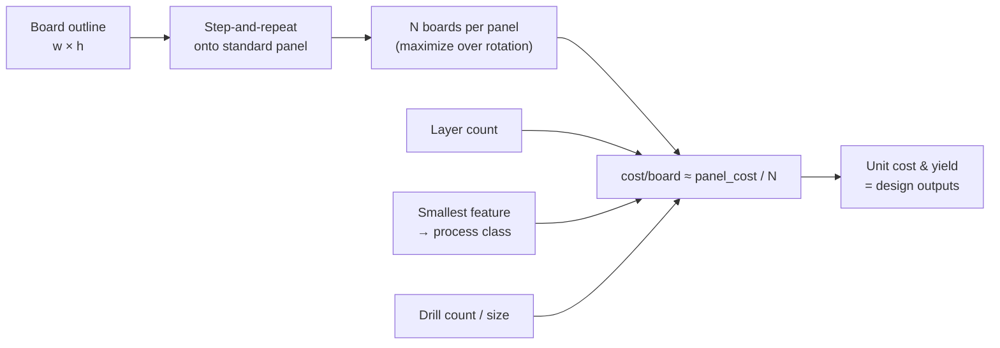
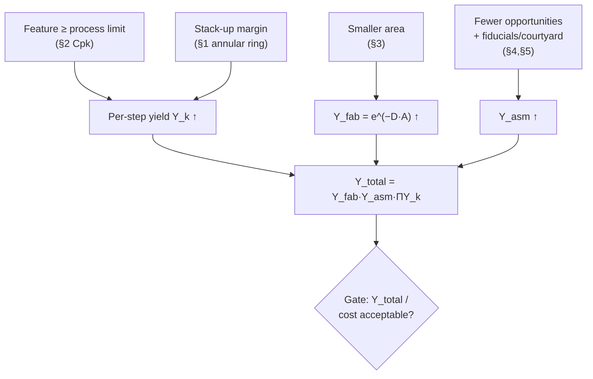

# DFM Principles

**Summary.** Design for Manufacturability (DFM) is the discipline of choosing geometry, materials, and topology so that a board can be **fabricated and assembled at high yield and low cost by a real, statistically-bounded process** — not by an idealized one. Its object of study is the gap between the *nominal* design the engineer draws and the *distribution* of physical outcomes a fab line and an assembly line actually produce: every etched trace, drilled hole, placed part, and reflowed joint lands somewhere inside a tolerance band, and yield is the fraction of those bands that all simultaneously fall inside spec. This document's central claim — and the reason DFM belongs in the Engineering Science Layer — is that **yield is a computable design output, not a post-hoc surprise**: given the process capability of each step and the design's feature sizes, area, and opportunity count, the probability that a board ships defect-free is a number you can predict and constrain *before* fabrication. The EAK runtime silently assumes this every time the [DFM Verification](../../docs/state-machines/dfm-verification.md) phase rejects a placement or track that sits inside the fabrication keep-out band, every time that [board-edge keep-out](../../docs/state-machines/dfm-verification.md) is sourced from a fabrication limit rather than guessed, and every time the [Manufacturing Generation](../../docs/state-machines/manufacturing-generation.md) gate refuses to release a design until every upstream verification phase is clear. (The wider claim this principle implies — rejecting *any* sub-capability feature and gating on a *computed* rolled yield — is specified but not yet implemented; the present DFM check is the edge keep-out, as detailed under *Mapping to the runtime* below.) DFM is the manufacturing-domain reading of the same rule/violation/waiver machinery that [DRC](../../docs/state-machines/drc-verification.md) applies to electrical correctness.

## Core principles

A vocabulary bridge first — every quantity below is a typed [Physical Quantity](../../docs/engineering/units-and-quantities.md), consistent with the [GLOSSARY](../../docs/GLOSSARY.md):

| Quantity | Symbol · unit | DFM meaning |
|----------|---------------|-------------|
| Tolerance | `t_i` · (length) | Half-width of a feature's allowed variation band |
| Stack-up result | `T_stack` · (length) | Accumulated tolerance of a dimension chain |
| Process mean / spread | `μ`, `σ` | Center and standard deviation of a process's output |
| Capability index | `Cp`, `Cpk` | How well a centered / off-center process fits its spec window |
| Specification limits | `LSL`, `USL` | Lower / upper bounds a feature must stay within |
| Defect density | `D` · defects/area | Random-defect rate of a fab process |
| First-pass yield | `Y` · (fraction) | Probability a board passes all steps defect-free |
| Defects per million | `DPMO` | Defect opportunities that fail, scaled to 10⁶ |
| Boards per panel | `N` · (count) | Usable boards stepped onto one fabrication panel |
| Panel utilization | `η` · (fraction) | Board copper area ÷ panel area |
| Annular ring | `AR` · (length) | Copper remaining around a drilled hole after registration error |
| Courtyard | — | Keep-out envelope around a component for placement + handling |

### 1. Tolerance stack-up — the design dimension is a distribution, not a value

No fabricated dimension equals its nominal value; it lands inside a band `nominal ± t`. When a *functional* dimension (an annular ring, a clearance, a courtyard gap) is the sum or difference of several toleranced features, the variations accumulate. Two models bound the result:

```
Worst-case (WC):   T_stack = Σ_i |∂f/∂x_i| · t_i          (linear chain: Σ t_i)
Statistical (RSS): T_rss   = sqrt( Σ_i (∂f/∂x_i · t_i)² )
```

Worst-case asks "what if every feature is simultaneously at its extreme?" — it is conservative and guarantees zero stack-up defects, but over-tightens individual tolerances (and so raises cost). Root-Sum-Square (RSS) treats the contributors as independent, centered, roughly-normal random variables, so their *combined* spread grows as the square root of the count, not linearly — valid only when those independence and centering assumptions hold. The worked case that matters most for PCBs is the **plated through-hole annular ring**:

```
AR = (pad_diameter − hole_diameter)/2 − registration_error
```

`pad_diameter`, `hole_diameter`, and the layer-to-layer `registration_error` each carry a fab tolerance. The design must guarantee `AR ≥ AR_min` (an IPC-class minimum: tangency for Class 1, a positive ring for Class 2/3) across the *whole* stack-up, not just at nominal. If the worst-case stack drives `AR` negative, the result is a **breakout** — the drill clips the pad — and an open or weak via. DFM either widens the pad, shrinks the drill, or demands tighter registration (a more expensive process). This is tolerance stack-up deciding a rule, quantitatively.

### 2. Process capability — a rule is the smallest feature a process holds at target yield

A fabrication step (etch, drill, plate, print, place, reflow) is a random process with mean `μ` and spread `σ`. Its *capability* against a spec window `[LSL, USL]` is:

```
Cp  = (USL − LSL) / (6σ)                         (potential, if perfectly centered)
Cpk = min(USL − μ, μ − LSL) / (3σ)               (actual, accounts for off-center μ)
```

`Cp` measures whether the spec window is *wide enough* for the spread; `Cpk` penalizes a mean that drifts toward one limit. For a normal process the escaping fraction past a limit `d` standard deviations away is `Φ(−d)`, so capability maps directly to yield:

```
defect_fraction ≈ Φ(−3·Cpk)   per one-sided limit
Cpk = 1.00  → ~1350 ppm/side    (3σ)
Cpk = 1.33  → ~32 ppm/side      (4σ, common PCB target)
Cpk = 1.67  → ~0.3 ppm/side     (5σ)
Cpk = 2.00  → ~3.4 DPMO         (6σ, with the conventional 1.5σ shift)
```

This is the engine behind every **manufacturing design rule**. A "6 mil minimum trace/space," a "0.2 mm minimum drill," a "4 mil solder-mask dam," a "minimum annular ring" — each is not a magic constant but *the smallest feature for which the responsible process keeps `Cpk` at the chosen yield target*. Asking a line for a feature below its rule does not "usually work"; it silently drops `Cpk` below 1 and converts a fraction of boards into scrap. DFM is therefore the act of keeping every feature on the safe side of a process-capability boundary — and the fab's design-rule sheet is that boundary, published.

### 3. Panel utilization and cost drivers — you pay for panels, not boards

Fabs price by the **panel** (a standard sheet, e.g. 18×24 in working area), not the board. A rectangular board of size `w × h` steps onto the panel in a grid; with edge rails of width `r` and inter-board gutter `g`:

```
N_x = ⌊ (W_panel − 2r + g) / (w + g) ⌋
N_y = ⌊ (H_panel − 2r + g) / (h + g) ⌋
N   = N_x · N_y          (try both orientations; keep the larger N)
η   = N · (w·h) / (W_panel · H_panel)
cost_per_board ≈ panel_cost / N
```

Because `cost_per_board ∝ 1/N`, **panel utilization is a first-order cost lever**: a board whose dimensions waste a column of the grid can cost dramatically more per unit than one a few millimetres smaller that fits an extra column. The other dominant cost drivers are step-functions, not smooth: **layer count** (each lamination pair adds cost), **board area** (more material and more defect opportunity), **smallest feature / tightest tolerance** (selects a more capable, pricier process class), **drill count and the smallest drill** (mechanical drilling is per-hit; laser microvias add process steps), **surface finish**, and **controlled impedance** (adds a test coupon and tighter stack-up control). DFM treats these as the cost gradient the design optimizer is implicitly walking.


*Figure: board geometry and feature choices flow deterministically into per-board cost and yield — both are outputs of the design, computable before fabrication.*

### 4. Design-for-test and fiducials — observability and a coordinate frame

A board that cannot be *tested* economically is not manufacturable at volume. **Design for Test (DFT)** reserves access — bed-of-nails In-Circuit Test pads (with a minimum test-pad diameter and probe-to-probe pitch the test fixture can land), or boundary-scan chains — so the line can measure each net. The figure of merit is **test coverage**: the fraction of nets (and of solder joints) a test can actually observe; uncovered nets are latent escapes. DFT is the manufacturing analogue of observability: a defect you cannot see, you ship.

**Fiducials** solve a different problem: the assembly machine needs a *coordinate frame*. Optical fiducials are bare-copper targets in the mask that the pick-and-place vision system locates to compute the transform from design coordinates to the real, slightly-rotated, slightly-scaled board on the conveyor:

```
[x_machine]   = [s·cosθ  −s·sinθ] [x_design] + [t_x]
[y_machine]     [s·sinθ   s·cosθ] [y_design]   [t_y]
```

At least **three non-collinear global fiducials** are needed to solve for translation `(t_x, t_y)`, rotation `θ`, and scale `s`; two collinear points cannot pin rotation, and one cannot pin anything. **Local fiducials** beside fine-pitch parts (BGA/QFN) correct residual local distortion so the nozzle lands the part on its pads. Omitting fiducials, or making them collinear, forces the machine to place by panel registration alone — and registration error is exactly the term that ruins fine-pitch placement.

### 5. Assembly constraints — courtyard and thermal relief

**Courtyard.** Each footprint carries a keep-out envelope larger than its copper: the component body plus placement tolerance plus nozzle/handling clearance. Two courtyards may not overlap, or the placement machine risks collision and the parts risk bridging. Formally a courtyard is the Minkowski sum of the body outline with the placement-error disk; the no-overlap rule is the assembly version of a DRC clearance. The same logic produces the **component-to-board-edge keep-out**: parts within the depaneling/router/conveyor-rail zone get sheared or stressed, so a minimum body-to-edge distance is mandatory — and it must be **sourced from the fabrication/depanel process**, not invented.

**Thermal relief.** A pad tied to a large copper plane wicks reflow heat into that plane like a heatsink, starving the joint and causing cold solder or **tombstoning** (one end of a chip reflows before the other and the part stands up). The fix is a *thermal-relief spoke pattern* — the pad connects to the plane through a few narrow necks rather than solid copper, trading a little electrical/thermal resistance for solderability. The design choice is explicit: power/ground pads that must carry current get more or wider spokes; signal pads on planes get standard relief. Get it wrong and the joint is unreliable even though the netlist is perfect.

### 6. Yield as a design output — the thesis

Combine the above and yield stops being luck. For random fabrication defects of density `D` over board area `A`, the Poisson model gives:

```
Y_fab = e^(−D·A)
```

— larger boards and higher defect densities lower yield *exponentially*. For assembly, with `O` defect opportunities (joints, placements) each at rate `DPMO`:

```
Y_asm = (1 − DPMO/10⁶)^O ≈ e^(−O·DPMO/10⁶)
```

The board's **rolled first-pass yield** is the product across all independent steps:

```
Y_total = Y_fab · Y_asm · Π_k Y_k
```

Every DFM rule in §1–§5 raises one factor in this product: keeping features above process-capability limits raises each `Y_k`; shrinking area raises `Y_fab`; cutting opportunity count and easing fine-pitch placement raises `Y_asm`. So **yield (and its dual, scrap/rework cost) is a deterministic function of design geometry** — exactly the property that lets a runtime *treat manufacturability as a verifiable gate* instead of a hope. A design that violates a DFM rule has a computably-lower `Y_total`; that is why the violation is an error, not a style note.


*Figure: each DFM rule raises one factor of the rolled yield; the runtime gate is a predicate on the product.*

## Why it matters for electronics & PCB design

A schematic can be electrically perfect and still be unbuildable, or buildable only at ruinous scrap rates. The same copper artwork that satisfies [ohms-law](../electrical/ohms-law.md) for current capacity and [signal-integrity](../electrical/signal-integrity.md) for impedance must *also* survive etch, drill, registration, solder-mask, paste, and reflow — each a tolerance-limited physical process governed by the [materials-science](../physics/materials-science.md) of copper, laminate, and solder and the [thermal-physics](../physics/thermal-physics.md) of reflow. DFM is where the abstract netlist meets the factory floor: it is the reason a `0.2 mm` via and a `0.15 mm` via are different engineering decisions even though they carry the same current, and the reason a board that fits 8-up on a panel is a different *product* than the same circuit at 6-up. Ignoring DFM does not produce a wrong circuit; it produces a *correct circuit that the world cannot economically make*, which for a design runtime is just as fatal.

## Mapping to the runtime

This theory is not decoration — it is the justification for specific EAK behaviors, both those implemented today and those specified for these phases but not yet built (each is flagged below, with gaps cross-linked to [the compliance report](../compliance/compliance-report.md)). Violating any *implemented* principle below would be an engineering bug in the runtime, not merely a quality lapse.

- **[DFM Verification — Phase 12](../../docs/state-machines/dfm-verification.md)** is the manufacturing-domain embodiment of §5 (and, by intent, §1–§2). It runs the [Verification Engine](../../docs/engineering/verification-engine.md) over manufacturability rules through the same generic [Rule → Violation → Waiver lifecycle](../../docs/engineering/verification-engine.md#3-the-generic-rule--violation--waiver-lifecycle) the electrical phases use, so a manufacturability finding becomes a first-class `Violation` exactly as an electrical fault would. **Implemented today:** the fabrication-sourced **edge-clearance keep-out** — §5's component-to-edge constraint — as two rules, `dfm-edge-clearance` (placement courtyards) and `dfm-trace-edge-clearance` (track copper), both defined in `eak/crates/eak-engines/src/lib.rs` and registered by `eak/crates/eak-phases/src/dfm_verification.rs`. **Specified but not yet implemented (gap):** the §1/§2 feature-capability rules — annular ring, drill, aspect-ratio, acid traps, solder-mask slivers, component spacing, panelization — are described here and in the spec but are *not* present in `eak-engines`; see [the compliance report](../compliance/compliance-report.md). The principle is unchanged: were the runtime to pass a feature the process cannot hold, it would be asserting a yield it cannot deliver — which is why these rules remain specified rather than dropped.

- **The board-edge keep-out (Phase-3 increment 9)** is §5's component-to-edge rule made concrete. The increment "Fabrication-source the DFM edge-clearance keep-out" matters *because* of this document: the keep-out distance is a property of the **depanel/router process**, so reading it from the fabrication source (rather than a hard-coded guess) is what makes the rule physically true. A guessed clearance would either over-constrain placement (cost) or under-constrain it (sheared parts) — both are the failure §5 predicts.

- **Per-net-class trace widths (Phase-3 increment 10)**, set in [Routing Planning — Phase 10](../../docs/state-machines/routing-planning.md) and floor-checked via the [Constraint Engine](../../docs/engineering/constraint-engine.md), are where §2 *should* meet ampacity. The implemented `NetClass` has exactly three variants and assigns a **fixed** width per class — `Power => 0.50`, `Ground => 0.50`, `Signal => 0.25` mm (`eak/crates/eak-phases/src/routing_planning.rs`) — chosen by hand, **not** derived from ampacity ([ohms-law](../electrical/ohms-law.md)/IPC) or impedance; and the `drc-trace-width` rule enforces only the **fabrication process floor**, not a current floor. The principle still motivates the split: a single global width would force every signal to a power trace's manufacturability margin or expose power nets to a signal trace's sub-ampacity width. Holding a *computed* ampacity/impedance bound alongside the manufacturing floor is specified, not yet implemented (gap; see [the compliance report](../compliance/compliance-report.md)).

- **The regulator VIN/VOUT rail split (Phase-3 increment 11)** is a manufacturability argument as much as a [power-integrity](../electrical/power-integrity.md) one: splitting a collapsed rail into single-driver input and output nets gives each its own net class, so the per-class width and the edge-clearance keep-out apply *per rail* instead of to an ambiguous merged node. A merged rail would defeat per-net-class handling. (The fuller §2 capability rules and the §5 thermal-relief constraint that this split would also feed remain specified, not yet implemented.)

- **[Manufacturing Generation — Phase 14](../../docs/state-machines/manufacturing-generation.md)** is the gate §6 calls for. Its `CheckingGate` enforces the cross-phase all-clear before any output is produced, and its completeness invariant (every placed component resolves to a BOM line and a real part — `UnsourcedPlacement`) is a §6 assembly precondition: an unsourced assembly directive is refused, not shipped. The resulting [Manufacturing IR](../../docs/compiler/ir/manufacturing-ir.md) (`ManufacturingIr` in `eak/crates/eak-compiler/src/lib.rs`) carries the fabrication outline + copper `Track`s, the assembly pick-and-place (`Placement` geometry + refdes→MPN `PartAssignment`), and the procurement BOM `line_items` — *not* paste/stencil layers or any yield figure. Its *internal consistency* invariant (every placement binds a real component that a BOM line sources) is the assembly/coordinate-frame correctness of §4–§5. **Gap:** the gate clears the *implemented* rule set plus sourcing completeness; it does **not** compute the §6 rolled yield `Y_total` (no `Y_fab`/`Y_asm`/defect-density model exists), so "releasing a design whose `Y_total` the line cannot meet" is the principle this gate is built toward, not a check it performs today — see [the compliance report](../compliance/compliance-report.md).

- **[Units & quantities](../../docs/engineering/units-and-quantities.md)** is the substrate for §1: a [Physical Quantity](../../docs/engineering/units-and-quantities.md) carries a **tolerance** (`3.3 V ±5 %`, `0.20 mm ±0.05`), so tolerance stack-up is computable *because* the runtime types tolerances as first-class. A dimension stored as a bare number could not be stacked-up, and §1 would be inexpressible.

- **[Standards & compliance](../../docs/engineering/standards-and-compliance.md)** supplies the §2 spec windows: IPC producibility classes (1/2/3) are the published `LSL/USL` and minimum annular-ring/registration values the rules check against. The [Learning Engine](../../docs/engineering/learning-engine.md) is where measured fab `Cpk` could tighten or relax those rules over time, turning §2 from static constants into calibrated capability.

## Failure modes if violated

- **Sub-capability features (§2 ignored).** A trace/space, drill, or mask feature below the process rule silently drops `Cpk < 1`; a predictable fraction of boards scrap as opens, shorts, or mask slivers. The runtime symptom: a design the [DFM gate](../../docs/state-machines/manufacturing-generation.md) passed but the fab rejects — a false "manufacturable."
- **Negative worst-case stack-up (§1 ignored).** Annular ring computed only at nominal goes negative at the tolerance extreme → drill breakout, broken vias, intermittent opens that pass at the test bench and fail in the field.
- **Poor panel fit (§3 ignored).** A board a hair too large drops a panel column; `N` falls, `cost_per_board ∝ 1/N` jumps — a correct design that is uncompetitive to build.
- **Missing/insufficient DFT or fiducials (§4 ignored).** Uncovered nets become untested escapes; fewer than three non-collinear fiducials leaves the placer unable to solve rotation/scale, so fine-pitch parts land off-pad and bridge.
- **Courtyard overlap or no thermal relief (§5 ignored).** Overlapping courtyards collide or bridge in assembly; pads without relief on planes cause cold joints and tombstoning. The netlist verifies clean while the physical board is unreliable.
- **Yield treated as luck (§6 ignored).** If `Y_total` is never computed, scrap and rework cost surface only after fabrication — the exact post-hoc surprise this layer exists to prevent. In the runtime this is the difference between a gate that *predicts* manufacturability and one that merely *hopes*.

## Related documents

Engineering-Science siblings: [pcb/stackup](../pcb/stackup.md) · [pcb/routing](../pcb/routing.md) · [pcb/placement](../pcb/placement.md) · [electrical/ohms-law](../electrical/ohms-law.md) · [electrical/power-integrity](../electrical/power-integrity.md) · [electrical/signal-integrity](../electrical/signal-integrity.md) · [physics/materials-science](../physics/materials-science.md) · [physics/thermal-physics](../physics/thermal-physics.md).

Runtime anchors: [DFM Verification](../../docs/state-machines/dfm-verification.md) · [Manufacturing Generation](../../docs/state-machines/manufacturing-generation.md) · [Routing Planning](../../docs/state-machines/routing-planning.md) · [Manufacturing IR](../../docs/compiler/ir/manufacturing-ir.md) · [PCB IR](../../docs/compiler/ir/pcb-ir.md) · [Verification Engine](../../docs/engineering/verification-engine.md) · [Constraint Engine](../../docs/engineering/constraint-engine.md) · [Units & quantities](../../docs/engineering/units-and-quantities.md) · [Standards & compliance](../../docs/engineering/standards-and-compliance.md) · [Learning Engine](../../docs/engineering/learning-engine.md) · [Principles](../../docs/foundation/principles.md) · [GLOSSARY](../../docs/GLOSSARY.md).
