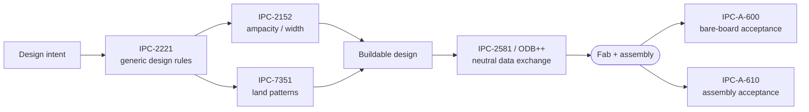
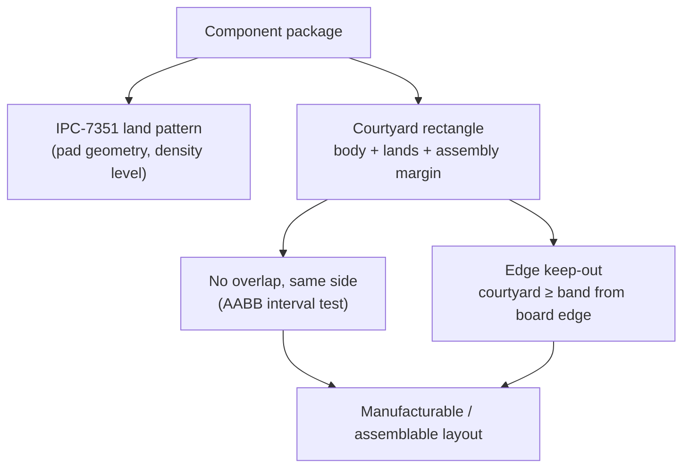
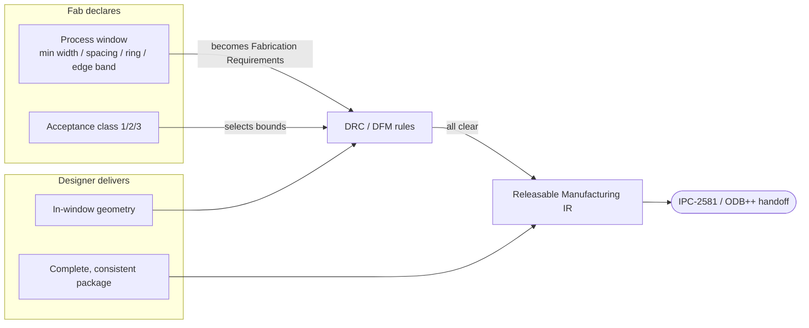

# IPC Standards

**Summary.** The IPC standards are the shared engineering grammar between the people who *design* a printed board and the factory that *builds* it: a family of documents from IPC (originally the Institute for Printed Circuits, now the Association Connecting Electronics Industries) that fix what a conductor, a land, a clearance, a solder joint, and a deliverable data set must look like so that "what was designed" and "what was fabricated" are the same object. They belong in the Engineering Science Layer because the EAK runtime silently assumes them everywhere it states a manufacturability rule: every fab-process floor, every courtyard keep-out, every ampacity-driven width, every release package presupposes an IPC clause that says *this is buildable and acceptable*. This document grounds that assumption. It explains which standard governs which seam — IPC-2221 (generic design), IPC-2152 (ampacity), IPC-7351 (land patterns), IPC-A-600 / IPC-A-610 (fabrication / assembly acceptability), IPC-2581 and ODB++ (data exchange) — and connects each to the concrete artifact in the runtime that embodies it: the `Fabrication`-category [Requirements](../../docs/foundation/engineering-domain-model.md#requirement) that carry the fab's process limits, the [DRC](../../docs/state-machines/drc-verification.md)/[DFM](../../docs/state-machines/dfm-verification.md) rule sets that enforce them, and the [Manufacturing IR](../../docs/compiler/ir/manufacturing-ir.md) that is the data-exchange package itself. When the runtime declares a board *releasable*, it is asserting an IPC claim. The deeper theory each clause encodes lives in sibling docs: ampacity in [ohms-law](../electrical/ohms-law.md), clearance fields in [electromagnetics](../physics/electromagnetics.md), courtyard geometry in [computational-geometry](../mathematics/computational-geometry.md), heat flow in [thermal-physics](../physics/thermal-physics.md).

## Core principles

A vocabulary bridge first. Each IPC family is a *contract over one seam* of the design; together they cover the whole path from intent to a manufactured board. The standard text itself is copyrighted and lives outside the repo as [Evidence](../../docs/foundation/engineering-domain-model.md#evidence) — what matters here is the *engineering content* each clause encodes and how it becomes a machine-checkable [Constraint](../../docs/foundation/engineering-domain-model.md#constraint) (the discipline of [standards-and-compliance](../../docs/engineering/standards-and-compliance.md)).

| Standard | Governs | Question it answers | Runtime seam |
|----------|---------|---------------------|--------------|
| **IPC-2221** | Generic PCB design | What spacing / clearance / annular ring / conductor is legal? | clearance & width [Constraints](../../docs/foundation/engineering-domain-model.md#constraint), DRC |
| **IPC-2152** | Conductor ampacity | How much current may this copper carry for a given ΔT? | per-net-class width sizing, [routing](../../docs/state-machines/routing-planning.md) |
| **IPC-7351** | Land patterns / footprints | What pad geometry and courtyard does this package need? | [Footprint](../../docs/foundation/engineering-domain-model.md#footprint), courtyard, [placement](../../docs/state-machines/component-placement.md) |
| **IPC-A-600** | Bare-board acceptability | Is the *fabricated board* acceptable (plating, etch, ring)? | DFM rules + verification record |
| **IPC-A-610** | Assembly acceptability | Is the *assembled board* acceptable (solder, placement)? | assembly checks + verification record |
| **IPC-2581 / ODB++** | Data exchange | How is the design handed to the fab, completely and unambiguously? | [Manufacturing IR](../../docs/compiler/ir/manufacturing-ir.md), artifact export |


*Figure: the IPC families partition the path from intent to an accepted board — design rules, then a neutral handoff, then acceptance criteria. Viewpoint: the manufacturing seam.*

### 1. IPC-2221 — the generic design rulebook

IPC-2221 (the *Generic Standard on Printed Board Design*, successor to the older IPC-D-275) is the floor under everything physical. It states the rules a layout must obey *independent of process*, of which three families drive a runtime:

- **Electrical conductor spacing.** Minimum copper-to-copper clearance is a function of the peak voltage between the conductors and the environment (bare internal, coated external, conformal-coated, etc.). The standard tabulates this as spacing-versus-voltage; below ~30 V the floor is a fixed minimum (set by manufacturability, not breakdown), and above it spacing grows with voltage to prevent arc-over and tracking. This is the DC/low-frequency design-rule face of the dielectric-strength physics in [electromagnetics](../physics/electromagnetics.md); the high-voltage variant is **creepage and clearance** (surface vs. air path), the safety-standard refinement layered on top.
- **Annular ring.** A plated through-hole needs a copper *annulus* around the drilled hole so the hole stays connected after drill-to-pad misregistration. IPC-2221 (and its qualification sibling IPC-6012) sets a minimum ring width; the tolerance tightens with the [acceptability class](#5-ipc-a-600--ipc-a-610--acceptability-and-the-classes) — Class 3 forbids ring *breakout*, Class 2 tolerates limited breakout.
- **Legacy ampacity.** IPC-2221 carries the classic conductor-sizing curve fit

```
I = k · ΔT^0.44 · A^0.725
      ΔT in °C,  A = cross-section in mil²,  I in A
      k ≈ 0.048  (external layer, air-cooled)
      k ≈ 0.024  (internal layer, legacy blanket 2:1 derate)
```

  derived from 1950s open-wire data. It is a single closed form — convenient, but it mis-models the board's thermal environment, which is exactly the defect IPC-2152 fixes (§3). The full derivation and worked numbers live in [ohms-law §6](../electrical/ohms-law.md).

The engineering point: IPC-2221 turns each of these into a **typed bound** — a clearance in millimetres, a ring width in millimetres, a current in amperes — i.e. a [Physical Quantity](../../docs/engineering/units-and-quantities.md) the runtime can check, not a guideline.

### 2. Conductor spacing as a clearance lattice

Spacing rules compose: every pair of conductors at distinct potentials imposes a minimum separation, and the *binding* separation at any point is the maximum demanded by any applicable rule (signal-integrity clearance, manufacturability floor, and IPC-2221 voltage spacing all bid; the largest wins). This is the same "max of independent bids" structure that governs trace width (ampacity vs. IR-drop vs. process floor in [ohms-law §7](../electrical/ohms-law.md)). A runtime must therefore treat clearance as a *resolved* quantity, not a constant — which is why it lives in the [Constraint Engine](../../docs/engineering/constraint-engine.md) where competing bounds are reconciled, not hard-coded per check.

### 3. IPC-2152 — ampacity done honestly

IPC-2152 (2009, *Standard for Determining Current Carrying Capacity*) supersedes the IPC-2221 curve with measured charts because ampacity is **not** a function of cross-section alone — it is a function of cross-section *plus the thermal context*:

- the **legacy internal 2:1 derate is often too conservative** — copper planes and laminate spread heat, so an internal trace near a plane can carry *more* than `k = 0.024` predicted;
- conversely an **isolated trace in still air runs hotter** than IPC-2221 claimed;
- ampacity depends on copper weight, width, board thickness, **board thermal conductivity**, the presence of planes, and ambient/airflow.

Stated as a budget, ampacity is the current that produces an *allowable temperature rise* `ΔT`, from the self-heating balance `ΔT = I²·R·θ` (see [thermal-physics](../physics/thermal-physics.md) and [ohms-law §5–6](../electrical/ohms-law.md)). The runtime consequence is sharp: any single current-per-width number is a *first-order proxy* and must be labelled as such; the faithful computation needs the stack-up's copper weight and the thermal environment. This is the physics that justifies why power and ground nets get a wider class default than signal nets.

### 4. IPC-7351 — land patterns and courtyards

IPC-7351 (the *Generic Requirements for Surface Mount Design and Land Pattern Standard*, current revision 7351B) defines, for each component package, the **land pattern** (the copper pads the part solders to) and the **courtyard** (the keep-out rectangle reserving room for the body, the lands, and assembly tolerance). Two ideas drive a runtime:

- **Density levels.** Each package gets three patterns — *Most* (level A, maximum copper and toe/heel fillet, most robust, lowest density), *Nominal* (B, the default), and *Least* (C, minimum land, highest density). The level chosen trades assembly robustness against board area, and it is a design decision with provenance, not a fixed fact.
- **Courtyard as a geometric keep-out.** The courtyard is an axis-aligned rectangle; "two parts may not collide" reduces to *no two courtyards on the same side may overlap* — a pure interval-overlap test on each axis (the AABB intersection of [computational-geometry](../mathematics/computational-geometry.md)). A separating gap on either axis proves non-collision; overlap on both is a defect.


*Figure: a land pattern fixes copper; the courtyard fixes space — overlap and edge-clearance are the two acceptance tests over it. Viewpoint: placement.*

### 5. IPC-A-600 / IPC-A-610 — acceptability and the classes

These are the *acceptance* standards — the agreed definition of "good enough," applied after the board is made:

- **IPC-A-600**, *Acceptability of Printed Boards*, covers the **bare board**: plating thickness, annular ring, etch quality, laminate voids, registration. It is the visual/qualitative counterpart to the quantitative qualification spec IPC-6012.
- **IPC-A-610**, *Acceptability of Electronic Assemblies*, covers the **assembled board**: solder-joint fillet, wetting, component alignment, tombstoning, voiding. It is the most widely cited IPC document on a production floor.

Both — and IPC-2221, IPC-6012, IPC-7351 density — share the **class system**, the single most important number in the designer↔fab contract:

| Class | Intent | Acceptance |
|-------|--------|------------|
| **Class 1** | General electronic | Loosest (function is enough) |
| **Class 2** | Dedicated service (most commercial) | Standard, tolerates limited breakout/voiding |
| **Class 3** | High reliability (aerospace, medical, life-support) | Tightest; no annular-ring breakout, strict fillet |

The class is declared *once*, up front, and then re-prices every other rule — a Class-3 board demands wider rings, tighter registration, and stricter solder acceptance than the same geometry at Class 2. In domain terms the class is a [Requirement](../../docs/foundation/engineering-domain-model.md#requirement) of regulatory/manufacturing category that selects which constraint bounds activate (the *compliance profile* of [standards-and-compliance §3](../../docs/engineering/standards-and-compliance.md)).

### 6. IPC-2581 / ODB++ — the neutral data exchange

The final seam is the *handoff*. Historically a board went to the fab as a bundle of single-purpose files — Gerber (RS-274X) copper images, an Excellon drill file, a separate netlist, a separate BOM, stack-up notes in a PDF — a "dumb image" set the fab had to re-interpret, with every gap an opportunity for a build that differs from the design. The two modern *intelligent, neutral* formats fix this by carrying the **whole product model in one structured package**:

- **IPC-2581** (a.k.a. DPMX, *Digital Product Model Exchange*) — an open XML standard: copper, drill, stack-up, netlist, component placement, and BOM in one vendor-neutral file.
- **ODB++** — the other intelligent format (originally Valor): a directory-structured database carrying the same intent.

The engineering invariant both encode — and the one the runtime must guarantee — is **completeness with internal consistency**: the placement matches the lands, the lands match the copper, the BOM matches the parts, the netlist matches the routing. A package that is internally inconsistent (a placement with no land, a BOM line with no part) is *not a valid handoff*, regardless of file format. The choice of concrete format is a technology decision deferred out of Phase-0 scope; the *property* — one complete, self-consistent, re-derivable package — is the standard's enduring content.

### 7. The shared contract, assembled

Putting the families together, the designer↔fab relationship is two reciprocal obligations:

1. **The fab declares its process window** — minimum trace width, minimum spacing, minimum annular ring, edge keep-out, registration tolerance, acceptance class. These are the limits below which it *cannot build* the chosen IPC class.
2. **The designer delivers a complete, consistent, in-window package** — geometry that respects every declared limit, handed over in a neutral, self-consistent form.


*Figure: IPC standards are the contract — the fab's process window becomes enforced rules; a clean run plus a complete package yields a releasable handoff. Viewpoint: the runtime's manufacturing gate.*

## Why it matters for electronics & PCB design

- **IPC is the interface, not decoration.** Two parties who never meet — designer and fab — agree on a board through these documents. Disagreement is silent until the board comes back wrong; the standard is what makes the agreement *checkable in advance*.
- **A rule is only meaningful with a class.** "Is this annular ring acceptable?" has no answer without the IPC class. The class is the single declaration that re-prices clearance, ring, and solder acceptance together.
- **Acceptability ≠ design rules.** IPC-2221/7351 say what to *draw*; IPC-A-600/610 say what is *acceptable when built*. A board can pass design rules and still fail acceptance (e.g. a solder fillet defect) — which is why the verification record must travel with the release.
- **A neutral, complete handoff prevents the worst failure.** The most expensive PCB bug is "the fab built something subtly different from what was verified." Completeness + internal consistency in the exchange package is the structural defence.
- **The process window is fab-specific.** A geometry buildable at one fab's Class 2 may be impossible at another's Class 3. Hard-coding one fab's numbers into the design rules is an engineering bug; the limits must be *sourced* from the chosen process.

## Mapping to the runtime

This is the section that makes IPC load-bearing. Each family is embodied by a concrete EAK artifact, and violating the principle would be a real bug in the runtime.

- **Fab process window ↔ `Fabrication`-category Requirements.** The fab's limits enter the runtime as [Requirements](../../docs/foundation/engineering-domain-model.md#requirement) of category `RequirementCategory::Fabrication` (`eak-domain`), explicitly defined as "what the chosen fab and assembly flow can build." `eak-engines` reads their `Length`-dimensioned targets through `fabrication_length_targets(...)` under a documented **positional slot contract**: slot 0 = the minimum manufacturable trace width (the IPC-2221/2152 process floor), slot 1 = the board-edge keep-out band (IPC-2221 edge clearance). This is the literal implementation of §7's first obligation — the fab *declares*, and the declaration is data, not a constant. A runtime that invented a floor when none was stated (rather than staying silent) would be guessing the fab's process — the exact error the code's "stays silent when no floor is stated" comment guards against.

- **IPC-2221 spacing / width / IPC-2152 ampacity ↔ DRC + per-net-class widths.** [DRC Verification](../../docs/state-machines/drc-verification.md) runs `DrcTraceWidthRule` (id `drc-trace-width`), which flags any [Track](../../docs/foundation/engineering-domain-model.md#track--routing) finer than the slot-0 fabrication floor — the IPC manufacturability minimum. The ampacity side lives in [Routing Planning](../../docs/state-machines/routing-planning.md): `class_width_mm(NetClass)` assigns `Power`/`Ground` a wider default (0.50 mm) than `Signal` (0.25 mm), encoding the IPC-2152 conclusion that current-carrying nets need more copper. Routing deliberately stays oblivious to the floor (a class default finer than the floor is caught by DRC, not silently clamped) — the honest division of labour between *sizing* and *checking*. The scope boundary, stated plainly: the per-class constant is a first-order proxy; the IPC-2152 current-and-ΔT-derived width is the reasoning-driven refinement the constant stands in for. Giving a power rail the signal width would be the §3 ampacity error committed in code.

- **IPC-7351 land patterns / courtyards ↔ Footprint + placement DRC/DFM.** A component's land pattern and courtyard are its [Footprint](../../docs/foundation/engineering-domain-model.md#footprint); [Component Placement](../../docs/state-machines/component-placement.md) sizes each courtyard via `courtyard_mm(ComponentClass)` (connectors largest, actives mid, passives smallest — the IPC density intuition). Two rules in `eak-engines` enforce the §4 geometry: `DrcCourtyardOverlapRule` (id `drc-courtyard-overlap`) flags any two courtyards overlapping on the same `BoardSide` via the strict-inequality AABB test (touching is allowed; overlap on both axes is the defect), and `DrcOutOfBoundsRule` requires every courtyard to lie wholly within the [Board](../../docs/foundation/engineering-domain-model.md#board--layer-stack) outline. A placement engine that omitted the courtyard would let parts collide physically while passing electrically — an IPC-7351 violation invisible to the netlist.

- **IPC-2221 edge clearance ↔ DFM edge keep-out (increment 9).** [DFM Verification](../../docs/state-machines/dfm-verification.md) runs `DfmEdgeClearanceRule` and `DfmTraceEdgeClearanceRule`, which demand every courtyard *and* every trace keep at least the slot-1 fabrication keep-out band from the board edge — an *assembly* keep-out beyond mere geometric fit (a part may fit the outline yet hug the edge too closely for the depaneling and handling IPC-A-610 assumes). The band is **fab-sourced** from the `Fabrication` Requirement, not hard-coded — the §7-first-obligation discipline applied to the edge.

- **IPC-A-600 / IPC-A-610 acceptability ↔ the verification record + manufacturing gate.** The acceptance standards correspond to the *verification record* the [Manufacturing IR](../../docs/compiler/ir/manufacturing-ir.md) bundles: clean/waived [Violations](../../docs/foundation/engineering-domain-model.md#violation) across ERC/DRC/DFM, with [Waivers](../../docs/foundation/engineering-domain-model.md#waiver) carrying rationale. The [Manufacturing Generation](../../docs/state-machines/manufacturing-generation.md) global gate is the runtime analogue of "fails acceptance" — it `Blocked`s release iff any open, error-severity violation remains anywhere (`ctx.violations().filter(is_blocking).count() > 0`); a *waived* defect is an explicitly accepted deviation (the runtime's concession line), an *unwaived* one blocks. The IPC class is the [compliance profile](../../docs/engineering/standards-and-compliance.md) that selects which bounds those rules enforce.

- **IPC-2581 / ODB++ exchange ↔ the Manufacturing IR + artifact export.** The [Manufacturing IR](../../docs/compiler/ir/manufacturing-ir.md) *is* the neutral exchange package — `eak-compiler`'s terminal lowering joins the two seams into one set: the fabrication outline + copper, the assembly pick-and-place (placement geometry plus a `PartAssignment` refdes→MPN binding), and the procurement BOM. The §6 completeness invariant is enforced literally: every placed component must resolve to a BOM line *and* a real part, or the lowering raises `IrError::UnsourcedPlacement` — "no assembly directive ships without an MPN." The IR's *faithful-derivation* invariant (every artifact traces to the verified PCB/BOM IR, no untracked edit between verification and generation) is the formal statement of "what we built = what we verified," recorded as the audit `Event::ManufacturingGenerated`. The concrete file standard (IPC-2581 vs. ODB++ vs. Gerber) is the deferred technology decision; the IR guarantees the *property* the standards exist to provide.

- **Class declaration ↔ Standards & Compliance.** Per [standards-and-compliance](../../docs/engineering/standards-and-compliance.md), an IPC land-pattern class maps to manufacturing-rule [Constraints](../../docs/foundation/engineering-domain-model.md#constraint) scoped to footprints, each citing its clause as [Evidence](../../docs/foundation/engineering-domain-model.md#evidence), resolved by the one [Constraint Engine](../../docs/engineering/constraint-engine.md) *against* electrical/physical constraints so a clearance demanded by both signal integrity and IPC spacing is reconciled once, not twice. The class is *not* a parallel compliance subsystem — it is constraints, inheriting resolution, gating, waivers, and provenance for free.

## Failure modes if violated

- **Hard-coding one fab's process window.** Bake a floor or edge band into the design rules instead of sourcing it from a `Fabrication` Requirement, and the runtime silently approves boards a *different* fab cannot build — the slot-contract / "stay silent when unstated" discipline exists to prevent exactly this.
- **No declared class.** Without an IPC class, "acceptable" is undefined; annular-ring and solder rules have no bound, so the gate either passes everything or guesses — both are unsound.
- **Land pattern without courtyard.** Model only copper and omit the IPC-7351 courtyard, and parts collide physically while DRC (electrical) and the netlist stay clean — a defect that surfaces only at assembly.
- **Ampacity from cross-section alone.** Use the IPC-2221 single formula and ignore IPC-2152's thermal context (layer, planes, airflow), and current-carrying copper runs hotter — or is needlessly wide — than the real board allows.
- **Incomplete or inconsistent handoff.** Ship a package where a placement has no land or a BOM line no part (the `UnsourcedPlacement` case), and the fab fills the gap by interpretation — "built ≠ verified," the most expensive PCB bug.
- **Editing between verification and generation.** Touch the geometry after the gate and before the IR is assembled, and the faithful-derivation invariant breaks: the released artifacts no longer describe the verified board, and the audit chain is a lie.
- **Treating acceptance as design rules (or vice-versa).** Pass IPC-2221 spacing yet fail IPC-A-610 solder acceptance — a board can be drawable-legal and built-unacceptable; conflating the two loses the verification record the release must carry.

## Related documents

- [`../electrical/ohms-law.md`](../electrical/ohms-law.md) — the ampacity derivation (IPC-2152/2221 curve, ΔT budget, IR drop) and the trace-width sizing rule this doc's §2–3 reference.
- [`../physics/electromagnetics.md`](../physics/electromagnetics.md) — the dielectric-strength and field physics under IPC-2221 conductor spacing, creepage, and clearance.
- [`../physics/thermal-physics.md`](../physics/thermal-physics.md) — the self-heating balance `ΔT = I²R·θ` that makes ampacity a thermal budget.
- [`../mathematics/computational-geometry.md`](../mathematics/computational-geometry.md) — the AABB interval-overlap test behind courtyard collision and edge keep-out.
- [`../pcb/placement.md`](../pcb/placement.md) · [`../pcb/stackup.md`](../pcb/stackup.md) — courtyard/land-pattern placement and the copper-weight stack-up ampacity needs.
- [`../../docs/state-machines/drc-verification.md`](../../docs/state-machines/drc-verification.md) · [`../../docs/state-machines/dfm-verification.md`](../../docs/state-machines/dfm-verification.md) — the `drc-trace-width`, `drc-courtyard-overlap`, out-of-bounds, and DFM edge-clearance rules that enforce IPC limits.
- [`../../docs/state-machines/routing-planning.md`](../../docs/state-machines/routing-planning.md) · [`../../docs/state-machines/component-placement.md`](../../docs/state-machines/component-placement.md) — per-net-class widths and courtyard sizing.
- [`../../docs/state-machines/manufacturing-generation.md`](../../docs/state-machines/manufacturing-generation.md) · [`../../docs/compiler/ir/manufacturing-ir.md`](../../docs/compiler/ir/manufacturing-ir.md) — the release gate, the verification record, and the Manufacturing IR as the IPC-2581/ODB++ exchange package.
- [`../../docs/engineering/standards-and-compliance.md`](../../docs/engineering/standards-and-compliance.md) · [`../../docs/engineering/constraint-engine.md`](../../docs/engineering/constraint-engine.md) — standards-as-constraints, the compliance profile, and conflict-aware resolution.
- [`../../docs/engineering/units-and-quantities.md`](../../docs/engineering/units-and-quantities.md) · [`../../docs/foundation/engineering-domain-model.md`](../../docs/foundation/engineering-domain-model.md) — the typed mm/A/°C bounds and the Footprint / Requirement / Track entities IPC rules attach to.
